# 使用 MERN 堆栈在云中上传图像

> 原文：<https://medium.com/analytics-vidhya/upload-image-in-cloudinary-using-mern-stack-39fcb4ed9d9e?source=collection_archive---------3----------------------->


雷诺·莱蒂安在 [Unsplash](https://unsplash.com?utm_source=medium&utm_medium=referral) 上拍摄的照片

作为一名开发人员，您可能遇到过将图像上传到任何云资源以及允许您的客户将图像上传到您的数据库的挑战。

在这篇文章中，我将带领我们通过使用 MERN 堆栈轻松实现这一目标。

我们将使用以下方法来实现这一目标:

*   反应堆
*   Nodejs
*   云雾缭绕
*   MongoDB

我们将使用 Reactjs 作为前端，Nodejs 作为后端，Cloudinary 作为客户端图像的云存储，MongoDB 作为我们的数据库，返回的图像路径将保存在这里。

**先决条件 **

*   了解反应的基础
*   安装 npm
*   了解 Nodejs 的基础
*   安装节点
*   设置并安装 MongoDB compass
*   了解 MongoDB 的基础
*   有模糊的叙述

接下来，让我们创建一个名为 CLOUDINARY_UPLOAD 的 react 项目，在这里按照[](https://reactjs.org/docs/create-a-new-react-app.html)**创建一个 react 项目**

**现在我们已经创建了一个新项目，让我们快速创建将处理客户端上传的组件；**

```
**cd srctouch imageUpload.js**
```

**在我们刚刚创建的新的***image upload . js***文件中，添加以下内容:**

**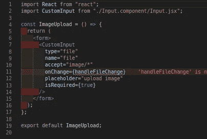**

**这是一个返回表单元素的组件，该元素包含一个输入(自定义输入)元素，该元素具有道具类型 ***文件*** 并接受 ***图像/******

*****文件*** 值使得输入可以接受任何 ***文件*** 类型， ***接受*** 属性是指定我们将上传哪个 ***文件*** 类型。onChange 函数中的 handleFileChange 是文件处理函数，它将在输入字段中寻找 onChange 事件。**

**让我们为图像字段创建 handleFileChange 处理程序；**

**首先 ***，*** 让我们设置一个管理文件值和解码图像文件的状态。在此之前，确保您已经在 react 导入参数中包含了 useState 挂钩，如下所示；**

**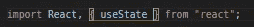**

**使用状态挂钩**

**添加了以上内容后，让我们添加状态的初始值；**

**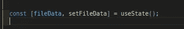**

**国家**

**接下来，我们将创建 handleFileChange 处理程序，如下所示；**

**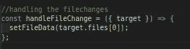**

**图像处理器**

**我们已经创建了一个函数来处理文件更改。我们从输入字段中析构了目标对象，并将解码后的图像对象设置为文件输入每次改变时的状态。**

**如果我们打印 **target.files[0]** ，我们应该在控制台上看到以下内容；**

**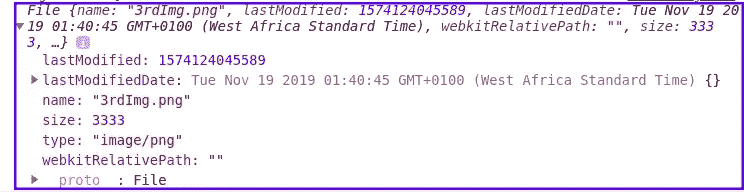**

**图像原型**

**正如我们所看到的，文件[0]保存了上传图像的全部信息，甚至还有附加信息，如*等等。这正是我们在输入字段的每一次变化中所得到的状态。***

***此时，我们看不到所选图像的路径，因为我们必须创建另一个状态，在每次更改时读取图像路径，并将其设置为文件输入字段值。让我们毫不拖延地为此创造条件；***

```
***const [images, setFile] = useState("");***
```

***在 handleFileChange 函数内部将 ***target.value*** 设置为 ***图像*** 的值；***

**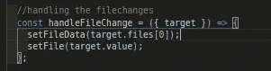**

**设置图像值**

*****文件*** 输入字段现在看起来是这样的；**

**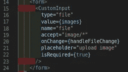**

***画面是现在输入字段的值。***

***渐渐地，我们已经能够使用刚刚创建的处理程序从本地机器上传图像。让我们继续创建一个将图像发送到服务器端的处理程序。***

***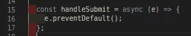***

***我们创建了一个 submit 函数，我们使用***e . prevent default***函数防止它在提交到端点时返回 void。***

**我们将添加一个名为 FormData 的 web API。它是一个构造函数，用于创建一个新的 formData 实例/存储数据等等。查看链接了解更多[***formData***](https://developer.mozilla.org/en-US/docs/Web/API/FormData/FormData)***。*****

**我们将使用名为 ***append*** 的 FormData 构造函数属性来添加解码后的文件对象，并将其发送到端点以供使用。**

**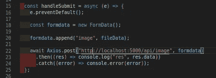**

**提交功能**

**上面我们创建了一个 formData 对象并附加了一个键(image)、值(fileData)，最后将数据发送到端点。**

```
**Note: make sure you have Axios installed in the project and import it to the uploadImage.js component as well.**
```

**转到 app.js 文件，导入 ImageUpload 组件，如下图所示；**

**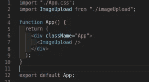**

**app.js**

**到目前为止，我们解释的所有这些都是我们上传图像并将上传的图像发送到服务器端所需的。**

**从今以后，我们将在服务器上处理客户端的请求，并将图像发送到我们的 Cloudinary 帐户。**

**在终端中，运行**

```
**cd ~cd Desktopmkdir cloudinaryImage_server_sidecd cloudinaryImage_server_sidetouch index.js mkdir model controller route code .**
```

**我们返回到根文件夹，导航到桌面文件夹，创建一个名为 cloudinaryImage_server_side 的文件夹，创建一个包含其他三个文件夹的索引文件，最后打开一个新的 Vscode 编辑器。 ***代码。*** 只针对那些使用 Vscode 作为开发工具的人。**

**我们将通过运行以下命令来添加 package.json 文件**

```
**npm init -y**
```

**我们将为这个项目安装所有必要的依赖项，如下所示**

```
**npm install express multer mongoose cors nodemon cloudinary multer-storage-cloudinary --save**
```

**现在我们已经创建了 package.json 文件，让我们设置服务器。在 index.js 文件中，添加以下代码**

**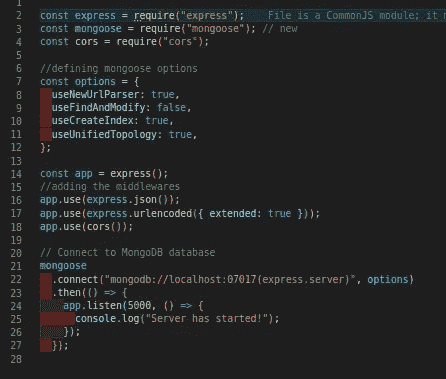**

**index.js 文件**

**转到 package.json 文件并修改脚本属性。将以下内容添加到脚本对象中；**

**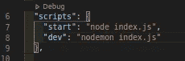**

**脚本对象**

**修改后，让我们用以下命令启动我们的服务器:**

```
**npm run dev**
```

**如果您在 Vscode 终端中看到以下内容，那么您已经成功启动了一个节点服务器。 `Server has started!`**

**打开我们创建的模型文件夹，创建一个名为 fileUpload.js 的文件，并在其中添加以下内容；**

**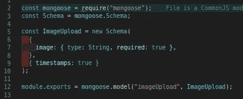**

**我们导入了 mongose，将 mongose 的 Schema 属性传递给了 Schema 变量。**

**我们为请求文件上传创建了一个模式，并将其导出以等待控制器文件中的导入。**

**完成后，我们将在控制器文件夹中创建一个文件，用于处理服务器端的图像上传**

**在您的终端中，导航到控制器文件夹并运行**

```
**Touch uploadImage.js**
```

**在其中添加以下内容:**

**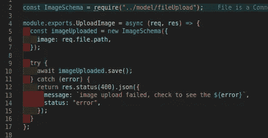**

**上传控制器**

**这保存了 ***请求*** 文件的上传控制器。图像值设置为 req.file.path，req.file 是设置 Cloudinary 返回的图像属性以供使用的地方。**

**我们将在根目录中创建一个名为 middleware 的新文件夹，该文件夹将包含一个名为 cloudinary.config.js 的文件。我们将在该文件中添加与我们的 cloudinary 帐户进行通信的功能。**

**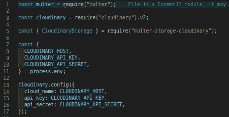**

**云二进制配置文件**

**我们导入了在 other 中需要的必要依赖项，以便成功地将图像上传到我们的 Cloudinary 帐户。我们从即将创建的 process.env 文件中析构了用于上传的 Cloudinary 标准。我们使用 Cloudinary.config 方法输入 Cloudinary 所需的所有检查。**

**现在，让我们使用 Cloudinary 仪表盘，复制上传图片所需的标准。以下是我们需要从仪表板中复制的内容；**

****

**cloudinary 通行证详细信息**

**现在我们已经获得了所有这些细节，我们将在我们的根路径中创建一个. env 文件，并在其中添加您的帐户细节以达到安全目的。**

**如果我们已经完成了上面的工作，让我们继续并通过添加以下内容来完成我们的 Cloudinary 配置上传处理程序。**

**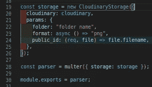**

**云储存**

**我们使用 CloudinaryStorage API 来添加我们想要集成的所有选项。params 字段包含一个对象，它将让我们处理和管理上传格式、上传图像的文件夹，以及最后一个惟一的公共 ID，您可以使用它来访问和执行其他 CRUD 操作。**

**最后，我们使用 Multer API 将这个预期的上传存储到它的存储属性中，并导出它以用作我们即将创建的 post route 中的中间件。**

**接下来，让我们在前面创建的 Route 文件夹中创建一个名为 uploadImageRoute.js 的文件。在其中添加以下内容:**

**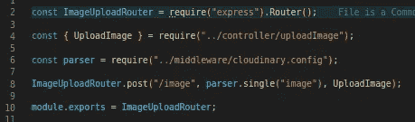**

**路由文件**

**我们导入了 express 的 ***路由器方法*** ，处理 Cloudinary 上传的中间件，以及处理将返回的图像路径保存到数据库的控制器(UploadImage)。**

**我们使用 imageUploadRouter 的 post 方法将客户端对中间件的请求发送到控制器。这里，如果客户机请求映像不满足 Cloudinary 要求的标准，它不会将请求传递给控制器。之后，我们导出了 ImageUploadRouter，这样我们就可以在 index.js 中使用它了**

**在 index.js 文件中，我们将导入 imageUploadRouter，并将其作为中间件添加到 app.use 方法的 express 方法中，如下所示。**

**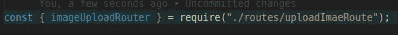**

**导入图像上传路由器**

**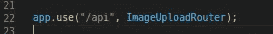**

**让我们试着打印 req.file 并了解我们对 Cloudinary 的期望。**

**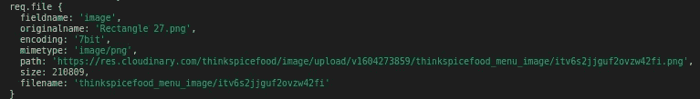**

**req.file**

**我想这太神奇了，现在我们不仅成功地将一张图片上传到了我们的 Cloudinary 帐户，还上传到了我们的数据库。**

**req.file.path 保存了上传图像的在线链接，这个 URL 是我们发送到数据库的内容，因此可以在任何浏览器中访问它。**

**如果这篇文章是有帮助的，为什么不点击拍手图标 50 次。对于 react 代码，你可以在这里找到[](https://github.com/chibuike07/cloudinary_upload)*而对于服务器，跟着[***me***](https://github.com/chibuike07/cloudinaryImage_server)***。******

**在我的 [***LinkedIn 账号***](https://www.linkedin.com/in/chime-princewill-3a2b1b192/) 和 [***中关注我的账号***](/@princewillchime43) 查看更多我的牛逼文章。**