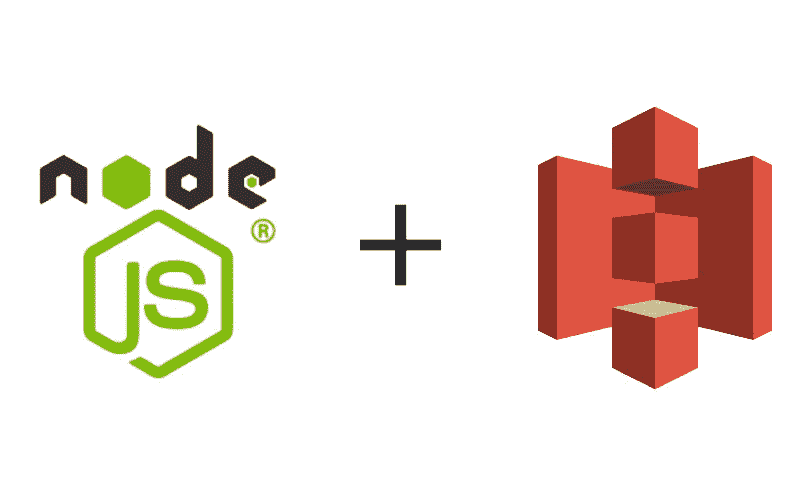

# 使用节点将文件上传到 AWS S3

> 原文：<https://medium.com/analytics-vidhya/upload-web-app-using-node-to-aws-s3-bcd7cc03ebd?source=collection_archive---------11----------------------->

昨天，我花了两个小时解决了一些“疑难杂症”，当时我正试图将 web-app 上传到一个公共桶中。希望这篇文章能节省你的一些时间⏱。

在这篇文章中，你将:

1.  了解如何创建一个 s3 存储桶来托管静态网页。
2.  了解如何使用 Node.js 将文件上传到 bucket
3.  熟悉 aws-sdk