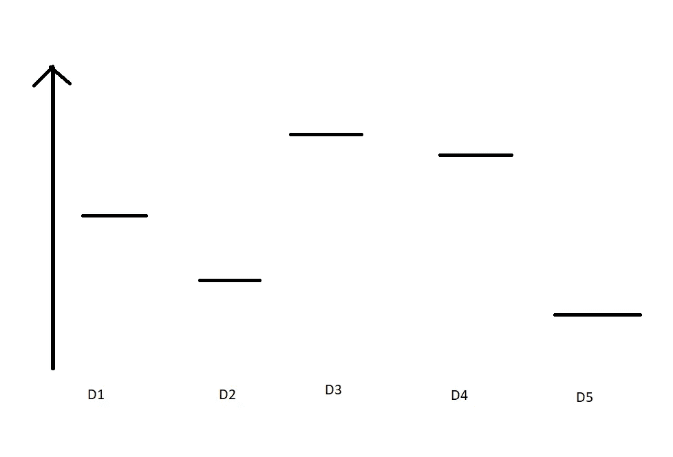
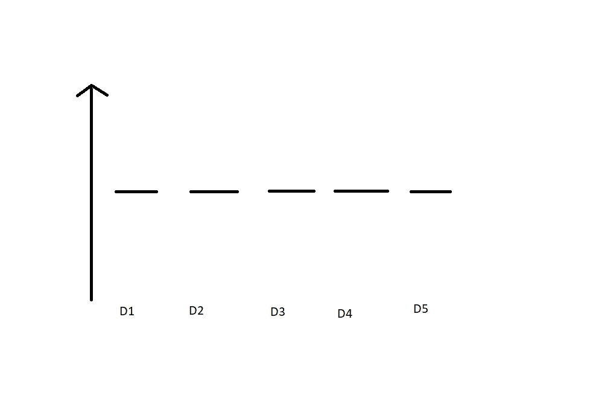
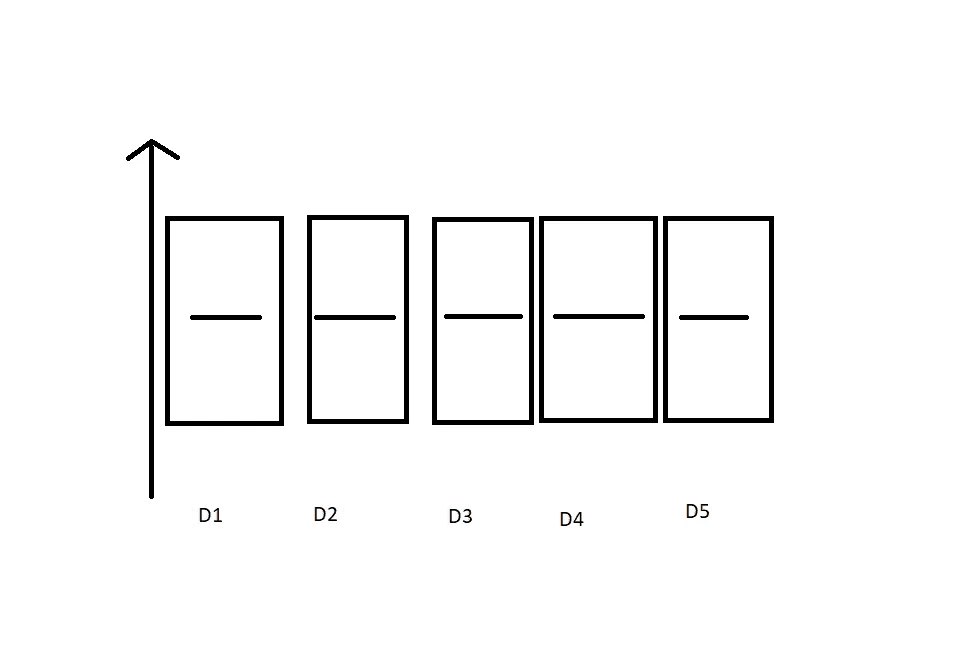
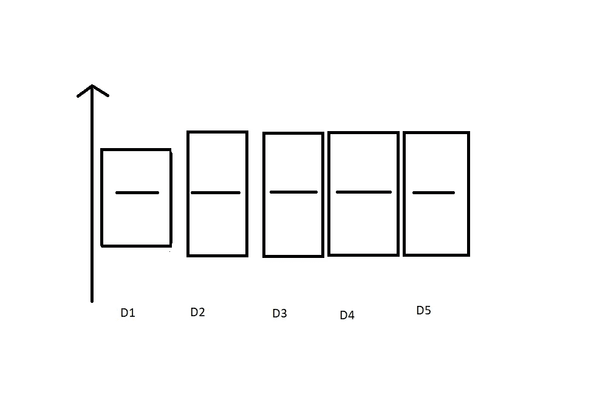
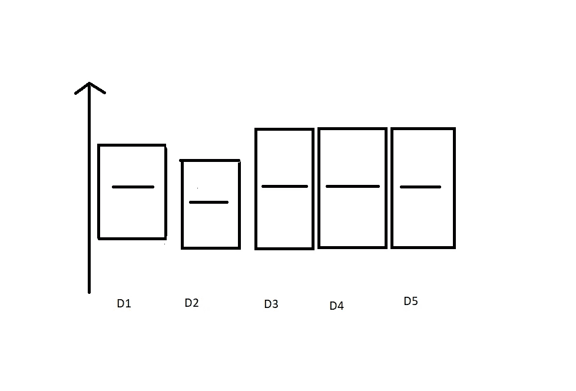
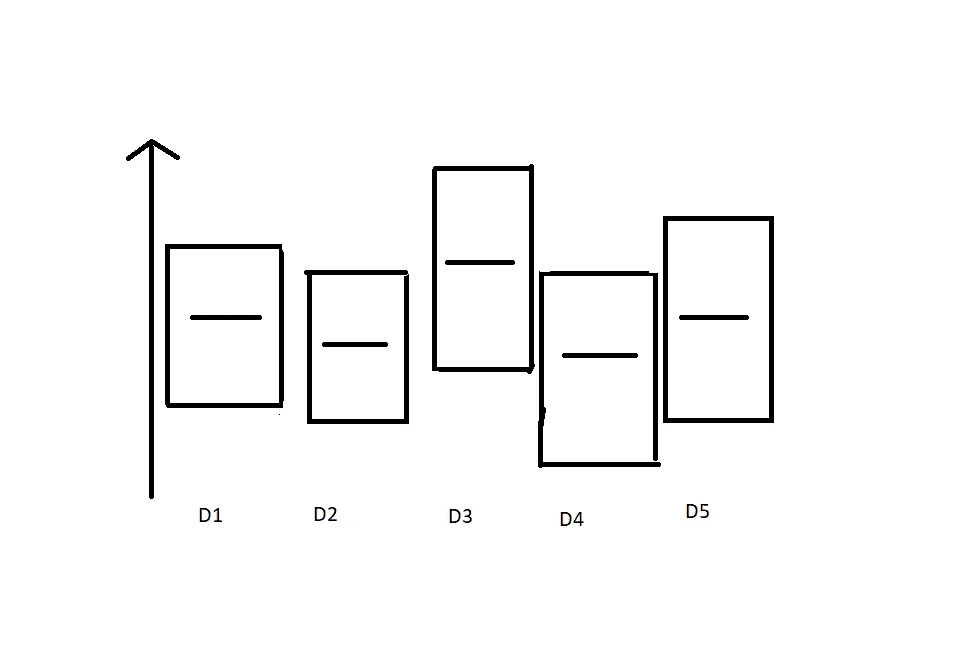
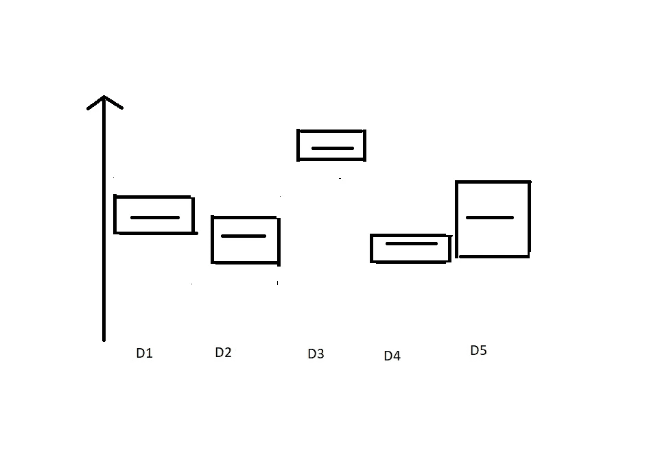

# 多武装匪徒问题的置信上限

> 原文：<https://medium.com/analytics-vidhya/upper-confidence-bound-for-multi-armed-bandits-problem-ea5d7bc840ff?source=collection_archive---------11----------------------->

本文将讨论置信上限及其算法步骤。

正如我们在[多股武装匪徒问题](/analytics-vidhya/the-multi-armed-bandit-problem-in-reinforcement-learning-cf46adc6d269)文章中看到的，我们有 5 个或更多的老虎机，我们以这样一种方式下注，使我们的利润最大化。

每台机器都有自己的分配，你的利润是根据它来决定的。我们以平衡的方式结合使用勘探和开采技术，以增加我们的利润。我们不能只有探索或剥削，因为它们可能不会给我们提供解决问题的最佳方案。

> ***置信上限*** UCB 是一种用于强化学习的确定性算法，该算法基于算法在每轮探索中分配给每台机器的置信边界，专注于探索和利用。当一台机器比其他机器使用得更多时，这些边界会减小。

**置信上限遵循的步骤**

1.  *在每一轮* ***n*** *中，我们考虑机器 m 的两个数字。
    - >* Nₘ(n) =机器 m 被选择到第 n 轮的次数。
    - > Rₘ(n) =机器 m 到第 n 轮的奖励次数
2.  *从这两个数字我们要计算，
    a.* 机器的平均报酬 m 到回合 n，rₘ(n) = Rₘ(n) / Nₘ(n).
    *b.* 置信区间[rₘ(n)—δₘ(n)，rₘ(n)+δₘ(n)]在第 n 轮用，δₘ(n)= sqrt(1.5 * log(n)/nₘ(n))
3.  *我们选择具有最大 UCB 的机器* ***m*** *，*(*【rₘ(n)+δₘ(n))*

*我知道这非常数学化，但是让我们通过例子来理解它:*

*假设您有 5 台老虎机，每台机器都有一定数量的相关分发。如果任何人事先知道这些分配，就可以很容易地使利润最大化。假设我们知道所有这些机器的先验分布，例如机器 M1 的分布是 D1，M2 的分布是 D2，M3 的分布是 D3，M4 的分布是 D4，M5 的分布是 D5。*

**

*我们可以清楚地看到，机器 3 具有最高的分布。但是在现实生活中，你不会事先知道分布，所以我们假设所有机器的分布都是相同的。*

**

*算法中的公式创建了一个置信界限，并假设该置信界限包含实际分布。*

**

*这些置信界限在上图中表示为矩形。现在，它们都有相同的置信界限，所以我们选择分布为 1 的机器 1。现在，在应用 UCB 算法后的第一轮中，它的置信界限变得稍微更低。*

**

*在将 UCB 应用于 D1 之后*

*现在，我们将再次遍历所有的机器，并找出哪一个具有更高的置信界限。除了 D1，其他所有分布都有相同的置信区间，并且都大于 D1。因此，在这种情况下，我们可以选择除 M1 以外的任何机器。这就是这个算法的妙处。即使其中一台机器的性能优于其他机器，算法也不会只利用那台机器。它也提供了探索其他机器的机会。*

*假设在第二轮你得到了这样的置信区间，*

**

*在第五轮之后，假设置信界限是这样的，*

**

*在每一轮之后，被选择的机器的置信界限将缩短，从而避免偏向一台机器，从而给其他机器机会。最后，能够给出更大利润的机器(在这种情况下是机器 3)将总是比其他机器具有更高的置信界限，从而利用它来获得最大回报。*

**

*这就是置信上限算法的工作原理。它开始探索所有具有最高置信度的机器，从而在一些探索之后找到最好的机器，然后开始收获利益以使利润最大化。*

**参考文献:**

1.  *[https://www . udemy . com/course/machine learning/learn/lecture/6456832 #问题](https://www.udemy.com/course/machinelearning/learn/lecture/6456832#questions)*
2.  *[https://analyticsindiamag . com/reinforcement-learning-the-concept-behind-UCB-explained-with-code/](https://analyticsindiamag.com/reinforcement-learning-the-concept-behind-ucb-explained-with-code/)*