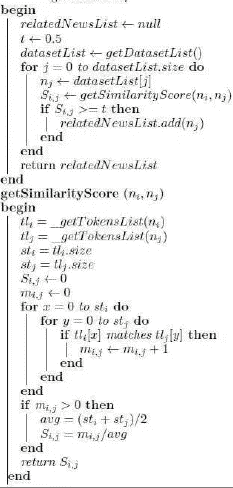
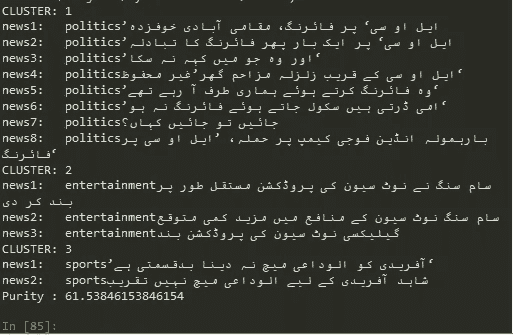
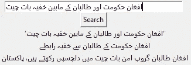

# 使用标题的乌尔都语新闻聚类

> 原文：<https://medium.com/analytics-vidhya/urdu-news-clustering-using-headlines-c45bc2b8362f?source=collection_archive---------32----------------------->


蒂姆·莫斯霍尔德在 [Unsplash](https://unsplash.com?utm_source=medium&utm_medium=referral) 上的照片

***乌尔都语*** *全世界有超过 1.04 亿人使用。他们中的大多数人对阅读他们感兴趣的特定新闻更感兴趣。现在，基于同样的新闻，不同的媒体呈现不同的观点。因此，将来自不同来源的类似新闻聚集在一起将会给出更好的图景。*

在本文中，我将讨论数据处理技术和用于对来自不同来源的类似乌尔都语新闻进行聚类的[方法。用于该任务的算法基于不同新闻之间的相似性分数和阈值，以将其视为聚类的一部分。该算法分两部分工作。首先，它计算相似性得分，然后将该得分与阈值进行比较](http://www.cle.org.pk/clt16/Presentations/Clustering%20Urdu%20News%20Using%20Headlines.pdf)

你可以在 [GitHub](https://github.com/asadmohammad/UrduNewsClustering) 上看到最终代码。

# 数据

我使用的数据是 BBC 和 VOA 每天大约 3000 篇不同类别的新闻文章，如娱乐、政治、体育和杂文。

# 数据处理

为了给聚类算法准备标题，数据需要是干净的。处理步骤如下:

1.记号化:给定一个字符序列和一个已定义的文档单元，记号化就是将它分割成小块的任务，称为**记号。**

```
“Word Split”
def Tokenize(headline):
 words = []
 splitHeadLine = []
 for headline in headlines: 
   words = re.split(‘\W+’,headline)
   splitHeadLine.append(words)
   words = [“”]

 return splitHeadLine
```

2.去除停用词:**停用词**是任何语言中的一组常用词。在乌尔都语中，使用最多的词是آ、آئی、آئیں、آئے,یہ、یہاں等等。我用过的一长串停用词可以在这里找到。

```
“Stop Word Removal”
def removeStopwords(jumla): 
   emp = ‘’
   WordsWithoutStopWords = []
   for alfaz in jumla:
      wordsWithoutoStopWords = []
      for lafz in alfaz:
        if lafz in stop_words or lafz == emp:
          continue
      wordsWithoutoStopWords.append(lafz)

      WordsWithoutStopWords.append(wordsWithoutoStopWords)
      del wordsWithoutoStopWords

 return WordsWithoutStopWords
```

3.单词规范化:文本规范化是将文本转换成规范(标准)形式的过程。比如'*美国'*到'*美国*'。为了规范化乌尔都语单词，使用了 UrduHack 库来执行这项任务。

```
“Normalize Words”from urduhack import normalize
def NormalizeWords(word):
    NormalizedWord = normalize(word)
    return NormalizedWord
```

现在，我们已经清理了数据。是时候实现算法了。

# 算法

用于该任务的算法基于不同新闻之间的相似性分数和阈值，以将其视为聚类的一部分。该算法分两部分工作。首先，它计算相似性得分，然后将该得分与阈值进行比较。



算法 1.0

这个算法的详细解释可以看[这里](http://www.cle.org.pk/clt16/Presentations/Clustering%20Urdu%20News%20Using%20Headlines.pdf)。

上面代码片段的实现如下:

该算法返回类似于给定新闻“n”的新闻列表。

1.  相关新闻功能:

```
“Related NEWS Function”
def relatedNews(dataSet,inputNews):
    relatedNewsList = []
    t = 0.5
    dataSetList = dataSet
    ni = inputNews
    sizeofDataSetList = len(dataSetList)
    for j in range(0,sizeofDataSetList):
        nj = dataSetList[j]
        Sij = getSimilarityScore(ni,nj)
        if Sij >= t:
            relatedNewsList.append(nj)

    return relatedNewsList
```

2.相似性得分:这个函数将计算我们上面处理过的两个标题之间的相似性。

```
"Similarity between input document(ith) and the jth document(document in the corpus)"
def getSimilarityScore(ni,nj):
    tli = getTokensList(ni)
    tlj = getTokensList(nj)
    sti = len(tli)
    stj = len(tlj)
    Sij = 0
    mij = 0
    for x in range(0,sti):
        for y in range(0,stj):
            if tli[x] == tlj[y]:
                mij = mij + 1
    if mij > 0:
        avg = (sti + stj)/2
        Sij = mij / avg

    return Sij
```

# 聚类结果:

以下是由该算法生成的聚类示例:



相似新闻的群集

让我们输入 news，看看这个算法生成的新闻列表。



与输入的新闻相似的新闻列表

国家类别的精度最高，为 0.84。微观平均精度为 0.45，而宏观平均精度为 0.48。

**展望未来**我正在将它整合到我们的项目 *AKHBAR 中，*这是一个乌尔都语新闻个性化门户，将通过仅使用标题和新闻内容对新闻进行聚类来显示来自所有其他乌尔都语新闻机构的新闻。

对进一步推进这个项目有什么建议吗？我很想收到你的来信！随时和我联系[*LinkedIn*](https://www.linkedin.com/asad-muhammad/)*。*

干杯。