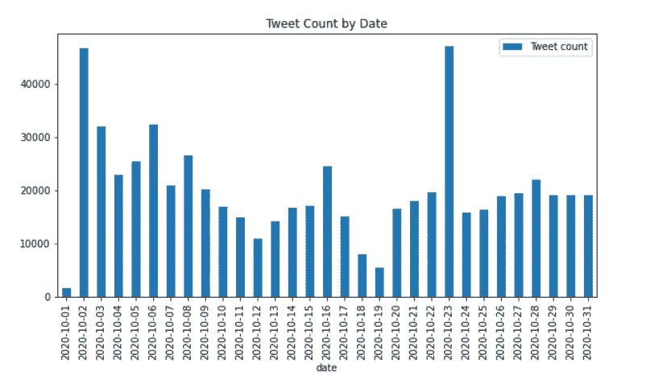
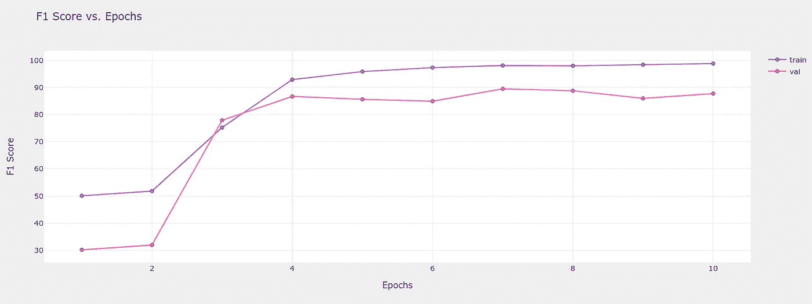
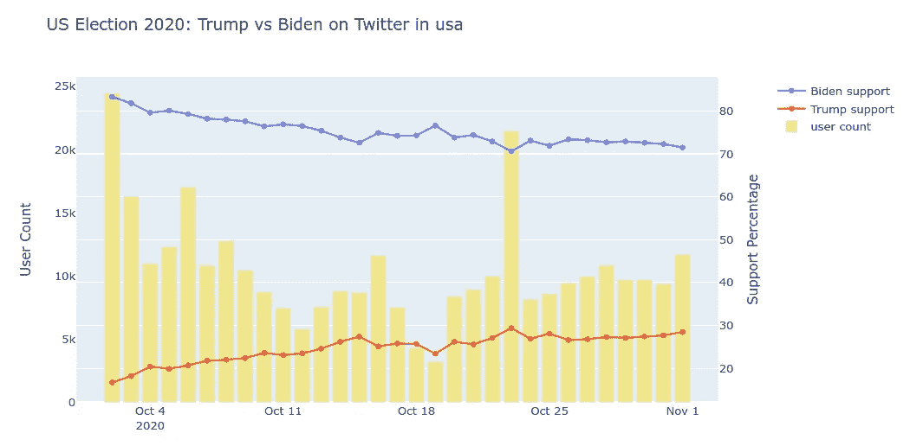
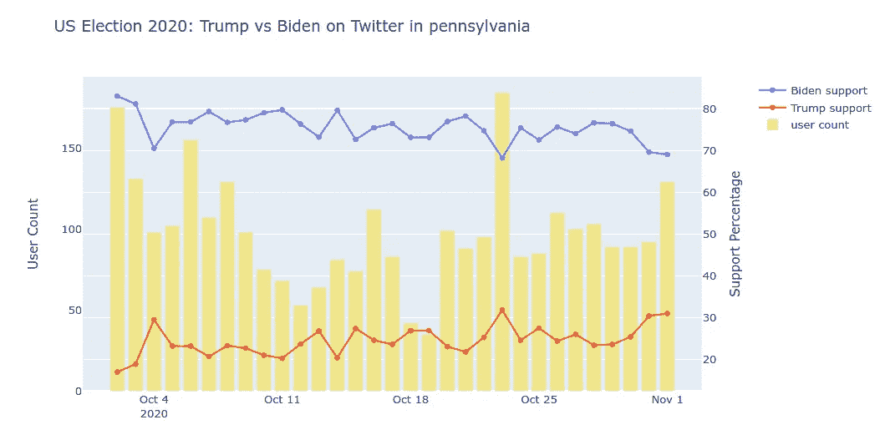

# 美国 2020 年大选:特朗普 vs 拜登在推特上

> 原文：<https://medium.com/analytics-vidhya/us-election-2020-trump-vs-biden-on-twitter-fbb8a8a7a489?source=collection_archive---------25----------------------->

**在 TPUs 上微调 PyTorch 中的 RoBERTa**

由[劳尔·纳杰拉](https://unsplash.com/@reinf?utm_source=medium&utm_medium=referral)在 [Unsplash](https://unsplash.com?utm_source=medium&utm_medium=referral) 上拍摄的照片

在今年早些时候的共和党全国代表大会上，唐纳德·特朗普(Donald Trump)在台上宣称:“这是美国历史上最重要的一次选举”。许多人会同意，这次他可能没有夸大其词。一些人甚至预测这次选举可能是自 1908 年以来最高的投票率。在两位候选人相互冲突的立场和政策之间左右为难，美国的选择将对世界其他地区产生深远的影响。

有这么多的利害关系，看看我们能否用公开的数据预测结果将会很有趣。我从 10 月初开始收集推文，希望利用 NLP 和 transformers 的力量来预测各州的选举结果。但很快就发现，Twitter 的用户群总体上是支持民主党的。根据皮尤研究中心最近进行的一项研究，69%的高产推特用户是民主党人。

如果数据中有内在的偏差，我们不能单独使用这个来源来预测结果。但我们可以看看 10 月份的趋势，看看是否有任何迹象表明未来会发生什么。

**数据**

截至 2020 年 10 月 30 日，Twitter 的 30 天平均日访问量超过 2000 万。为了选择合理大小的相关子集，我们只选择标签为#Trump 或#Biden 的推文，并排除转发。(例如，参见本指南[中的](https://towardsdatascience.com/how-to-scrape-tweets-from-twitter-59287e20f0f1)如何抓取推文)。我们每天有大约 2 万条推文需要分析。

作者图片

看看按日期排列的最受欢迎标签的种族条形图(使用[fluore Studio](https://public.flourish.studio/visualisation/4206480/))，有一点很突出:#Trump 是目前最受欢迎的一个——但正如我们将看到的，这些推文的大多数在情绪上是负面的。这次选举反映了美国社会分化为两大阵营，亲特朗普和反特朗普。投票给拜登的人更有可能是特朗普的仇恨者，而不是拜登的真正支持者。Twitter 还采取了前所未有的决定，压制(如果不是彻底禁止的话)一些关于亨特·拜登事件的推文，这可能是#HunterBiden 这样的标签没有在平台上传播的原因，尽管在福克斯新闻上的观看率非常高。

由[兴旺工作室](https://public.flourish.studio/visualisation/4206480/)提供

**训练、验证和测试数据集**

为了生成训练数据集，我们假设推文文本部分使用的某些标签反映了投票意图。对特朗普来说，这些标签包括:

*   #特朗普 2020 滑坡，
*   #Trump2020LandslideVictory，
*   #特朗普 2020 美国，
*   #BidenCrimeFamily

对于拜登，我们使用以下语句:

*   #TrumpCovid，
*   #特朗普病毒，
*   #VoteHimOut，
*   #特朗普国家耻辱，
*   #特朗普崩溃，
*   #特朗普犯罪家族

训练集的大小在 20K 左右。手动检查一百条推文的样本，这种生成训练集的方法只有大约 90%的准确率，因为评论者可能对某个标签表示不赞同，或者只是在讽刺。

为了生成验证集，我们不能使用从训练集中随机拆分的标准方法——算法很容易识别所使用的标签，而根本不分析语言，从而过度适应验证集。我们使用另一组短语，但是这次是在字段*用户名*和*用户描述上。*例如，如果一个用户在 *user_description 中有短语“vote Biden”，*我们相当确定他的投票意图。验证集包含大约 2500 条推文。

至于测试集，我们将使用字段 *user_location* 包含对美国的引用的所有推文，并使用过滤器-2020 年 9 月 1 日之后开通的 Twitter 帐户被排除在外，以防止虚假帐户传播宣传。用于训练和验证的推文也被排除在外，留给我们大约 60 万条推文。

**文本准备**

尽管停用词移除和词干化是变形金刚出现之前的标准工作流程的一部分，但现在由于变形金刚的强大，它们对结果的影响很小。我们将简单地:

1.  将 tweet 中的三个字段连接起来:*用户名*、*用户描述*和*文本*作为我们的输入文本；
2.  删除超链接；
3.  删除除撇号以外的标点符号；
4.  使用[表情库](https://github.com/carpedm20/emoji/)的文字；
5.  拆分骆驼大小写单词像“BidenHarris”到“Biden Harris”；和
6.  将所有字母转换成小写。

**在谷歌 TPU 实验室培训 py torch Roberta**

在我的 [Google Colab 笔记本](https://colab.research.google.com/drive/1THzDP3ny6YsPgf6GmzvgzKGmWJIO6qcy?usp=sharing)中可以找到用预先训练好的权重对 TPU 的 PyTorch Huggingface RoBERTa 模型进行微调的代码。

我不会在这里详细介绍代码，因为我相信工作流在笔记本本身中是相当清楚的，但我会注意到一些非标准的功能。由于训练集是用简单的规则选择的，因此在训练期间，选择 tweet 的阶段将被屏蔽，并用概率为 0.5 的空字符串替换。这将有望迫使模型不仅依赖于这些短语，还依赖于推文中更深层的语言特征。

由于训练集本身是有噪声的，我们将使用软标签:这里我们使用[0.1，0.9]而不是使用[0，1]作为类的标签。从经验上看，该模型通过这种修改训练得更好。训练度量配置文件看起来是合理的，在 4 个时期后，验证准确度达到了相当高的水平，这是许多下游微调任务的典型特征。

作者图片

**结果**

在我们深入研究结果之前，让我们首先从测试数据集中挑选一个小样本，并抽查预测的质量。在检查了 100 个样本后，我们对支持特朗普和支持拜登的推文的准确率都在 80%左右。

算法不符合要求的情况有多种原因。有时候，推文的文本部分没有足够的信息——附带的图像或视频承载了主要信息，我们没有对它们进行分析。有时算法会被语言的细微差别击败，而其他时候推文只是简单地令人困惑(至少对非美国人来说)。

例如，一条推文称“#特朗普的支持者在深夜集会上遭遇严寒后住院”。尽管该模型给出了 73%的支持特朗普的可能性，但我仍有疑虑。所以我跟踪了推文中的链接，这条推文竟然是反特朗普的左翼报纸《卫报》一篇文章的标题。所以，不完全是。

从每天的样本量来看，如果有一个真正的潜在模式，准确性上的轻微障碍应该没有太大关系——模式应该仍然很明显。

随着警告的提出，我们终于可以看看有趣的部分了:*随着选举日的临近，特朗普和拜登的相对支持率如何变化？*为了防止多产用户歪曲结果，我们将首先按用户对结果进行平均——每个帐户每天只有一票。

这是整个国家的总体情况:

作者图片

如前所述，Twitter 的用户群通常是支持民主党的，没有其他来源，很难得出任何关于真实支持水平的结论。反特朗普阵营在推特用户中拥有巨大优势。

然而，有一个非常明显的趋势——唐纳德·特朗普的支持度在整个 10 月份在 Twitter 上逐渐上升，在 23 日达到局部峰值，当时前商业伙伴波布林斯基作证反对拜登夫妇。总体而言，唐纳德·特朗普的支持率上升了 10%以上。

这种模式也广泛适用于单个州，由于样本量较小，噪声更大。在摇摆州之一的宾夕法尼亚州，我们观察到特朗普同样的上升轨迹，如果不是更不稳定的话。

作者图片

这一势头是否足以让特朗普再坚持 4 年？整个世界都在屏住呼吸…

用于 tweets 抓取、EDA、数据准备和结果分析的 Jupyter 笔记本可以在我的 [Github repo](https://github.com/ivanlai/US-Election-2020) 中找到。感谢阅读。