# 美国气温趋势

> 原文：<https://medium.com/analytics-vidhya/usa-temperature-trends-52c110ad3585?source=collection_archive---------18----------------------->

图片由 Akila Balasundaram(作者)提供

# 是什么启发了我做这个分析？

温度趋势和全球变暖一直是我和许多读者感兴趣的话题。因此，作为一名数据科学爱好者，当我遇到一个包含这种数据的数据集时，我抓住机会进行分析，并为其他爱好者做出贡献，同时，在我看来，这也是从资深数据科学家那里获得一些积极反馈的方式。所以在这里，我跳出来进一步探索数据。

# 对温度趋势的快速了解

关于全球变暖、全球气温趋势、海平面上升等的文章已经写得太多了。特别是 N 个博客和帖子发表了各种关于美国气温趋势的趣闻。这些文章中一些有趣的叙述如下

*   美国相邻的 48 个州的平均地表温度平均每十年上升 0.14 华氏度。
*   自 1895 年以来，美国的平均气温每年上升 1.3 到 1.9 华氏度。
*   2012 年和 2015 年是有记录以来最热的两年。
*   2012 年是全球有记录以来最热的一年。
*   2006-2015 年是全球有记录以来最热的十年。
*   美国北部、西部和阿拉斯加的气温上升幅度最大，而美国东南部的气温变化不大。

# 数据集

*   我已经从 Kaggle 下载了数据，这是一个预测建模和分析平台
*   数据集链接—[https://www . ka ggle . com/sudalairajkumar/主要城市每日气温](https://www.kaggle.com/sudalairajkumar/daily-temperature-of-major-cities)
*   数据集记录了从 ***1995 -2020 年的时间序列数据。***

> 该数据集包含来自主要地区的总共 125 个国家，如**非洲、亚洲、澳大利亚/南太平洋、欧洲、中东、北美、南美/中美洲&加勒比海**

但是我们现在感兴趣的是美国的气温趋势。所以我将美国的数据切片，作为我们进一步分析的数据框架。

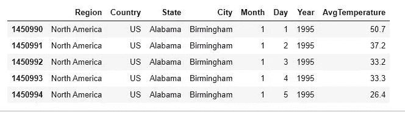

**可视化库:**

我使用了三个库来可视化它们的数据，

*   我们自己的 Matplotlib
*   *Seaborn。*
*   *Plotly* (我最近发现了这个库，我喜欢它的高度交互性，它能生成出版物质量的图表)。

**用于分析的其他库:**

*   熊猫
*   sklearn
*   XGBoost

**使用的 IDE:Jupyter 笔记本**

使用的语言:Python。

# 让我们深入分析一下:

让我们一个一个地分析我们在这篇文章开始时讨论过的观点。

美国北部、西部和阿拉斯加州的大部分地区气温上升，而美国东南部的部分地区气温略有变化。

为了检查这个断言在我们的数据集中是否成立，让我们进一步将数据分为 3 类。

*   **美国北部、西部:**伊利诺伊州、密苏里州、堪萨斯州、南达科他州
*   **美国东南部:**佐治亚、佛罗里达、阿拉巴马
*   **特例:**阿拉斯加

**美国迄今记录的平均气温平均值**

记录的平均温度的平均值

**全美记录的最高平均温度**

记录的最高平均温度

请随意使用“编辑图表”选项来玩和分析图表。我们可以注意到，美国北部、西部和阿拉斯加的温度变化(可以用色标显示)非常明显，而美国东南部的温度变化很小。美国西北部的极端温度实际上是显而易见的。

下图显示了所选各州历年的最高记录温度和平均温度及其差异。

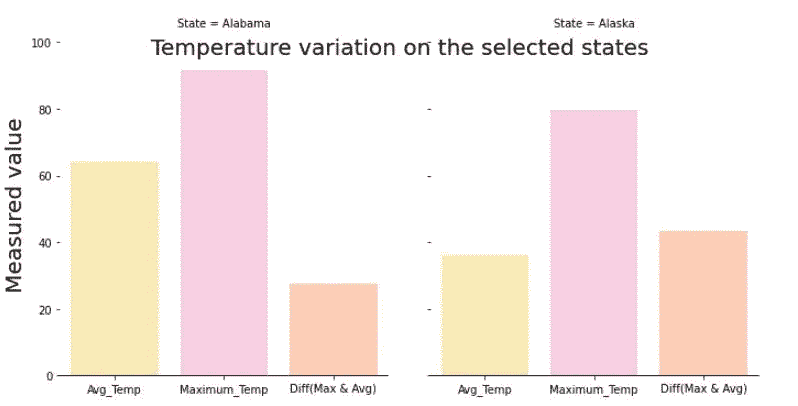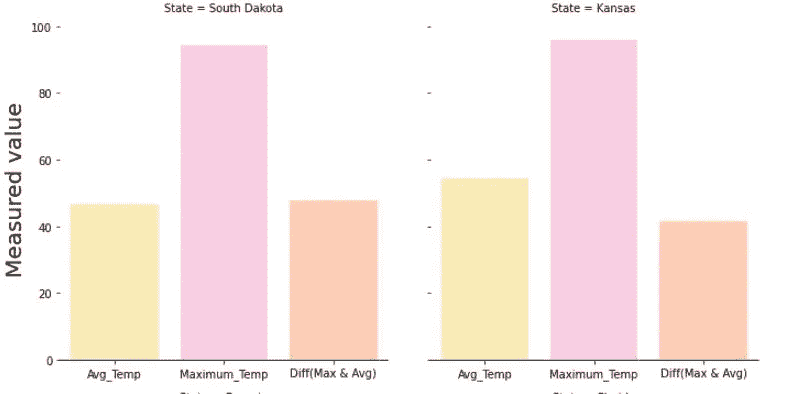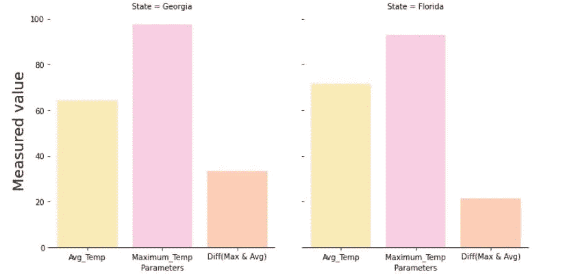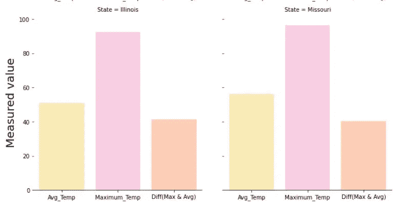

正如你在上面的图表中所看到的，在东南部各州，这种差异是非常小的。

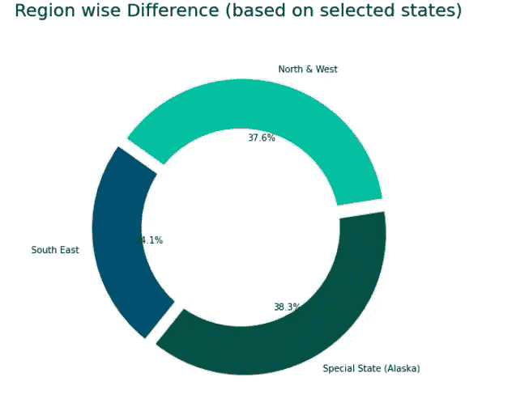

最高和平均温度区域差异

2012**——全球最暖的一年，美国也适用吗？**

下面是年份和温度变化的快照(抱歉伙计们，我没能嵌入视频)

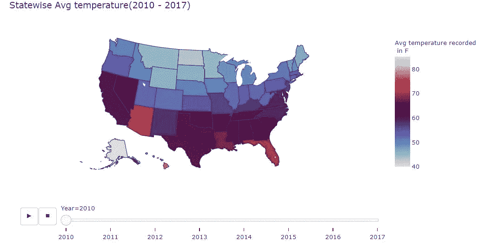

2010 年

**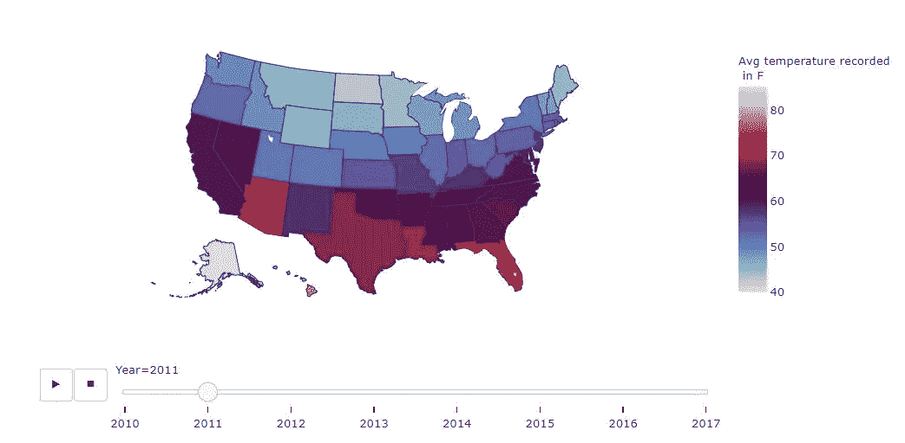**

****2011 年****

**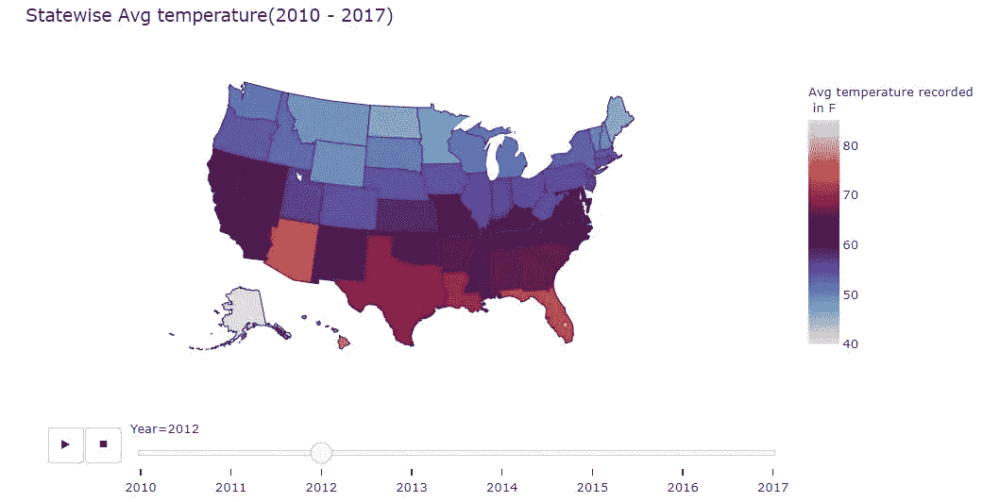**

****2012-利息年****

**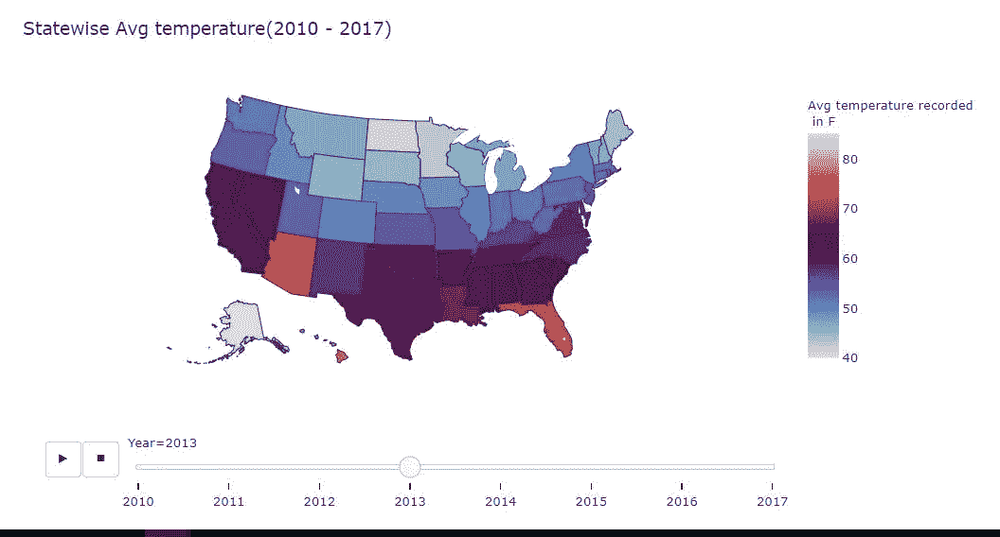**

****2013 年****

**从颜色梯度来看，很明显 2012 年是最热的一年，因为颜色从较暗到非常暗的蓝色梯度(接近 60 华氏度)变化，而不是较浅的蓝色梯度。与 2012 年的快照相比，其他年份的快照具有较浅的蓝色渐变。**

**同样，如果我们仔细观察这些快照，会发现美国东南部的**颜色梯度变化很小，甚至没有变化，这进一步证明了我们之前的说法，即**美国东南部各州在美国温度分析中受影响最小或统计上不显著。******

**2006—**2015 年是全球有记录以来最热的十年****

**为了这个分析，我将数据分离为基于十年的平均温度的平均值。由于我们有从 1995 年到 2020 年的数据，我们将把它分为 30 年，并检查美国气候趋势的说法是否正确。**

*   **1995-2005 年(特别将 2005 年添加到这十年中，这样就可以很容易地想象这一说法是否适用于美国)**
*   **2006 年至 2015 年(我们的兴趣)**
*   **2016–2019(不完整的十年)**

**当我试图把这种说法想象成 30 年来各州的平均温度时，几十年间的温度差异几乎看不出来。请看一些州的十年气温图截图。**

**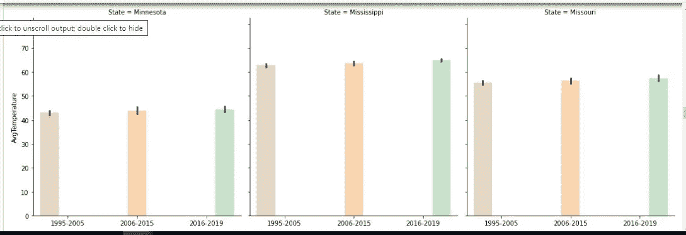**

**该州十年记录的温度**

**但是当我们试着看整个美国的数据时，这种差异是明显的。**

**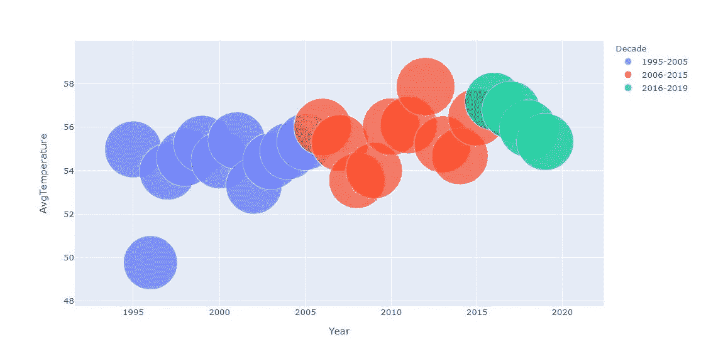**

**但它也让我们看到，2016-2025 这一正在发生的十年有可能成为新的“**最热的十年**”，因为趋势与(2006-2015)十年相当。**

**T **自 1895 年**以来，美国的平均气温每年上升约 1.3 华氏度至 1.9 华氏度**

**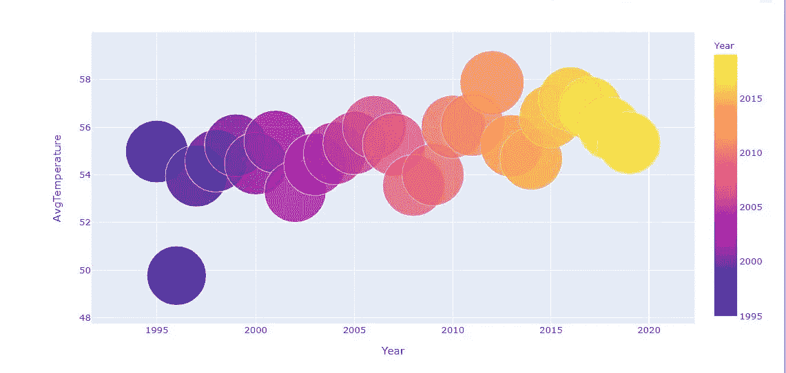**

**这些说法部分正确，因为我们可以看到从 1995 年到 2020 年至少有 1 **F** 上升，除了一些异常值(2006 年),温度下降非常小(2016- 2020 年)**

# **结论:**

## **北部、西部和阿拉斯加气温上升最多，而西南部气温变化最小**

*   **从我们的分析来看，这种说法已被证明是正确的，这些地区的极端温度也有显著的差异。**
*   **此外，在查看氯普图中各州的时间序列数据时，颜色变化在北部、东部和阿拉斯加州非常明显。**
*   **美国东南部的气温变化很小，甚至没有变化。**

## **2006-2015 年是全球有记录以来最热的十年，美国也是如此吗？**

*   **当通过将数据分成 30 年仔细查看时，这部分是正确的，并且这种影响在许多州并不显著。**
*   **如果看一下那十年各州记录的平均气温，我们可以得出结论，这在少数几个州是最低限度可见的**
*   **但是如果观察整个美国，按十年来分类的话，是的，这是对的。**

## **2012 年是全球有记录以来最热的一年，那么美国呢？**

*   **根据我们的数据，这一指控声称到目前为止是真实的，同时查看最近几年，即 2010 年、2011 年(前几年)和 2013 年、2014 年(后几年)，在这些年份，这一表述明显是明智的。**
*   **看看整个美国的时间序列数据，这些事实也符合我们的分析。这种模式在美国北部和西部也很明显，而东南部和阿拉斯加州没有受到太大影响，这再次证明了我们的第二点**

## **2012 年和 2015 年是温暖年。**

*   **虽然就各州而言，这种影响在 2012 年是真实的，但 2015 年仍不能被视为“最热的一年”，因为它的影响是分散的，在许多州并不突出**

## **平均温度每十年上升 0.4 华氏度**

*   **在分类的十年中观察到的差异约为每十年增加 **1.05 华氏度。****
*   **这比声称的每十年 **0.4 华氏度**的温度增加 **0.65 华氏度**。**
*   **这可能是因为我们只有 1995-2020 年的数据，所以我们可以将它们大致分为 30 年。**
*   **第三个十年在本分析中也变得无关紧要，因为它仍是一个持续的十年**

# **改进点:**

**通过输入更多年的数据，比如从 20 世纪 70 年代开始的数据，可以改进分析，从而实现预测的准确性和更深入的分析。**

****注意:伙计们，我也在我做分析的同一个笔记本上用梯度推进算法做了一个温度预测。如果你想看 Jupyter 笔记本，请使用下面的链接来看编码和预测部分。****

***链接:***

** [## AkilaBalasundaram/中

### permalink dissolve GitHub 是超过 5000 万开发人员的家园，他们一起工作来托管和审查代码，管理…

github.com](https://github.com/AkilaBalasundaram/Medium/blob/master/US%20temp%20data.ipynb)**