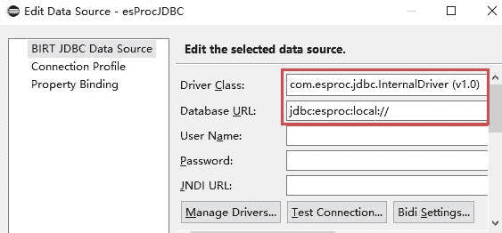
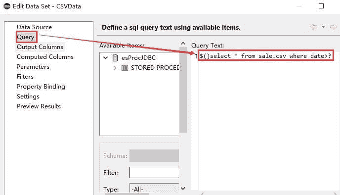
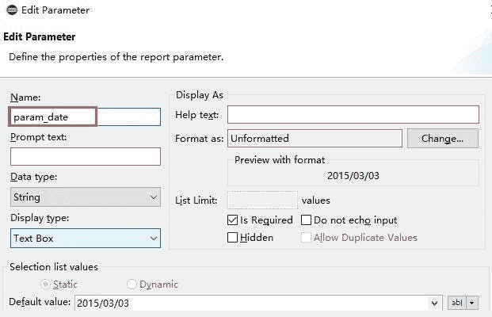
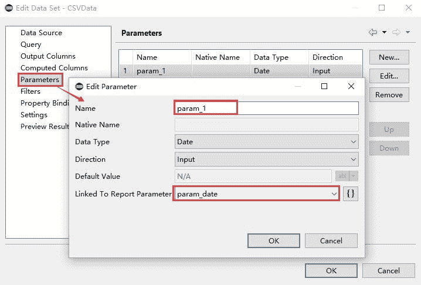
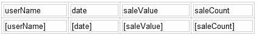
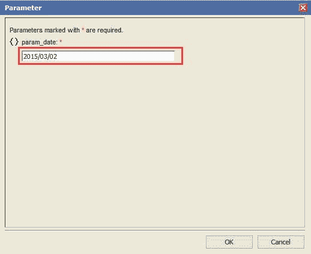
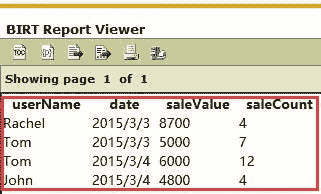

# 使用 BIRT 从 CSV 生成报告

> 原文：<https://medium.com/analytics-vidhya/use-birt-to-generate-reports-from-cvs-e8e9e5972992?source=collection_archive---------13----------------------->

如果您在 BIRT 从 CSV 或其他类型的平面文件中获取数据，您可以使用平面文件数据源。如果生成动态参数报告，可以创建第二个数据集来使用该参数并过滤原始数据集。如果您使用未格式化的 CSV 文件作为数据源并生成报告，您需要实现脚本数据源来引入数据。如何像 SQL 对平面文件那样查询数据并创建动态参数报告？怎样才能用一种简单易行的方式取代脚本数据源呢？我们如何在一个文件中处理所有的平面文件？答案是在 Birt 中使用 esProc。

下面举个例子介绍一下实现过程:
本例中，员工销售信息存储在 sale.csv 中，需要根据输入参数查询日期大于 2015–03–02 的员工信息。

sale.csv 数据如下:

```
userName,date,saleValue,saleCount
    Rachel,2015-3-1,4500,9
    Rachel,2015-3-3,8700,4
    Tom,2015-3-2,3000,8
    Tom,2015-3-3,5000,7
    Tom,2015-3-4,6000,12
    John,2015-3-2,4000,3
    John,2015-3-2,4300,9
    John,2015-3-4,4800,4  userName,date,saleValue,saleCount
    Rachel,2015-3-1,4500,9
    Rachel,2015-3-3,8700,4
    Tom,2015-3-2,3000,8
    Tom,2015-3-3,5000,7
    Tom,2015-3-4,6000,12
    John,2015-3-2,4000,3
    John,2015-3-2,4300,9
    John,2015-3-4,4800,4 
 userName,date,saleValue,saleCount
    Rachel,2015-3-1,4500,9
    Rachel,2015-3-3,8700,4
    Tom,2015-3-2,3000,8
    Tom,2015-3-3,5000,7
    Tom,2015-3-4,6000,12
    John,2015-3-2,4000,3
    John,2015-3-2,4300,9
    John,2015-3-4,4800,4  userName,date,saleValue,saleCount
    Rachel,2015-3-1,4500,9
    Rachel,2015-3-3,8700,4
    Tom,2015-3-2,3000,8
    Tom,2015-3-3,5000,7
    Tom,2015-3-4,6000,12
    John,2015-3-2,4000,3
    John,2015-3-2,4300,9
    John,2015-3-4,4800,4
```

这里我们展示了如何在 birt 中使用 CSV 数据源的参数。

这里不介绍 BIRT 与 esProc 的集成。请参考[如何在 BIRT](http://c.raqsoft.com/article/1544410181816) 调用 SPL 脚本。

**步骤 1** :添加一个 esProc JDBC 数据源。



**第二步**:添加数据集，直接写 SQL 查询 CSV 文件。

查询文本:



报告参数:



设置数据集参数并将它们链接到报表参数:



**第三步**:创建报表

该报告设计如下:



**第四步**:网页预览，输入参数，预览结果:

(1)输入参数:日期 2015 年 3 月 2 日



更多示例，程序文本文件参考以下[结构化文本计算](http://c.raqsoft.com/article/1571711703952)。