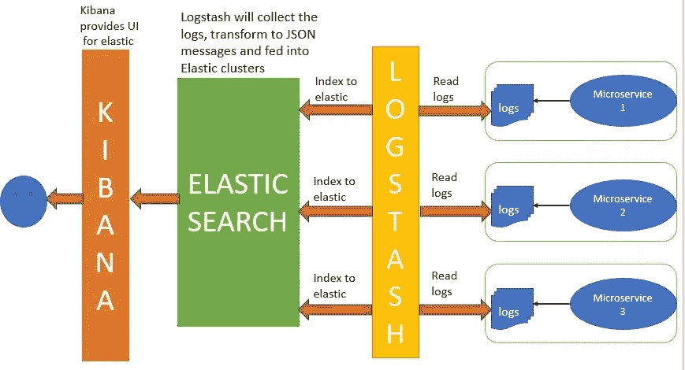
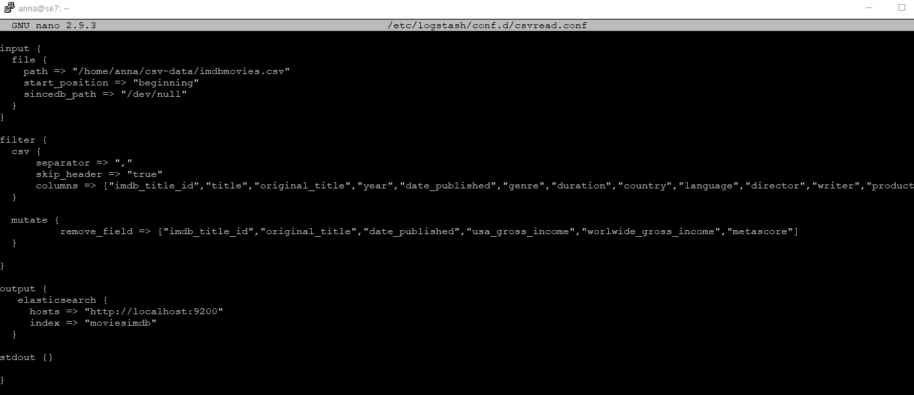
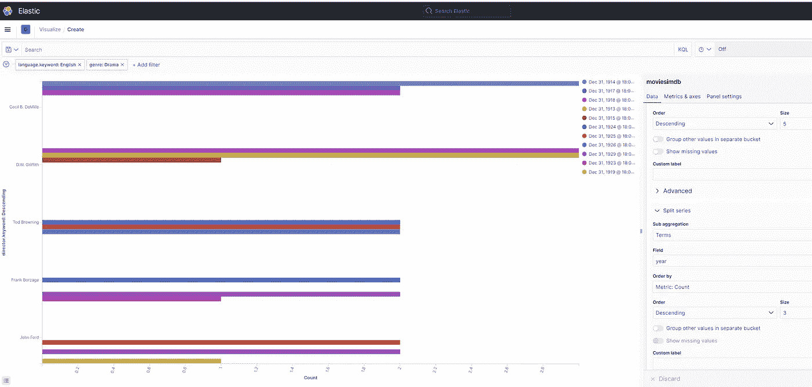
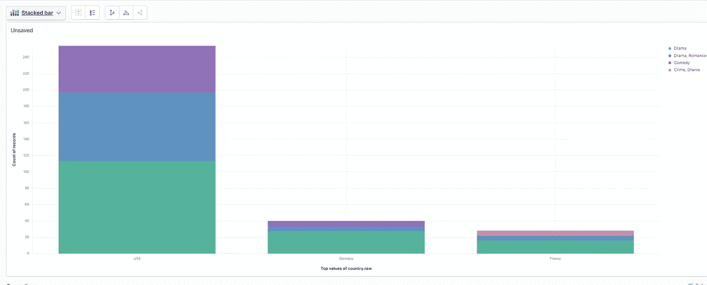
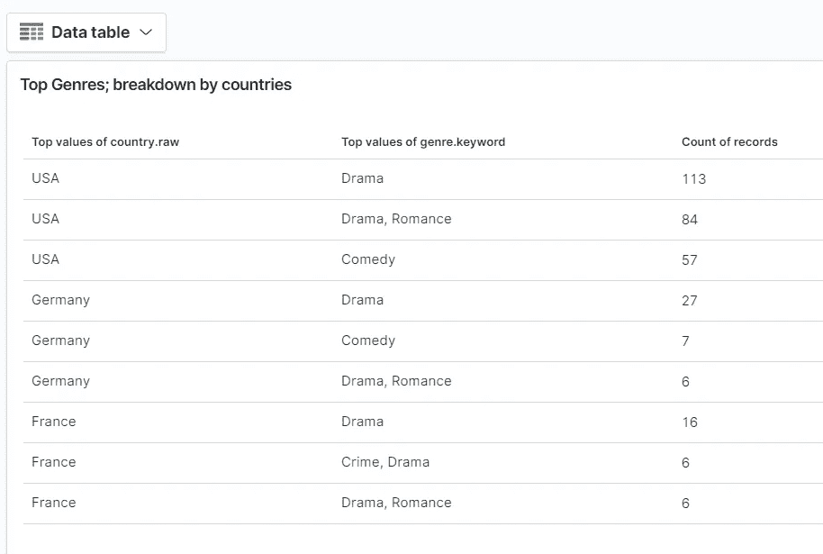

# 使用 Elasticsearch、Logstash 和 Kibana (ELK)可视化 IMDB 电影数据集

> 原文：<https://medium.com/analytics-vidhya/use-elasticsearch-logstash-and-kibana-elk-to-visualize-imdb-movie-dataset-1e63eaec3bff?source=collection_archive---------6----------------------->

在这篇文章中，我写的是我的一个项目，涉及 ELK Stack 和 IMDB movies 数据集。

# 麋鹿栈是什么？

**Elasticsearch:** 它是一个分布式、开源的搜索和分析引擎，支持所有类型的数据，包括文本、数字、地理空间、结构化和非结构化数据。

简而言之，它存储和索引转换后的数据(在本例中，来自 Logstash)。

**Logstash:** Logstash 是一个具有实时流水线功能的开源数据收集引擎。Logstash 可以动态地统一来自不同来源的数据，并将数据标准化到您选择的目的地。

简而言之，它收集日志和事件数据。在这种情况下，它解析和转换数据并将其发送给 Elasticsearch。

**Kibana:** 一个可视化工具，与 Elasticsearch 一起运行，允许用户分析数据并构建强大的报告。



来源:[https://www . javainuse . com/spring/spring boot-microservice-elk](https://www.javainuse.com/spring/springboot-microservice-elk)

# IMDB 电影数据集:

电影数据集包括 85，855 部电影，具有诸如电影描述、平均评级、投票数、流派等属性。

来源:[https://www . ka ggle . com/stefanoleone 992/IMDB-extensive-dataset](https://www.kaggle.com/stefanoleone992/imdb-extensive-dataset)

# 开始设置:

1.安装 Virtualbox

从 https://www.virtualbox.org/wiki/Downloads[安装 Virtualbox】](https://www.virtualbox.org/wiki/Downloads)

2.安装 Ubuntu

从 https://www.ubuntu.com/download/server[下载 Ubuntu 服务器 ISO](https://www.ubuntu.com/download/server)

3.安装 Java 8 环境

```
*sudo apt-get install openjdk-8-jre-headless -y*
```

4.安装 Elasticsearch

```
*sudo apt-get update && sudo apt-get install elasticsearch*
```

5.安装日志存储

```
*sudo apt-get update && sudo apt-get install logstash*
```

6.安装基巴纳

```
*sudo apt-get install kibana**sudo vi /etc/kibana/kibana.yml and change server.host to 0.0.0.0*
```

# 使用 logstash 开始向 elasticsearch 发送数据

**1。启用并开始弹性搜索**

```
*sudo /bin/systemctl enable elasticsearch**sudo /bin/systemctl start elasticsearch.service*
```

**2。日志存储配置文件**

该文件包含输入文件、输出位置和指定过滤方法的详细信息。



在[https://github . com/annapooranik/ELKforIMDBmovies/blob/main/CSV read . conf](https://github.com/annapooranik/ELKforIMDBmovies/blob/main/csvread.conf)中找到

3.**启动日志存储**

```
sudo /usr/share/logstash/bin/logstash -f /etc/logstash/conf.d/csvread.conf
```

运行上述命令后，数据应该在 Elasticsearch 中进行索引。如您所见，我已经创建了名为 moviesimdb 的索引

**4。启动基巴纳**

```
sudo /bin/systemctl enable kibana.servicesudo /bin/systemctl start kibana.service
```

在网络浏览器中进入[http://](http://127.0.0.1:5601/app/home#/)localhost:5601[/app/home #/](http://127.0.0.1:5601/app/home#/)，你应该能够在 Kibana 中可视化数据

# Elasticsearch 映射？

在 elasticsearch 中，映射是一个模式定义。Elasticsearch 有合理的默认值，但有时您需要定制它们

**解决方案:**

遗憾的是，您不能更改现有索引上的映射。您必须删除它，建立一个新的映射，并重新索引它。因此，这是我们在将数据导入索引之前需要考虑的事情。

**查看已有索引:**

```
curl -XGET hostname:9200/moviesimdb/_search?pretty=true
```

我已经将默认的索引导出到文件— moviesimdb_index，该文件可以在[https://github . com/annapooranik/ELKforIMDBmovies/blob/main/movie simdb _ index](https://github.com/annapooranik/ELKforIMDBmovies/blob/main/moviesimdb_index)中找到，供您参考

**删除已有的索引:**

```
curl -XDELETE hostname:9200/moviesimdb
```

**更改默认弹性搜索映射:**

在 Elasticsearch 中，默认情况下，字符串将被映射为文本和关键字。

当我们需要文本字段应该精确匹配时，最好使用关键字映射来代替文本。对已分析文本字段的搜索将返回任何稍有关联的内容。根据分析器的不同，结果将区分大小写、进行词干分析、删除停用词、应用同义词等。

因此，基于此，我想

1.将描述更改为分析器字段

```
“description” : { “type” : “text”, “analyzer” : “english”},
```

和

2.将“年初至今”字段从文本字段更改为

```
“year” : { “type” : “date”, “fields” : { “keyword” : { “type” : “keyword”, “ignore_above” : 256 } }}
```

**多字段:**我们可以针对不同的目的，以不同的方式索引同一个字段。例如，字符串字段可以映射为全文搜索的文本字段，也可以映射为排序或聚合的关键字字段

3.为国家字段启用多字段。该请求添加了 country.raw 关键字多字段，可用于排序。

```
“country” : { “type” : “text”, “fields” : { “raw”: { “type”: “keyword” } }},
```

**N-grams:**N-gram 是 N 个字符的序列。Elasticsearch 不仅将可搜索文本分解成单个术语，还分解成更小的块。边 n 元文法用于实现自动完成功能。

4.在这里，我创建了一个定制的分析器——自动完成过滤器，并使用 ngram_tokenizer 进行设置——指定最小和最大克数，并应用于一个字段——标题。

```
“settings”: {“analysis”: { “filter”: { “autocomplete_filter”: { “type”: “edge_ngram”, “min_gram”: 1, “max_gram”: 20}},“analyzer”: { “autocomplete”: { “type”: “custom”, “tokenizer”: “standard”, “filter”: [ “lowercase”, “autocomplete_filter” ] } } }},// then proceed to mappings-> properties and make the changes“title” : { “type” : “text”, “analyzer”: “autocomplete”},
```

以下是完整代码的链接:[https://github . com/annapooranik/ELKforIMDBmovies/blob/main/ElasticsearchMapping](https://github.com/annapooranik/ELKforIMDBmovies/blob/main/ElasticsearchMapping)

创建映射后，使用 csvread.conf 文件再次启动 logstash。

这些映射将在 Elasticsearch 和 Kibana 中提供

**搜索现有索引:**

```
curl -XGET hostname:9200/moviesimdb/_search?pretty-d ‘
{ “query”: { “match”: { “title”: “star” } }}’
```

# 使用 Kibana 的仪表板

一旦您启动了 Kibana 服务，在您的浏览器中打开 localhost:5601，您应该能够打开 Kibana。

接下来，按照[https://www . elastic . co/guide/en/ki Bana/current/index-patterns . html](https://www.elastic.co/guide/en/kibana/current/index-patterns.html)创建一个索引模式，然后使用 Visualise、Discover 和 Dashboard，您应该能够创建一些可视化来回答一些查询。

我用我的数据集回答的一些例子如下:

1.  根据他们制作的电影数量，排名前三的导演是谁？按照前三年的排名进一步细分每位导演(再次按照电影数量)



2.哪三个国家制作的电影数量最多(根据数据库中的电影数量)？该数据进一步细分为各个国家的前三大流派。



3.问题 2 的数据表。



**备注:**

1.  与这个项目相关的所有代码都可以在—[https://github.com/annapooranik/ELKforIMDBmovies](https://github.com/annapooranik/ELKforIMDBmovies)中找到
2.  由于篇幅和时间的限制，这里没有解释其他复杂的决策、配置和代码
3.  其他技术，如 Beats，可以集成在此之上。