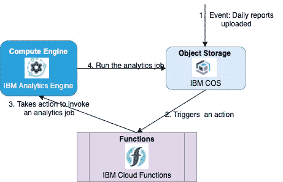
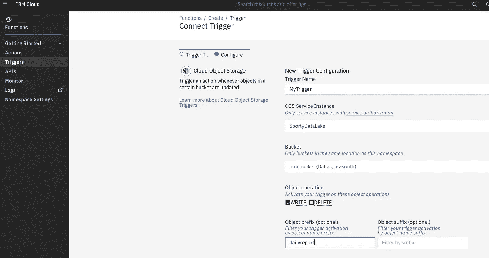
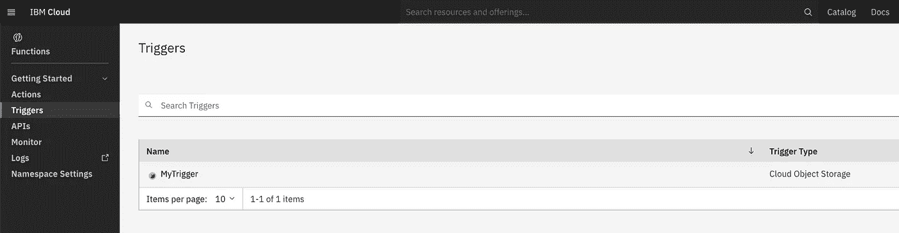
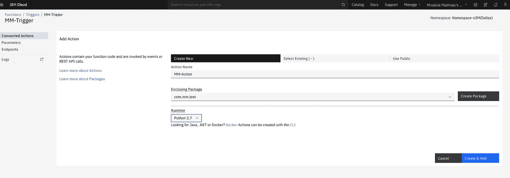
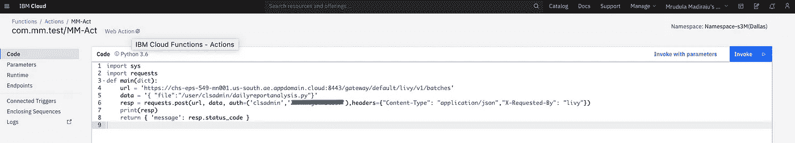
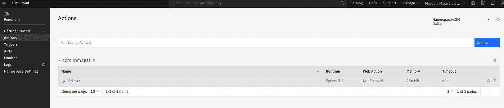
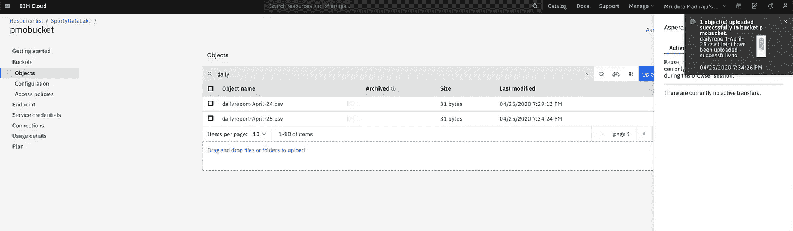
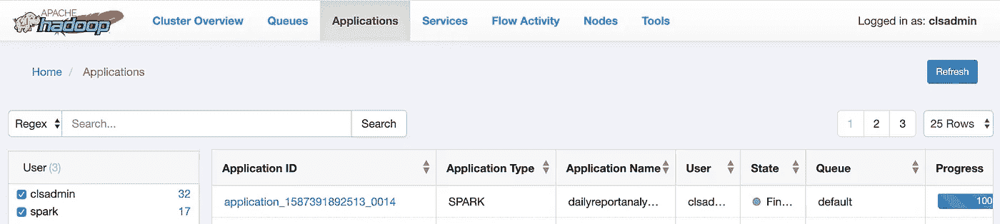

# 将函数用于分析工作流

> 原文：<https://medium.com/analytics-vidhya/use-functions-for-analytics-workflows-16c9629ffbca?source=collection_archive---------38----------------------->

# TL；速度三角形定位法(dead reckoning)

这个故事基于一个客户使用案例——如何将**无服务器**与**托管服务**结合起来构建分析工作流。我们将看到这样一个需求的必要性，以及实现它的步骤。

有服务为什么还要无服务器？[本凯霍](https://read.acloud.guru/@ben11kehoe?source=post_page-----717ef2088b42----------------------)的优秀文章 [**无服务器是一种心态**](https://read.acloud.guru/serverless-is-a-state-of-mind-717ef2088b42) 谈如何…

> “您应该在托管服务之间使用函数作为粘合剂，包含您的业务逻辑，这些托管服务提供了构成您的应用程序的大部分的重要内容。

# *概观*

**

1.  *数据成批出现，并存储在[云对象存储器](https://cloud.ibm.com/catalog/services/cloud-object-storage)中。数据丢弃的频率是每天一次，根据负载、来自某个上游系统的事务数量等，数据丢弃可以在任何时间发生。*
2.  *每当有数据丢失时，使用 [IBM 云函数](https://cloud.ibm.com/functions)触发*动作**
3.  *动作的实际*执行是调用计算引擎上的作业，在本例中是 [IBM 分析引擎](https://cloud.ibm.com/catalog/services/analytics-engine)。这里我们使用 Livy 接口调用一个 spark 应用程序**
4.  *最后，spark 应用程序的执行是针对刚刚丢弃的数据完成的。*

# *IBM 云功能*

*IBM Cloud Functions 基于 Apache OpenWhisk，是一个多语言功能即服务(FaaS)编程平台，用于开发可按需扩展执行的轻量级代码。这种事件驱动计算平台，也称为无服务器计算，或功能即服务(FaaS)，运行代码以响应事件或直接调用。*

*   *动作:动作是一段执行特定任务的代码。一个动作可以用你选择的语言编写，比如嵌入在 Docker 容器中的 JavaScript 或 Swift 代码或自定义二进制代码的小片段。您可以将您的操作作为源代码或 Docker 映像提供给云函数。*
*   ***序列:**一组动作可以链接成一个序列，无需编写任何代码。序列是按顺序调用的动作链，其中一个动作的输出作为输入传递给下一个动作。*
*   ***事件:**事件的例子包括数据库记录的改变、超过特定温度的物联网传感器读数、GitHub 存储库的新代码提交，或者来自 web 或移动应用的简单 HTTP 请求。*
*   ***触发器:**触发器是一类事件的命名通道。触发器是一个声明，您希望对来自用户或事件源的某种类型的事件做出反应。*
*   ***规则:**规则将一个触发器与一个动作相关联。每次触发器触发时，规则使用触发器事件作为输入，并调用关联的操作*

*点击阅读更多概念和术语[。](https://cloud.ibm.com/docs/openwhisk?topic=cloud-functions-use_cases)*

# *步骤 1:创建触发器*

*在不涉及太多细节的情况下，这一步是在一个名为 **pmobucket** 的特定桶上创建一个触发器，当带有名称前缀 **dailyreport*** 的对象被写入桶时，该触发器被激活。*

**

*它出现在我的触发器列表中，因此:*

**

# *步骤 2:创建行动*

*在这一步中，我们创建一个与上一步中创建的触发器相关联的操作。您可以选择任何运行时，比如 Node.js，随您选择——在本例中，我选择了 Python3。*

**

*为了演示起见——我使用了一个使用 python 请求库的简单 Livy 调用——来调用一个名为 **dailyreportanalysis.py** 的预定义应用程序*

**

```
*import sys
import requests
def main(dict):
    url = '[https://chs-mmm-007-mn001.us-south.ae.appdomain.cloud:8443/gateway/default/livy/v1/batches'](https://chs-eps-549-mn001.us-south.ae.appdomain.cloud:8443/gateway/default/livy/v1/batches')
    data = '{ "file":"/user/clsadmin/dailyreportanalysis.py"}'
    resp = requests.post(url, data, auth=('clsadmin','password'),headers={"Content-Type": "application/json","X-Requested-By": "livy"})
    print(resp)
    return { 'message': resp.status_code }*
```

*我创建的操作如下所示。*

**

# *步骤 3:上传数据以触发操作*

*再次出于演示的目的，我使用云对象存储的控制台界面来上传需要分析的数据*

**

*这导致应用程序被自动调用，您可以从分析引擎集群的 Ambari UI 中看到这一点。*

**

# *结论*

*IBM Cloud functions 是一个强大的工具，可用于将跨多个服务的处理流程缝合在一起。在这里，为了演示的目的，我们只触及了表面。*

*如果不是为了函数？同样的事情也可以通过外部和内部的工作流工具来实现(比如 Oozie)。然而，这需要更多的设置、代码和配置。我花了不到一个小时的时间为这个特别的演示创建步骤。*

*围绕 [IBM Cloud](https://cloud.ibm.com/) 快乐探索！*

*这篇文章是与 IBM 云和认知软件服务顾问[丹尼尔·洛佩斯·赛恩斯](https://www.linkedin.com/in/daniel-lopez-sainz-6114998/)合著的。*