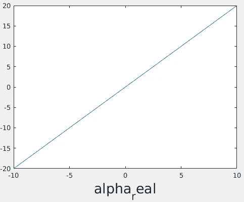
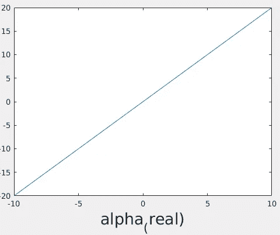
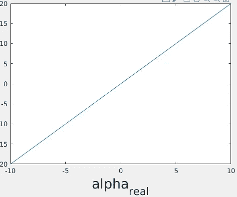
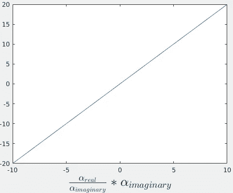

# 使用 Latex 解释器在 Matlab 中绘图

> 原文：<https://medium.com/analytics-vidhya/use-latex-interpreter-for-plotting-in-matlab-eb812fb475e2?source=collection_archive---------8----------------------->

现在，人们习惯于用图表的形式显示任何数据。毕竟人脑很容易感知视觉数据。所以，没有人应该受到责备。

作为一名科学家，我使用了大量的数学符号(主要来源于希腊语)。那些符号存在于 Matlab 中，但是你当然不会在编辑器中使用它们，因为我们都知道在我们的报告中键入数学方程(使用这些符号)的痛苦。这就是 Matlab 代码看起来像这样的原因

```
clear all;
alpha = -10:10;
beta = 2.*alpha;
```

而不是像这样

```
clear all;
α = -10:10;
β = 2.*α;
```

顺便说一下，在第 3 行中，我使用了。*而不是公正。指示 matlab 它是一个元素式运算(beta =[2 *(10)，2*(9)，2*(8)，…，2 *(8)，2 *(9)，2*(10) ]，而不是矩阵乘法运算(beta = [-10，-9，-8，…，8，9，10] * [-10，-9，-8，…，8，9，10] * [-10，-9，…，8，…，8，9，10] … 10 次)。

回到我们的主题…如果代码中没有使用符号，那么它们在哪里使用呢？你一定已经从标题猜到了。它们用于情节。因为情节很重要。他们是进入演示的人。

所以，我正高兴地把我的一些阿尔法和贝塔放在一个情节里，这就发生了。

```
clear all;
alpha_real = -10:10;
alpha_imaginary = 2.*alpha_real;
plot(alpha_real, alpha_imaginary)
xlabel('alpha_real','FontSize',20);
```



显然它有问题。只有' real '中的' r '作为下标。



所以，我想，等等(实际上必须是 hold off(这是 matlab 的双关语))，可能是我漏掉了括号。所以，我尝试了更糟糕的`xlabel('alpha_(real)');`。我也试过`xlabel('alpha_[real]');`，还是很失望。



当我使用*花括号*时，它终于成功了。我试过了`xlabel('alpha_{real}');`

那是一种解脱。所以，现在我想(在我自己的歪心思里)是不是有 matlab 做不到的事情。

是啊！

Matlab 不能像人类一样写分数。因此，我说服自己，分数看起来像图中的分数是很重要的，并开始搜索 Microsoft Office(或 LibreOffice(或任何典型的 Office 套件))是如何做到这一点的。我是一个 latex 的家伙(所有技术人员都喜欢 latex 而不是 office 套件)发现 matlab 有一个 Latex 解释器。我用乳胶打报告。这使它变得更容易，因为我不必记住另一个奇怪的语法，或者使用另一个软件来实现这个小功能。我可以简单地将我的代码从 latex 复制并粘贴到 matlab 中，然后完成工作。

所以最后我的代码看起来像

```
clear all;
alpha_real = -10:10;
alpha_imaginary = 2.*alpha_real;
plot(alpha_real, alpha_imaginary)
xlabel('$\frac{\alpha_{real}}{\alpha_{imaginary}}*{\alpha_{imaginary}}$','Interpreter','latex','FontSize',20);
```

顺便说一下，第 5 行延续到第 6 行(是的，它相当长)。因此，我的情节是这样的

