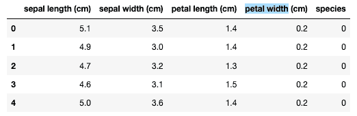
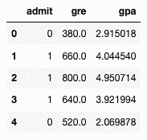
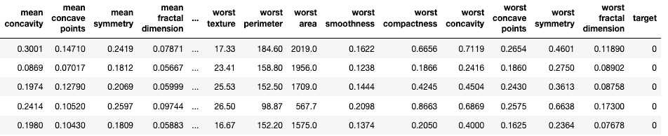

# 使用机器学习进行分类——分类建模简介

> 原文：<https://medium.com/analytics-vidhya/use-machine-learning-to-make-categorization-introduction-to-classification-modeling-97e83563cc9c?source=collection_archive---------26----------------------->

这一系列文章是为了向对该主题感兴趣但没有先验背景的人介绍机器学习。如果你有任何问题或者想知道更多关于这个话题的信息，请发短信或者邮件给我。

我们已经在另一篇文章中讨论过[用回归建模解决回归问题。我们将看看分类问题和建模，以了解分类模型可以做什么，以及在现实生活中的应用。](https://nars-chang.medium.com/solve-problems-with-machine-learning-what-is-machine-learning-anyway-bb2d5339a88)

我最近在一部名为《殖民地》的严肃电视剧中遇到了一个有趣但极端且在道德上有争议的分类模型。关于这个节目的一些背景信息——简而言之，在未来的某个时候，一个外星物种殖民了地球，并通过一个名为“占领”的代理组织统治着地球。这里引起我注意的是，外星人采用了一种由人类数据科学家开发的分类算法，将人类分成几个组，用于不同的功能。在节目中，它并没有真正讨论算法如何让人们合格或不合格，但这足以引发思考。我正在狂看这部剧，稍后我会回到这个话题。

让我们回到分类问题和模型。分类问题是根据一套特定标准做出判断的情况。它可以是对具有相似特征的项目进行分组，像上面提到的算法一样进行资格认定，或者读取测试结果并决定它是积极还是消极的情况。还有很多例子。简而言之，通过分类机器学习模型，我们正在训练程序选择/分组目标或做出判断。

让我们来看看使用机器学习来分组项目。想象一下，如果你给的任务是把一堆花按它们的种类分开，你可以通过观察花的不同和相似来完成这项工作。为了让计算机为我们工作，我们不需要一堆花，而只需要一个有花的文件和对花的特征的观察。Scikit-learn 的[虹膜数据集就是一个很好的例子。(例如，请参见下表。)](https://scikit-learn.org/stable/auto_examples/datasets/plot_iris_dataset.html)[鸢尾](https://en.wikipedia.org/wiki/Iris_(plant))是一组开花植物的名字。在这个数据集中，物种是目标结果，有三个物种，分别用 0、1 和 2 表示。其余的列是花的特征，我们可以使用所有的特征或者只选择几个特征来建模。当我们训练我们的模型时，我们正在使我们的模型学习性状和目标物种价值之间的关系。如果我们用物种值缺失的新花卉数据填充我们的模型，我们期望模型基于之前学习的关系产生缺失值。

接下来，让我们看看一个分类模型是如何做出判断的。比方说，我有一个申请名牌大学的学生数据库。这个数据集中有三列——录取、gre 和 gpa。数据集中的每一行代表一个应用程序。在录取列中，如果学生被录取，则值为 1，否则为 0。我们训练我们的分类模型来学习 admit、gre 和 gpa 之间的关系。一旦模型被训练，我们可以向模型提供新的应用数据，以便机器基于先前学习的关系进行鉴定。

这里我们要介绍的最后一个用例是使用分类模型来读取测试结果，以确定患者是否患有肿瘤。在此数据集中，我们的列包含来自各种测试的值，目标列包含值 0 和 1–0 为负，1 为正。同样，我们训练我们的模型来学习目标列和其余测试结果列之间的关系。我们的期望是，当我们完成对我们的模型的训练时，它可以根据之前学习的关系来确定患者是否患有肿瘤。

这些是如何使用分类模型、用例以及模型如何在一个非常高级的视图中工作的例子。在某种程度上，这三个例子都是为了教学目的而简化的。以大学入学的第二个用例为例，我们知道当学生申请大学时，有更多的数据点需要考虑，如课外活动和表现以及学生的论文问题回答。

为了让机器学习发挥作用，我们必须找到一种方法来捕捉这些上下文中对象的观察结果，并找到一种方法来将观察结果转换为模型/程序可以识别的数据格式。在许多情况下，我们不得不简化观察以使其有效，这可能导致现实的丧失。或者，该模型可能在一种情况下工作良好，但在另一种情况下工作不佳，这是由于数据的收集或构造方式。机器学习是一种方法和工具，可以用来提高效率，但每个模型都有自己的局限性。

为了确保模型能够工作并做出“正确”的分类，我们需要评估我们的模型并使用评估来改进我们的模型，并在投入使用之前验证我们的模型的有效性。在我的下一篇文章中，我将讨论如何评估和改进分类模型。

如果你有兴趣了解更多关于机器学习和分类模型的知识，请发短信或邮件给我。