# 使用朴素贝叶斯算法进行分类和数值数据分类

> 原文：<https://medium.com/analytics-vidhya/use-naive-bayes-algorithm-for-categorical-and-numerical-data-classification-935d90ab273f?source=collection_archive---------0----------------------->

***朴素贝叶斯*** 是一种**监督**学习算法，属于**贝叶斯**分类。它使用**概率**进行预测分析。

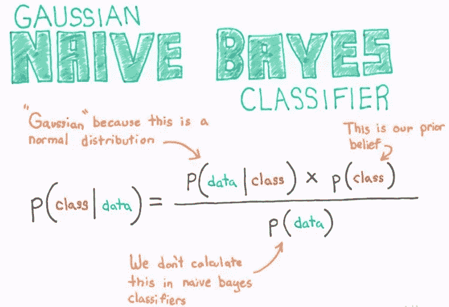

## 贝叶斯方程的证明:

如果我们考虑两个类别 **A** 和 **B** ,那么→

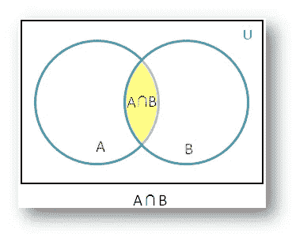

那么，A 对 B 的概率= **P(A|B) =**

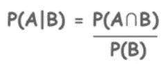

并且，B 对 A 的概率= **P(B|A) =**

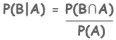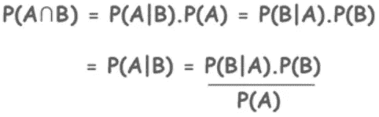

朴素贝叶斯方程

现在，我们将使用这个等式来理解朴素贝叶斯分类如何在各种数据集上工作，并为我们完成分类工作。

## **使用朴素贝叶斯分类器的领域:→**

1.  新闻分类(分为体育、医疗、媒体、娱乐等。)
2.  垃圾邮件过滤(将电子邮件分类为垃圾邮件或非垃圾邮件)
3.  人脸识别和物体检测
4.  医疗诊断
5.  天气预报

## **朴素贝叶斯算法如何工作:→**

为了理解这种算法是如何工作的，我们将使用这个数据集来对来自特定地方的具有特定收入的人进行分类，根据他们的性别进行分类。

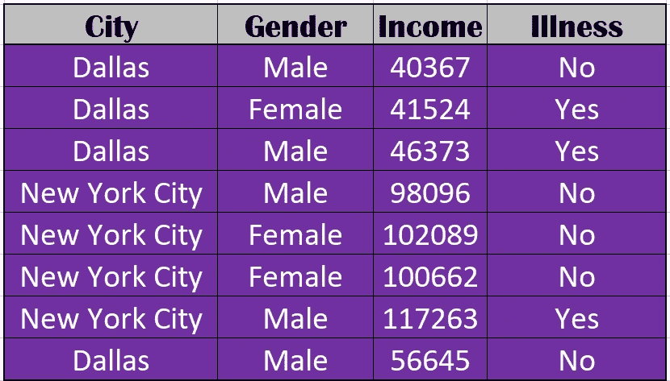

心脏病诊断数据集

现在，我们将开始为数据集中的每个独立列(城市、性别和收入)构建**频率**和**可能性**表。

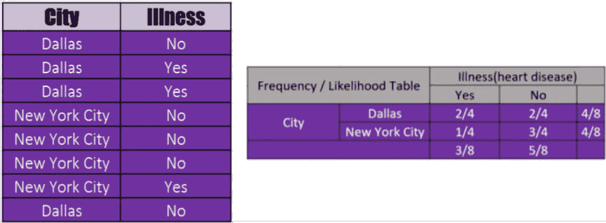

疾病列的可能性表

所以，我们从下表中得到的各种概率是:—

*   P(达拉斯|是)= 2/4，P(达拉斯|否)= 2/4
*   P(纽约市|是)= 1/4，P(纽约市|否)= 3/4
*   P(达拉斯)= 4/8，P(纽约)= 4/8
*   P(是)= 3/8，P(否)= 5/8

因此，给定患心脏病的可能性，城市是“达拉斯”= **P(是|达拉斯)** = (P(是)* P(达拉斯|是))/P(达拉斯)=((3/8)*(2/4)/(4/8)= 0.375**[***从贝叶斯方程导出的公式***】**

同理， **P(无|达拉斯)** = 0.625， **P(有|纽约市)** = 0.18， **P(无|纽约市)** = 0.93

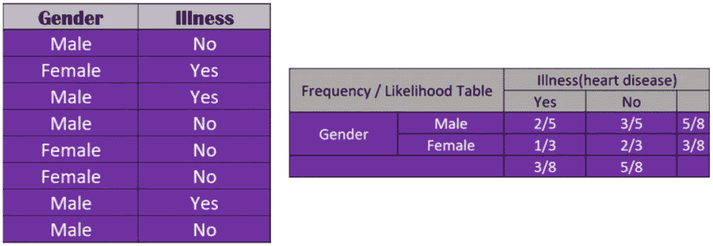

性别列的可能性表

所以，我们从下表中得到的各种概率是:—

*   P(男性|是)= 2/5，P(男性|否)= 3/5
*   P(女性|是)= 1/3，P(女性|否)= 2/3
*   P(男性)= 5/8，P(女性)= 3/8
*   P(是)= 3/8，P(否)= 5/8

因此，给定患心脏病的可能性，城市是“男性”= **P(是|男性)** = (P(是)* P(男性|是))/P(男性)=((3/8)*(2/5)/(5/8)= 0.24**[***从贝叶斯方程导出的公式***】**

同理， **P(无|男)** = 0.6， **P(有|女)** = 0.33， **P(无|女)** = 1.11

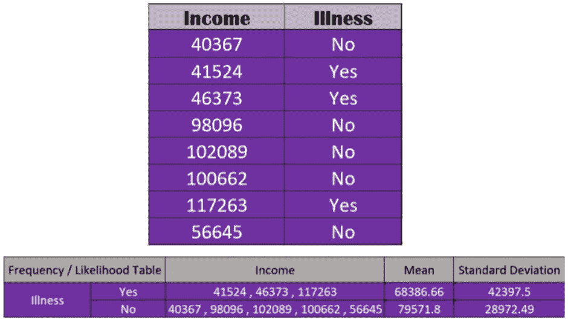

表 1

对于那些不明确的列，如“**收入**列，我们将使用**平均值、标准差和正态分布**公式来计算患者是否患有心脏病的可能性。公式如下所示:→

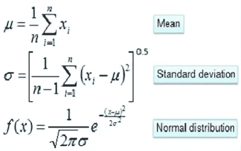

**均值、标准差和正态分布公式**

为了计算我们预测患者是否患有心脏病的任何新值 ***X*** 的可能性，我们将首先计算值 **mean** 和 **std。偏差**为收入栏根据心脏病存在与否，而不是针对该人的相应收入。* *然后我们将计算一个人患心脏病的可能性，或者，不是借助正态分布公式，而是使用我们必须预测疾病的那个人的收入值。**[ **重要**

现在，我们准备好预测新的测试数据集。因此，如果我们必须预测以下情况:→

测试数据

首先我们将计算患病的可能性，值 100000:

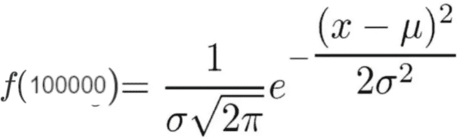

正态分布 1000 值

“是”，此人有疾病的可能性为→ **P(收入= 10000 |疾病=是)**=(1/(42397.5 *(2.506)))*(2.718)^-((100000–68386.66)/(2 * 42397.5))= 0.00000712789

“否”，此人未患病的可能性是→ **P(收入= 10000 |患病=否)**=(1/(28972.49 *(2.506)))*(2.718)^-((100000–79571.8)/(2 * 28972.49))= 0.0000107421

## 预测:→

for : X =(城市=达拉斯，性别=女性，收入=100K)

*   **P(X | Class = No)**= P(City = Dallas |Class=No) * P(性别=女性| Class = No)* P(收入= 100K | Class = No)= 2/4 * 2/3 * 0.00000712789 = 0.00000237596
*   **P(X | Class = Yes)**= P(City = Dallas |Class=Yes) * P(性别=女性| Class = Yes)* P(收入= 100K | Class = Yes)= 2/4 * 1/3 * 0.0000107421 = 0.000001790

* *[自 P(X |否)*P(否)> P(X |是)*P(是)]**。因此，[P(No | X)> P(Yes | X)]= >**Class = No**[**Important**]，算法将给出 **No** 作为**输出**，并且对于该测试数据集**，我们将认为患者不会患有心脏病。**

## 最需要注意的是:→

*** *如果我们的数据集中只有分类列**** ，如“城市”和“性别”列。那么在这种情况下，我们按照给定的步骤执行:→

for : X =(城市=达拉斯，性别=女性)

*   **P(Class = No | X)**= P(Class = No | City = Dallas)* P(Class = No | Gender = Female)= 0.625 * 1.11 = 0.69375
*   **P(Class = Yes | X)**= P(Class = Yes | City = Dallas)* P(Class = Yes | Gender =女性)= 0.375 * 0.33 = 0.12375
*   因此， **P(否)**= 0.69375/(0.69375+0.12375)= 0.84862385321&**P(是)**= 0.12375/(0.69375+0.12375)= 0.15137614678

由于**P(Class = No | X)**>**P(Class = Yes | X)**因而，**P(No)**>**P(Yes)**=>**Class = No****重要**，同样地，算法会给 **No** 作为**输出**并且，对于这个条件也和

这就是朴素贝叶斯算法的工作原理。我希望你喜欢阅读这篇博客。如果你有任何问题、意见或顾虑，请在评论区告诉我。在那之前享受学习。