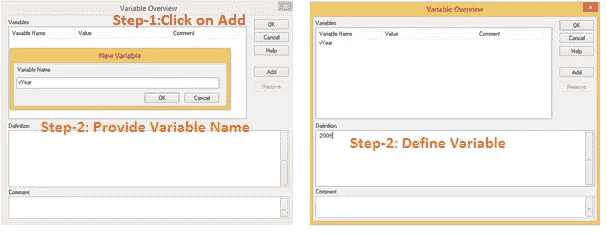
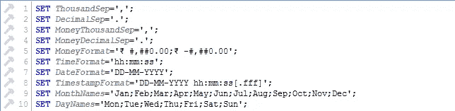
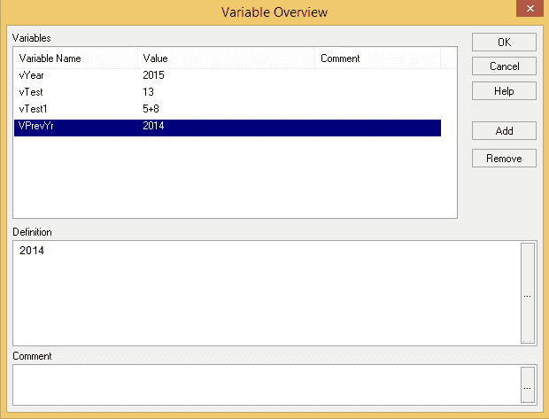
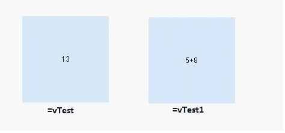
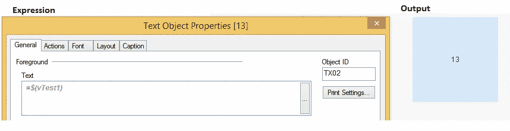

# 使用 QlikView 中的变量创建强大的数据故事

> 原文：<https://medium.com/analytics-vidhya/use-of-variables-in-qlikview-to-create-powerful-data-stories-438842870870?source=collection_archive---------0----------------------->

# 介绍

一个前端很好而后端很差的应用程序就像没有大脑的美女。最初你对它感到敬畏，但随着时间的推移，你会被它激怒。另一方面，高效的后端和糟糕的前端可能不会激发用户使用应用程序。在当今世界，你需要在这两个方面都做到优秀。

遗憾的是，许多人只将数据可视化与前端工程联系在一起。在今天的文章中，我想展示 QlikView 的后端工程是什么样的，以及它如何为您的数据故事增添巨大的力量。

# 编程语言中的自然进程

如果你学过任何语言的编码，你会亲身经历这一过程。

学习一门语言的第一步是理解它的语法，打印输出的方式，做数学计算等等。在这个阶段，你通常不会做任何复杂的事情。这通常不是很令人兴奋或有帮助的。毕竟你学编程语言不是为了算 2 + 3！

学习语言的第二阶段**是你开始使用变量来完成一些更复杂的任务。通过使用变量，您可以创建更复杂、更有用的通用逻辑。因此，如果你想比较两列各有一百万个数字，你不能这样做，除非你使用变量(可能是你可以，不是我！).这个过程的美妙之处在于，一旦你学会了使用变量，你就不可能想到学习过程中甚至还有第一阶段！**

学习一门新的编程语言还有更多的阶段，但是对于今天的文章，我们将把重点放在我刚刚提到的任何编程语言的第二阶段——变量的使用。如果您完全是 Qlikview 的新手，您应该首先从我们的学习路径— [资源学习基础知识，从零开始学习 QlikView，成为专家](https://www.analyticsvidhya.com/blog/qlikview-learning-path/)

# 真实生活情况——拯救我的变数！

我在 2012 年初开始使用 QlikView，并爱上了它。我们有一个充满激情的开发团队，在接下来的 6 个月里(有许多黑夜)，我们能够在一个漂亮的 QlikView 仪表板上为我们组织的整个销售流程替换传统的笨重的 excel / access 报告。我们现在是我们组织中其他情报单位羡慕的对象，被认为是整个组织的成功转型。

2012 年 9 月，销售总监给我打电话。这是明年销售计划的时间。所以，我想他会问同样的计划。对此我有充分的准备。多年来，我们已经创建了一个基于 Excel 的应用程序，它可以模拟大量的场景，然后为所有销售人员提供(字面上的)目标。

然后炸弹来了！销售总监说，这次他希望在我们的 QlikView 应用程序上进行规划。他说他希望在我们的仪表板中有一个新的工作表，销售人员可以在其中输入他们工作的参数(例如，一天接 10 个销售电话)，应用程序提供了他们将季节性和过去趋势考虑在内的估计。

我不知道如何在 QlikView 中做到这一点，所以我只是听他的。我不想让过去 6 个月的所有努力都结束，也不想让人们回到运行商业智能的旧方式。幸运的是，我遇到了变量以及它们在运行假设场景中的用途，我们继续在应用程序中构建它们。

# 什么是变量？有哪些方法可以创建它？

变量存储任何类型(数字、字符串、布尔、浮点)的数据(静态的或计算的),并使用表达式或直接使用其名称进行引用。QlikView 中的变量命名惯例有一些基本规则:

每当我们为静态值创建一个变量时，我们在变量名前面加上“ **v** ”(小写)。

每当我们在一个变量中存储一个表达式时，我们都会在变量名前面加上“ **e** ”(小写)。

在第一个字符之后，我们应该保留相关的名称，以便对开发人员友好。创建变量有多种方法。常用的有:

***方法 1:*** 进入菜单- >设置/变量概述

***方法二:*** 通过使用 SET 和 LET 语句。

让我们一个一个来看:

# 方法 1:

进入设置菜单->点击变量概述



**注意:**你也可以用表达式定义一个变量。

# 方法 2:

每当您开始一个新文档并转到编辑脚本时，您一定已经注意到 QlikView 会根据您的系统配置加载一些预定义的值。对吗？

这是因为，这些是 QlikView 使用 *Set 语句*创建的变量。您也可以使用“ **Set** ”语句在脚本中定义变量。



让我们看看我们是怎么做的。查看下面定义变量的语法:

```
**Syntax:** Set Variable_Name=Value;Example: Set vPrevYr='2014';
```

另一种创建变量的方法是使用“ **Let** 语句。 **Let** 语句对' = '右侧的表达式求值，并将其赋给' = '左侧的变量。

**语法:**让变量名称=表达式；

```
Example: Let vTest=5+8;
```

如果你将使用 **Set** 语句将表达式输出存储在一个变量中，它将把表达式存储为一个值。在接下来的章节中，我将展示使用 **Let** 和 **Set** 语句定义公式的详细效果。

```
Example: Set vTest1=5+8;
```

在下面的截图中，运行脚本后可以看到所有定义的变量(vPrevYr，vTest，vTest1)。同样，新变量也可以在这里定义/找到。



另读:[如何在 qlikview 中实现增量加载？](https://www.analyticsvidhya.com/blog/2014/09/qlikview-incremental-load/)

# 我们如何访问变量？

可以使用等号(=)来访问变量值。如果变量以等号“=”为前缀，QlikView 会尝试将该值作为公式(QlikView 表达式)进行计算，然后显示或返回结果，而不是实际的公式文本。

让我们通过访问上面创建的变量“ **vTest** ”(使用 Let 创建)和“ **vTest1** ”(使用 Set 创建)来理解它。

让我们创建一个文本框对象，并放入一个表达式为 **"=vTest"** ，类似地，在另一个文本框中，我们放入 **"=vTest1"** (如下所示)。



请注意，使用“ **Let** 创建的变量(vTest)已经得到了很好的评估。相反，使用“**Set”**创建的变量(vTest1)尚未被求值。这就是使用 Set 或 Let 语句创建变量的区别。

现在，为了评估变量 **vTest1，**我们可以使用**美元符号扩展(DSE)** 。它是计算公式的方法。让我们看看这个使用美元符号展开的方法。此外，这也是在 QlikView 中访问变量的标准方式。

```
Syntax: $(variable_Name)
```

现在，我将访问变量"**vtest 1"**,并检查输出。



另请阅读:[Qlikview 中合成键的概念—简化！](https://www.analyticsvidhya.com/blog/2014/11/synthetic-keys-qlikview-simplified/)

# 变量最常见的用法是什么？

变量是 Qlikview、D3.js 等数据可视化软件的主体。优化变量的使用总是会减少应用程序开发时间。让我们看看变量的一些常见用法:

1.  **可移植性:**当我们想要存储值并在多个对象/图表中使用它们而不想再次键入那些值时，就使用变量。当我们想要执行动态计算时，也会用到变量。例如:为表示前一年而创建的变量“vPrevYr=$(=Max (Year)-1)”，是指根据当前选择的动态计算，可以被文档中的所有对象访问。
2.  **在图表对象中使用:**我们可以在多个地方使用图表中的变量:
3.  **假设分析:**我们可以在假设分析表达式中使用变量，也可以使用“**输入框**或“**滑块对象”。**在这种情况下，我们从这些对象(Input，Slider)中获取变量值，并在表达式中使用它们。
4.  **在表达式中(Set Analysis 和 Aggr):** 可以在预先表达式中使用变量，如 Set Analysis、Aggr()等。要了解这些表达式更多细节，您可以阅读这些文章([集合分析](https://www.analyticsvidhya.com/blog/2014/01/set-analysis-qlikview/)、 [AGGR()](https://www.analyticsvidhya.com/blog/2014/02/aggr/) )

除了上面提到的用途，我们还可以使用变量进行增量数据加载，并在各种脚本方法中改进我们的数据模型。

# 结束注释:

在本文中，我们讨论了变量的重要性、创建变量的方法以及变量在日常开发中的常见用法。基本上，我们已经看到了创建它们的两种方法(Set & Let 和 Variable Overview)。

如果我总结了变量最常见的用法，那么它将是使用其他图表对象的表达式开发，如输入框、滑块、文本框、按钮等。我建议你使用仪表盘中的变量。它减少了 dashboard 的静态特性，并且可以通过只在一个地方改变值来改变整个表达式的值。

我希望这篇文章能帮助你了解 QlikView 中变量的细节。我们很想听听您的意见。你觉得有用吗？欢迎在下面的评论中发表你的想法。

*原载于 2015 年 6 月 18 日 https://www.analyticsvidhya.com*[](https://www.analyticsvidhya.com/blog/2015/06/variables-qlikview-data-stories/)**。**