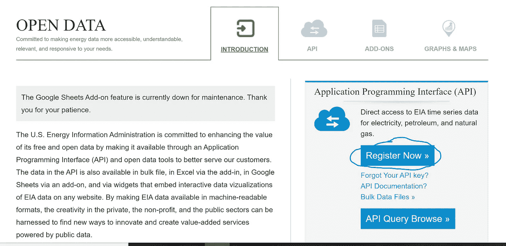

# 使用 Python 从能源部的 EIA API 中提取能源数据

> 原文：<https://medium.com/analytics-vidhya/use-python-to-pull-energy-data-from-the-us-department-of-energys-api-11d6f724927e?source=collection_archive---------6----------------------->


照片由[在](https://unsplash.com/@appolinary_kalashnikova?utm_source=unsplash&utm_medium=referral&utm_content=creditCopyText) [Unsplash](https://unsplash.com/s/photos/energy?utm_source=unsplash&utm_medium=referral&utm_content=creditCopyText) 上的卡拉什尼科夫拍摄

[能源信息署](http://www.eia.gov)负责美国能源部的统计和数据。美国有大量与能源相关的数据和信息，包括可再生能源、核能、原油、汽油、喷气燃料、柴油、电力和天然气。

然而，在 EIA 的网站上导航和查找数据可能会很棘手。为了帮助解决这个问题，EIA 创建了一个易于访问的 API。你可以在[www.eia.com/opendata.](http://www.eia.com/opendata.)找到 API。根据不同类型的数据，EIA 每周、每月或每年发布新数据。该 API 对于在每周和每月数据发布时刷新它们非常有用。

例如，我使用从 EIA 的 API 中提取的数据创建了下图。每次月度数据发布，我都可以重新运行代码，图形会自动更新。为了可视化，我从[这篇文章](https://towardsdatascience.com/visualizing-covid-19-data-beautifully-in-python-in-5-minutes-or-less-affc361b2c6a)中得到代码。


# API 访问— API 密钥

首先，您需要从 EIA 获得一个 API 密钥。转到[www.eia.com/opendata](http://www.eia.com/opendata)并点击“立即注册”按钮。



这将带你到一个注册表格，看起来像这样。输入您的信息，然后单击“注册”。您将收到一封包含新 API 密钥的电子邮件。它可能会被发送到您的垃圾文件夹，所以如果您在几分钟内没有收到 API 密钥，请务必检查那里。


# 查找数据集

现在，您可以通过 API 搜索想要获取的数据集。您可以通过点击 [API 主页上的“API 查询浏览”来浏览数据集。](https://www.eia.gov/opendata/)


在下一页，您可以点击“儿童类别”下的链接来搜索您需要的数据。


另一种搜索数据的方法是点击页面顶部的“来源和用途”并浏览网站。当您遇到想要的数据集时，EIA 通常会在 API 中发布一个指向该数据集的链接。

# 获取系列 ID

每个数据系列都有一个特定的系列 ID。您将使用这个系列 ID 和 API 键从数据库中提取数据集。例如，下图显示了 PADD 3(美国墨西哥湾沿岸)原油消费数据的系列 ID。该代码允许您一次获取多个系列。跟踪所有您想要使用的系列 id。


**趣闻:** PADD 代表[石油管理局防区](https://en.wikipedia.org/wiki/Petroleum_Administration_for_Defense_Districts)。这些区域是在 1942 年第二次世界大战期间建立的，用来组织汽油和柴油等燃料的分配。今天，PADDs 仍然用于按地区组织数据。


资料来源:环境影响评估

# 使用 Python 拉入数据

现在我们有了 API 键和系列 id，我们可以编写 Python 代码来访问数据。首先，导入必要的库。我们将使用 pandas、numpy、requests、matplotlib 和 datetime。数据是 json 格式的，所以我们需要请求库来正确读取数据。

```
#Import libraries
import pandas as pd
import requests
import matplotlib.pyplot as plt
import numpy as np
from datetime import date
import matplotlib.ticker as ticker
```

现在，将您的 API 密钥粘贴到代码中。然后粘贴您想要提取的系列 id。用逗号分隔您的系列 id。在下面的代码中,“PADD 名称”变量充当您希望在最终数据帧中使用的列名。您还可以使用“startDate”和“endDate”变量选择想要提取的日期范围。

```
# API Key from EIA
api_key = 'PASTE YOUR API KEY HERE'# PADD Names to Label Columns
# Change to whatever column labels you want to use.PADD_NAMES = ['PADD 1','PADD 2','PADD 3','PADD 4','PADD 5']# Enter all your Series IDs here separated by commas
PADD_KEY = ['PET.MCRRIP12.M',
'PET.MCRRIP22.M',
'PET.MCRRIP32.M',
'PET.MCRRIP42.M',
'PET.MCRRIP52.M']# Initialize list - this is the final list that you will store all the data from the json pull. Then you will use this list to concat into a pandas dataframe. final_data = []# Choose start and end dates
startDate = '2009-01-01'
endDate = '2021-01-01'
```

最后，调用 API 以 json 格式提取数据。您的 url 链接可能会根据您正在获取的数据集而变化。要检查所需的确切 url，请查看 API 查询浏览器中的“要使用的 API 调用”链接。


API 调用使用链接是您需要用来拉入 API 的链接。可能与下面提供的代码不同。

```
# Pull in data via EIA APIfor i in range(len(PADD_KEY)): url = '[http://api.eia.gov/series/?api_key='](http://api.eia.gov/series/?api_key=') + api_key +
          '&series_id=' + PADD_KEY[i] r = requests.get(url)
    json_data = r.json()

    if r.status_code == 200:
        print('Success!')
    else:
        print('Error')

    df = pd.DataFrame(json_data.get('series')[0].get('data'),
                      columns = ['Date', PADD_NAMES[i]]) df.set_index('Date', drop=True, inplace=True)
    final_data.append(df)
```

# 创建熊猫数据框架

现在把你所有的数据合并到一个熊猫数据框中，编辑日期，创建一个时间序列。

```
# Combine all the data into one dataframe
crude = pd.concat(final_data, axis=1)# Create date as datetype datatype
crude['Year'] = crude.index.astype(str).str[:4]
crude['Month'] = crude.index.astype(str).str[4:]
crude['Day'] = 1
crude['Date'] = pd.to_datetime(crude[['Year','Month','Day']])
crude.set_index('Date',drop=True,inplace=True)
crude.sort_index(inplace=True)
crude = crude[startDate:endDate]
crude = crude.iloc[:,:5]
```

现在你有了一个熊猫数据框架，它很容易操作、分析和可视化。


下面是上面的数据框架图。同样，可视化的代码来自[这篇文章](https://towardsdatascience.com/visualizing-covid-19-data-beautifully-in-python-in-5-minutes-or-less-affc361b2c6a)，但是我在下面复制了我的确切代码。


```
# Generating Colours and Style
colors = {'PADD 1':'#045275', 
          'PADD 2':'#089099', 
          'PADD 3':'#7CCBA2', 
          'PADD 4':'#7C1D6F', 
          'PADD 5':'#DC3977'}plt.style.use('fivethirtyeight')# Creating the Visualization
plot = crude.plot(figsize=(12,8), 
                  color=list(colors.values()), 
                  linewidth=5, 
                  legend=False)plot.yaxis.set_major_formatter(ticker.StrMethodFormatter('{x:,.0f}'))
plot.grid(color='#d4d4d4')
plot.set_xlabel('Date')
plot.set_ylabel('Crude Inventory Levels (KBD)')# Assigning Colour
for padd in list(colors.keys()):
    plot.text(x = crude.index[-1], y = crude[padd].max(), color = 
    colors[padd], s = padd, weight = 'bold')# Adding Labels
plot.text(x = crude.index[1], 
          y = int(crude.max().max())+1300, 
          s = "Crude Consumption by PADD (thousand barrels per
               day)", 
          fontsize = 23, 
          weight = 'bold', 
          alpha = .75)plot.text(x = crude.index[1], 
          y = int(crude.max().max())+900, 
          s = "Crude consumption by refineries and blenders is a  
          proxy for crude demand in each region", 
          fontsize = 16, 
          alpha = .75)plot.text(x = crude.index[1], 
          y = -1000,
          s = 'Source: Energy Information Administration
          [www.eia.gov'](http://www.eia.gov'), 
          fontsize = 10)
```