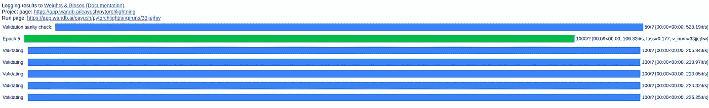
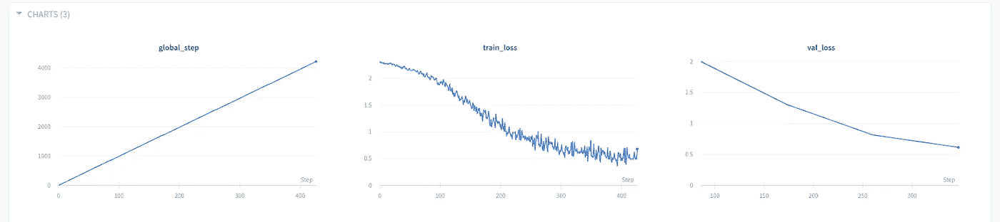
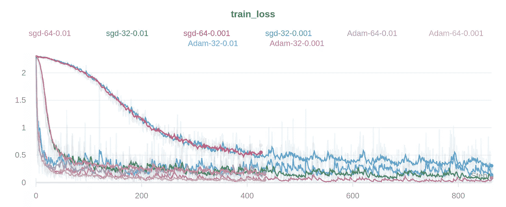
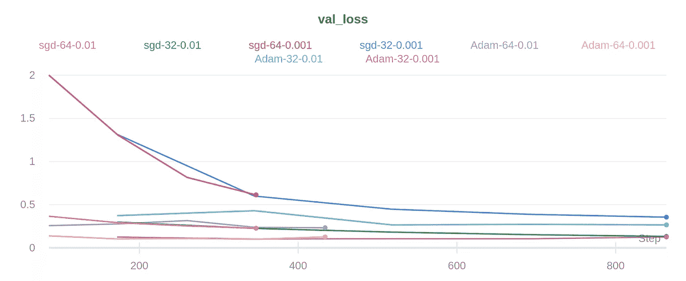
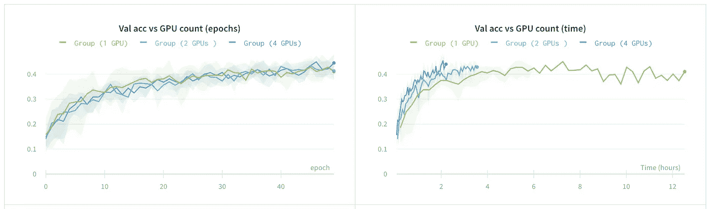

# 使用 Pytorch Lightning 将科学代码从工程代码中分离出来

> 原文：<https://medium.com/analytics-vidhya/use-pytorch-lightning-to-decouple-science-science-code-from-engineering-code-1e6f36cf6a1a?source=collection_archive---------19----------------------->

> Pytorch lighting 通过为定义和训练模型提供明确的代码结构，显著减少了样板代码。


## 介绍

PyTorch Lightning 让你将科学代码从工程代码中分离出来。研究通常包括用新的实验变体编辑样板代码。由于这种修补过程，大多数错误都被引入到代码库中。Pytorch lighting 通过为定义和训练模型提供明确的代码结构，显著减少了样板代码。

# 装置

安装 pytorch lightning 非常简单:

```
pip install pytorch-lightning
```

为了在我们的 pytorch 代码中使用它，我们将导入必要的 pytorch lightning 模块:

```
import pytorch_lightning as pl
from pytorch_lightning.loggers import WandbLogger
```

我们将使用 WandbLogger 来跟踪我们的实验结果，并将它们直接记录到 wandb。

# 创建我们的闪电课堂

为了在 pytorch 中创建一个神经网络类，我们必须从 torch.nn.module 导入或扩展。

让我们创建我们的类，我们将使用它来训练一个对 MNIST 数据集进行分类的模型。为了比较我们的结果，我们将使用与官方文档中相同的例子。

正如您在上面看到的，除了导入的基类之外，代码中的其他内容与原始 pytorch 代码非常相似。在 PyTorch 中，这种数据加载可以在主训练文件中的任何地方进行。在 PyTorch Lightning 中，这是在 Lightning 模块的三个特定方法中完成的。

*   train_dataloader()
*   val_dataloader()
*   test_dataloader()

第四种方法意味着数据准备/下载。

*   准备 _ 数据()

Lightning 的优化器代码是一样的，只是它被添加到 LightningModule 中的 configure _ optimizers()函数中。

如果我们考虑一个传统的 pytorch 训练管道，我们将需要为 epochs 实现循环，迭代小批量，为每个小批量执行前馈传递，计算损失，为每个批量执行反向投影，然后最终更新梯度。为了在 lightning 中做到这一点，我们将训练循环和验证循环的主要部分分成三个函数:

*   训练 _ 步骤
*   验证 _ 步骤
*   验证 _ 结束

这些函数的原型是:

使用这些功能，Pytorch lightning 将自动完成管道的培训部分。我们会谈到这一点，但在此之前，让我们看看 pytorch lightning 如何轻松地与 Weights & Buases 集成，以跟踪实验并创建您可以在任何地方监控的可视化效果。

# 训练循环

现在，让我们进入训练任何模型的最重要的部分，训练循环。因为我们使用 pytorch lightning，大部分的事情已经在幕后处理好了。我们只需要指定一些超参数，训练过程将自动完成。作为一个额外的好处，你还会得到一个很酷的每次迭代的进度条。

为了用闪电训练你的 pytorch 模型，你需要做的就是这些。这一行代码将很容易取代你的庞大和低效的香草 pytorch 代码。PyTorch 还提供了一个很好的进度条来跟踪每次迭代。



让我们看看仪表板中为这次运行[生成的可视化效果。](https://app.wandb.ai/cayush/pytorchlightning/reports/How-to-use-Pytorch-Lightning-with-Weights-%26-Biases--Vmlldzo2NjQ1Mw)



当模型被训练时，特定运行的训练丢失和验证丢失被实时自动记录在仪表板中。

我们可以用不同的超参数重复相同的训练步骤，以比较不同的跑步。我们将更改记录器的名称，以唯一地标识每次运行。

这是我们的模型到目前为止的进展情况。



这些可视化效果将永久保存在您的项目中，这使得比较不同超参数变量的性能、恢复最佳性能模型以及与您的团队共享结果变得更加容易。

# 多 GPU 训练

Lightning 提供了一个简单的 API 来执行数据并行和多 gpu 训练。不需要在采样器中使用 torch 的数据并行类。您只需要指定并行模式和您希望使用的 GPU 数量。

有多种培训方式:

*   数据并行(distributed_backend='dp ')(多 GPU，1 台机器)
*   distributed data parallel(distributed _ back end = ' DDP ')(跨多台机器的多 GPU)。
*   distributeddataparallel 2(distributed _ back end = ' Ddp 2 ')(机器中的 DP，跨机器的 ddp)。
*   TPUs(TPU 核心数=8|x) (tpu 或 TPU pod)

在本文中，我们将使用数据并行后端。下面是我们如何将它合并到现有的代码中。

在这里，我只使用了 1 个 GPU，因为我在谷歌 colab 上工作。

随着您使用更多的 GPU，您将能够监控不同配置之间的内存使用差异，如下图所示。



Pytorch Lightning 提供了两种提前停车的方法。以下是你如何使用它们:

a)将 early_stop_callback 设置为 True。将查找“val_loss”

b)或者配置您自己的回拨

# 16 位精度

根据项目的要求，您可能需要提高或降低模型权重的精度。降低精度可以让你在 GPU 中安装更大的模型。让我们看看如何在 pytorch lightning 中融入 16 位精度。

首先，我们需要安装 NVIDIA apex。为此，我们将在 colab 中创建一个 shell 脚本并执行它。

现在我们可以直接在训练器的精度参数中传入所需的值。

# 与 Pytorch 的比较

现在我们已经看到了 lightning 提供的简单框架，让我们快速看一下它与 pytorch 的比较。在 lightning 中，我们可以通过自动回调和进度条来训练模型，只需创建一个训练器并在其上调用 train()方法。

你可以看到训练代码可以变得多么复杂，我们甚至还没有包括合并多 GPU 训练、提前停止或跟踪 wandb 性能的修改。

为了在 Pytorch 中添加分布式训练，我们需要使用 DistributedSampler 对数据集进行采样。

您还需要编写一个自定义函数来包含早期停止。但是在使用 lightning 时，所有这些都可以通过一行代码来完成。

这个故事到此为止！