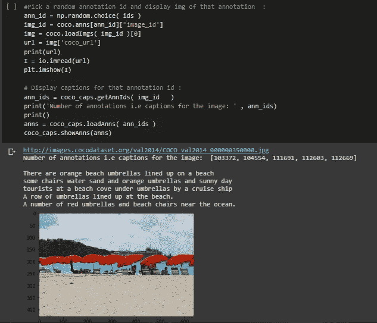

# 使用 Pytorch 创建一个带有预训练 Resnet50 和 LSTM 的图像字幕模型，并在 google Colab GPU 上进行训练(seq2seq 建模)。

> 原文：<https://medium.com/analytics-vidhya/use-pytorch-to-create-an-image-captioning-model-with-cnn-and-seq2seq-lstm-and-train-on-google-e6563cb9f511?source=collection_archive---------5----------------------->

萨法尔·萨法罗夫在 [Unsplash](https://unsplash.com?utm_source=medium&utm_medium=referral) 上拍摄的照片

点击这里查看完整步骤和详情:[https://github . com/rammyram/Image _ captioning/blob/master/Image _ captioning . ipynb](https://github.com/rammyram/image_captioning/blob/master/Image_Captioning.ipynb)

**使用的训练数据集:**

使用 COCO 2014 数据集。欢迎您使用最新数据以获得更好的结果。

我们可以跟着官方的 github repo 学习如何使用 COCO API。输入注释文件的路径，然后我们可以从数据集可视化图像。

加载注释

选择一个随机的注释 id，并可视化相应的图像和标题

**预处理步骤:**

我已经应用了通常的预处理步骤，如调整大小，随机裁剪，图像正常化。

使用 NLKT 对字幕进行标记化，并通过出现次数过滤了对我们的训练没有太大帮助的罕见单词。我们添加了开始和结束标记来标识标题的开始和结束，这些标题对应于 idx2word 字典中的索引 0 和 1。例如，一个原始文本句子“我很棒”将被标记为[，'我'，' am '，'很棒'，]，并最终变成[0，23，8，14，1]。

图像上标题的长度是可变的，但我们的模型要求每批输入固定的长度。通常我们会使用 pytorch 中的填充函数来填充或截断它们，使它们在 mini batch 中具有相同的长度。或者我们可以使用 pytorch 中的 SubsetRandomSampler 从给定的索引列表中随机抽取元素。我们首先生成一个随机数≤字幕的最大长度，例如 13。然后，我们使用 np.where 获取长度=13 的标题的所有索引。

为了节省时间，我们应用了预先训练的 resnet50。记得删除最后的 FC 层，因为我们不做图像分类，我们只需要提取特征和连接特征向量与 LSTM 在解码器中。记住冻结 resnet50 的参数，否则会损坏训练重量。

**解码器中的正向功能:**

我们已经将文本句子转换为整数标记，现在我们添加一个单词嵌入层来增加模型的表示能力。不要忘记连接特征向量(图像)和我们的嵌入矩阵(标题),以传递到 LSTM

**测试用样本函数:**

不要忘记对测试图像集应用相同的图像预处理步骤。测试图像将经过相同的预处理步骤，并输入到模型中以输出一个令牌，然后我们将整数令牌与 word2idx 字典进行映射以获得文本令牌。这个记号也成为我们的模型的输入，以预测下一个记号。它一直循环，直到我们的模型读取了令牌。

DecoderRNN 中定义的预测函数，用于预测样本测试数据的标题

*最初发表于*[*【https://github.com】*](https://github.com/rammyram/image_captioning)*。*