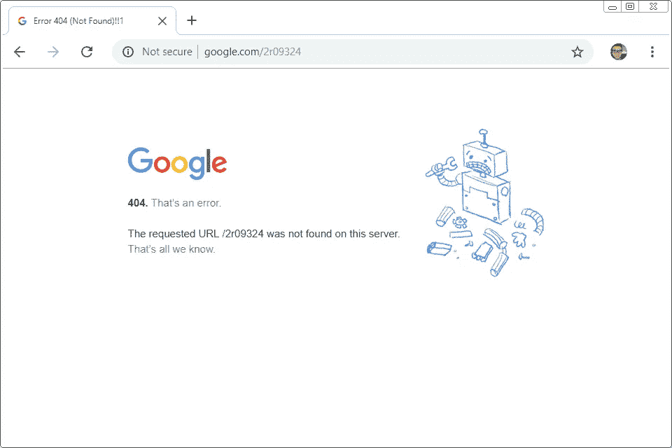

# 使用 TOR 以避免刮擦时堵塞

> 原文：<https://medium.com/analytics-vidhya/use-tor-to-avoid-getting-blocked-when-scraping-704c360cb7d1?source=collection_archive---------3----------------------->

有多少次你认为你已经写了一个完美的爬虫，你可以让它整夜运行，从网络上抓取成百上千、上百万的数据，但是当你醒来时，你发现你收到大量的错误，404 没有找到，401 未经授权，403 禁止，或者 429 太多的请求？



为了避免被阻止，我发现如果是因为 IP 相关的原因，使用 TOR 可能会有帮助。

# 为什么我的爬虫被堵住了？

1.  IP 被屏蔽:刮的时候可以看到你的 IP 地址。来自同一个 IP 的异常大量的请求将被阻塞。
2.  没有用户代理或用户代理被阻止:用户代理告诉服务器正在使用哪个 web 浏览器，例如，*“Mozilla/5.0(X11；Linux x86 _ 64rv:70.0)壁虎/20100101 火狐/70.0"* 。如果未设置用户代理，服务器将不允许访问。如果来自同一个用户代理的请求异常多，它将被阻塞。
3.  蜜罐陷阱:蜜罐是普通用户看不到的链接，只有爬虫才能看到。当爬虫尝试访问链接时，服务器停止响应。
4.  同一用户登录请求了太多次。

虽然该列表并不详尽，但它涵盖了爬虫被阻止的主要原因。

# TOR 是什么？

TOR 是“洋葱计划”的简称。之所以与洋葱相关，是因为消息经过多层加密(就像洋葱一样),并被路由到不同的计算机，每台计算机只解密一层，然后转发到下一台计算机/服务器。所以，对于中间的每台计算机，他们只知道来源计算机和目的计算机，但不知道来源。

如果你不明白我在说什么，看看这个 YouTube 视频。

**对 Tor 来说最好的事情是 IP 每 10 分钟改变一次(对于 tor 浏览器或者你可以通过 TOR 控制器设置)。这可以防止爬虫被 IPs 阻止。**

# Python 中如何使用 TOR？

```
import requestssession = requests.session()
session.proxies = {}
session.proxies['http'] = 'socks5://localhost:9150' #9150 for browser; 9050 for TOR service
session.proxies['https'] = 'socks5://localhost:9150'
```

就是这样！很简单。带有代理设置的标准请求包。或者您可以使用套件[杆](https://stem.torproject.org/)与 tor 控制器一起工作。

```
from stem import Signal
from stem.control import Controllerdef switchIP():
    with Controller.from_port(port = 9051) as controller:
        controller.authenticate()
        controller.signal(Signal.NEWNYM)
```

# 还要更改 User_Agent

用户代理告诉服务器正在使用哪个 web 浏览器。服务器可能会阻止过于频繁查询服务器的 web 浏览器。

幸运的是，user_agent 很容易伪造。与其多此一举，不如先在网上找包。并且我找到了 [fake-useragent，](https://pypi.org/project/fake-useragent/)一个包来随机生成 user-agent 字符串。

简单地做:

```
from fake_useragent import UserAgentheaders = {"User_Agent":UserAgent().random}
```

# 放弃

通过使用 Tor 网络和伪用户代理，你将拥有一个非常强大的工具集来从网络上抓取数据。但是，请在合理的速度和尊重其他用户。