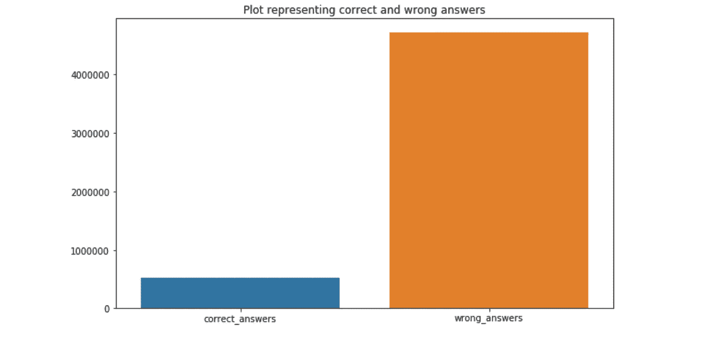
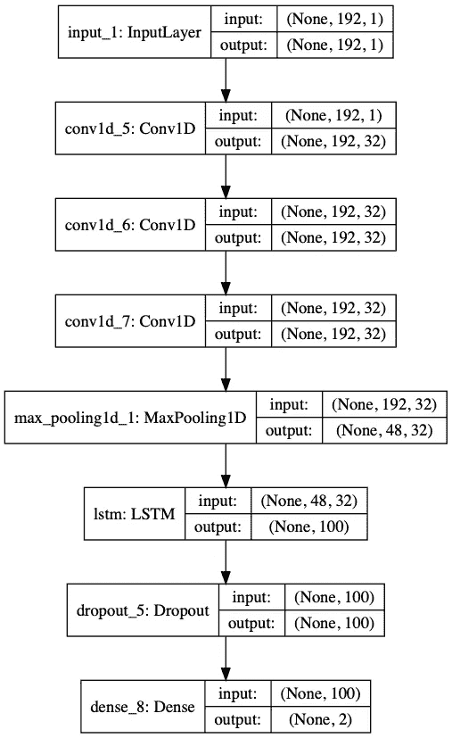

# 使用 BERT 模型中的迁移学习来预测开放式问题的正确描述性答案

> 原文：<https://medium.com/analytics-vidhya/use-transfer-learning-in-bert-model-to-predict-correct-descriptive-answer-for-open-ended-questions-e2c4d94e6098?source=collection_archive---------7----------------------->


**开放式问题**是一个不能用“是”或“否”或者静态回答来回答的问题。开放式问题是一种需要回答的陈述。可以将回答与提问者已知的信息进行比较。

开放式问题的示例:

*   说说你和你主管的关系。
*   你如何看待你的未来？
*   告诉我这张照片中的孩子。
*   政府的目的是什么？
*   你为什么选择那个答案？

# 问题

这个问题是一个简单的问答问题，我们必须预测一个答案对于一个给定的问题是否正确，但是这里的缓存是答案是描述性的。对于给定的问题，有 10 个答案，其中 9 个是不正确的，1 个是正确的。问答集的一个示例是:

> **1)空气污染暴露的症状？**
> 
> **答案 1:** 长期暴露在污染的空气中会产生永久性的健康影响比如:1 肺部加速老化。2 肺活量丧失，肺功能下降。3 疾病的发展，如哮喘、支气管炎、肺气肿，可能还有癌症。4 寿命缩短。
> 
> **2)空气污染暴露的症状？**
> 
> **答案 2:** 长期暴露在颗粒物污染中会导致重大健康问题包括:1 呼吸道症状加重，如气道刺激、咳嗽或呼吸困难。2 肺功能下降。3 哮喘加重。4 .儿童慢性呼吸道疾病的发展。
> 
> **3)空气污染暴露的症状？**
> 
> **答案 3:** 空气污染对健康的短期影响。即使在空气污染水平较低的日子，非常敏感的人也可能会受到健康影响。使用每日空气质量指数了解空气污染水平，并了解推荐的行动和健康建议。这里的建议适用于任何有症状的人。短期影响。空气污染对健康有一系列的影响。然而，英国的日常空气污染预计不会上升到人们需要对其习惯进行重大改变以避免暴露的水平；没有人需要害怕去户外，但他们可能会经历一些明显的症状，这取决于他们属于以下哪个人群:
> 
> **4)空气污染暴露症状？**
> 
> **回答 4:** 长期暴露在颗粒污染中会导致严重的健康问题，包括:呼吸道症状增加，如呼吸道刺激、咳嗽或呼吸困难、肺功能下降
> 
> **5)空气污染暴露的症状？**
> 
> **答案 5:** 长期暴露在污染的空气中会产生永久性的健康影响如:肺部加速老化；肺活量下降，肺功能下降；疾病的发展，如哮喘、支气管炎、肺气肿，可能还有癌症；寿命缩短
> 
> **6)空气污染暴露的症状？**
> 
> **答案 6:** 短期接触颗粒物污染可:加重肺部疾病引起哮喘发作和急性支气管炎；增加呼吸道感染的易感性；导致心脏病患者心脏病发作和心律不齐；即使你是健康的，你可能会经历暂时的症状，如:眼睛，鼻子和喉咙的刺激；咳嗽
> 
> **7)空气污染暴露的症状？**
> 
> **答案 7:** 患有哮喘的儿童可能会注意到，在空气污染水平高于平均水平的日子里，他们需要增加使用缓解药物。患有心脏或肺部疾病的成人和儿童出现症状的风险更大。遵循医生关于锻炼和控制病情的常规建议。即使在空气污染水平较低的日子，非常敏感的人也可能会受到健康影响。任何有症状的人都应该遵循提供的指导。
> 
> **8)空气污染暴露症状？**
> 
> **答案 8:** 长期暴露在污染的空气中会对健康产生永久性影响，如:肺部加速老化。肺活量下降，肺功能下降。哮喘、支气管炎、肺气肿等疾病的发展，可能还有癌症。
> 
> **9)空气污染暴露的症状？**
> 
> **回答 9:** 您的实际不良反应风险取决于您目前的健康状况、污染物类型和浓度以及您暴露在污染空气中的时间长短。高空气污染水平会导致直接的健康问题，包括:1 加重心血管和呼吸系统疾病。2 增加了心脏和肺部的压力，它们必须更加努力地向身体供氧。3 呼吸系统细胞受损。
> 
> **10)空气污染暴露的症状？**
> 
> **回答 10:** 暴露在这种颗粒中会影响你的肺部和心脏。长期暴露在颗粒污染中会导致严重的健康问题，包括:呼吸道症状增加，如呼吸道刺激、咳嗽或呼吸困难；肺功能下降；哮喘加重

在所有这些答案中，第 9 个答案是正确的。对于所有正确的问题，预测的标签必须是 1，对于所有错误的答案，预测的标签必须是 1。因此这是一个**二元分类**问题。

## 挑战

但是解决这些问题的一些挑战是:

*   高度不平衡的数据。一个正确答案有 9 个错误答案。不平衡比例是 9:1。



显示数据集中正确答案类和错误答案类分布的图

*   没有功能工程的空间。由于每个问题都是独特的，所以没有任何功能工程可以完成

在解决问题时，需要克服这些挑战。

# 方法

## 1)数据清理

简单的数据处理技术已经完成，例如

*   HTML 的删除

移除一些 html 标签和实体，如

、T0、T1

```
import re
#function to clean the word of any html-tags and make it lower case
def cleanhtml(sentence): 
    cleanr = re.compile('<.*?>')
    cleanentity = re.compile('&.*;')
    cleantext = re.sub(cleanr, ' ', sentence)
    cleantext = re.sub(cleanentity, ' ', cleantext)
    return cleantext.lower()
```

*   移除 URL

由于 URL 也有特殊的结构，常规的数据处理会使其失去意义，而且 URL 没有任何重要的意义，因此删除它会使数据变得有效

```
url_regex = 'http[s]?://(?:[a-zA-Z]|[0-9]|[$-_@.&+]|[!*\(\),]|(?:%[0-9a-fA-F][0-9a-fA-F]))+';for i in range(preprocessed_questions.shape[0]):
    preprocessed_questions[i] = re.sub(url_regex, '', preprocessed_questions[i]);
```

*   删除标点符号等

标点符号如；%&应该删除，因为它们没有重要意义。还把不是、还没有等扩展为不是、还没有等

```
#function to clean the word of any punctuation or special characters
def cleanpunc(sentence): 
    cleaned = re.sub(r'[?|!|"|#|:|=|+|_|{|}|[|]|-|$|%|^|&|]',r'',sentence)
    cleaned = re.sub(r'[.|,|)|(|\|/|-|~|`|>|<|*|$|@|;|→]',r'',cleaned)
    return  cleaned
```

这里，由于某些原因，我们特意省略了停用字词的删除过程，这将在后面的部分中揭示。

## 2)使用的指标

考虑到数据是高度不平衡的，度量标准也应该适应这一事实。因此，选择的指标是

*   混淆矩阵


混淆矩阵

*   精确
*   召回


*   f1-分数


使用 F1-score 是因为只有当精确度和召回率高时它才会高。

准确性不是这里的首选指标，因为数据中有很大的不平衡。这里还使用了混淆矩阵，我们必须知道每一类中正确和错误预测的数据点数

*   平均倒数等级

平均倒数排名计算如下:
1)每个问题有 10 个可能的答案，其中任何一个都是正确的。因此，我们认为这十个答案都是正确的。我们对这些概率进行排序，并给每个答案分配等级。概率最高的答案排名第一，排名第二的答案排名第二，依此类推。我们取其中正确答案的排名，并取排名的倒数。像这样，我们把所有正确答案的倒数加起来

这个想法是，我们希望所有的正确答案得到一个更高的排名，理想情况下是排名 1。
理想的 MRR 值是 1，非常差的 MRR 将是 0。

```
#Calulates the rank of the correct answer for each question based on the sorted order of its probability#Takes the inverse of that rank and adds it togetherdef mrr(y_pred, y_true):
    count = 0
    mean_reciprocal_rank = 0
    while y_pred.shape[0]:
        y_pred_chunk = y_pred[0:10]
        y_pred = y_pred[10:]
        y_true_chunk = y_true[0:10]
        y_true = y_true[10:]
        y_true_array = np.argmax(y_true_chunk, axis=1)
        try:
            index_of_correct_answer = y_true_array.tolist().index(1)
        except Exception as e:
            continue
        prob_of_correct_answer = y_pred_chunk[index_of_correct_answer]
        sorted_prob_pred = np.array(sorted(y_pred_chunk, key=lambda x:(-x[1])))  
        sorted_prob_pred = np.array(sorted(sorted_prob_pred, key=lambda x:(x[0])))
        for rank in range(10):
            if (sorted_prob_pred[rank][0] == prob_of_correct_answer[0] and sorted_prob_pred[rank][1] == prob_of_correct_answer[1]):
                break
        rank = rank+1
        mean_reciprocal_rank += (1/rank)
        count = count+1
    return mean_reciprocal_rank/count
```

## **3)使用的技术**

用来解决这个问题的机器学习技术就是深度学习。

## **为什么要用深度学习？**

选择深度学习来解决这个问题的主要原因是:

*   这个问题不需要可解释性和延迟作为约束。如果这些约束存在，使用深度学习技术将不是正确的选择，因为深度学习模型需要将输入传递到其所有层，这需要大量时间来进行标签预测，并且深度学习中没有可解释性的概念，因为它们是复杂的模型
*   对于这个问题，特征工程似乎是不可能的。因此，从数据中自动学习特征的深度学习技术将对该问题非常有帮助。

## 为什么是伯特？

尝试了如下几种神经网络结构:


具有 5 个隐含层的神经网络


具有四个一维卷积网络神经网络



具有一维卷积层和 LSTM 层神经网络


具有 LSTM 层和时间分布密集层的神经网络


前四个模型使用两种类型的数据嵌入进行训练:

1.  手套向量
2.  TF-IDF 加权手套向量

第五层是数据嵌入层，它将数据嵌入作为学习的一部分。但是没有一个管用。即使超参数调整和增加数据大小也没有增加。类别 1 的预测结果仍然很差，并且所有训练的模型都是哑模型，因为问题很难通过这些简单的体系结构来解决。


获得混淆矩阵

由于存在巨大的类别不平衡，通过分配类别权重来训练神经网络以平衡不平衡。

类 1 的预测结果稍好，但这是以类 0 的预测为代价的。我们可以观察到像发生在 0 班和 1 班之间的拔河比赛。虽然 1 类的预测很好，但这确实影响了 0 类的预测

每一个神经网络都与张量板相连，以深入研究问题。在研究梯度的张量板直方图时，我们可以观察到大多数、几乎所有的梯度都具有正确的值，即它们既不太小也不太大。因此，我们可以得出结论，网络没有遇到消失或爆炸梯度问题。可能网络不太强大，无法学习如此复杂的问题

此外，在检查每个网络的 MRR 时，我们可以观察到，它给出了非常低的 MRR(0.33)，这意味着许多错误答案数据集被错误地预测为正确答案标签，这是因为大多数错误答案被预测为正确，而一些正确答案的排名非常低(意味着与其他错误答案相比，预测的概率非常低

我们可以继续尝试不同的架构来解决这个问题，但是计算量会很大。训练和实验这些问题需要大量的计算能力。

这就是迁移学习扭转局面的地方。不要尝试多种架构，因为这是计算密集型的，最好使用迁移学习和微调预训练的 NLP 模型来解决这个问题。BERT 是 google 构想的最先进的 NLP 模型，因此 BERT 被选择用于迁移学习

## 4)伯特

BERT(来自变压器的双向编码器表示)是 Google 最近发表的论文，目前是所有 NLP 模型的最新技术。BERT 的主要创新是它的注意力技术，它屏蔽了输入中的几个单词，并试图从上下文信息(即它周围的单词)中预测它。与以前从左到右处理数据的 NLP 模型不同，它从左到右和从右到左处理输入。

Pytorch 提供了一个预训练的 BERT 模型，该模型针对我们的数据进行了微调。该模型在 google colab 中使用其 GPU 进行训练。

要用 google colab GPU 训练任何深度学习模型，在 google colab 中打开你的 jupyter 笔记本，点击**编辑→笔记本设置**，然后在随后出现的对话框中，选择 GPU 作为硬件加速器，然后点击**保存**。

```
model = BertForSequenceClassification.from_pretrained("bert-base-uncased", num_labels=2)
model.cuda()
```

**输入格式:**

输入以“问题”的形式输入。”对伯特的回答。在训练 bert 模型时，这种技术比简单的问题和答案的串联更有效，因此被使用。

**训练技巧:**

由于 google colab 在没有会话超时的情况下只能工作 12 个小时，并且不可能一起训练 4 个纪元的 BERT 模型，因此使用了一个简单的技巧来实现这一点。
BERT py torch 模型针对 5L 训练数据进行训练，并使用 10K 验证数据进行一个时期的验证。
之后，将其保存为文件，然后启动新的 google colab 会话，并再次使用另一个时期的 5L 数据训练先前训练的模型。

按照这种方法，我们通过存储和训练前一个时期的 BERT 模型来训练 4 个时期的 BERT 模型

```
param_optimizer = list(model.named_parameters())
no_decay = ['bias', 'gamma', 'beta']
optimizer_grouped_parameters = [
    {'params': [p for n, p in param_optimizer if not any(nd in n for nd in no_decay)],
     'weight_decay_rate': 0.01},
    {'params': [p for n, p in param_optimizer if any(nd in n for nd in no_decay)],
     'weight_decay_rate': 0.0}
]optimizer = BertAdam(optimizer_grouped_parameters,
                     lr=2e-5,
                     warmup=.1)
```

训练 BERT 模型

```
# Store our loss and accuracy for plotting
train_loss_set = []# Number of training epochs (authors recommend between 2 and 4)
epochs = 4# trange is a tqdm wrapper around the normal python range
for _ in trange(epochs, desc="Epoch"):

  # Training

  # Set our model to training mode (as opposed to evaluation mode)
  model.train()

  # Tracking variables
  tr_loss, tr_accuracy, tr_f1_score = 0, 0, 0
  nb_tr_examples, nb_tr_steps = 0, 0# Train the data for one epoch
  for step, batch in enumerate(train_dataloader):
    if nb_tr_steps%1000 == 0:
      print("Step", nb_tr_steps)
    # Add batch to GPU
    batch = tuple(t.to(device) for t in batch)
    # Unpack the inputs from our dataloader
    b_input_ids, b_input_mask, b_labels = batch
    # Clear out the gradients (by default they accumulate)
    optimizer.zero_grad()
    # Forward pass
    loss = model(b_input_ids, token_type_ids=None, attention_mask=b_input_mask, labels=b_labels)
    train_loss_set.append(loss.item())    
    # Backward pass
    loss.backward()
    # Update parameters and take a step using the computed gradient
    optimizer.step()

    with torch.no_grad():
      # Forward pass, calculate logit predictions
      logits = model(b_input_ids, token_type_ids=None, attention_mask=b_input_mask)

    # Move logits and labels to CPU
    #print("logits", logits)
    logits = logits.detach().cpu().numpy()
    label_ids = b_labels.to('cpu').numpy()tmp_tr_accuracy = flat_accuracy(logits, label_ids)
    tmp_f1_score = f1(label_ids, logits)

    tr_accuracy += tmp_tr_accuracy
    tr_f1_score += tmp_f1_score

    # Update tracking variables
    tr_loss += loss.item()
    nb_tr_examples += b_input_ids.size(0)
    nb_tr_steps += 1 print("Train loss: {}".format(tr_loss/nb_tr_steps))
  print("Train Accuracy: {}".format(tr_accuracy/nb_tr_steps))
  print("Train f1-score: {}".format(tr_f1_score/nb_tr_steps))

# Validation
# Put model in evaluation mode to evaluate loss on the validation set
  model.eval()# Tracking variables 
  eval_loss, eval_accuracy, eval_f1_score = 0, 0, 0
  nb_eval_steps, nb_eval_examples = 0, 0# Evaluate data for one epoch
  for batch in validation_dataloader:
    # Add batch to GPU
    batch = tuple(t.to(device) for t in batch)
    # Unpack the inputs from our dataloader
    b_input_ids, b_input_mask, b_labels = batch
    # Telling the model not to compute or store gradients, saving memory and speeding up validation
    with torch.no_grad():
      # Forward pass, calculate logit predictions
      logits = model(b_input_ids, token_type_ids=None, attention_mask=b_input_mask)

    # Move logits and labels to CPU
    logits = logits.detach().cpu().numpy()
    label_ids = b_labels.to('cpu').numpy()tmp_eval_accuracy = flat_accuracy(logits, label_ids)
    tmp_f1_score = f1(label_ids, logits)

    eval_accuracy += tmp_eval_accuracy
    eval_f1_score += tmp_f1_score
    nb_eval_steps += 1print("Validation Accuracy: {}".format(eval_accuracy/nb_eval_steps))
  print("Validation f1-score: {}".format(eval_f1_score/nb_eval_steps))
```

## 4)结果

结果真是不可思议。不同于我训练的典型的简单神经网络，它是一个完全愚蠢的模型，伯特工作起来非常有魅力。


BERT 模型的混淆矩阵、精度和召回矩阵

BERT 模型对类别 1 给出了非常好的预测。类别 0 具有非常好的召回值 0.93，而类别 1 给出相对较低的召回值 0.644。获得的 F1 分数为 0.9472，准确度为 0.89，表明该模型表现非常好。

另一个值得注意的点是，MRR 非常好，这个 BERT 模型达到了 0.0.8862530 的 MRR，这表明即使一些正确答案没有被正确预测，但与它们的共同错误答案数据点相比，它们的排名更高。

但是，如果我们针对更大的数据集和更高数量的历元来训练 BERT，结果将会得到很好的改善。由于 BERT 模型的内存和会话超时限制，很难为具有更大数据量的更高历元训练模型。但是随着更高的计算和存储能力，结果可能会得到改善。

上面的案例研究是一个很好的例子，表明当我们没有足够的基础设施和计算资源时，要解决深度学习问题，迁移学习是最有效的技术:)

# 参考资料:

1.  [https://towards data science . com/Bert-explained-state-of-art-state-language-model-for-NLP-F8 b 21 a9 b 6270](https://towardsdatascience.com/bert-explained-state-of-the-art-language-model-for-nlp-f8b21a9b6270)
2.  https://mccormickml.com/2019/07/22/BERT-fine-tuning/

我的 git hub 全部作品链接:[https://github . com/gayathriabhi/BERT-model-to-predict-the-correct-descriptive-answer](https://github.com/gayathriabhi/BERT-model-to-predict-the-correct-descriptive-answer)

领英简介:[https://www.linkedin.com/in/gayathri-s-a90322126/](https://www.linkedin.com/in/gayathri-s-a90322126/)