# 基于加权平均集成的二手车价格预测

> 原文：<https://medium.com/analytics-vidhya/used-car-prediction-using-weighted-average-ensemble-74039a2761d6?source=collection_archive---------2----------------------->


图片来源:Unsplash

加权平均集成是一种技术，其中几个模型的预测有助于与其估计性能成比例的新模型的预测。加权平均集成基于这样的思想，即具有高性能的模型(例如，从 MAE 小于 1.5 的 10 个模型中选择 5 个模型)被分配不同的权重(其总和必须为 1)，并且在分配这些权重之后求和。

本文的目的是使用加权平均集成来预测二手车的价格。

# **数据介绍**

功能描述:

1 —姓名 **:** 汽车的品牌和型号。

2 —地点 **:** 汽车销售或可供购买的地点

3 —年份 **:** 型号的年份或版本。

4 —行驶公里数 **:** 前车主驾驶汽车行驶的总公里数，单位为公里。

5 —燃料类型 **:** 汽车使用的燃料类型。

6 —变速器 **:** 汽车使用的变速器类型。

7 — Owner_Type **:** 所有权是一手、二手还是其他。

8 —里程 **:** 汽车公司提供的标准里程，单位为 kmpl 或 km/kg

9 —发动机 **:** 发动机的排气量，单位为 cc。

10 —功率:发动机的最大功率，单位为 bhp。

11 —座位 **:** 车内座位数。

12 — New_Price **:** 同型号新车的价格。

13 —价格 **:** 以印度卢比为单位的二手车价格。

让我们导入必要的库，以帮助导入数据，清理数据和可视化数据，我们还将打印形状和前 5 行数据，看看我们的数据看起来像什么

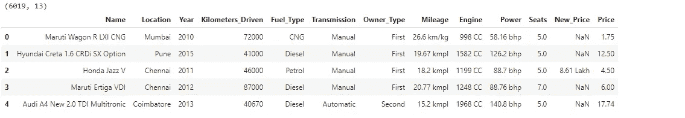

图片 1

从这个表中，我们可以看出，像年份、公里数、座位、价格这样的特征是仅有的数字特征。为了验证这种说法，您可以检查数据的数据类型，当我们删除它们的单位测量时，里程、发动机和功率等特性也可以是数字特性，但我们将在稍后进行处理。让我们来看看可用数字特征的统计摘要。

```
train.describe()
```

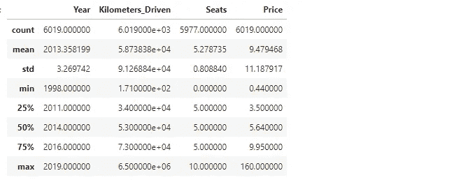

花一分钟来分析一下……是的，我知道你可能在想什么，根据我们对汽车的领域知识，肯定没有没有座位的汽车。现在你明白了为什么数据探索是关键——这种类型的错误不仅给出了一个糟糕的模型，还向观众给出了糟糕的解释，想象一下，你绘制了一个座位条形图，人们看到 0 个座位有特定的频率。是啊荒谬！

让我们检查数据中缺失的值。

```
train.isnull().sum()
```

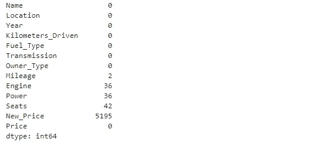

我们在 New_Price 中有很多缺失值，所以我们肯定会放弃它，但从发动机、功率和座椅来看，我们有相当多的缺失值-我很好奇为什么我们有相同的缺失值，你可能也是。让我们查询这些缺失的值，看看我们能从中获得什么。

```
train[train['Engine'].isnull()].head()
```

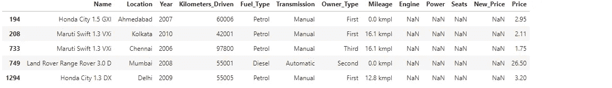

所以，是的，我们认为这些缺失值可能有一个趋势，因为这些要素几乎具有相同的缺失值。好了，这里我们有它，丢失的值出现在同一行，你可以打印整个丢失的数据来查看。现在我们已经知道这一点，手动输入这些值将有助于我们的模型，而不是使用平均值。汽车数据是我们可以从几个搜索引擎获得的，我们只需要使用正确的关键字。

但是为了实现这一点，我们需要估算几种不同汽车的缺失值。使用 name 特性来查询并不是一个坏主意，但是这将花费太多的时间，而且我们将会写很长的重复代码，这很累人。但是，我们从名称列创建两个新功能如何:

1.  Name_gen:这将是汽车的通用名称。例如本田、福特、保时捷等
2.  Name_model:这个特性将包含汽车的通用名称和通用型号。例如本田城市、福特经典、保时捷 X

我希望你明白这里的意思，也就是说，我们可以用一行代码估算所有本田汽车的缺失值，也可以估算其他缺失值。让我们创建这些功能:

在处理缺失值之前，让我们执行一些单变量和双变量绘图，看看是否可以从中获得特征。

```
plt.figure(figsize = (10,8))
sns.scatterplot(x = 'Kilometers_Driven', y = 'Price',  data = train, hue = train['Transmission'])
plt.title('Price vs Kilometer_Driven')
sns.despine() 
```

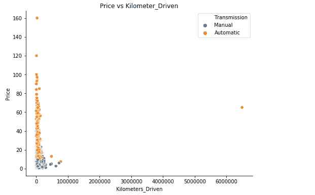

图片 1

从这个图中，我们可以看到位于 6000000 公里左右的异常值。由于集群的原因，我们实际上无法从中获得任何其他信息。让我们去除异常值，再次查看该图。

```
df = train[train['Kilometers_Driven'] < 6000000]
plt.figure(figsize = (8,6))
sns.scatterplot(x = 'Kilometers_Driven', y = 'Price', data = df, hue = df['Transmission'])
sns.despine()
plt.show()
```

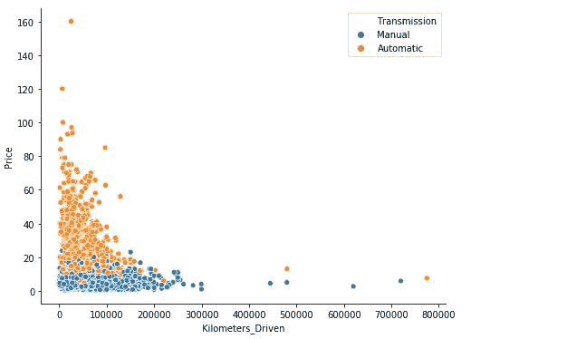

图片 2

现在这是一个更好的观点，我们也可以得出结论，自动挡汽车比手动挡汽车更贵，行驶公里数更少的汽车价格更高。

```
sns.countplot(x = train['Fuel_Type'])
plt.xlabel('Fuel_Type')
plt.title('Fuel_Type Distribution')
sns.despine()
```

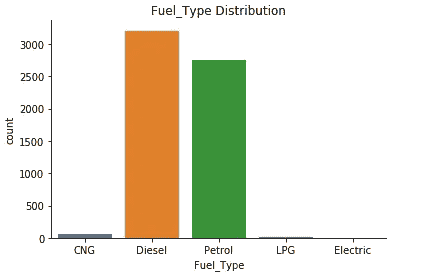

图 3

柴油和汽油燃料类型在这一类别中占主导地位，由此可以产生一个特征:

```
sns.countplot(x = train['Seats'])
plt.xlabel('Seats')
plt.title('Fuel_Type Distribution')
sns.despine()
```

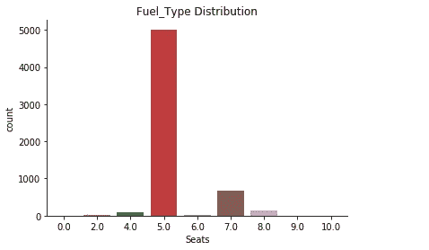

正如所料，大约 83%的汽车有 5 个座位，超过 10%的汽车有 7 个座位

现在我们处理这些丢失的值，这可能有点长，但逻辑是这样的:

*   我们将为缺失值创建一个函数。
*   该函数将查询缺失值，并存储我们希望根据名称、名称 _ 模型或名称 _gen(但大多数情况下我们将使用名称 _ 模型和名称 _gen)估算的特定汽车的索引，然后输入基于该索引的列的值。
*   但是，我们将为数据中具有高值计数的 Name_gen 输入缺失值，而具有少量值计数的 Name_gen 将使用平均值进行输入。我希望你有这背后的直觉。

名词（noun 的缩写）b，我从网上搜索汽车名称得到了数据，我们将填补发动机和功率的缺失值。

我们将处理丢失的里程值，用 5 个座位替换 0 个座位，并用 5 填充丢失的座位值。

我们剩下一些缺失值，但这些值来自不常出现的 Name_gen，我们将对此使用均值插补。现在让我们从里程和引擎中移除单位度量，并将它们转换为数字数据类型。

转换电源功能会给你一个错误，因为我们有值为'空'位于该功能。花一点时间查看前 200 行，亲自看看。

我们将通过创建一个函数来处理空值，就像我们上面所做的一样，但是这个函数将只保存 2 个值。与我们上面创建的另一个函数不同，我们还将对 car Name_gen 使用均值插补，频率较低

现在，让我们再次查看我们的统计摘要，删除异常值，并删除一些特性。

```
train.describe()
```

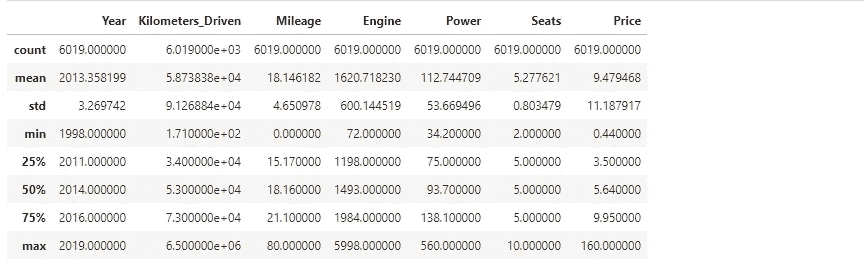

# 特征工程

# 功能选择(RFE)

递归特征消除选择方法是一个递归过程，它根据特征的级别重要性对特征进行排序。它重复构建模型，选择性能最强或最弱的功能，将该功能放在一边，并对剩余的功能重复该过程。在这个过程中，我们将使用随机森林。结果将是重要特征的索引:

现在我们有了特性索引，让我们选择新的 X 特性。

# 标准化和拆分

# 建立模型

在实现加权平均集成之前，让我们用一些日常使用的算法来构建我们的模型。我们将使用平均绝对误差来评估我们的结果，取每个误差的绝对值，然后取这些绝对误差的平均值。

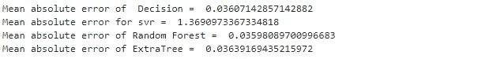

图 5

从我们上面的描述到什么是加权平均集成，我们将向上舍入到 1 的权重分配给具有高性能的不同模型。从我们上面建立的模型来看，性能最好的 3 个模型是决策树、随机森林和 ExtraTree。接下来，我们给决策树和 RandomForest 分配相等的权重，因为它们具有几乎相同的准确性，并且给 ExtraTree 分配最小的权重。

让我们建立我们的模型！！

```
weighted_average = ((DTree_pred * 0.4) + (RF_reg_pred * 0.4) + (Ex_reg_pred)* 0.2)
print('Mean absolute error of weighted_average', mean_absolute_error(y_test,weighted_average))
```

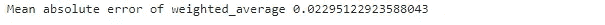

图 6

正如所料，我们得到了加权平均系综更好的准确性。你不局限于只有这些算法，你也可以尝试其他算法来取乐，看看你能从中得到什么结果。

# 结论

始终好好研究和观察你的数据是很重要的，因为你可以在最不可思议的地方发现一些错误。集成技术给了我们的模型一个提升，还有其他几个集成学习技术将帮助你的模型，给你一个完美的位置。下面有一篇文章的链接。此外，有几种方法可以执行特性选择(下面有一篇文章的链接)。建议不要把自己局限在一种技术上，尝试学习不同方法来解决问题。此外，如果只有一种技术，那么你可以成为另一种技术的作者/创造者..

[](https://towardsdatascience.com/the-5-feature-selection-algorithms-every-data-scientist-need-to-know-3a6b566efd2) [## 每个数据科学家都应该知道的 5 种特征选择算法

### 额外收获:是什么让一个优秀的足球运动员变得伟大？

towardsdatascience.com](https://towardsdatascience.com/the-5-feature-selection-algorithms-every-data-scientist-need-to-know-3a6b566efd2) [](https://heartbeat.fritz.ai/ensemble-learning-techniques-demystified-e57ee5714996) [## 去神秘化的集成学习技术

### 理解机器学习集成算法的详细教程。

heartbeat.fritz.ai](https://heartbeat.fritz.ai/ensemble-learning-techniques-demystified-e57ee5714996) 

这个完整笔记本和数据集的链接可以在我的 [github](https://github.com/Nelsonchris1/weighted-average-ensemble) 中找到

[在推特上联系我](https://twitter.com/Nelson_Christof)

[在 linkdln 上和我联系](https://www.linkedin.com/in/nelson-ogbeide-013569171/)