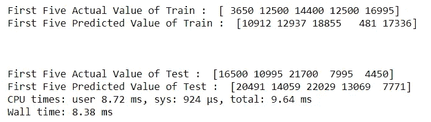
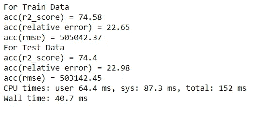

# 二手车价格估计:一个回归模型

> 原文：<https://medium.com/analytics-vidhya/used-cars-price-estimation-a-regression-model-f91d9c26d102?source=collection_archive---------7----------------------->

—可用于估计二手车价格的报废数据集。


图片来源:谷歌

***问题陈述*** :二手车根据品牌、厂家、变速器类型等进行定价。这个过程是由一个专业人士完成的，他/她根据以前的经验了解二手车的状况和正确的定价方案。我们的目标是建立一个模型，根据历史数据对二手车的价格进行估算。这些数据是从 Craigslist 收集的，Craigslist 是世界上最大的二手车销售网站。

数据的来源可以在 [***这里找到***](https://www.kaggle.com/austinreese/craigslist-carstrucks-data) 。

## 关于数据集

该数据集包含 539759 行和 25 个维度。尺寸如下所述:

**id** :汽车唯一 Id
**Url**:汽车列表 Url
**地区**:有问必答地区
**地区 _url** :地区 Url
**价格**:汽车价格
**年份**:销售年份
**生产厂家**:汽车生产厂家
**型号【t** :气缸类型汽车含
**燃料**:汽车燃料类型
**里程表**:汽车行驶里程数
**标题 _ 状态**:车辆状态
**变速器**:变速器类型
**vin** :车辆识别号
**驱动**:驱动类型
**大小** :车的颜色
**图片 _ 网址**:车的图片网址
**描述**:车主提到的描述
**县**:县所属
**州**:所在州
**lat** :挂牌纬度
**long**

# 数据分析:

## 列:ID

要检查是否存在任何重复的 ID，如果是，我们可以删除重复的列。但是幸运的是，数据中没有重复的 id。

## 列:价格

当我们检查价格列时，我们可以找到 0 值和最小值和最大值，显然这些值是异常值。现在，根据谷歌上的许多数据，我们可以说，一辆二手车的价格最高可以达到 15 万美元，这取决于像兰博基尼 Ferarri 这样的汽车，但我仍然会保持最高 20 万美元。最低的是 100 美元。剩余的总计行将被删除。


价格:描述

## 列:制造商

该列包含汽车品牌的不同制造商，该列中的所有值都具有非空值，唯一值为 43 count。因此将保留所有这些。

## 列:燃料

谈燃油，主要有 5 种燃油，不包括空值。我们删除了无效燃料类型的行。

## 列:传输

该部分包含 3 个唯一值，“自动”、“手动”和“其他”。也有被删除的空值。

## 列:状态

大约有 51 个唯一状态可用，没有空值，因此我们将保留它们。

## 列:年份

现在，年份是一个非常重要的列，它可能有一些高质量的数据。在删除任何列之前，我们都需要格外小心。大约有 112 个不同的年份，包括 0 和 null。0 和空值的计数较少，因此可以安全地删除。

## 列:里程表

这是一个数值，表示汽车的行驶距离，如果是空值，我们可以把它们去掉，或者用 0 代替。选择权在你。

## 列:驱动器、类型、油漆和状况

这是最后 4 个分类列，我们可以删除空值，保留其余的。

除了这些列之外，其余的列都将被删除，您可以选择保留它们。我选择这些，因为它们似乎是预测所需的最有价值的。

# 数据可视化:

## 1.绘制价格 v/s 制造商


每类制造商的平均价格

## 2.绘制价格 v/s 燃料类型


每种燃料的平均价格

## 3.绘制价格 v/s 传输类型


每种传输类型的平均价格

## 4.检查使用的前 20 个价格点:


价格值的箱线图

```
Top 20 most used price points:
6995     5193
7995     4966
5995     4951
3500     4879
4995     4847
4500     4695
8995     4659
9995     4421
5500     4232
2500     4145
6500     4001
3995     3883
7500     3332
3000     3177
10995    3161
12995    3095
5000     3089
1        2942
11995    2938
13995    2914
Name: price, dtype: int64
```

## 5.绘制价格 v/s 状态


每个州的平均价格

## 6.用每个州的销售数量绘制州图。


每个州的销售数量

## 7.绘制年销售额 v/s 图


绘制销售数量/年

我们可以看到，随着时间的推移，销售额会下降，1960 年以后会下降，因此我们将只保留 1960 年以上的数据。

# 特征工程:

在开始之前，让我们检查数据的基本信息。


信息

## 将数据分为训练和测试

我们将以 80:20 的比例将数据分为训练和测试

## 数据预处理:

我使用了 4 种主要类型的分类数据，正如我们可以看到的，我们有大部分的分类数据。下面是用于分类的 4 个。

1.  **一键编码**:您可以在这里 详细了解 [***。***](https://machinelearningmastery.com/why-one-hot-encode-data-in-machine-learning/)
2.  **频率编码**:在这种类型的编码中，我们可以计算类别在列车数据集中出现的频率，然后用每个类别出现的值的频率数来代替。确保频率编码时不包括测试数据，以避免数据泄漏。
3.  **值编码**:这是一种我发现对我的情况很有帮助的编码类型，可以称为标签编码，但略有不同，例如，我的柱面列有 4 个柱面、6 个柱面的值，我分别用 4 和 6 替换了它们。这不是标签编码器的情况，因为标签编码是顺序的。
4.  **序数编码器**:你可以在这里 了解序数与标签编码 [***的区别。***](https://datascience.stackexchange.com/questions/39317/difference-between-ordinalencoder-and-labelencoder)

同样对于数值，我用 sklearn 中的标准标量进行了标准化。

一旦完成，我们现在准备将所有转换后的数据合并到一个框架中，以便我们的模型在其上进行训练。我们将使用 hstack form scipy.sparse 来水平堆叠特性，确保所有特性都是 numpy 数组并且具有相同的行长度。

## 绩效指标:

将使用以下 3 个指标来衡量我们模型的性能。而那些分别是: [***r2 得分***](https://stackoverflow.com/questions/23309073/how-is-the-r2-value-in-scikit-learn-calculated) ， [***相对误差(平均绝对误差)***](https://en.wikipedia.org/wiki/Mean_absolute_error) 和[***RMSE***](https://www.statisticshowto.com/rmse/)。我把它们都链接到一个网页上，在那里你可以找到足够的信息来阅读和理解。

# ML 建模:

## 1.线性回归:

在统计学中，线性回归是一种建模标量响应(或因变量)与一个或多个解释变量(或自变量)之间关系的线性方法。只有一个解释变量的情况称为简单线性回归。(来源:维基百科)

**结果** —模型训练后:


线性回归的结果

对于不理解这一点的人，让我们尝试使用未训练的模型从训练和测试中预测前 5 个值。

**实际 v/s 预测值:**



前 5 个值预测

正如所见，预测没有那么好。

让我们继续其他模式。

## 2.支持向量回归:

在机器学习中，支持向量机(SVM，也称为支持向量网络)是具有相关学习算法的监督学习模型，这些算法分析用于分类和回归分析的数据。给定一组训练样本，每个样本被标记为属于两个类别中的一个或另一个，SVM 训练算法建立一个模型，将新样本分配给一个类别或另一个类别，使其成为非概率二进制线性分类器(尽管存在诸如普拉特标度的方法，以在概率分类设置中使用 SVM)。SVM 模型是将示例表示为空间中的点，通过映射，各个类别的示例被尽可能宽的间隙分开。然后，新的例子被映射到同一个空间，并根据它们落在缺口的哪一边来预测属于哪个类别。(来源:维基百科)

**结果:**


SVR 结果

**实际 v/s 预测值:**


预言；预测；预告

## 3.线性支持向量回归；

线性支持向量回归。

类似于参数 kernel='linear '的 SVR，但根据 liblinear 而不是 libsvm 实现，因此它在选择惩罚和损失函数方面具有更大的灵活性，并且应该可以更好地扩展到大量样本。

这个类支持密集和稀疏输入。(来源:sklearn)

**成绩:**


L-SVR 结果

**实际 v/s 预测值:**


预测 v/s 实际值

## 4.MLP 回归:

多层感知器回归器。该模型使用 LBFGS 或随机梯度下降来优化平方损失。MLPRegressor 迭代地训练，因为在每个时间步长，计算损失函数相对于模型参数的偏导数以更新参数。

它还可以将正则化项添加到损失函数中，从而缩小模型参数以防止过拟合。

这种实现处理表示为浮点值的密集和稀疏 numpy 数组的数据。(来源:sklean)

我做了一个超参数调整，你也可以这样做。确定需要多个值的参数，并使用 GridSearch 进行训练。

**结果:**



MLP 回归量:结果

**实际 v/s 预测值:**


预测 v/s 实际值

## 5.新币回归量:

通过用 SGD
最小化正则化经验损失来拟合的线性模型 SGD 代表随机梯度下降:每次估计每个样本的损失梯度，并且该模型以递减的强度时间表(也称为学习速率)沿着该路径更新。
正则项是添加到损失函数中的惩罚，它使用平方欧几里德范数 L2 或绝对范数 L1 或两者的组合(弹性网)将模型参数向零向量收缩。如果由于正则化，参数更新越过 0.0 值，则更新被截断为 0.0，以允许学习稀疏模型并实现在线特征选择。
该实现处理表示为要素浮点值的密集 numpy 数组的数据。(来源:sklearn)

**结果:**


新币:结果

**实际 v/s 预测值:**


预测 v/s 实际值

有史以来最差的表现，我们可以通过调整超级参数来纠正它，但现在我会让它保持原样。

## 6.决策树回归:

决策树回归观察对象的特征，并在树结构中训练模型来预测未来的数据，以产生有意义的连续输出。连续输出意味着输出/结果不是离散的，也就是说，它不仅仅由一组离散的、已知的数字或值来表示。

**离散输出示例:**天气预测模型，预测某一天是否会下雨。
**连续产出示例:**一种利润预测模型，说明销售一种产品可能产生的利润。(来源:GeeksForGeeks)

## **结果:**


DTR:结果

**实际 v/s 预测值:**


预测 v/s 实际值

如果您看到它完美地预测了训练数据的值，而测试数据却没有那么完美，这意味着模型中存在过度拟合。你可以用很多方法摆脱过度拟合，正则化，树的深度等等。谷歌上有大量关于它的信息，只需搜索一下。

## 7.XGB 回归:

XGBoost 是一种算法，最近在结构化或表格数据的应用机器学习和 Kaggle 竞争中占据主导地位。

XGBoost 是梯度提升决策树的实现，旨在提高速度和性能。(来源:machinelearningmastery)

## 结果:


XGB:结果

**实际 v/s 预测值:**


预测 v/s 实际值

到目前为止，这是最好的一个，近距离 r2 准确率为 85.22 %。

## 8.轻型 GBM:

Light GBM 是一个梯度推进框架，使用基于树的学习算法。轻型 GBM 垂直生长树，而其他算法水平生长树，这意味着轻型 GBM 逐叶生长树，而其他算法逐级生长。它会选择 delta 损失最大的叶子来生长。当生长相同的叶子时，逐叶算法可以比逐层算法减少更多的损失。(来源:Medium)

## 结果:


L-GBM:结果

**实际 v/s 预测值:**


预测 v/s 实际值

所以，这些是我用来做这个估计的模型类型，还有很多其他的回归模型，你可以用手去抓。

所以，探索吧..

# 总结模型的结果:


决赛成绩

# 结论:

1.  正如我们所看到的，我没有微调我的模型，这是你自己尝试。
2.  通过超参数调整，可以提高模型的性能。
3.  有这么多其他的回归模型，你可以尝试这些以外的模型。
4.  尝试各种其他要素工程来转换数据并在您的模型中使用它们，如果您发现任何更好的结果，请告诉我。
5.  尝试使用我删除的任何列，以使预测更好。

这些是你可以使用的一些点，在你的模型中学习，合并数据和转换特征。

> **感谢阅读！**
> 
> 如果你想了解更多类似的话题或者看看我还能提供什么，一定要访问我的网站:[所有关于东西](https://digital.allaboutstuffs.com/)
> 
> 准备好让你的学习更上一层楼了吗？查看我提供的课程:[课程](https://digital.allaboutstuffs.com/courses/)
> 
> 生活工作压力大？花一点时间来放松和放松我的舒缓和放松的视频！现在就去我的频道，开始你的内心平和与宁静之旅吧