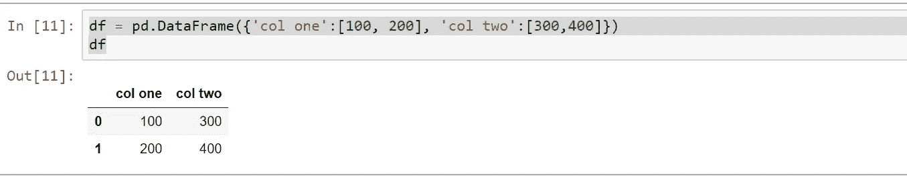
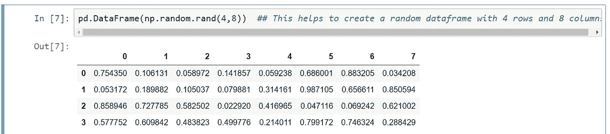
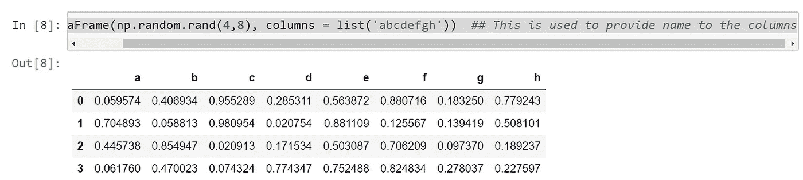
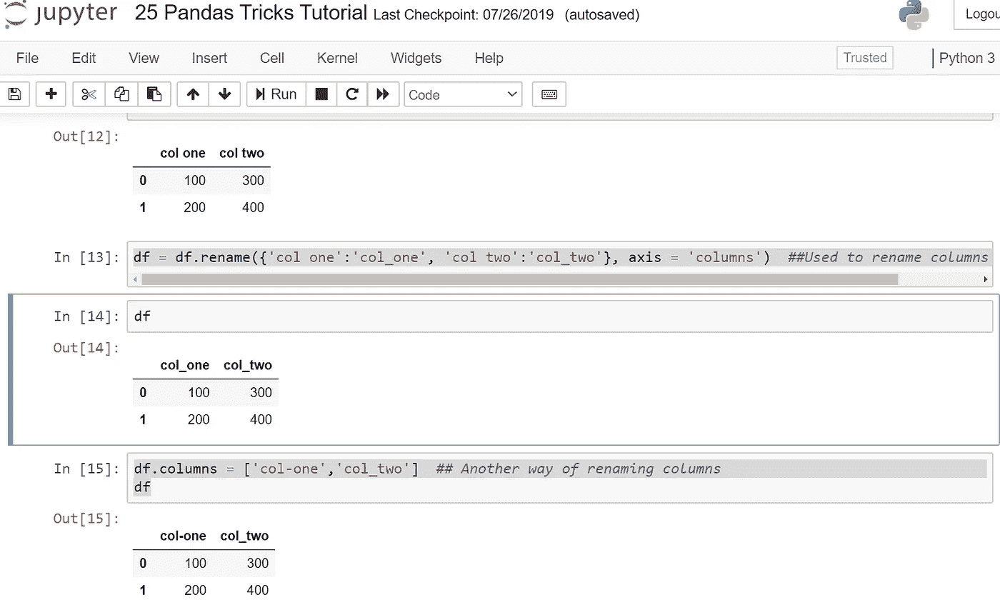
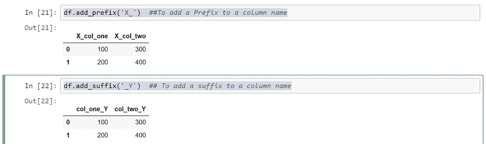

# 有用的熊猫把戏——第一部分

> 原文：<https://medium.com/analytics-vidhya/useful-pandas-tricks-part-1-c29292a7053a?source=collection_archive---------30----------------------->


蟒蛇-熊猫的把戏

在计算机编程中， **pandas** 是一个为 **Python** 编程语言编写的开源软件库，用于数据操作和分析。特别是，它提供了数据结构和操作来操作数字表和时间序列。

在本文中，我们将了解一些在数据操作和分析过程中可以使用的有用技巧。在我的软件生涯中，作为我们日常分析和操作的一部分，我已经学会了这些技巧和诀窍。但主要功劳归于“[数据学院](https://www.youtube.com/user/dataschool/about)”YouTube 频道创始人**凯文·马卡姆**。

今天，在这篇文章中，我们将学习一些基本的技巧和诀窍，然后我们将在接下来的文章中学习更多。

现在，要检查存储在您系统上的 **pandas** 的版本和 pandas 依赖项的版本，我们可以使用下面两个命令:

```
pd.__version__ ## Used to know the version of PandasOutput : '0.24.2'pd.show_versions()  ## Used to know the version of Pandas dependencies as wellOutput :
INSTALLED VERSIONS
------------------
commit: None
python: 3.6.7.final.0
python-bits: 64
OS: Windows
OS-release: 10
machine: AMD64
processor: Intel64 Family 6 Model 142 Stepping 10, GenuineIntel
byteorder: little
LC_ALL: None
LANG: None
LOCALE: None.None

pandas: 0.24.2
pytest: None
pip: 10.0.1
setuptools: 39.0.1
Cython: None
numpy: 1.16.4
scipy: 1.3.0
pyarrow: None
xarray: None
IPython: 7.6.1
sphinx: None
patsy: None
dateutil: 2.8.0
pytz: 2019.1
blosc: None
bottleneck: None
tables: None
numexpr: None
feather: None
matplotlib: 3.1.0
openpyxl: None
xlrd: None
xlwt: None
xlsxwriter: None
lxml.etree: None
bs4: None
html5lib: None
sqlalchemy: None
pymysql: None
psycopg2: None
jinja2: 2.10.1
s3fs: None
fastparquet: None
pandas_gbq: None
pandas_datareader: None
gcsfs: None
```

我们可以创建如下所示的数据帧:



数据帧—图 1

我们也可以创建一个随机的数据帧，包含任意多的行和列。在下图中，我创建了一个 4 行 8 列的数据框。

同样的命令是:

```
pd.DataFrame(np.random.rand(4,8))  ## This helps to create a random dataframe with 4 rows and 8 columns
```



列标题从 0 到 7 的随机数据帧(4x 8)

现在，在上面的代码片段中，dataframe 具有从 0 到 7 的列名。但是，如果我们想要提供我们自己的特定列名，那么我们可以使用下面的代码片段。

```
pd.DataFrame(np.random.rand(4,8), columns = list('abcdefgh'))  ## This is used to provide name to the columns
```



带有随机数和指定列标题的数据帧(4 乘 8)

现在，我们可以重命名上面创建的图 1 的数据帧的列标题，如下所示:

```
df = df.rename({'col one':'col_one', 'col two':'col_two'}, axis = 'columns')  ##Used to rename columns one by onedf.columns = ['col-one','col_two']  ## Another way of renaming columns 
```



重命名列标题

同样，我们可以向列标题添加前缀/后缀，如下所示:

```
df.add_prefix('X_')  ##To add a Prefix to a column namedf.add_suffix('_Y')  ## To add a suffix to a column name
```

上面两个代码片段的输出:



添加到列名的前缀和后缀

检查并运行这些命令，以便理解它们，然后在自己的工作中使用它们。在下一篇文章中，我会想出更多熊猫的把戏。