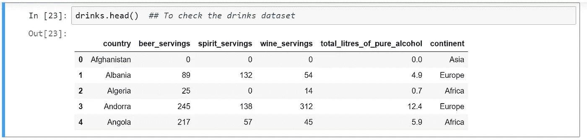
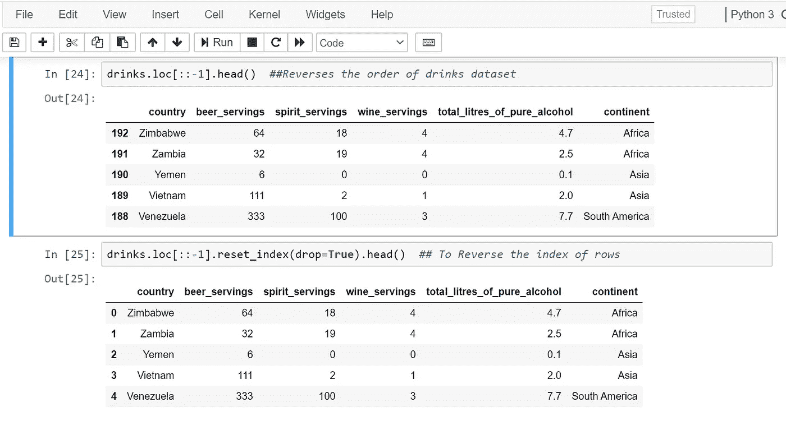
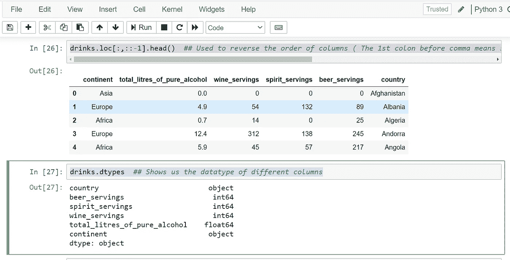
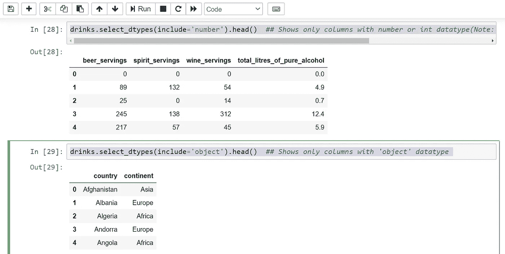
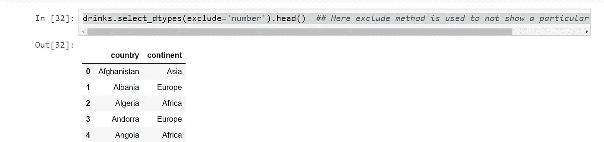
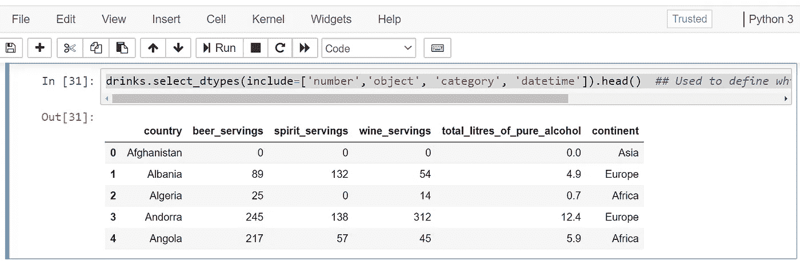

# 有用的熊猫把戏第二部分

> 原文：<https://medium.com/analytics-vidhya/useful-pandas-tricks-part-2-1cdeca72ee9a?source=collection_archive---------13----------------------->


Python 熊猫——一个强大的库

在本文中，我们将了解更多可用于数据操作和分析的技能。所以，这篇文章是我上一篇[文章](/@kumar.brar/useful-pandas-tricks-part-1-c29292a7053a)的延续。

首先，我们需要导入 *numpy* 和 *pandas* 库和一些数据集(可以免费使用和学习)，如下所示:

```
import pandas as pd
import numpy as npdrinks = pd.read_csv('[http://bit.ly/drinksbycountry'](http://bit.ly/drinksbycountry'))
movies = pd.read_csv('[http://bit.ly/imdbratings'](http://bit.ly/imdbratings'))
orders = pd.read_csv('[http://bit.ly/chiporders'](http://bit.ly/chiporders'), sep = '\t')
orders['item_price'] = orders.item_price.str.replace('$', '').astype('float')
stocks = pd.read_csv('[http://bit.ly/smallstocks'](http://bit.ly/smallstocks'), parse_dates=['Date'])
titanic = pd.read_csv('[http://bit.ly/kaggletrain'](http://bit.ly/kaggletrain'))
ufo = pd.read_csv('[http://bit.ly/uforeports'](http://bit.ly/uforeports'), parse_dates=['Time'])
```

我们可以借助 **head** 命令检查数据集的基本结构。

注意:默认情况下，head 命令显示 5 行，带有列标题。但是如果您需要查看更多的数据，那么您可以在 head 命令中传递行数，即 df.head(15)表示 15 行，依此类推。



现在，假设您想要反转数据集的顺序，即从最后一行开始向第一行移动，并且您还想要反转行的索引，请使用如下所示的命令:



反转数据集的顺序并反转行的索引

同样，反转列顺序的命令及其说明如下所示:

```
drinks.loc[:,::-1].head()  ## Used to reverse the order of columns (The 1st colon before comma means select all rows and the double colon with -1 means to reverse the column order)
```

类似地，知道不同列的数据类型的命令:

```
drinks.dtypes  ## Shows us the datatype of different columns
```



列和列数据类型详细信息的逆序

命令显示只有数字数据类型的列。在这里，我们利用*包含*的方法:

```
drinks.select_dtypes(include='number').head()  ## Shows only columns with number or int datatype(Note: It also shows the float datatype as well)
```

显示具有对象数据类型的列的命令:

```
drinks.select_dtypes(include='object').head()  ## Shows only columns with 'object' datatype
```



数字和对象数据类型

类似地，如果我们不想在结果中包含特定的数据类型，我们可以使用" *exclude* "方法，如下所示:

```
drinks.select_dtypes(exclude='number').head()  ## Here exclude method is used to not show a particular datatype columns
```



排除方法

另外，如果我们想在结果中包含一组数据类型，我们可以使用下面的命令:

```
drinks.select_dtypes(include=['number','object', 'category', 'datetime']).head()  ## Used to define which all datatype columns to include and showcase
```



包括方法

因此，我们学习了一套有用的方法，这些方法在我们的日常分析和报告任务中非常有用。在下一篇文章中，我们将继续学习熊猫的其他技巧和窍门。