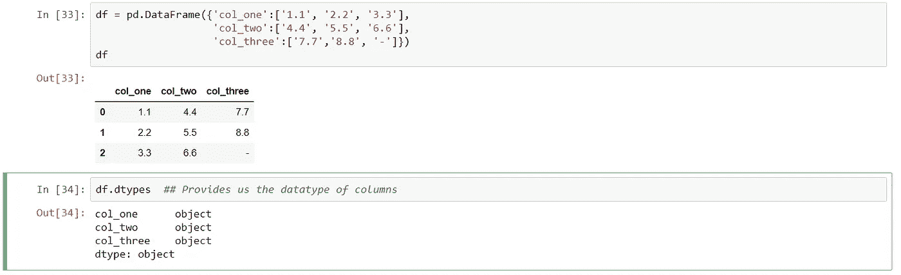
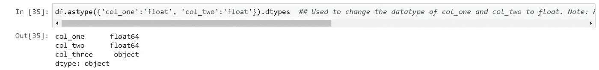
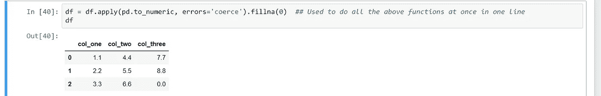
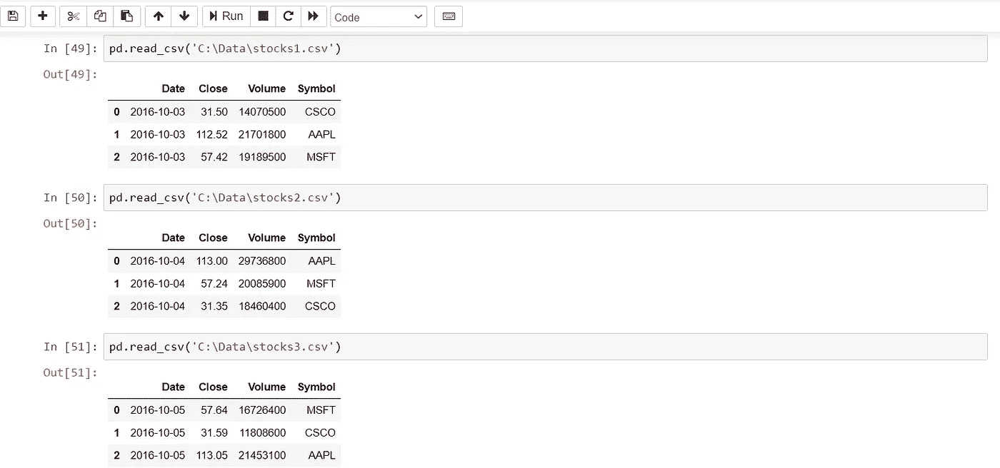
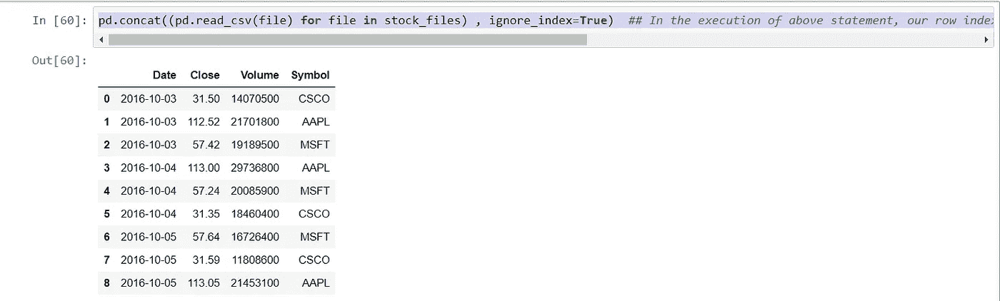
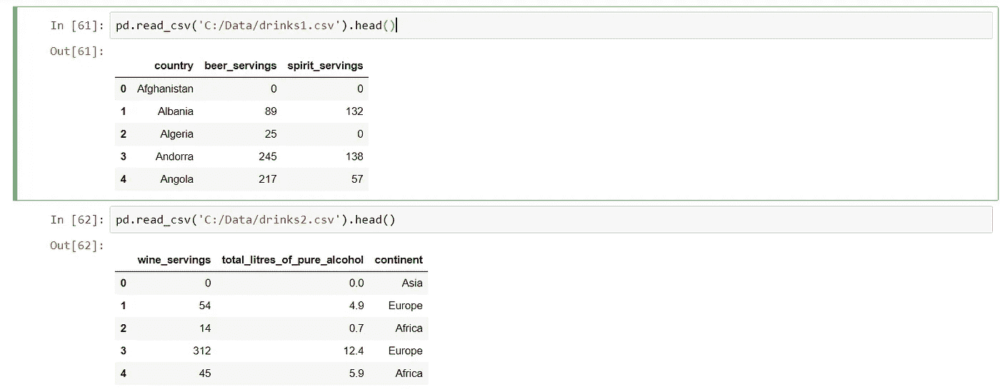
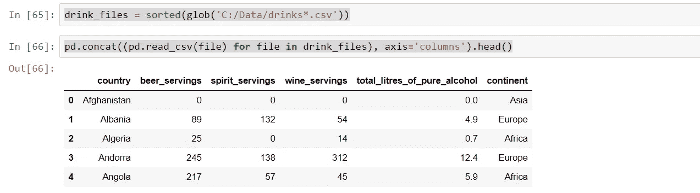

# 有用的熊猫把戏第三部分

> 原文：<https://medium.com/analytics-vidhya/useful-pandas-tricks-part-3-9db0d534a05a?source=collection_archive---------23----------------------->


熊猫 3(功夫熊猫 3 电影的壁纸)

作为我上一篇[文章](/@kumar.brar/useful-pandas-tricks-part-2-1cdeca72ee9a)的延续，我将继续介绍 Pandas 中用于数据分析和操作的有用技巧。

让我们首先创建一个数据帧，如下所示:

```
df = pd.DataFrame({'col_one':['1.1', '2.2', '3.3'],
                   'col_two':['4.4', '5.5', '6.6'],
                   'col_three':['7.7','8.8', '-']})
df
```

dataframe 与查找每列数据类型的查询如下所示:



创建数据帧和相应的命令来查找列的数据类型

如上所示，列的数据类型是'*对象'类型。*如果我们想将数据类型转换成其他类型，我们可以通过在 pandas 中使用 *astype 函数*来实现。请注意，这个函数将只改变 col_one 和 col_two 的数据类型。它不会改变 col_three 的数据类型，因为它包含连字符(-)符号，pandas 不会将其识别为任何数据类型。



使用 astype 函数转换列的数据类型

如果我们需要将任何数据类型转换为' NaN ',我们可以使用如图所示的*强制*关键字。我们还可以使用 fillna 方法填充零来代替 NaN(不是一个数字)。下面，我用一行代码演示了整个功能，但是您也可以用两个步骤来完成。

**注:** *作为一个练习，我把它留给你，让你自己做同样的事情。*



在一行中使用强制关键字和 fillna 方法

假设您有三个不同的 csv 文件，您可以借助 *read_csv* 函数在 pandas 中读取，如下所示:



在熊猫中读取 CSV 文件

在这里，文件名的名称匹配某个模式，因为所有文件名都包含名称 stocks*。csv(这里，*表示任何字符或数字，我们知道文件名类似于 stocks1.csv、stocks2.csv 和 stocks3.csv，其中 stocks 一词在所有文件名中是常见的。)

***注意:*** 如果您需要一个文件名列表，这些文件名中间都有某个扩展名、前缀或任何常见的字符串，请使用 [glob](https://pymotw.com/2/glob/#module-glob) 而不是自己编写代码来扫描目录内容。

```
from glob import glob
stock_files = sorted(glob('C:/Data/stocks*.csv'))  ## Here, with the help of sorted function , we can sort the files
stock_filespd.concat((pd.read_csv(file) for file in stock_files) , ignore_index=True)  ## In the execution of above statement, our row index is getting repeated between 0 to 2\. So, in order to ignore the index, we set ignore_index filed as True.
```

输出如下所示:



连接结果

我们也可以通过列来连接一个表。比方说，我们有如下所示的两个文件:



由列分隔的两个表

现在，如果我们想根据列将这两个表连接成一个表，那么我们可以在下面命令的帮助下做同样的事情。

```
drink_files = sorted(glob('C:/Data/drinks*.csv'))pd.concat((pd.read_csv(file) for file in drink_files), axis='columns').head()
```

结果如下所示:



通过列连接表

在下一篇文章中，我将解释我们可以在 pandas 中用于数据分析和操作的其他技巧。