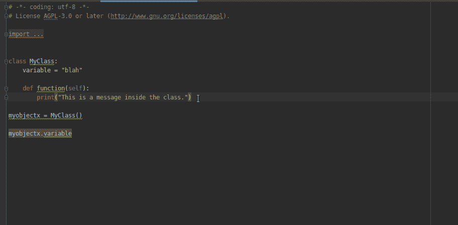
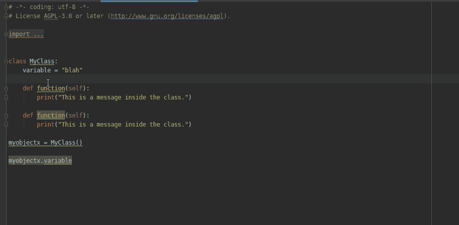
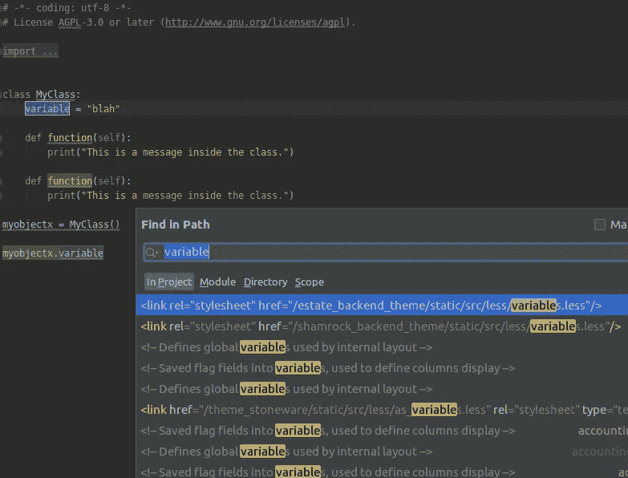
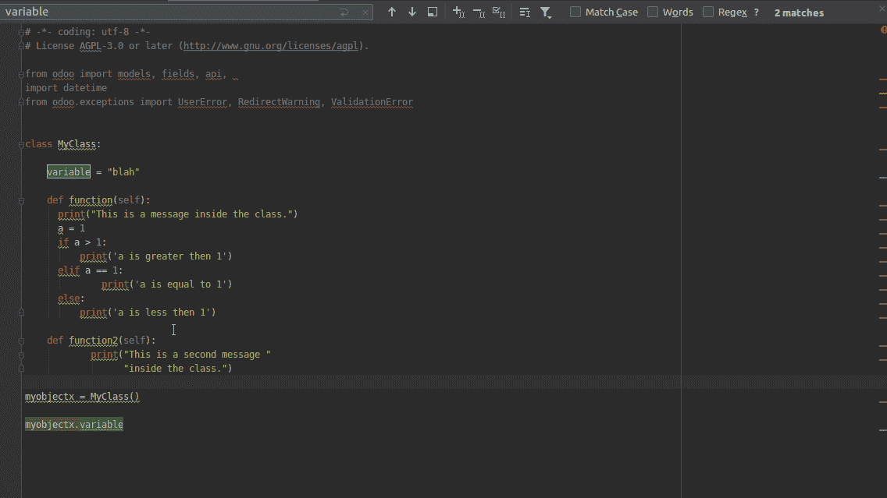
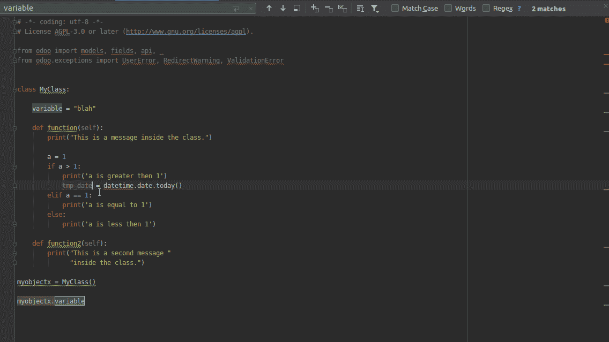
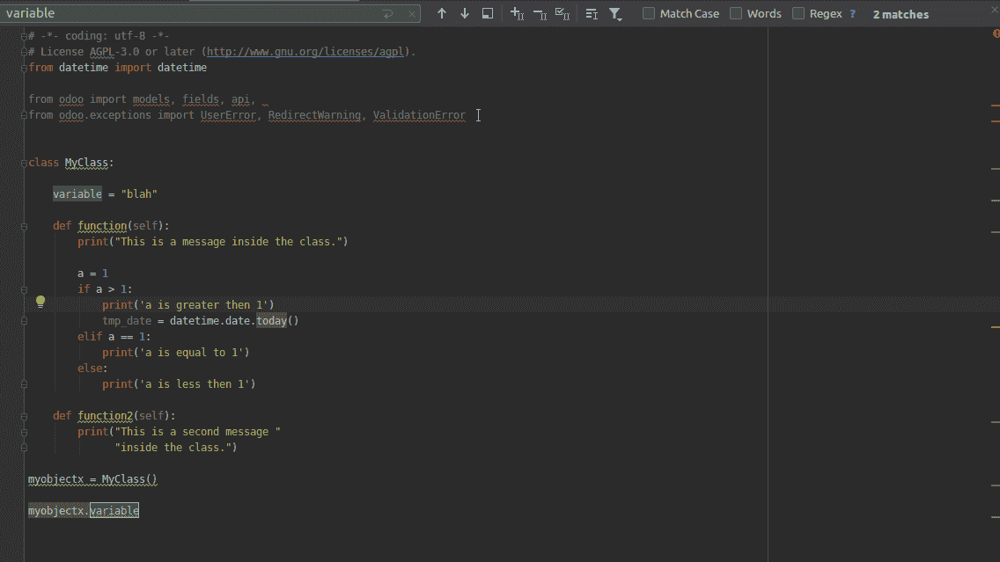
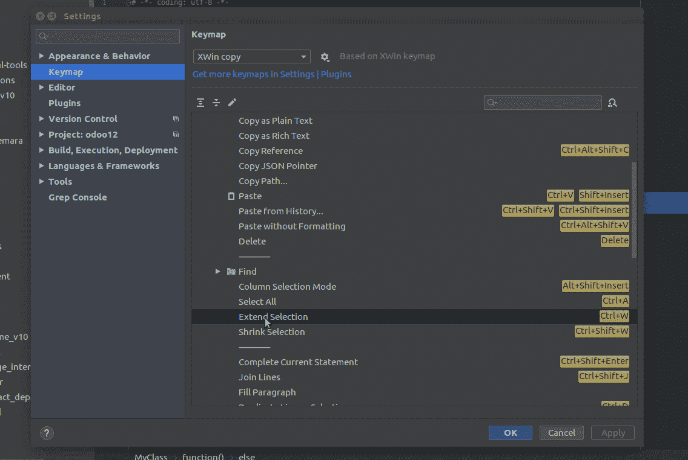

# 有用的 Pycharm 快捷方式

> 原文：<https://medium.com/analytics-vidhya/useful-pycharm-shortcuts-65343a72e6f2?source=collection_archive---------6----------------------->

Python IDE

对于每一种编程语言，你都可以使用**代码编辑器**或 **IDE** 来编写你的代码:

**代码编辑器:**或者文本编辑器是你像写文本一样写代码的地方，但是你可以从不同编程语言的语法高亮中受益，你也可以做自动完成和一些其他的特性，这帮助你更有效地写你的代码

IDE:**I**integrated**D**development**E**n environment 它更强大，它提供了代码编辑器可以提供的所有功能，还提供了其他有用的功能:调试、版本控制系统(VCS)、安装新的包&插件、类映射、清晰的项目视图等等。

所以我们可以说，对于测试或编译小代码来说，代码编辑器是一个很好的选择。但是对于项目/程序来说，IDE 是最好的解决方案。

PyCharm (Py + Charm: Python 很迷人😆开个玩笑)是 Python 编程语言最广泛使用的 ide 之一，由 JetBrain 开发。

在这篇文章中，我们将向你展示一些有用的快捷方式来使用 Pycharm (JetBrain soltutions ),这将帮助你更有效率，为你节省时间😉)

让我们深入了解这些快捷方式:

*   **ctrl + a :** 选择文件中的所有文本
*   **Alt +向上/向下:**从一个功能跳到另一个功能
*   **ctrl + e:** 显示最近访问过的文件
*   **ctrl + d :**

我们都知道 ctrl + c & ctrl + v => ctrl + d 是两者的组合，或者更确切地说，是复制文本的一种方式

Ctrl + d

*   **ctrl + f:**

它会打开一个搜索栏，在你的文件中寻找一个特定的作品/句子，你也可以选择你想要寻找的表达式，然后按 ctrl + f，它会自动把它放在搜索栏中

ctrl + f

*   **ctrl + shift + f:**

它做的事情和 ctrl + f 一样，但是它会给你更多的搜索选项:指定要查找的目录，可以选择要检查的文件类型(*。py，*。xml …)、匹配大小写…等等

**ctrl + shift + f**

*   **ctrl + shift +上/下或 Alt+ shift +上/下:**

它可以帮助您有效地将选定的行移动到另一个位置

**ctrl + shift +向上/向下或 Alt+ shift +向上/向下**

*   **ctrl + a 然后 ctrl + alt + i:**

这是一个很好的快捷方式，有助于组织/自动缩进你的代码

**ctrl + alt + i**

*   **Ctrl + a → Ctrl + Alt + L:**

它有助于根据建议的代码样式(PEP8)格式化您的代码

*   **Alt + Enter:**

导入缺少的包

Alt+ Enter

*   **ctrl + Alt + O:**

优化您导入的包，删除未使用的包

**ctrl + Alt + O**

*   **ctrl + k:**

使用版本控制系统(VCS)时，打开窗口提交更改的快捷方式

*   **ctrl+alt+shift+delete+insert+j+enter:**

冷静点！！你不是同时按下所有这些按钮的章鱼😜

# 结论

你可以通过进入**文件- >设置- >按键映射**来查看所有的快捷方式

您也可以更改或添加该列表的快捷方式

更改或添加快捷方式

我希望我有所帮助

奥斯曼·甘地，爱你的❤

你可以在 [Linkedin](https://www.linkedin.com/in/othmane-ghandi/) 、 [Twitter](https://twitter.com/GHANDIOthmane) 中轻松找到我