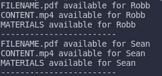
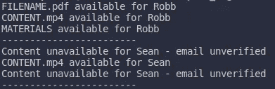
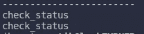
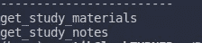
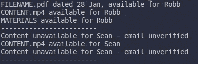

# 使用 Python 装饰器的有用技巧

> 原文：<https://medium.com/analytics-vidhya/useful-tips-for-using-python-decorators-fb0d6daec7c9?source=collection_archive---------28----------------------->

照片由 [Pexels](https://www.pexels.com/photo/blur-branches-bright-christmas-decor-283932/?utm_content=attributionCopyText&utm_medium=referral&utm_source=pexels) 的 [Inna Lesyk](https://www.pexels.com/@inna-lesyk-67454?utm_content=attributionCopyText&utm_medium=referral&utm_source=pexels) 拍摄

W 当我开始学习 python 的时候，我曾经对每一个新的概念或技巧感到兴奋，或者你知道 python 让代码看起来不那么可怕的方式，同时在幕后做了很多事情。然而，在你学过的每一种编程语言中，总有一件事你无法理解。对我来说，那就是“装饰者”,然后，当你意识到这个概念在你的项目中是多么有帮助时，你会感觉更糟。

所以，如果你是 python 的新手，并对装饰者感到害怕，那你就来对地方了。我将从最基础的地方开始，重点关注我觉得大多数初学者会犯错误的地方。

照片由[艾米丽·莫特](https://unsplash.com/@emilymorter?utm_source=medium&utm_medium=referral)在 [Unsplash](https://unsplash.com?utm_source=medium&utm_medium=referral) 上拍摄

# 为什么装修工是必须的？

例如，假设您正在为一个教育平台开发一个应用程序&您的客户指定他想要所有的学习资料、课程、笔记等。对已验证的用户和未验证的用户都是自由可用的。所以，你开始工作并构建了一个很棒的应用程序，但是正如客户指定的，没有访问过滤器来区分用户。现在，在开发工作流程的某个地方，您的客户意识到了他的业务模型中的一些缺陷&请求对最终的应用程序进行一些修改，以限制未经验证的用户访问任何特定的内容&允许那些已经验证了他们的电子邮件地址的用户——砰！。

就像这样，你的客户接受标准一路下滑，原因并不是你的错。

现在，你有两个选择:

1.  您继续向您的客户想要访问限制的每个功能单元添加访问协议。
2.  或者，您聪明地使用类似于 python 中的 decorators 的东西来定义一次访问级别功能，并在任何想要升级访问级别的地方使用它。

> 装饰器就是这样，它给先前定义的函数增加了额外的功能。

它属于一个更广泛的类别，称为**元编程，**其中程序的一个组件试图在编译时修改另一个组件的功能。

所以，这就是你现在需要知道的。让我们开始有趣的部分。

# 初始实施:

首先，让我们看看我们现在在用户过滤方面的情况:

[源代码](https://gist.github.com/pratik-1999/03be1643db401860e7ef11dfc4d5d1ab)

输出

在这里，我们可以清楚地看到，没有访问过滤器，因此经过验证和未经验证的用户都可以访问每个资源，执行代码将产生以下输出。注意，这里我们只使用了三个需要访问限制的函数，但是在现实世界中，这个数字可能是几十个或者更多。

想想看，如果我们在我们想要应用访问限制的每个函数中检查用户的**状态**，传统的 if-else 语句方法会有多乏味。

# 基于装饰器的实现:

现在让我们看看 decorators 是如何让添加客户要求的访问限制功能变得如此容易的。

[源代码](https://gist.github.com/pratik-1999/55bac55aaa9c724cb7d9b6f866f4a66e)

输出

装饰器`restrict_access`将我们需要应用访问过滤器的函数作为其输入参数，在我们的例子中，函数是`get_study_materials`和`get_study_notes`。

然后，名为`check_status`的包装函数验证用户的状态，如果用户通过验证，则提供访问。最后，装饰器返回这个包装函数。

为了使用装饰器，只需将`@decorator_name` 放在那些我们想要限制未验证用户访问的函数声明的上方，我们就完成了！

继续，因为客户要求将学习材料和笔记的访问权限仅限于经过验证的用户。你所要做的就是在`get_study_materials`和`get_study_notes`函数上面使用`restrict_access`装饰器。

# 最佳实践和实施:

虽然上面的 decorator 实现本身完全没问题，但是它可能会导致一些难以跟踪的问题，并且需要一些改进，我希望我在开始使用 decorator 时就知道这些。

## *提示 1*

> 在装饰器内部的任何包装函数之上总是包含`functools.wraps(func)`。

为了了解原因，只需执行以下命令:

[源代码](https://gist.github.com/pratik-1999/d827c523395568408cfa2bed8152e7df)

输出

注意`get_study_materials`和`get_study_notes`函数的名字是如何在装饰器中变成包装函数`check_status`的名字的。这是一个被忽视的严重问题，当你使用原来的名字时，困难就出现了。

让我们来看看`functools`图书馆在这方面有什么帮助:

[源代码](https://gist.github.com/e9544b969c192d1f8b8c86ea65307a7a.git)

输出

`@functools.wraps(func)`只是确保`check_status`只作为一个包装器，不修改被传递函数的名字。输出验证功能正常。

## 提示#2

> 在向包装函数传递输入参数时，使用*** args**&*** * kwargs**。

原因是，假设我们在将来定义新的功能或修改当前的功能，以获得不同数量的输入参数，我们的装饰器仍然可以正常工作。

[源代码](https://gist.github.com/8156a0310d080b1bd236b1b8dfa170de.git)

输出

注意，即使在`get_study_notes`函数中添加了一个额外的参数，我们的装饰器仍然无缝地适应了变化。这提供了很大的灵活性，同时定义了更多的通用装饰器，就像我们的例子一样。

请在下面的评论中分享你的疑惑，我很乐意帮助你。同时，如果您学到了一些有价值的东西，请留下赞/鼓掌，并关注我以获取即将到来的数据科学系列的更新。

想在 python 里学点别的？这是给你的:

 [## 用 Python 101 进行单元测试

### 在大多数情况下，数据科学团队和软件工程团队之间经常发生争论。

medium.com](/analytics-vidhya/unit-testing-with-python-101-e3eb0e7c1170)