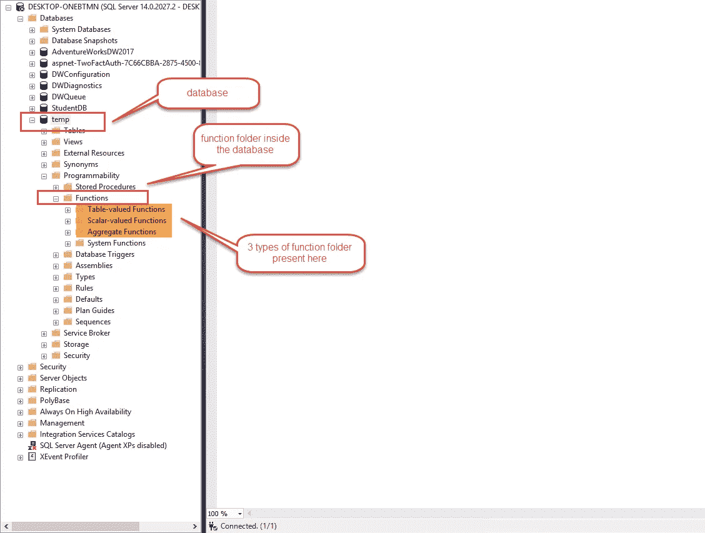
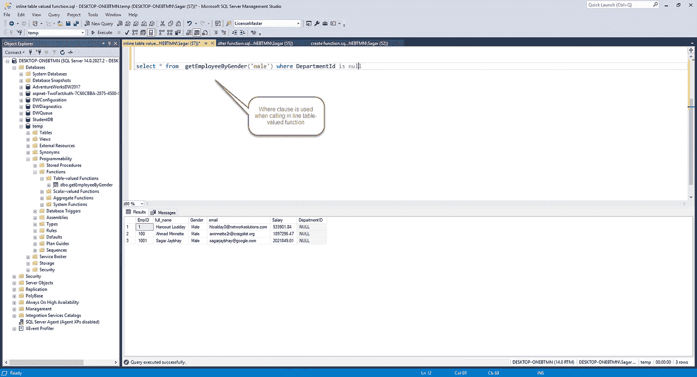
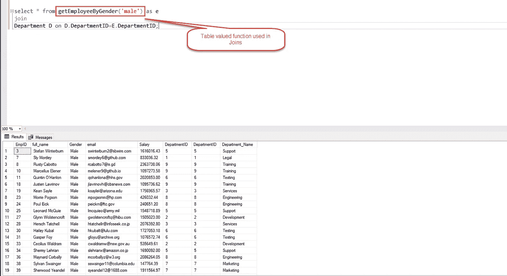
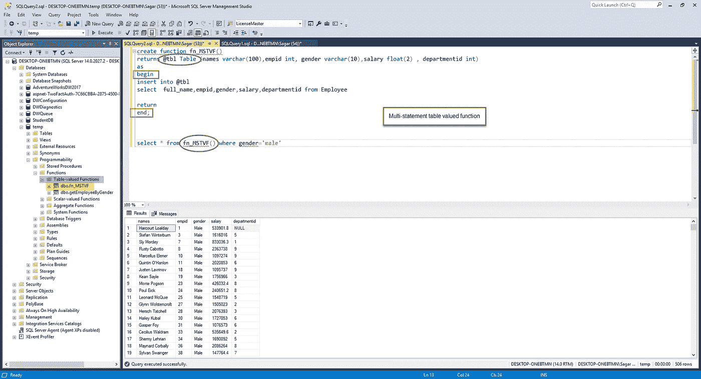
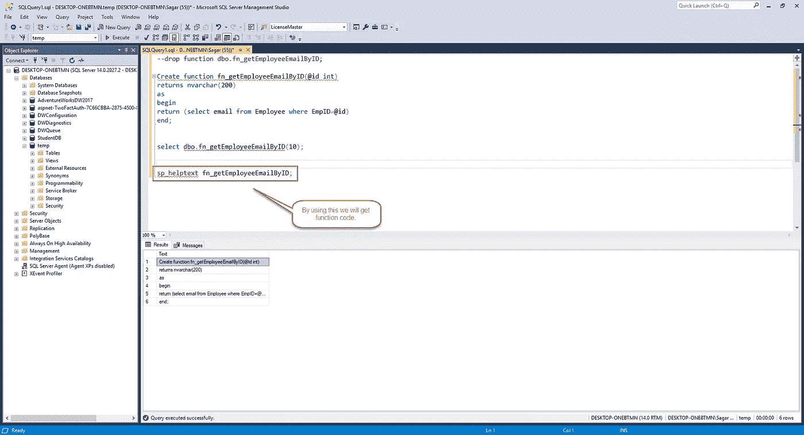
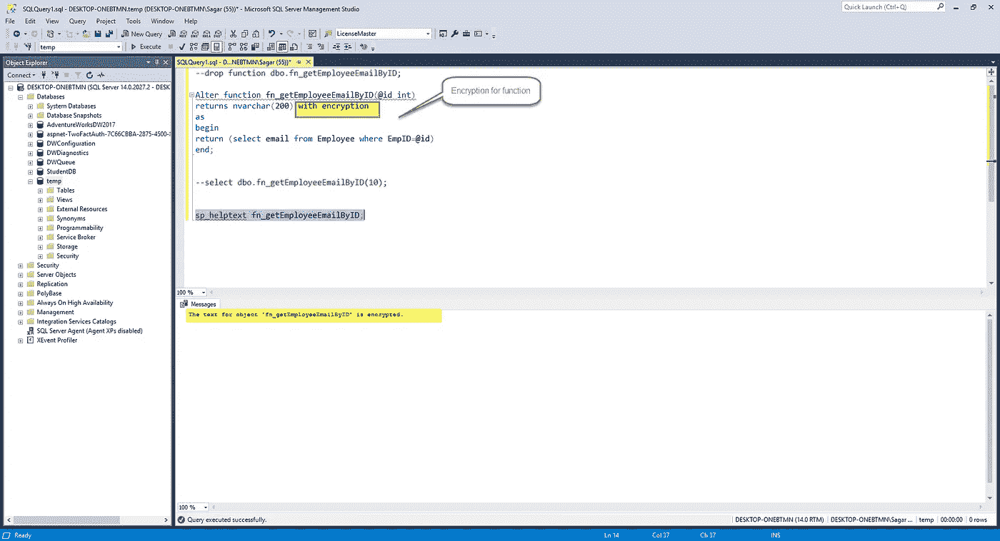
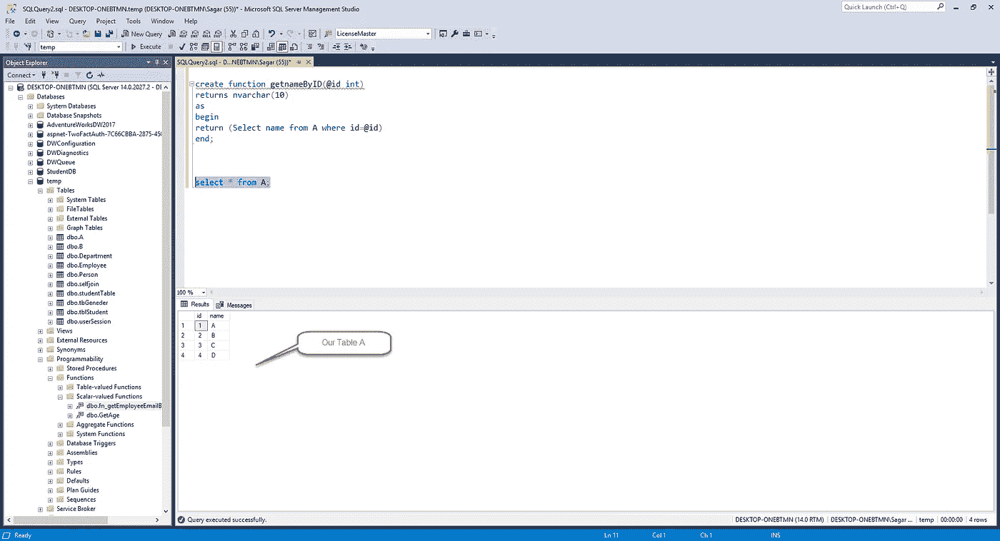
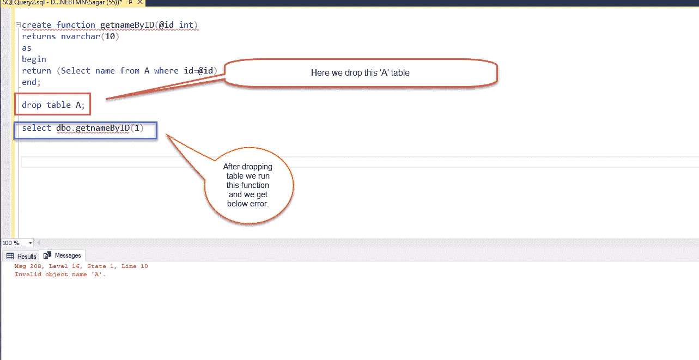
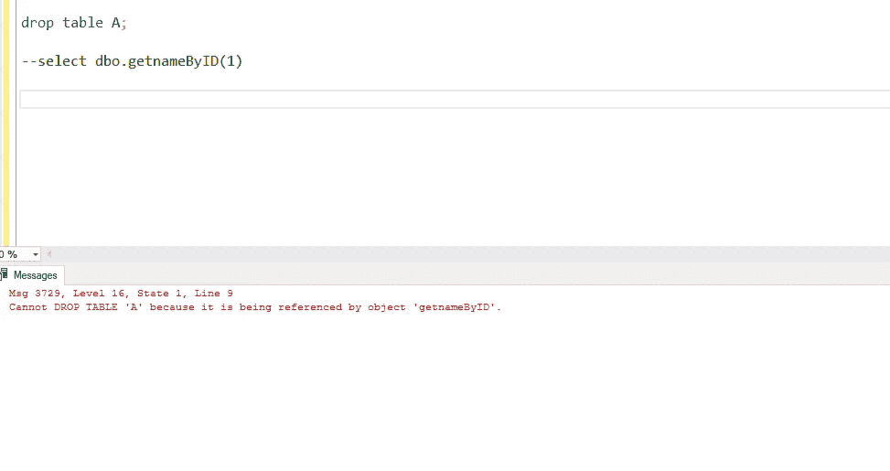

# SQL Server-2020 中的用户定义函数

> 原文：<https://medium.com/analytics-vidhya/user-defined-function-in-sql-server-2020-18b7fcfdd5d2?source=collection_archive---------10----------------------->

在本文中，我们将通过 sql server 中不同类型的函数来理解 sql server 中的用户定义函数 a)标量函数 b)内联表值函数 c)多语句表值函数

# SQL Server 中的用户定义函数

用户定义的函数也称为 UDF。在 SQL server 中有 3 种不同类型的[用户定义函数](https://docs.microsoft.com/en-us/sql/t-sql/statements/create-function-transact-sql)

1.  标量函数。
2.  内联表值函数。
3.  多语句表值函数。

您可以在 SQL Server Management studio 中找到这些函数文件夹，见下图



# 标量函数

为什么这个函数叫标量函数，因为它返回单个值。

**举例**

带参数的内置函数

```
select ABS(-1000) // op 1000
```

带 0 参数的内置函数

```
Select GetDate() //
```

**标量函数的一般语法:**

```
CREATE FUNCTION [schema_name.]function_name (parameter_list)
RETURNS  return-data-type AS
BEGIN
statements
RETURN value
END
```

# 如何在 SQL server 中创建用户自定义标量函数？

```
Create function GetAge(@bdate nvarchar(100))
returns int
as 
begin
declare @age Int
set @age=DATEDIFF(YEAR,cast(@bdate as date),Getdate());
return @age;
end
```

在上面的函数中，我们计算年龄。

如果您只使用

选择函数名(参数)；然后它会给出一个错误，为了克服这个错误，我们需要给出一个完全限定名**或者两个部分名**或者至少在函数名前添加数据库所有者和名称。在我们的例子中，dbo 是数据库所有者。

```
select dbo.GetAge('12/01/1988'); // op- 31
```

第二个示例:您可以在 select 子句中使用它，如下所示

```
select id,first_name,last_name,dbo.getage(dateofbirth) from studentTable
```

在存储过程中也可以这样做，但是不能在 select 子句和 where 子句中使用存储过程。

# 如何修改 SQL server 中的函数？

```
ALTER function [dbo].[GetAge](@bdate nvarchar(100))
returns int
as 
begin
declare @age Int
set @age=DATEDIFF(YEAR,cast(@bdate as date),Getdate());
return @age;
end
```

alter 关键字需要使用，而不是 create 语句和你需要在这里写的整个函数。

# 如何从 SQL server 中删除函数？

您需要使用 drop 关键字和函数名来删除 SQL server 中的函数。

此外，完全限定名或数据库管理员名需要与函数名一起使用。如果只使用函数名，则会出现错误。

常规语法:

```
Drop function function-name;
```

**示例**

```
drop function dbo.getage
```

# 内联表值函数

# 什么是表值函数？

表值函数是用户定义的函数，它将表作为数据类型返回。返回类型是一个表，它被视为一个表。

在这种类型的函数中，我们返回一个表，在前面我们学习了返回单个值。

**表值函数的一般语法:**

```
create function function_name(@parameter datatype)
returns table
as
return (select * from table_name)
end
```

1.  在上面的通用语法中，你会看到 returns 返回类型是 table 意味着这个函数将返回 table。
2.  在这个函数中，主体不包含在 Begin 和 End 块中
3.  无论返回什么表，该表的结构具体取决于您使用的 select 语句。
4.  表值函数被视为一个表。

如果您在此函数 create 语法中使用 begin 和 end 语句，您将得到以下错误。

状态 31，过程 getEmployeeByGender，第 7 行[批处理开始行 0]

-“BEGIN”附近的语法不正确。

**例子**

```
create function getEmployeeByGender(@gender nvarchar(10))
returns table
as
return (select * from Employee where Gender=@gender);
```

在上面的函数中，我们将性别作为一个参数传递，这个参数用在下面 select 语句的 where 子句中。

要调用这个函数，我们需要使用下面的语法。

**Select * from function_name(参数)；**

前夫;前妻;前男友;前女友

```
select * from getEmployeeByGender('male')
```



在内联表值函数中，当您调用此函数时，可以在。

```
select * from getEmployeeByGender('male') where DepartmentId is null
```


## 我们可以在哪里使用内联表值函数？

*   内联表值函数可用于实现参数化视图的功能
*   您可以使用由内联表值函数返回的表进行连接，或者与另一个表形成连接。

对另一个表使用表值函数进行查询

```
select * from getEmployeeByGender('male') as e join Department D on D.DepartmentID=E.DepartmentID;
```



## 如何修改表值函数？

您可以在函数创建中使用 alter keyword 而不是 create word。脚本的其余部分是相同的。

```
alter function [dbo].[getEmployeeByGender](@gender nvarchar(10))
returns table
as
--begin
return (select EmpID,full_name,DepartmentID,Salary from Employee where Gender=@gender);
--end
GO
```

# 多语句表值函数(MSTVF)

多语句表值函数是返回多条语句结果的表值函数。

它很有用，因为您可以在该函数中执行多个查询。

在这种类型的函数中，您需要定义一个表变量并返回该变量。

此外，您可以创建表格的结构。

```
create function fn_MSTVF()
returns @tbl Table (names varchar(100),empid int, gender varchar(10),salary float(2) , departmentid int)
as
begin
insert into @tbl
select  full_name,empid,gender,salary,departmentid from Employee

return
end;

select * from fn_MSTVF() where gender='male';
```



# 表值函数和多语句表值函数有什么区别？

*   在内联表值函数中，我们在 return 语句中没有表的结构，而在多语句表值函数中，我们在 returns 子句中有表的结构。
*   当 MSTVF 有 begin 和 end 块时，内联表值函数不必有 begin 和 end 块。
*   当您能够在 MSTVF 上使用内联表值来实现函数时，内联表值函数比 MSTVF 具有更好的性能。
*   可以使用内联表值更新表，但不能使用 MSTVF

```
update fn_MSTVF() set departmentid=1 where empid=1 // gives error can’t modify

update getEmployeeByGender('male') set departmentid=null where empid=1 //update successfully underlying table.
```

# SQL Server 2020 中的重要概念

在 SQL 中，函数在任何给定时间都是确定性的或非确定性的。

**确定性和非确定性函数:**

这是一个在任何时候都返回相同值或结果的函数，无论您使用特定输入运行相同函数多少次，并且假定数据库的状态保持不变。

《出埃及记》平方()、平均值()、总和()

注意:所有聚合函数都是确定性函数。

**不确定函数:**

这些函数在每次使用一组特定的输入值调用时可能会返回不同的结果，即使它们访问的数据库状态保持不变。

```
GetDate(), CURRENT_TIMESTAMP()
```

**兰德功能:**

基于种子值，该函数具有确定性和非确定性。

```
Select Rand()Select Rand(1);
```

**使用带加密选项的函数定义加密:**

因为我们能够以类似的方式加密存储过程，所以我们也可以在 sql server 中加密函数。

如下图所示，我们首先创建一个函数，然后调用这个函数，看看它是否工作正常。

之后，我们在一个内置存储过程 sp_helptext 的帮助下调用这个函数，这个过程用于获取函数文本。

```
--drop function dbo.fn_getEmployeeEmailByID;

Create function fn_getEmployeeEmailByID(@id int)
returns nvarchar(200)
as
begin
return (select email from Employee where EmpID=@id)
end;

select dbo.fn_getEmployeeEmailByID(10);

sp_helptext fn_getEmployeeEmailByID;
```



为了避免这种情况，我们不希望最终用户看到我们的代码，然后我们需要加密这个函数，通过使用加密关键字，我们可以做到这一点，见下面的代码。

因为我们已经创建了函数，所以我们将在其中修改和添加加密标签

```
Alter function fn_getEmployeeEmailByID(@id int)
returns nvarchar(200) with encryption 
as
begin
return (select email from Employee where EmpID=@id)
end;
```


完成此操作后，当您运行下面的命令时，您会得到一个错误。

```
sp_helptext fn_getEmployeeEmailByID;
```



下面是我们得到的错误。

对象“fn _ getEmployeeEmailByID”的文本已加密。

# SchemaBinding 函数:

模式绑定指定函数绑定到它引用的数据库对象。当指定模式绑定时，不能以任何影响函数定义的方式修改或删除基本对象。

要实现修改，你需要首先修改你的函数，然后你才能修改一个基本对象。

```
create function getnameByID(@id int)
returns nvarchar(10)
as
begin 
return (Select name from A where id=@id)
end;
```

参见上面函数在这个我们使用的“A”表中创建一个语句，假设任何人意外地删除了这个表或者修改了列名或者删除了我们函数所依赖的列，那么我们的函数将不能正确执行，它将抛出一个错误。

因此，为了避免这种情况，我们使用 Schemabinding 选项。



现在我们的函数依赖于表 A。我会放弃表 a

```
drop table A; select dbo.getnameByID(1);
```

删除表格并运行我们的函数后，我们得到以下错误。

消息 208，第 16 级，状态 1，第 10 行无效的对象名“A”。



为了避免这种情况，我们需要模式绑定，为此，我们需要将它与 **SchemaBinding** 一起使用

因此，如果我想要模式绑定，我们需要改变函数并执行该函数，其语法如下。

```
alter function getnameByID(@id int)
returns nvarchar(10) with SchemaBinding 
as
begin 
return (Select name from A where id=@id)
end;
```

通过这样做，我们得到一个错误如下

消息 4512，级别 16，状态 3，过程 getnameByID，第 5 行[批处理开始行 1]

无法对函数“getnameByID”进行架构绑定，因为名称“A”对于架构绑定无效。名称必须由两部分组成，并且对象不能引用自身。

为了克服这个错误，我们需要将表名分成两部分，如下图所示 **dbo。答**

```
alter function getnameByID(@id int)
returns nvarchar(10) with SchemaBinding 
as
begin 
return (Select name from dbo.A where id=@id)
end;
```

在此之后，我们的函数修改成功，如果我们试图删除表，我们得到以下错误。

Msg 3729，16 级，状态 1，第 9 行

无法删除表' A '，因为它正被对象' getnameByID '引用。



*原载于 2020 年 1 月 25 日 https://sagarjaybhay.com*[](https://sagarjaybhay.com/user-defined-function-in-sql-server-2020/)**。**