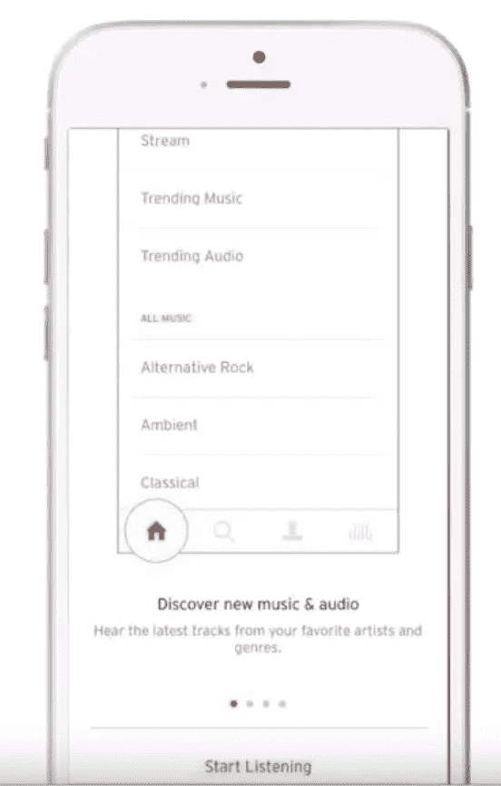

# 用户入门—设计视角

> 原文：<https://medium.com/analytics-vidhya/user-onboarding-a-design-perspective-504ee19bdbfa?source=collection_archive---------21----------------------->

> 为什么用户入职很重要？
> 
> 用户入职的要素。
> 
> 吸引用户的最佳实践。
> 
> 真实世界的例子。

## 为什么入职很重要？

一项研究表明，在下载后的第一周使用应用程序的用户中，大约有一半会保留下来，或者在接下来的三个月里会表现出进一步的活动。并且通常在一个月的时间里表现出更高的参与度，最终保持率会增加。这意味着，从长远来看，欢迎拥有强大入职体验的新用户的品牌将更有能力留住用户。入职不一定是一天的活动。它可以跨越几天，基本上只要教育用户。

## 用户入职的基本要素是什么？

> 介绍内容
> 许可
> 多通道信息
> 测试
> 测量

**介绍性内容 **

一旦用户下载了你的应用，用介绍性的内容问候他们是很重要的。这将有助于展示你的应用程序的价值，讨论关键功能，并为用户提供明确的行动号召。

困境是大多数应用程序忽略了介绍内容，这基本上是你第一次安装和打开应用程序时看到的内容。介绍内容是你的应用程序的第一印象，微笑是开启良好关系的关键。

我们可以看到 SoundCloud 的一个介绍性屏幕，上面清晰地呼吁开始收听。

**介绍性内容提示:**

> 提供指示器，让用户知道浏览你的介绍内容需要多长时间。
> 
> 提供退出简介的选项。有些用户可能已经有了一个帐户，想直接进入，给他们这样做的选项。
> 
> 通过图片展示应用的价值和功能。文字是伟大的，但图像更强大，可能会提供更多的方向。
> 
> 保持简短。只包含最重要的信息。
> 
> 包括你的应用程序的标志和口号，以建立用户的信任。

***许可:问路***

如果应用程序需要用户的特殊许可，或者如果您希望启用推送通知来发送有用的消息，您需要与您的用户进行沟通。

**许可提示:**

> 使用自定义的选择加入提示，让您能够以自己的方式请求许可，并灌输您的品牌个性等提示。
> 
> 关键—自定义选择加入提示应显示在本机 iOS 提示之前。原因是，一旦本机操作系统提示显示你不会再有机会要求许可，用户将不得不通过他们的设置来更新。
> 
> 测试你的选择加入提示，看看哪些变体产生了最多的选择加入。
> 
> 一定要向用户解释你为什么要求某些权限，不要只是要求而不给他们一个理由。解释获取推送通知、启用位置功能等的好处。

***多渠道消息传递:提升留存率***

一份白皮书指出，在安装后的前七天内运行多渠道 onboarding 活动的应用程序在两个月内的保留时间增加了 130%,而仅使用推送通知的活动增加了 71%。这意味着你应该做两件事。

**多渠道消息传递的技巧:**

> 通过电子邮件、应用内/浏览器内消息等其他渠道补充推送通知，解释应用的价值。
> 
> 如果您的应用程序需要注册才能获得完整的功能，请通过推送通知让用户知道要获得完整的体验还需要做更多的事情。有些人可能会因为很多原因而在早上早早放弃。但你不必放弃他们，有时人们只是需要一点提醒。

***测试:优化你的入职***

开始时，您可能希望从创建一个入职流程开始。一个信息，但随着你的收购战略的推进，测试变得至关重要，你希望找到将推动大多数用户采取你想要的行动的入职流程和信息。

**测试提示:**

> 测试您的入职流程，其中包括内容、链接和操作，例如，您可能有一个流程有三个介绍屏幕，引导至我们的注册页面，另一个流程可能有五个介绍屏幕，引导至我们的注册页面，您可以测试哪个流程生成的注册量最高
> 
> 测试你的信息:这包括你的推送通知和电子邮件的文案、图片、语气、个性化。

***测量* :**

一旦你完成了所有内容信息和流程的构建，你必须评估性能。

**测量技巧:** **计算留存率的三种流行方法**

> 保留。这包括入职后的保留，以及范围和滚动保留。保持率可能是唯一最重要的指标，你可以用它来确定你的入职活动是否创造了积极参与的用户。
> 
> 分析入职对首次购买、注册或您关注的任何其他关键行动的影响。首次购买表明用户对你提供的产品感兴趣，注册表明用户有兴趣长期使用你的品牌和应用。3 .将你的留存指标与你所在行业的留存指标进行比较。测量保持力最常用的方法是经典法、范围法和滚动法。

经典保留率是指在某一天会打开的用户的百分比。范围保留类似于经典保留，但也是针对多天而不是一天。你可以选择任何区间，7 天的周线或 30 天的月线是最常见的。最后，还有滚动保留，它查看某一天或之后打开的用户的百分比。查看三种不同的计算方法将帮助您了解每种计算方法固有的优势和劣势。

***真实世界的例子:***

**IHEARTRADIO —精彩的介绍内容**

作为新用户浏览前三个屏幕中的流程。你可以立即看到，他们解释了应用程序的价值，以及我如何从中受益。因此，第一个屏幕是你的耳朵音乐，数以千计的直播电台和艺术家站，连接您最喜爱的总是免费的。第二个屏幕上写着加入派对，在你的发行版中发现数百万首歌曲，无论你走到哪里都有你所有的音乐。然后第三屏，不要错过一个节拍，聚会前或分手后跑步或放松。我们有一个车站非常适合你。

我们可以看到，在任何时候，我都可以创建一个帐户或登录。在第三个屏幕之后，我必须登录或创建一个帐户，作为一个新用户，我选择创建一个帐户，这将把我带到第四个屏幕。这已被提示填写关于我自己的简要信息。我将创建一个帐户，他们立即要求使用我的位置或邮政编码为我提供最好的 DJ 和广播电台。正如您所看到的，解释提示本身的值。

在按下“不，谢谢”后，他们会提示我选择我最喜欢的流派，这样他们就可以推荐定制的电台。一旦我选择了类型，他们会解释启用推送的原因，这很好。他们解释了获得推送通知的价值，并问我一个定制的道具。一旦我接受了。然后我收到一个我也允许的原生 iOS 提示，然后我被带到主屏幕。

**料斗—大权限**

在兴趣屏幕中，你可以在左侧看到他们创建了一个自定义的推送应用程序，并提示解释推送的价值，如果我拒绝，他们稍后会有第二次机会询问。

**TripIt —出色的多渠道入职培训**

在我决定创建一个账户之后。我被提示检查我的收件箱中的验证链接，他们没有发送验证电子邮件，但随后欢迎电子邮件，重申其服务的价值。

当我点击确认邮件中的链接时，我会被带到一个向我发送信息的网站。该消息告诉我输入更多关于我自己的信息来完成我的个人资料。在本例中，他们使用了三种渠道，即消息、电子邮件和浏览器消息来指导我完成这一过程。

**关键要点:**

> 总是包括自然的内容。
> 
> 使用自定义提示来请求权限，不要只是让本机操作系统来决定用户选择加入的命运。
> 
> 使用多渠道消息传递来提高留存率，并更好地引导用户使用你的应用和品牌。
> 
> 根据结果进行测试和优化。
> 
> 衡量入职的影响，不要只是假设一切正常，要确定入职如何影响员工的忠诚度和首次行动。

有一篇关于[用户入职漏斗](/swlh/https-medium-com-despina-exad-the-user-onboarding-funnel-7f7dd82579af)的精彩文章