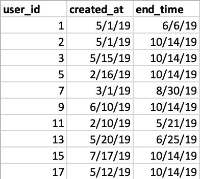
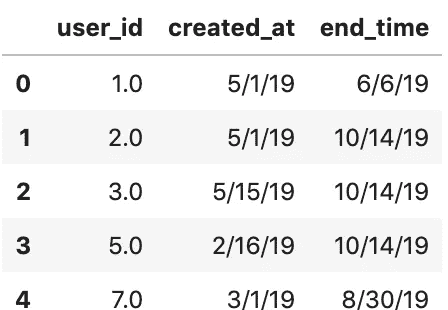
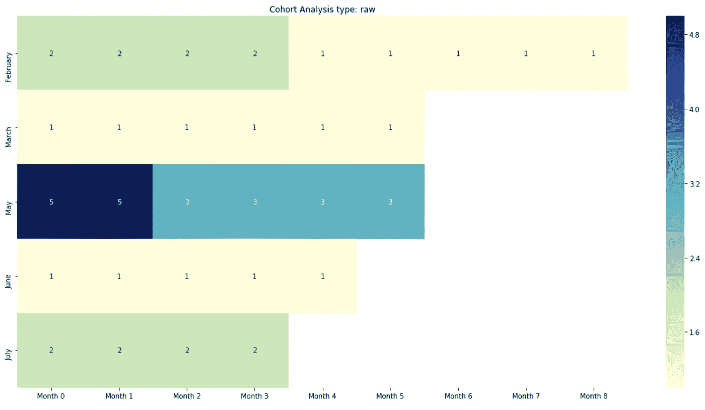
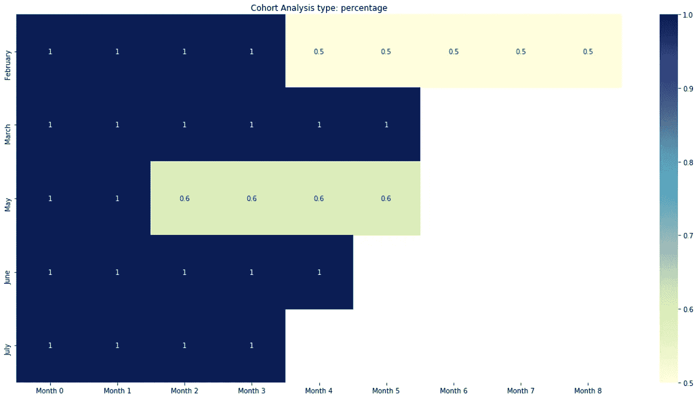
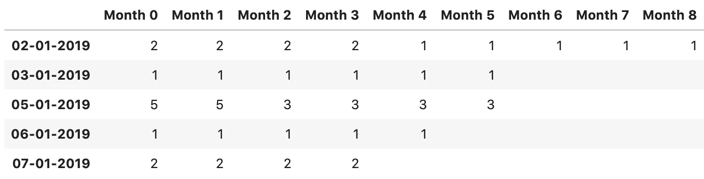
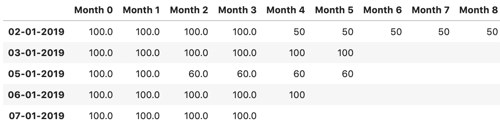

# Python 中的用户保持

> 原文：<https://medium.com/analytics-vidhya/user-retention-in-python-8c33fa5766b6?source=collection_archive---------2----------------------->

在本文中，我将向您展示如何通过导入一个非常小的易于运行的保留模块来对您的数据集运行用户保留分析。这篇文章是为那些希望以最少的努力快速进行保留分析的分析师(和学生一样)准备的——这样可以让你花更多的时间分析，花更少的时间编码。

**那么什么是用户留存？**

从本质上来说，用户留存允许你进行群组分析(这只是意味着在某个时间段内对用户进行分组)，并查看有多少用户在加入后参与了某项活动。

也许上面的解释让你感到困惑，但是不用担心，这个概念很容易理解。假设您从如下所示的数据集开始:



数据应该采用的格式示例

上图是您理想使用的原始数据格式，其中:

*   **user_id** :您希望将其包含在保留计算中的每个用户的唯一标识符。
*   **created_at** :用户的注册日期。你如何考虑什么是“注册”完全取决于你的具体用例。但一个简单的例子可以有一个网站，用户必须创建一个帐户(因此注册)
*   **end_time** :用户执行动作的最后日期。示例:用户上次登录您的服务的时间。同样，这个指标完全取决于您的用例。

**注:**给定用户的 *end_time* 必须始终大于或等于 *created_at* 值。当你思考这个问题时，直觉上这是有道理的。例如:在用户注册并被引入您的环境之前，无法跟踪任何用户活动。

让我们使用 CalculateRetention 包来执行此分析:

**第一步:安装软件包**

```
pip install calculate-retention
```

**第二步:导入需要的包**

```
from calculate_retention import CalculateRetention
```

和其他包裹一起

```
import pandas as pd
import numpy as np
import seaborn as sns
import matplotlib.pyplot as plt
from datetime import date, timedelta
import datetime as dt
import warnings
```

**第三步:导入你的文件作为熊猫数据框架**

这里的关键点是，你只需要输入一个熊猫数据框。因此，您可以在任何 Python 工作流中实现这种保留分析。

我只需将一个 CSV 文件读入一个熊猫数据帧，该数据帧包含上图所示的数据(为了完整起见，我将在这里再次展示)

```
# Reading in the file 
my_file = pd.read_csv('retention_test.csv')
my_file.head()
```



我的文件的前 5 行

**第四步:创建留存分析对象**

```
# Use 'weekly' for weekly retention and 'monthly' for monthly retention
retention_data = CalculateRetention(my_file, 'monthly')
```

**步骤 7:地块保持**

*绘图原始数据:*

```
retention_data.plot_retention('raw')
```



如何阅读:很简单，这张图显示了 0 月实际注册的用户数量，以及这些用户中有多少人在接下来的几周内进行了某项活动(如登录、做某事等)

例如，让我们看看五月。本质上，我们说 5 个用户在 5 月注册(或进入你的系统)，所有 5 个用户在 6 月都进行了一些活动。然而，我们在 6 月失去了 2 个用户，因此在 7 月、8 月、9 月、10 月只剩下 3 个用户登录或执行一些活动。在 10 月，所有 3 个用户都是最后一次登录，因此剩下的几个月是空白的。

*剧情百分比:*

```
retention_data.plot_retention('percentage')
```



如何阅读:例如，让我们看看五月。本质上，我们说 100%的用户在 5 月注册(或进入你的系统)，100%的用户在 6 月进行了一些活动。然而，只有 0.66%的用户在 7 月、8 月、9 月、10 月进行一些活动，100%的用户中有 66%在 10 月最后一次登录(或进行一些活动)，因此剩下的月份为空白。

**第五步&第六步呢？**

现在你可能已经注意到我错过了第 5 步和第 6 步。这是因为不需要它们来执行如上所述的快速保留分析。

**第五步:获取底层数据**

这里的目标是让你，分析师，轻松地将这些结果纳入你的分析

*原始数据*

```
z = retention_data.get_raw_retention()
z.fillna('')  # Just to make it look neater
```



一个熊猫的数据框架，上面也画了同样的数据

*百分比*

```
p = retention_data.compile_percentages()
p.fillna('')  # Just to make it look neater
```



一个熊猫的数据框架，上面也画了同样的数据

一般说明:该分析基于模拟数据。当使用生产级别的数据时，您的结果将更有意义。我使用了一个小的数据集，以避免让任何人感到困惑，尤其是那些刚刚开始编程和分析之旅的人。

祝你好运，我希望这有所帮助。如果有东西坏了，请在评论中告诉我，我会在几个小时内帮你修好:)