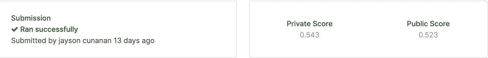

# 在 Catboost 中使用自定义度量:分类为回归

> 原文：<https://medium.com/analytics-vidhya/using-a-custom-metric-in-catboost-classification-as-regression-1ad42b2e7d?source=collection_archive---------3----------------------->


科林·沃茨在 [Unsplash](https://unsplash.com/s/photos/cat-and-trees?utm_source=unsplash&utm_medium=referral&utm_content=creditCopyText) 上的照片

在这篇博客中，我将分享我在 Catboost 中为 Kaggle 比赛定义自定义指标的经验。

Catboost 文档[第](https://catboost.ai/docs/concepts/python-usages-examples.html#custom-loss-function-eval-metric)页提供了一个如何为过拟合检测器和最佳模型选择实现自定义指标的示例。虽然，我觉得它不够琐碎，所以我写这篇文章作为我自己和其他用户的未来参考，他们可能会发现这些笔记很有用。

首先，我将设置场景，说明当 Catboost 有大量的[支持的指标](https://catboost.ai/docs/references/custom-metric__supported-metrics.html)可用时，我为什么要使用自定义指标。

**目标**:建立一个模型，根据儿童之前的应用程序使用数据，预测评估组(4 个班级)的儿童。参见[ka ggle 2019 数据科学碗](https://www.kaggle.com/c/data-science-bowl-2019)。

**评估指标** : [二次加权 Kappa](https://en.wikipedia.org/wiki/Cohen%27s_kappa)(QWK)——这是衡量两个结果之间一致性的指标；我们的预测与地面真相标签。

**策略**:建立一个回归模型，应用一些边界截止点，将回归模型的连续结果转换成可用于 QWK 度量的离散结果(4 个类别)。

这里的问题是，我们正在构建一个回归模型，但是想要使用 QWK 度量，这是一个分类度量 T21。尽管 QWK 作为 wk appa(Catboost 分类模型中预定义的指标)可用，但它不能用于回归模型。

解决这个问题的一种方法是建立一个定制的度量标准，将回归模型的连续结果转换成 4 类，然后应用外包的 QWK 度量标准。(**见例 2** )

**示例 2** 中的自定义指标可用作回归模型的过度拟合检测器！

要在 Catboost 中构建自定义指标，必须遵循以下格式。参见 Catboost 文档[第](https://catboost.ai/docs/concepts/python-usages-examples.html#custom-loss-function-eval-metric)页。

```
class CustomMetric(object):
    def get_final_error(self, error, weight):
        return 0.0def is_max_optimal(self):
        return Truedef evaluate(self, approxes, target, weight):
        # approxes - list of list-like objects (one object per approx dimension)
        # target - list-like object
        # weight - list-like object, can be None
        return 0.0, 0.0
```

您可以将类名`CustomMetric`编辑成您想使用的任何名称，但是…

**注意:不要编辑以下任何函数名** `get_final_error, is_max_optimal, evaluate`

1.  让我们开始讨论`evaluate`函数。

**变量**
`approxes`:如果使用`eval_metric`参数，这些是您在`fit`方法中由 CatBoostRegressor 模型提供的预测。`approxes` 将以类格式 *DoubleArrayWrapper* 出现，它们是索引容器(例如元组、列表、集合、字典；这些是内置的**容器**。要访问容器中的内容，我们需要通过它的索引来调用它，并将它赋给一个变量。因此，我们编写`approx=approxes[0]`，如下面两个例子所示。

我们现在可以把`approx` 看作是我们通常的预测列，其形状与我们的标签/目标列相同。

在我的例子中， **Example 2** ，我的目标列的形状是 *N* x *1* 因此，访问每个条目只需调用它们的索引，即`approx[i] for i in range(len(approx))`

既然我们能够访问我们的预测条目，我们现在可以进行适当的操作，以便计算我们正在尝试构建的定制指标。

这些是你的基本事实标签。形状将取决于您为模型构建的度量的类型。

`weight`:要在您的自定义指标上使用的重量。这个可以`None`。形状将取决于您为模型构建的度量的类型。

**返回语句** 函数`evaluate`要求我们返回一个有序对，例如`return 0.0, 0.0`。

该有序对的第一个和第二个条目将分别用作`get_final_error`函数的`error`变量和`weight`变量。

2.接下来，是`is_max_optimal`功能。

设置`return True`意味着**较高的返回值比较低的返回值更好。**

设置`return False`意味着**较低的返回值比较高的返回值更好。**

3.最后，我们的最后一个函数是`get_final_error.`

**变量**
`error`和`weight`:如上所述，这两个变量是`evaluate`函数的输出。现在，您可以进行适当的操作来获得最终的错误输出(参见**示例 1** )。有时，没有更多的事情要做，简单地返回`error`就像在**例子 2** 中那样就足够了。

**Return 语句** Catboost 期望一个单一实数。

我们的第一个例子在 Catboost [文档](https://catboost.ai/docs/concepts/python-usages-examples.html#custom-loss-function-eval-metric)中提供。为了便于参考，我将把它放在这里。

**例 1**

```
class LoglossMetric(object):
    def get_final_error(self, error, weight):
        return error / (weight + 1e-38) def is_max_optimal(self):
        return True def evaluate(self, approxes, target, weight):
        # approxes is list of indexed containers
        # (containers with only __len__ and __getitem__ defined), one container
        # per approx dimension. Each container contains floats.
        # weight is one dimensional indexed container.
        # target is float.   
        # weight parameter can be None.
        # Returns pair (error, weights sum) assert len(approxes) == 1
        assert len(target) == len(approxes[0]) approx = approxes[0] error_sum = 0.0
        weight_sum = 0.0 for i in xrange(len(approx)):
            w = 1.0 if weight is None else weight[i]
            weight_sum += w
            error_sum += w * (target[i] * approx[i] - math.log(1 + math.exp(approx[i]))) return error_sum, weight_sum
```

下面这个例子是我为[数据科学碗 2019 Kaggle 比赛实现的。](https://www.kaggle.com/c/data-science-bowl-2019)

**例 2**

为 Catboost 定制 Kappa 指标

**备注:**我定义变量`pred`的原因是`approx`，它是一个' _catboost。“_DoubleArrayWrapper”对象不支持项分配。

**Kaggle 结果**



***银牌得分***

上面的结果是我的一个内核使用我为 Catboost 定制的 Kappa 度量得到的分数。不幸的是，我没有选择这个内核作为我的最终提交之一，所以我告别了银牌。

使用定制的 Kappa 指标的优势(正如我在比赛结束后意识到的)是，在交叉验证期间，我能够在回归模型的几个折叠中实现低得多的*均方根误差*。这应该是一个更稳定的指标，而不是排行榜上敏感的 Kappa 指标。

吸取教训！

一旦有时间，我打算通过我的 GitHub 分享我的 Kaggle 内核的一个干净版本。感谢您阅读至此！