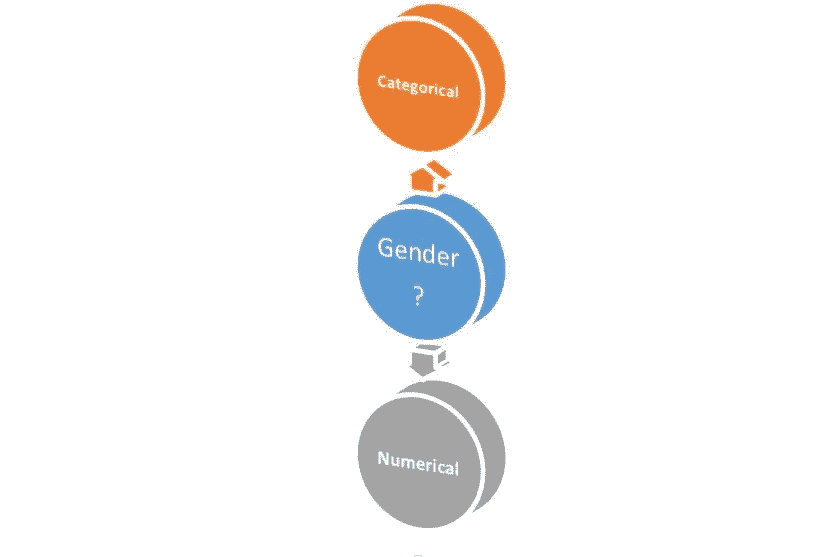
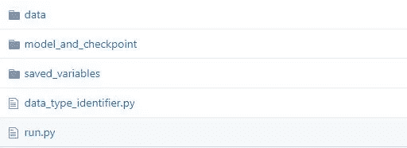
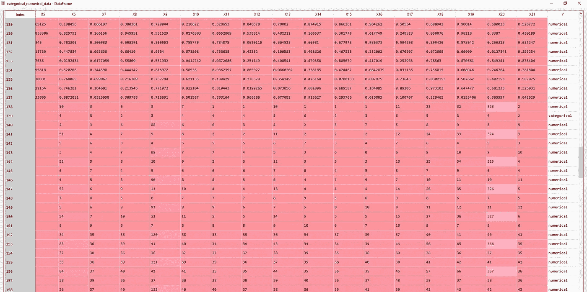
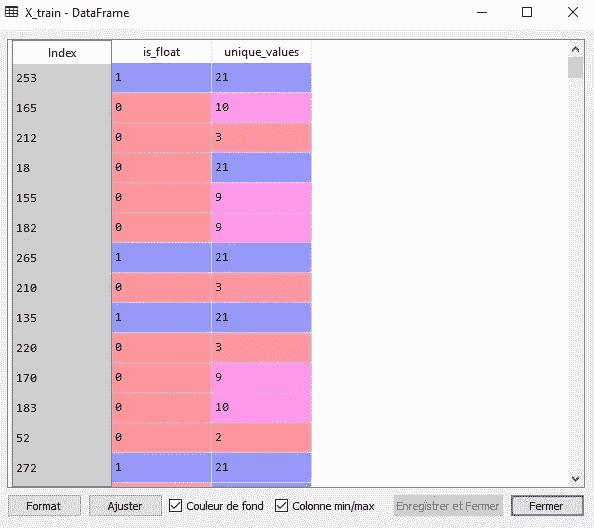
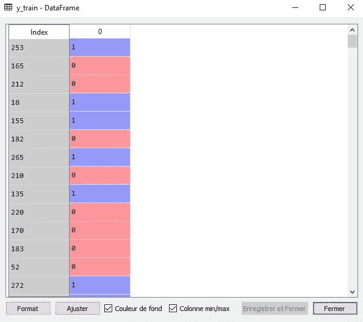

# 使用逻辑回归检测特征是数值型还是分类型

> 原文：<https://medium.com/analytics-vidhya/using-a-logistic-regression-to-detect-if-a-feature-is-numerical-or-categorical-825eaf49f1a2?source=collection_archive---------8----------------------->

你读了标题，你可能想知道为什么有人想要自动检测一个给定的特征是数字的还是分类的。这对于更大的任务来说会很方便，因为这只是处理数据集中缺失值的一个步骤(对于一般的机器学习问题)。最终目标是通过考虑每一个变量类型，能够用集合方法(例如随机森林)替换每一个空单元格。但首先，让我们关注如何才能真正实现这个目标。

我们可以用什么特征来区分数字变量和分类变量？

在接下来的章节中，我们将讨论和剖析用 ***Python*** 编写的每一段代码。完整代码可在 [**这里**](https://github.com/YA26/Data_type_identifier) 。

# **分类变量与数值变量**

分类变量可以有多个类别或模态(有或没有顺序),而数值变量测量群体中每个个体的数量。

***分类变量的例子:***

*   **饿**:是，不是，是，是，不是
*   性别:1，0，1，1，0，1
*   疼痛 : 1，5，2，7，1，10

***数值变量的例子:***

*   年龄:15 岁、30 岁、26 岁、74 岁、25 岁、12 岁
*   **工资($)** : 5000，1000，3000，25000，1500，7500

# 唯一值、浮点数和顺序性

分类变量的唯一值往往比数值变量少。与我们在数字中观察到的相比，它也不呈现浮点数。

如果满足以下条件，我们将认为某个特征是绝对的:

*   它有很少的唯一值(但不仅仅是)
*   它包含一个字符或字符串
*   它包含整数(但不仅仅是)

如果满足以下条件，我们将认为特征是数字的:

*   它有大量独特的价值
*   它包含浮点数
*   它包含整数(但不仅仅是)

当分类变量由整数组成时，唯一值自然是连续的。数字变量将包含非顺序模态。

# 存储库的架构

贮藏室ˌ仓库

我们有两个主要模块:

*   在***data _ type _ identifier . py***中，我们编写了一个类，用于预处理数据，建立我们的模型和我们的预测方法。
*   在 ***run.py*** 中我们实例化我们的类并执行一切。

在每一步，我们都将展示在类 ***数据类型标识符*** 中写了什么，以及它在 run.py 中的执行情况

# 数据预处理

下面的数据集完全是针对这种情况制作的。让我们来看看。

数据片段

每一条线或观测值都是一个样本大小为 21 的特征。 ***Y*** 是我们的目标变量，只包含两种模态(数字模态和分类模态)。我们希望对每个观察值的所有唯一值进行计数，并且我们还希望知道它们是否包含浮点数。让我们转换数据集。

当我们试图导入一个包含缺失值的整数列时，Pandas 会自动将其转换成一个数据类型为 *object* 的列。有时它甚至能把一切都变成浮点数。为了避免必须手动设置每个列的数据类型，我编写了一个名为***keep _ initial _ data _ types****的方法。我使用了一种特殊的 pandas 数据类型(Int64Dtype)来保持数据集的原始性。*

我们实例化我们的类，导入数据，将特征从目标变量中分离出来。在使用前面的方法之前，我们需要转置数据集，因为如果每个要素都是列格式的，那么分析它们会更容易。

现在是构建训练集的时候了。我们检查每个单独的特征(列)是否包含浮点数，并计算所有唯一值。最后，我们不要忘记对目标变量进行编码。

在 run.py 中，我们还获得了目标变量的 training_set 和映射。当后者被编码时，“0”代表分类，而“1”代表数字。最后，我们对特征(X_train)和目标变量(y_train)进行混洗，以在训练过程中增加一些随机性。

以下是我们的决赛:

# 训练:乙状结肠神经元

我使用 Tensorflow 2.0(带有 Keras API)构建了一个 sigmoid 神经元(也可以使用 Scikit-Learn)。在 Scikit-Learn 中，我们使用最大似然法来寻找模型的最佳权重(包括偏差)。这里，我们选择使用 Keras 来最小化二元交叉熵代价函数，以便优化权重。进行交叉验证是为了避免过度拟合。使用 Adam 实现梯度下降(AdaGrad 和 RmsProp 的最佳方案)。如果你想了解更多优化技术，这是一篇很好的文章。

我能够在训练集上获得 88.62%的准确率。这并没有太大的意义，因为它衡量的是模型在已经看到的数据上的表现。获得了 96.43%的验证准确性:这是一个好迹象，因为该分数是在验证集上计算的。让我们看看在随机测试集上能得到什么。

# 测试

由于在这次经历之前我没有任何数据，我不得不通过使用在互联网上找到的随机特征来建立一个测试集。这个模型正确地预测了每一个。这并不奇怪，因为它只在 10 个不同的特性上进行了测试。

已经创建了一个分类报告，可以在 Github 存储库中找到

# 结论

检测一个给定的特征是分类的还是数值的可以用两个变量来完成。一个计算所有唯一值(unique_values)，另一个发现任何浮点数的存在(is_float)。然而，可以肯定的是，可能有其他的预测，可以提高这个模型的质量。同样，更大的测试集肯定会受到欢迎，因为错误预测的可能性会增加。但就目前而言，该模型将有助于自动填充数据集中缺失的值。请随时添加任何贡献给这个项目。