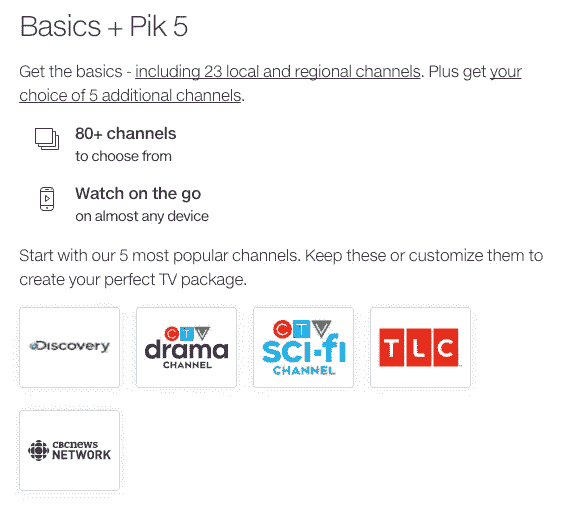
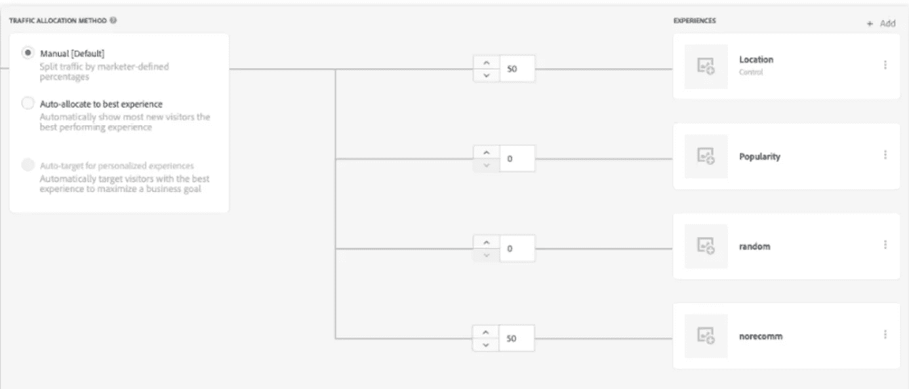

# 使用 Adobe Target 确定最佳机器学习模型

> 原文：<https://medium.com/analytics-vidhya/using-adobe-target-to-decide-the-best-machine-learning-model-e0f44edf94d4?source=collection_archive---------17----------------------->

在 Telus Digital，我们求助于机器学习模型来帮助我们推荐产品，预测用户行为，并确定为用户提供个性化体验的机会。像大多数公司一样，我们正在大力投资机器学习和人工智能，以帮助我们推动业务目标。

随着我们的数据科学实践接近成熟，我们需要一种方法来相互验证我们的模型的性能，实现这一点的一种方法是运行 A/B 测试。

# 机会

我们在个性化和 A/B 测试方面取得了极大的成功，这主要归功于我们能够[与 Adobe 目标服务器端](/@gonzalovazquez/how-telus-digital-personalizes-with-adobe-target-under-200ms-90d4189024d0)集成。自从我们的个性化 API 开发以来，我们的个性化和 A/B 测试实践飞速发展。我们可以在不到 200 毫秒的时间内向客户提供完全个性化的内容。

过去，我们只使用 Adobe Target 来测试内容，因为个性化 API 与 Contentful(我们的 CMS 工具)集成在一起。然而，一个有趣的机会出现在我的团队面前，是否有可能 A/B 测试不同的模型而不是内容？

# 推荐引擎

Telus Digital 的数据科学团队构建了一个推荐引擎，向我们的客户推荐不同的电视频道。

Pik 电视

推荐引擎有三种不同的模式来推荐最佳频道:

*   基于位置:基于一个用户的位置，它推荐其他用户在他们周围观看了什么。
*   基于随机:随机向用户推荐频道
*   热门:向用户推荐最受欢迎的频道

当团队将推荐引擎部署到产品中时，他们需要一种方法来测试三个模型中哪一个表现最好。这时，我们有了灵感。我们将利用 Adobe Target 和个性化 API 来运行不同模型的 A/B 测试。

# 解决方案

当我们开始头脑风暴架构看起来会是什么样子时，我们开始概述两个指导原则。

1)我们的解决方案倾向于去耦架构；允许每个系统知道彼此最少的信息。

2)我们的解决方案必须是可重用的，允许其他服务使用它。

第一步是编写我们的 A/B 测试假设:

> 如果客户看到一个推荐的频道，那么他们会将其添加到购物车中，因为有合适的推荐，我们会确认推荐引擎的推荐是否正确。

陈述我们的转化目标(将渠道添加到购物车)，让我们有一个可衡量的标准来测试。

一旦我们设定了假设和转换目标，我们就在 Adobe Target 中创建了一个包含四种体验的活动，每一种体验都对应于不同的模型，外加一种没有推荐的体验(这将作为我们的控制)。在每次体验中，我们不是存储内容来展示给用户，而是存储一个类似于 *{"model": "random"}* 的 JSON 有效负载。

多种体验的推荐活动

最后，事件的顺序如下:

1)客户端应用从推荐引擎 API 请求预测。

2)推荐引擎 API 调用 Adobe Target 传递 MCID cookie。

3) Adobe Target 评估 cookie，并将四个选项之一与其 cookie 一起返回给推荐引擎 API。

4)推荐引擎 API 查看请求，并基于它接收的有效载荷选择要使用的适当模型。

5)推荐引擎 API 将预测连同 cookies 一起返回给客户端应用。

6)客户端应用程序将这些 cookies 写入浏览器，使 Adobe Analytics 能够看到正在向客户展示目标体验。

高层建筑

该解决方案允许我们的系统在相互解耦的同时相互交互。同样，我们能够在测试期间调整每个模型接收的流量。

调整每个模型接收的流量

测试期结束后，我们在 Adobe Analytics 中分析了结果，我们发现流行度模型在所有其他模型中表现最好。该集成非常成功，我们计划将其用于未来的用例。