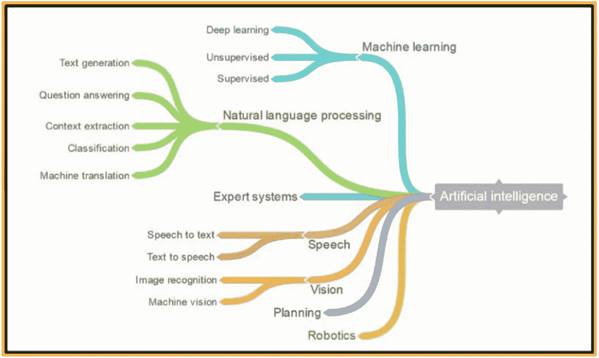
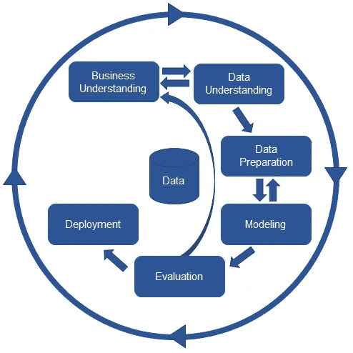
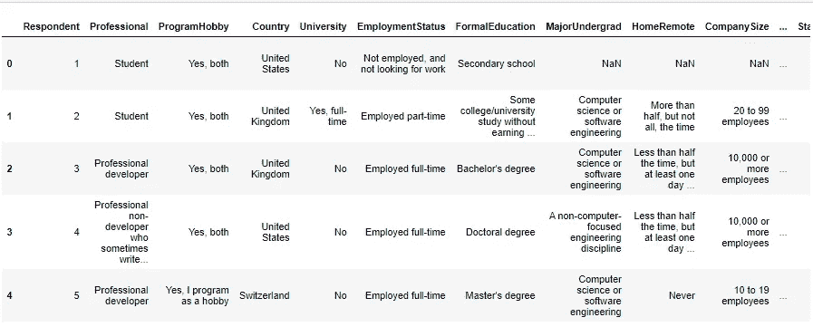
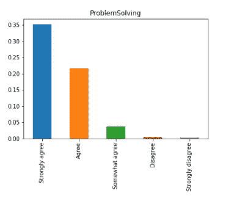
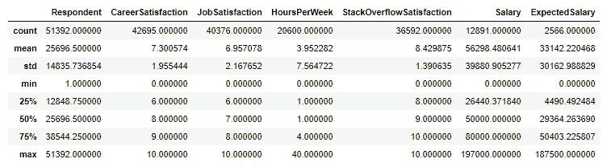
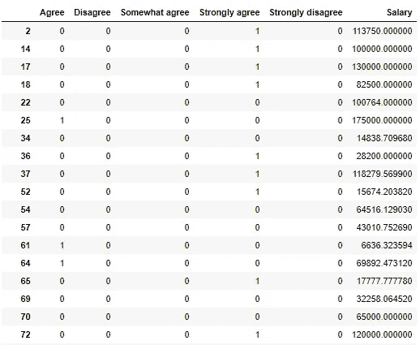

# 基于程序员解决问题的态度用人工智能/人工智能预测他们的工资

> 原文：<https://medium.com/analytics-vidhya/using-ai-ml-to-predict-programmers-salaries-based-on-their-attitudes-towards-problem-solving-acf3adb4f065?source=collection_archive---------9----------------------->

解决问题是软件开发人员/程序员需要的一项关键技能。在这篇博客中，我们使用 CRISP-DM 过程，根据软件开发人员对解决问题的态度，为他们的工资建立了一个预测模型。

CRISP-DM 是数据科学的跨行业流程。它有以下六个步骤:(1)业务理解，(2)数据理解，(3)数据准备，(4)数据建模，(5)结果评估，(6)模型部署。我们遵循这个过程是为了建立一个模型，这个模型可以根据软件开发人员对解决问题的热爱来预测他们的工资。图 1 描述了 CRISP-DM。

图 1: CRISP-DM

这个博客的三个商业问题是:( 1)百分之多少的开发人员喜欢解决问题？(2)一个开发者的平均工资是多少？(3)能否基于软件开发人员对解决问题的热爱来预测薪资？

我们利用了其 2019 年年度调查中的堆栈溢出数据集。Stack Overflow 是一个知识共享平台，为专业和爱好者程序员提供问答网站。每年，Stack Overflow 都会对网站上的人进行一次大规模调查，涵盖各种信息，如编程语言、工资、代码风格和其他各种信息。2019 年，他们收集了来自 213 个国家的 64，000 多份回复。

我们使用 Python 来构建我们的 AI/ML 模型以及以下库:numpy、pandas、math、matplotlib 和 sklearn。在快速查看数据后，我们意识到数据集有 154 列和 51，392 行，这使得人眼无法从数据中获得任何洞察力。图 2 显示了填充到 Jupyter 笔记本中的数据集的快照。经过快速分析后，我们确定调查中有一个问题旨在通过五点李克特量表从开发人员那里收集解决问题的数据。开发人员被要求对以下陈述“我喜欢解决问题”进行评级，从“强烈不同意”到“强烈同意”。我们还注意到一个显示开发人员工资的问题。

图 2:数据理解—数据框快照

我们利用 matplotlib 通过创建一个图表来更好地理解数据，该图表展示了程序员对图 3 中显示的问题解决问题的答案。我们还使用了一个描述性图表来更好地理解数据的描述性统计，如图 4 所示。

图 3:对“我喜欢解决问题”的回答

图 4:描述性统计

为了建立 AI/ML 模型，根据程序员对解决问题的态度来预测他们的工资，我们通过清理、删除缺失值以及将分类变量更改为数字来准备数据，以便机器更好地理解和模拟数据。最终的干净数据框由 6 列和 12，891 行组成，用于模型，最终数据框如图 5 所示。

图 5:清理后的数据帧

我们使用 Python 中的线性回归构建了我们的模型。自变量是对解决问题的态度，因变量是工资。

每个研究问题的结果如下:

(1)根据条形图，35%的程序员强烈热爱解决问题，20%热爱解决问题，总计 55%。

(2)根据描述性统计表，程序员的平均工资为 56，296 美元。

(3)基于 AI/ML 模型，对强烈热爱解决问题的程序员的预测为 59，366 美元，对不热爱解决问题的程序员的预测为 42，687 美元。

我们没有部署该模型，因为这只是利用数据科学构建基本 AL/ML 模型的一个小例子。这篇博文旨在交流数据科学的成果和奇妙之处，只需几行代码，我们就能通过几个步骤分析庞大的数据集。

下面的 Github 链接为感兴趣的技术读者提供了 Jupyter 笔记本中的项目代码:[https://github.com/dralibaker/Stack-Overflow.git](https://github.com/dralibaker/Stack-Overflow.git)