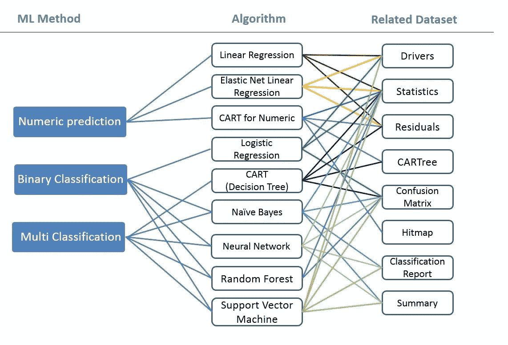

# 用人工智能/最大似然法预测股票的价格表现

> 原文：<https://medium.com/analytics-vidhya/using-ai-ml-to-predict-stocks-price-performance-1b752f1a34ba?source=collection_archive---------5----------------------->

这个数据科学项目的重点是建立一个 AI/ML 模型，根据从标准普尔 500 公司名单中推断的财务数据来预测股票 52 周的价格表现。对数据进行探索、可视化和处理。然后实现并改进支持向量回归(SVR)。最后，结果和结论放在一起。