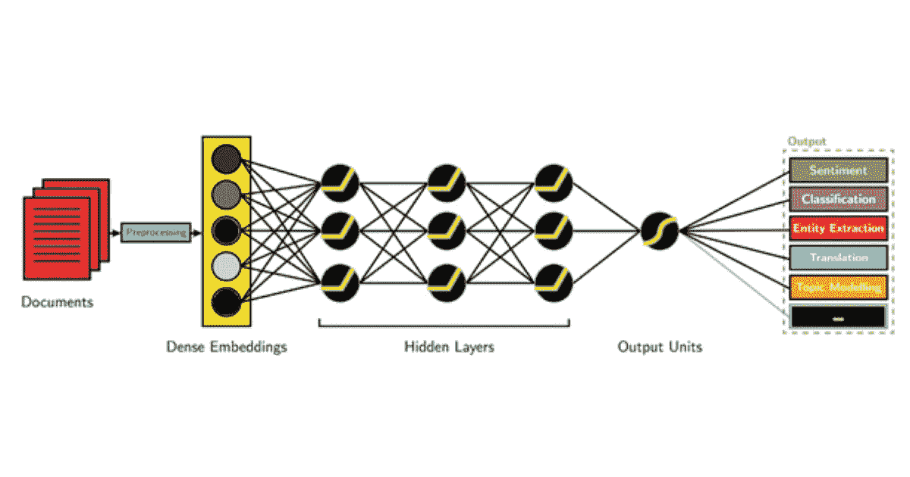
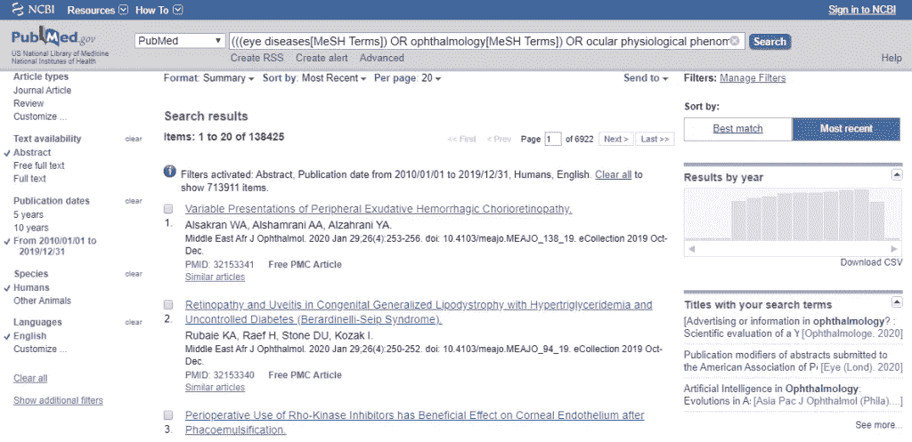
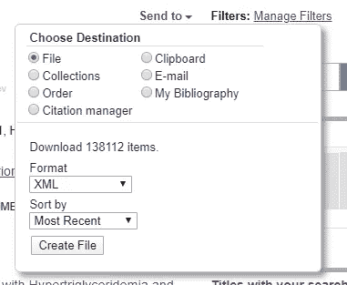
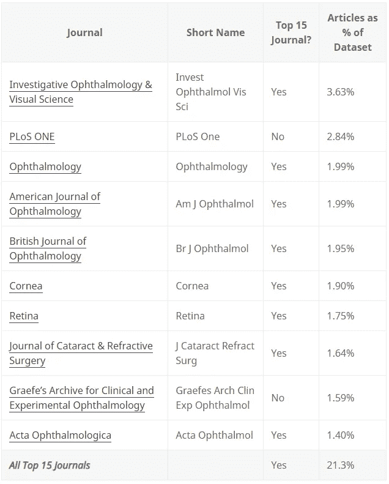
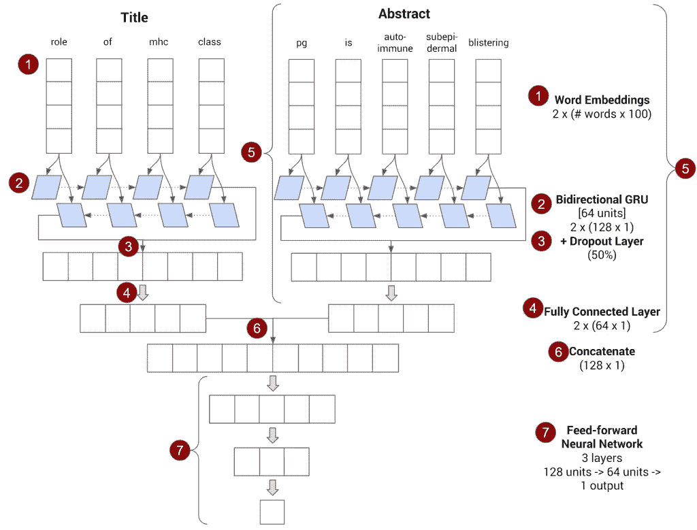
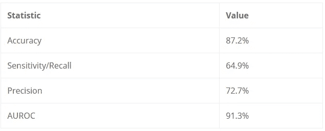
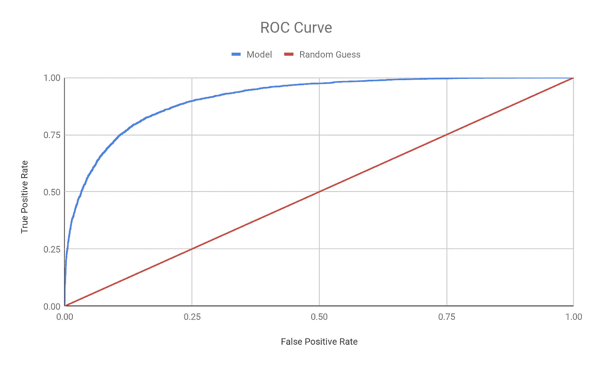

# 用人工智能预测一篇论文是否会出现在顶级期刊上

> 原文：<https://medium.com/analytics-vidhya/using-ai-to-predict-if-a-paper-will-be-in-a-top-tier-journal-27c7edccf32e?source=collection_archive---------30----------------------->

(图片来源:[英特尔](https://software.intel.com/en-us/articles/deep-learning-for-natural-language-processing))

最近几个月，我一直在与斯坦福大学的[王思佳](https://profiles.stanford.edu/sophiaywang)博士合作，应用[深度学习/人工智能](https://en.wikipedia.org/wiki/Deep_learning)技术，利用医生在电子病历(EMR)中写的笔记进行预测。虽然这些方法背后的数学可能非常复杂，但像 [Tensorflow](https://www.tensorflow.org/) 和 [Keras](https://keras.io/) 这样的工具使得没有经过正式培训的人能够更广泛地应用它们。我想分享一些我学到的东西，以帮助那些想开始类似工作但在开始时有困难的人。

对于本教程([Github](https://github.com/BenjaminTseng/ophthalmology-pubmed-predict/)上可用的所有代码)，我们将编写一个简单的算法来预测一篇论文，仅基于其摘要和标题，是否是发表在[眼科领域前 15 名期刊之一的论文](https://scholar.google.com/citations?view_op=top_venues&hl=en&vq=med_ophthalmologyoptometry)(根据 2014-2018 年的 [h-index](https://en.wikipedia.org/wiki/H-index) 进行衡量)。它将在一个数据集上进行训练和测试，该数据集包括 2010 年至 2019 年发表的所有英文眼科相关文章，以及 Pubmed (由 NIH 运营的免费搜索引擎，几乎涵盖所有生命科学相关论文)中的摘要。它还将包含我在多个项目中使用过的一些功能，但这些功能似乎是在线良好教程中所缺乏的，例如使用带有`tf.keras`和`tf.data`的多个输入模型，在多个输入序列上使用相同的嵌入层，以及使用带有`tf.data`的填充批处理来合并序列数据。这篇文章还假设您了解 Python 3(和 Numpy)的基础知识，并且已经安装了 [Tensorflow 2](https://www.tensorflow.org/install) (有 GPU 支持)、BeautifulSoup、lxml 和 Tensorflow 数据集。

# 从 Pubmed 获取数据

要训练这样的算法，我们需要大量的数据。令人欣慰的是，Pubmed 使得建立一个相当完整的生命科学相关语言内容的数据集变得很容易。使用国家医学图书馆的 MeSH 浏览器，它维护了一个显示不同生命科学主题如何相关的“知识树”，我找到了涵盖眼科文献的四个网格术语:“[眼病](https://meshb-prev.nlm.nih.gov/record/ui?ui=D005128)”、“[眼科](https://meshb-prev.nlm.nih.gov/record/ui?ui=D009885)”、“[眼部生理现象](https://meshb-prev.nlm.nih.gov/record/ui?ui=D009799)”和“[眼科手术过程](https://meshb-prev.nlm.nih.gov/record/ui?ui=D013508)”。这些可以输入到 Pubmed 高级搜索界面，左侧的搜索过滤器可以用于缩小相关标准(英语，人类物种，2010 年 1 月至 2019 年 12 月出版，有摘要文本，以及期刊文章或综述论文):

我们可以使用右上方的“发送到”按钮下载 138，425 个摘要(以及相关的元数据)作为一个巨大的 XML 文件(见下面的截图)。生成的文件大约有 1.9 GB(所以请给它一些时间)

一个 1.9 GB 的 XML 文件很难处理，不适合在模型中使用，所以我们应该首先预处理数据，以创建较小的文本文件，这些文件只包含训练和测试模型所需的信息。下面的 Python 脚本逐个读取 XML 文件的每一行，每次看到新条目的开头时，它都会使用 [BeautifulSoup](https://www.crummy.com/software/BeautifulSoup/bs4/doc/) (以及它所依赖的 [lxml 解析器](https://lxml.de/index.html))解析前一个条目，并提取摘要、标题和日志名称，以及为模型构建一个单词(词汇)列表。

[Pubmed](https://www.nlm.nih.gov/bsd/licensee/elements_descriptions.html)使用的 XML 格式比较基础(文章元数据包装在`<PubmedArticle>`标签中，标题包装在`<ArticleTitle>`标签中，期刊名缩写在`<MedlineTA>`标签中等等。).然而，摘要并不总是以完全相同的方式存储(有时在`<Abstract>`标签中，有时在`<OtherAbstract>`标签中，有时在多个`<AbstractText>`标签之间划分)，所以大部分代码被设计成处理那些不同的情况:

在解析 XML 之后，语料库中出现至少 25 次(`smallestfreq`)的每个单词都被存储在词汇表中(稍后将使用该词汇表将单词转换为机器学习算法可以使用的数字)，并且存储的摘要、标题和期刊名称在被写入(每行一个)不同的文本文件之前被混洗。

查看生成的文件，很明显，谷歌学术确定为眼科前 15 名的期刊是数据集中多产的期刊(占条目最多的 10 种期刊中的 8 种)。特别值得注意的是，数据集中约 21%的文章发表在排名前 15 的期刊中:

Pubmed 查询中 10 个最多产的期刊和来自[前 15 名(按 H-index)眼科期刊的文章总数百分比](https://scholar.google.com/citations?view_op=top_venues&hl=en&vq=med_ophthalmologyoptometry)

# 使用 Tensorflow 和 Keras 建立模型

将一个简单的深度学习想法翻译成代码可能是一场噩梦，需要完成所有的矩阵运算。幸运的是，AI 社区已经开发了像 [Tensorflow](https://www.tensorflow.org/) 和 [Keras](https://keras.io/) 这样的工具来使这变得更加容易(现在加倍如此，因为 [Tensorflow 已经选择在`tf.keras`中采用 Keras 作为其主要 API](https://www.tensorflow.org/guide/keras/overview) )。现在，没有经过正式培训的程序员(更不用说什么是矩阵运算或它如何工作的知识了)可以将深度学习方法应用于一系列问题。虽然文档的质量并不总是很好，但丰富的在线课程和教程(我个人推荐 [DeepLearning.ai 的 Coursera specialization](https://www.deeplearning.ai/deep-learning-specialization/) )让愿意“动手”的自学者可以接触到这些方法。

因此，虽然我们可以关注我们将使用的模型架构如何工作的所有数学细节，但事实是没有必要的。我们需要关注的是模型的主要组件是什么以及它们的作用:

1.  该模型使用 [Keras 嵌入层](https://keras.io/layers/embeddings/)将*标题*中的单词转换成称为[单词嵌入](https://en.wikipedia.org/wiki/Word_embedding)的数字向量。这提供了数学模型可以理解的数字输入。
2.  然后，基于[门控递归单元](https://en.wikipedia.org/wiki/Gated_recurrent_unit)(通过使用[Keras 双向层包装器](https://keras.io/layers/wrappers/)和[Keras GRU 层](https://keras.io/layers/recurrent/)的组合来实现)，将表示摘要的单词嵌入序列馈送到[双向递归神经网络](https://en.wikipedia.org/wiki/Bidirectional_recurrent_neural_networks)。这是一个深度学习架构，众所周知，它擅长理解事物的序列，这在语言任务中是有价值的(其中你需要区分“狗坐在椅子上”和“椅子坐在狗上”，即使它们使用相同的单词)。
3.  双向 GRU 层输出一个数字向量(实际上是两个连接在一起的数字，但这是在幕后完成的)，然后通过一个[丢弃层](https://keras.io/layers/core/)进行馈送，以帮助减少[过拟合](https://en.wikipedia.org/wiki/Overfitting)(算法学习“记忆”它看到的数据，而不是关系)。
4.  然后，步骤 3 的结果通过单层[前馈神经网络](https://en.wikipedia.org/wiki/Feedforward_neural_network)(使用[Keras 密集层](https://keras.io/layers/core/))反馈，产生另一个向量，该向量可以被认为是“算法对标题的理解”
5.  对*摘要*中的单词重复步骤 1–4(使用与步骤 1 相同的嵌入层)
6.  将摘要(步骤 4)和标题(步骤 5)的输出结合起来，将两个向量粘在一起，形成一个更大的向量，然后通过一个 2 层前馈神经网络运行这种结合(该网络将“结合”算法对摘要和标题的“理解”)，并插入一个脱落层(以防止过度拟合)。
7.  最后一层应该使用 [sigmoid 激活](https://en.wikipedia.org/wiki/Sigmoid_function)输出一个数字，因为模型正在尝试学习预测二进制结果(这篇论文是否在顶级期刊上[1]或[0])

上面的描述跳过了许多数学细节(例如，GRU 如何工作，下降如何防止过拟合，前馈神经网络中的数学情况)，其他教程和论文以更长的篇幅涵盖了这些细节。它还略述了一些关键的实现细节(什么大小的字嵌入，我们应该在前向神经网络中使用什么样的激活函数，什么样的随机变量初始化，要实现什么样的丢失量)。

但是有了像`tf.keras`这样的高级框架，这些细节就变成了配置变量，你要么接受建议的缺省值(就像我们对随机变量初始化和偏差使用所做的那样)，要么试验值/遵循惯例来找到工作良好的东西(就像我们对嵌入维度、丢失量和激活函数所做的那样)。概述模型的代码相对简单(如果去掉注释和多余的空格，只有 22 行)就说明了这一点:

# 使用`tf.data`构建数据管道

现在我们有了一个模型，如何将之前从 Pubmed 解析的数据输入其中呢？为了处理人工智能研究人员在处理数据时经常遇到的一些复杂问题，Tensorflow 发布了`tf.data`、[一个用于构建数据管道的框架](https://www.tensorflow.org/guide/data)，以处理太大而不适合内存和/或需要进行大量预处理工作的数据集。

我们首先创建两个函数

1.  `encode_journal`它将期刊名称作为输入，如果是顶级眼科期刊，则返回 1，如果不是，则返回 0(通过与正确的期刊名称列表进行简单比较)
2.  `encode_text`它将给定期刊文章的标题和摘要作为输入，并将它们转换成算法可以处理的数字列表。它通过使用[tensor flow 数据集库](https://www.tensorflow.org/datasets/api_docs/python/tfds/features/text/TokenTextEncoder)提供的`TokenTextEncoder`函数来实现这一点，该函数将我们最初解析 Pubmed XML 时创建的词汇表作为输入

这些方法将在我们的数据管道中使用，以将输入转换成模型可用的东西(顺便说一句:这就是为什么您会在`encode_text`中看到`.numpy()`——它用于将`tf.data`将传递给它们的张量对象转换成模型可用的东西)

由于 Tensorflow 的运行方式，`encode_text`和`encode_journal`需要包装在`tf.py_function`调用中(这允许您在 Tensorflow 图上运行“普通”Python 代码)，这就是`encode_text_map_fn`和`encode_journal_map_fn`(参见下面的代码片段)的用武之地。

最后，为了完善数据管道，我们:

1.  使用`tf.data.TextLineDataset`摄取解析后的标题、摘要和期刊名称所在的文本文件
2.  使用`tf.data.Dataset.zip`方法将标题和抽象数据集合并成一个输入数据集(`input_dataset`)。
3.  使用`input_dataset`的`map`方法来应用`encode_text_map_fn`，以便模型将输入作为数字列表使用
4.  获取日志名称数据集(`journal_dataset`)并应用其`map`方法来应用`encode_journal_map_fn`，以便模型根据日志是否是前 15 名之一来使用输入 1 或 0
5.  使用`tf.data.Dataset.zip`方法将输入(`input_dataset`)和输出(`journal_dataset`)合并到我们的模型可以使用的单个数据集中

为了帮助模型一般化，将数据分成四组是一个很好的做法，以避免对已经看到的数据进行算法训练或评估(即，为什么一个好老师会进行与作业相关但不相同的测试)，主要是:

1.  **训练集**是我们的算法将学习的数据(因此，应该是四个中最大的)。
2.  (我还没有看到一个一致的名称，但我创建了一个 **stoptrain set** ,用于在每个时期(训练集的完整运行)后检查训练过程，以便在结果模型开始过度拟合训练集时停止训练。
3.  **验证集**是我们用来比较不同模型架构和配置在完成培训后表现如何的数据。
4.  **保持集或测试集**是我们将用来衡量我们的最终算法如何执行的。它被称为保留集，因为它直到最后才被使用，以使它成为真正公平的基准。

`tf.data`使这一步变得非常简单(使用`skip` —跳过输入条目——和`take`,顾名思义，获取给定数量的条目)。最后，`tf.data`还提供类似于`padded_batch`的批处理方法，以在算法将连续训练的 100 篇文章的批次之间标准化输入的长度(由于不同的摘要和标题将具有不同的长度，我们将截断或填充每个标题分别为 72 个单词和 200 个单词长):

# 训练和测试模型

现在我们已经有了模型和数据管道，培训和评估实际上相对简单，包括指定要跟踪的指标以及培训应该如何进行的细节:

*   因为目标是衡量模型有多好，所以在算法训练时，我要求模型报告四个方面的情况:`metrics` ( [敏感度/召回率](https://en.wikipedia.org/wiki/Sensitivity_and_specificity)[你正确获得前 15 名期刊文章的比例】、精确度【你预测的前 15 名期刊文章的比例实际上是正确的】、准确度【模型获得正确答案的频率】和 [AUROC](https://en.wikipedia.org/wiki/Receiver_operating_characteristic#Area_under_the_curve) (衡量你的模型在敏感度和精确度之间权衡的程度)
*   训练将使用应用于[二元交叉熵](https://en.wikipedia.org/wiki/Cross_entropy)损失函数的 [Adam 优化器](https://arxiv.org/abs/1412.6980)(一种流行、高效的训练方法)(这在算法进行是/否二元预测时是有意义的)。
*   一旦 stoptrain 组显示出过度拟合的迹象，该模型也被设置为停止训练(使用`callbacks`中的`tf.keras.callbacks.EarlyStopping`)
*   训练集(`train_dataset`)、最大历元数(通过训练集的完整迭代)和停止训练集(`stoptrain_dataset`)被传递到`model.fit`以开始训练
*   训练后，可以使用`model.evaluate`在验证集(`validation_dataset`)上评估模型:

在对模型架构和参数进行多次迭代以找到一个好的工作模型之后，最终可以在维持集(`test_dataset`)上对模型进行评估，以查看它将如何执行:`model.evaluate(test_dataset)`

# 结果

您的结果将根据数据的确切顺序、算法开始训练时使用的初始随机变量以及许多其他因素而有所不同，但当我运行它时，训练通常在 2-3 个时期内完成，性能类似于下表:

评估该模型的另一种方法是显示其 [ROC(接收器工作特性)曲线](https://en.wikipedia.org/wiki/Receiver_operating_characteristic)，AUROC(ROC 曲线下面积)数的基础，以及该模型在真阳性(y 轴上)和假阳性(x 轴上)与纯粹随机猜测(蓝色对红色)之间进行权衡的可视化表示。在 91% AUROC(最大值:100%，最小值:50%)时，该模型优于许多常见的风险分值，更不用说随机猜测了:

有趣的是，尽管该模型的性能很强(AUROC 和 point 对灵敏度、精确度和准确度的估计)，但当我分享一组得分很高和得分很低的摘要和标题时，我或我调查的一小部分人类科学家样本并不立即清楚该算法在寻找什么。这是许多人工智能方法的怪癖和缺点之一——它们的“黑箱”性质——后续分析可能会揭示更多。

*特别感谢王思佳* *和安东尼·潘* *审阅摘要和阅读早期版本！*

(本文原载[此处](https://benjamintseng.com/portfolio/nlp-pubmed-data-using-tensorflow-and-keras/))

[链接到包含所有代码的 GitHub 页面](https://github.com/BenjaminTseng/ophthalmology-pubmed-predict/)