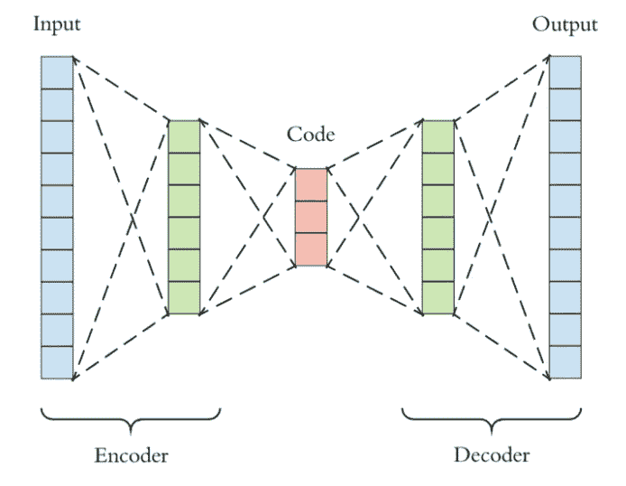
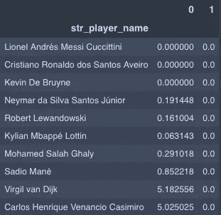
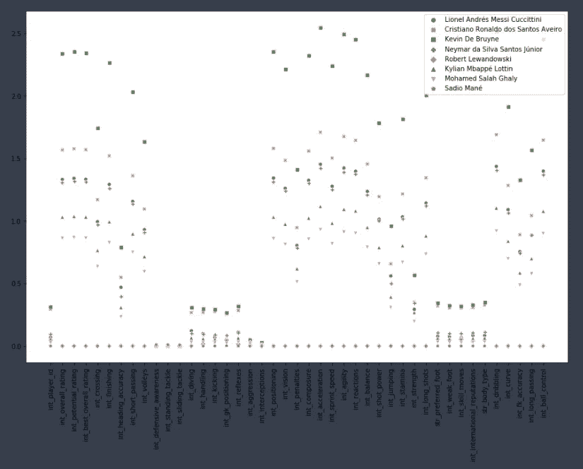

# 使用自动编码器找到足球的最好成绩

> 原文：<https://medium.com/analytics-vidhya/using-autoencoders-to-find-soccers-bests-bcd2f1166302?source=collection_archive---------19----------------------->


米奇·罗森在 [Unsplash](https://unsplash.com?utm_source=medium&utm_medium=referral) 上的照片

在我自学的时候，我在学习神经网络的时候遇到了自动编码器。自动编码器是一种神经网络，它接受输入，通过隐藏层将其压缩到更少的维度，然后将维度扩展回原始形状。这背后的理论是，当数据被压缩到更少的维度，然后再次扩展时，数据中隐藏的关系可以被提取出来。自动编码是一种类似于 PCA 的无监督或半监督学习技术，并且具有许多类似的应用，即数据降噪和图像处理。然而今天，我将探索自动编码的另一个应用——看看我是否能找到 2021 年的最佳足球运动员。

# ***策略***

因为自动编码可以帮助发现我们数据中的潜在关系，我试图使用 EA Sports 2021 FIFA 数据集的球员评级(不包括守门员)来比较世界上前 10 名足球运动员。球员的评级包括传中、射门、头球准确性、短传、防守意识、滑铲、处理、踢腿、反射、惯用脚、攻击性、加速度、沉着、冲刺速度、敏捷性等——基本上是一个详尽的属性列表。自动编码将通过减少数据集中的特征数量，发现数据中的潜在关系，这将允许我们根据相似性对世界上前十名球员进行分组。

但首先，根据 EA Sports FIFA 21，以下是世界十大足球运动员，不包括守门员:

```
Top 10 FIFA Players1\. Lionel Messi
2\. Cristiano Ronaldo
3\. Kevin DeBruyne
4\. Neymar Jr.
5\. Robert Lewandowski
6\. Kylian Mbappe
7\. Mohamed Salah
8\. Sadio Mane
9\. Virgil van Dijk
10\. Carlos Casemiro
```

# ***自动编码机制***



整个神经网络是由编码器和解码器组成的自动编码器。您可以看到，编码器是解码器的镜像，由一个中间层隔开。在我们的数据集中，43 个特征被输入到我们的神经网络中，中心层被压缩到 2 个节点，然后特征在解码器中以与它们被缩减回 43 个特征相同的方式被扩展。出于我们的目的，我们使用编码阶段来找出数据中的潜在关系，看看我们能从 FIFA 前十名中发现什么。然而，我们首先训练整个神经网络以确保没有信息丢失，然后我们查看来自编码器的数据。*注意:在训练我的模型之前，我使用标准缩放器缩放了我的数据*

这是我为辨别我的数据而建立的实际神经网络:

```
encoder = Sequential()
encoder.add(Dense(units=22, activation='relu', input_shape=[43]))
encoder.add(Dense(units=11, activation='relu', input_shape=[22]))
encoder.add(Dense(units=5, activation='relu', input_shape=[11]))
encoder.add(Dense(units=2, activation='relu', input_shape=[5]))decoder = Sequential()
decoder.add(Dense(units=5, activation='relu', input_shape=[2]))
decoder.add(Dense(units=11,activation='relu',input_shape=[5]))
decoder.add(Dense(units=22,activation='relu',input_shape=[11]))
decoder.add(Dense(units=43,activation='relu',input_shape=[22]))autoencoder = Sequential([encoder,decoder])
autoencoder.compile(loss="mse", optimizer=SGD(lr=.1))
```

这是我训练的第一个神经网络。然后我使用了一个不同的网络，在最后的编码层我把它改成了

```
encoder.add(Dense(units=10, activation='relu', input_shape=[5]))
```

这将因此改变我的解码器的输入层

```
decoder.add(Dense(units=5, activation='relu', input_shape=[10]))
```

我现在可以有两组数据来解释，这将有助于我们解释更多关于我们的球员。

# 解读我们的 FIFA 2021 数据

在训练我们的神经网络之后，我们可以研究编码器，并使用预测方法来研究我们的数据

```
encoded_dim = encoder.predict(scaled_df)
results = pd.DataFrame(data=encoded_dim, index=df2.index)
results
```



这些结果使我们能够将球员分组，因为他们之间有一些潜在的相似性:A 组:莱昂内尔·梅西，克里斯蒂亚诺·罗纳尔多，凯文·德布劳内，甚至姆巴佩，B 组:小内马尔，罗伯特·莱万多夫斯基，C 组:维吉尔·范迪克和卡洛斯·卡西米罗。

我用我的第二个神经网络进行了更深入的分析，揭示了我们足球运动员的其他一些情况。



从这张图表来看，莱万多夫斯基和德布鲁因是最不相似的球员，而莱万多夫斯基和马内是最相似的。内马尔和梅西非常相似。但它也表示，德布鲁因是一名非常独特的球员，因为它与其他球员有所不同。也许他是中场，而其他人是前锋。而德布鲁因在假摔、处理、踢腿、反射、名声、体型等技能上与 c 罗最为相似。除了技术动作、球门保持定位、偏好脚和弱脚之外，所有球员在这些提到的类别中都有聚类。Mbappe 与 Salah 最为相似。这张图表还显示，c 罗是梅西和德布鲁因的混合体，但更像梅西。

这是只看 FIFA 21 视频游戏评分的一种替代方法，因为这些评分有一个附加的旋转或“维度”。这不仅仅是一个评级，而是一个评级漫画或更全面的足球运动员的评级。当然，到最后，这些异同都是有待商榷的。辩论运动和观看运动本身一样有趣。我们非常欢迎和鼓励对这些足球运动员的评论，因为他们的描述是准确的。最后，我希望这个项目能够引发假日餐桌上的讨论，并在这个过程中为自动编码器提供一些启发！节日快乐！