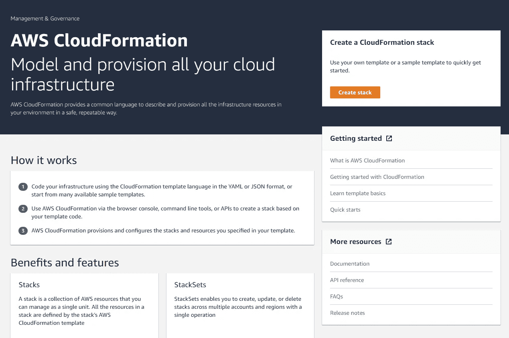
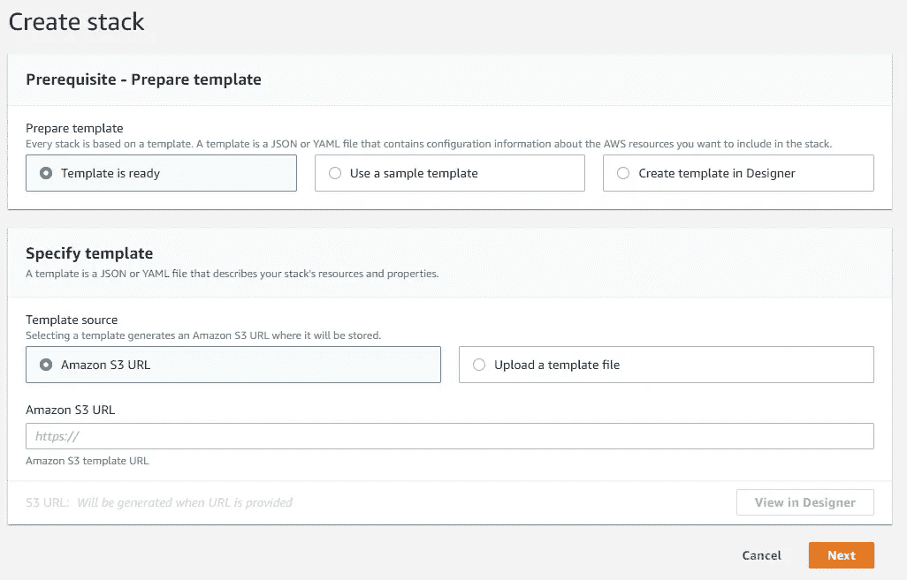
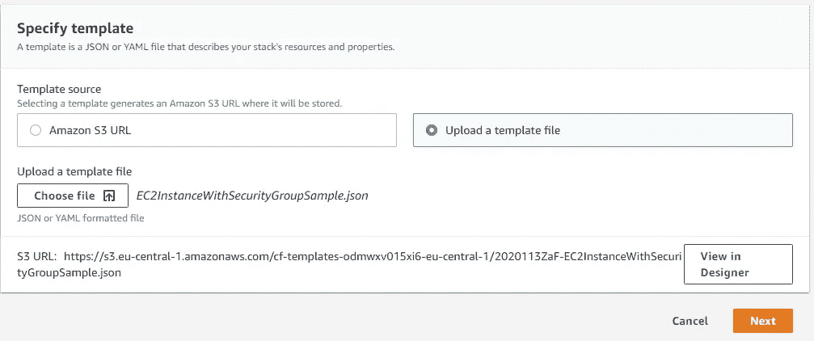
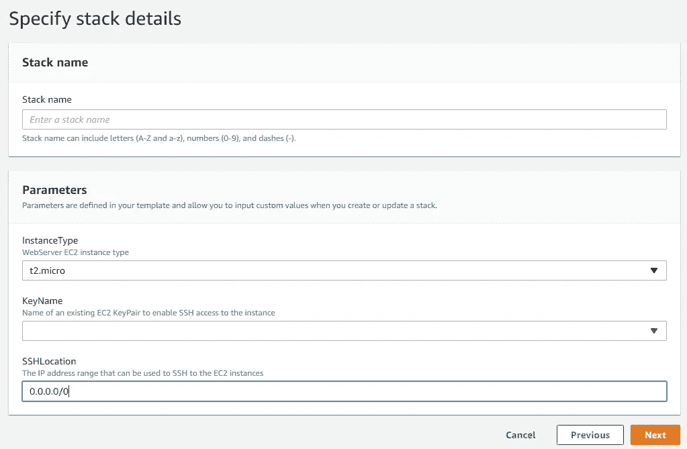
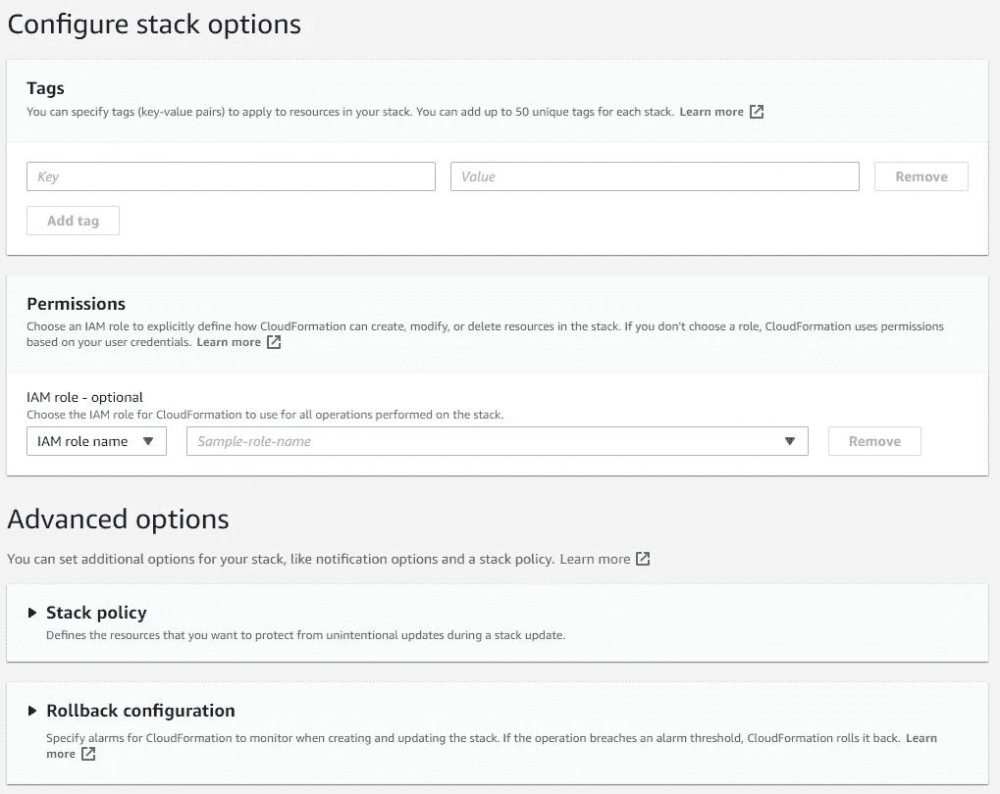
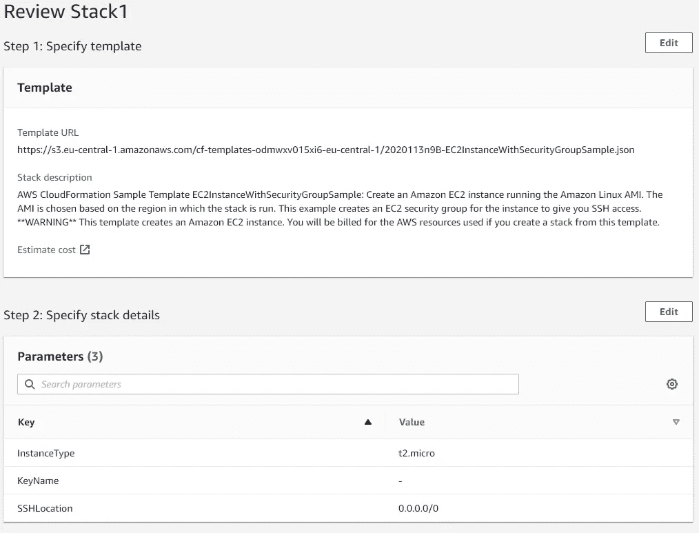
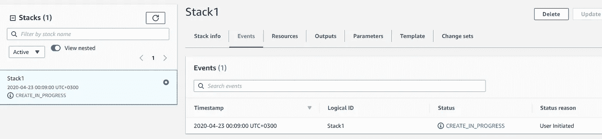
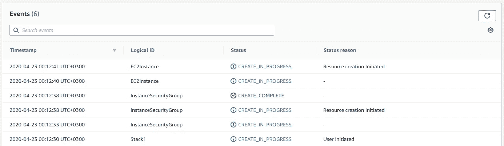
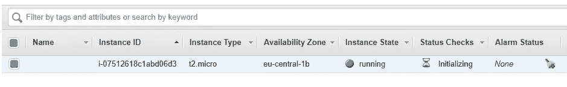
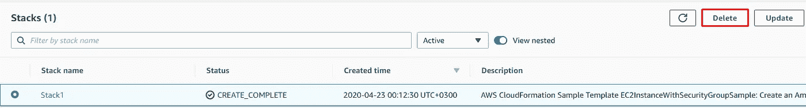

# 使用自动气象站云形成

> 原文：<https://medium.com/analytics-vidhya/using-aws-cloudformation-a3546a3035e2?source=collection_archive---------29----------------------->

关于云形成的入门级信息

伊恩·施耐德在 [Unsplash](https://unsplash.com?utm_source=medium&utm_medium=referral) 上拍摄的照片

## 免责声明:

这是关于亚马逊网络服务(AWS)系列的第一篇文章，我将为[认证开发者考试助理](https://aws.amazon.com/certification/certified-developer-associate/)写这篇文章。

## 什么是云形成？

正如它在[文档](https://docs.aws.amazon.com/AWSCloudFormation/latest/UserGuide/Welcome.html)中所写的:AWS CloudFormation 是一种帮助你建模和设置亚马逊 Web 服务资源的服务，这样你就可以花更少的时间来管理这些资源，而把更多的时间放在你在 AWS 中运行的应用上。您可以创建一个模板来描述您想要的所有 AWS 资源(如 Amazon EC2 实例或 Amazon RDS DB 实例)，AWS CloudFormation 会为您提供和配置这些资源。您不需要单独创建和配置 AWS 资源，也不需要弄清楚什么依赖于什么；AWS CloudFormation 处理所有这些。

## 这是什么意思？

CloudFormation 在 AWS 中执行创建和修改基础设施的工作。

CloudFormation 使用的主要工具是模板，这个文件包含了关于你的结构的完整解释。模板可以使用 JSON 或 YAML 格式存储。[在这里](https://docs.aws.amazon.com/AWSCloudFormation/latest/UserGuide/sample-templates-services-eu-central-1.html)你可以下载一些基本模板(针对欧盟-中欧 1 地区)

## 模板剖析:

模板包含以下部分:

**" AWSTemplateFormatVersion "**:" 2010–09–09 "

模板格式的版本—始终为“2010–09–09”，这是目前唯一允许的格式。

**【描述】**:“AWS 云信息样本模板…”

模板的简短描述。

**"参数"**:"实例类型":{

参数列表，作为输入参数传递给模板。

**" Mappings "**:" T2 . nano ":{ " Arch ":" hvm 64 " }

存储参数集的便捷方式，取决于某个变量。

**"资源"**:" ec2 实例":{

模板中使用的资源列表

**"输出"**:"实例 Id" : {

输出参数，例如新创建的 EC2 实例的 IP 地址，它在流程结束后可见。

模板的两个主要部分是**“参数**和**“资源】**

## 描述资源和参数

**资源**对象包含一个资源对象列表。资源必须有一个 Type 属性，它定义了您想要创建的 AWS 资源的种类。类型属性具有特殊的格式:

> **AWS::product identifier::resource Type**——“Type”:“AWS::EC2::Instance”

每个资源也可以包含属性—值列表。

**参数:**指定可以在运行时传递给模板的值。例如环境或 EC2 图像的类型。

## 什么是堆栈？

栈是一个单独的单元，它包含了 CloudFormation 模板和所有的资源。

## 简短演示

1.  转到 AWS 控制台中的 CloudFormation 页面

2.点击“创建堆栈”

你可以从三个选项中选择一个

*   **模板准备就绪—** 如果您已经准备好模板。
*   **使用样本模板—** 从模板库中选择一个模板。
*   **在设计器中创建模板—** 使用图形工具创建新模板。

当我使用亚马逊文档[中的模板](https://docs.aws.amazon.com/AWSCloudFormation/latest/UserGuide/sample-templates-applications-eu-central-1.html)时，这意味着我已经有了模板(选项一)。

3.在**【指定模板】**窗格中选择**【上传模板文件】**并上传模板。

您可以在 designer 中查看您的模板，或者点击**“下一步”**。

在这个屏幕上，你可以给栈一个名字，改变参数，并进一步。该屏幕上的所有参数均取自模板的**“参数”**部分。

在此屏幕上，您可以添加或更改堆栈的更多参数。

这是创建堆栈之前的最后一个屏幕，您可以在其中查看和更改选项。

这里你可以看到你的堆栈是如何创建的。

在“事件”窗格中，您将看到创建进度。

为了确保创建了 EC2 实例，让我们转到 EC2 控制台

很好！我们看到新的虚拟机已经创建。

现在让我们尝试删除堆栈。回到 CloudFormation，选择你的堆栈并点击“删除”

我们还可以在这里看到删除进度。

过了一会儿，堆栈删除了。

## 结论:

我们学习了什么是云结构，模板是什么样子，模板的主要部分是什么。我们还部署和删除创建安全组和 EC2 实例简单模板。