# 使用 Azure Application Insights 在 Java 应用程序中提供业务指示器

> 原文：<https://medium.com/analytics-vidhya/using-azure-application-insights-to-provide-business-kpis-in-java-applications-5f8b4dd80b09?source=collection_archive---------5----------------------->

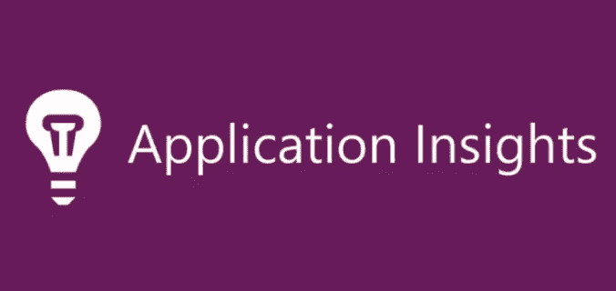

今天，我想与您分享一种有趣的方法，以简单的方式在您的 Java 应用程序中提供一些业务指标，而不需要通过分析环境公开数据或在应用程序的数据库中执行查询，也不需要冒着因查询执行不佳而降低性能的风险。

**但什么是 Azure 应用洞察？**

简而言之，Application Insights 是 Azure 的一项托管服务，允许您以简单的方式监控您的应用程序，帮助您了解客户的行为，评估性能并诊断可能的问题。

有关应用洞察的更多信息，请访问:[https://docs . Microsoft . com/en-us/azure/azure-monitor/app/app-Insights-overview](https://docs.microsoft.com/en-us/azure/azure-monitor/app/app-insights-overview)

在我开始之前，我想提出一个假设方案，并提出一些要求，以便我们能够随后满足这些要求。

假设我们正在实现一个应用程序，目的是通过互联网接收一些捐赠。

除了功能需求之外，业务领域旨在获得一些指标，例如:

**-给定时间段内的登录次数；**

**-给定时间段内的捐赠数量；**

**-过滤给定时间段内价值超过 1000 美元的捐款；**

根据这些要求，我们将继续实施。

第一步是创建应用程序，为了节省时间，我们将使用 site Spring Initialzr 来生成项目的框架。

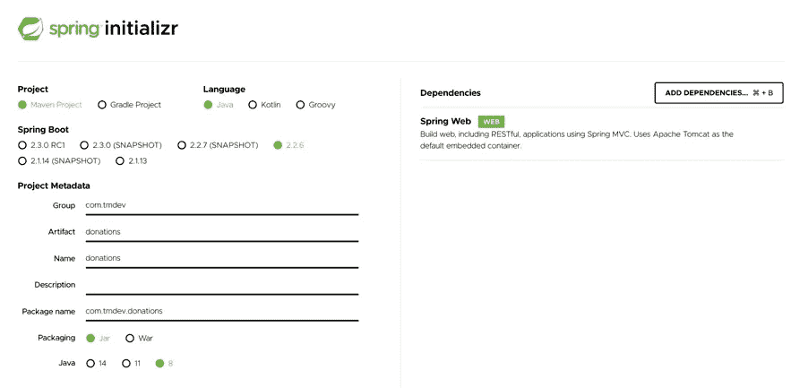

创建项目框架后，将其导入到您的首选 IDE 中。在我的例子中，我将使用 IntelliJ。

将项目导入 IDE 后，打开 POM.xml 文件并添加 Application Insights 依赖项。

```
<dependency>
    <groupId>com.microsoft.azure</groupId>
    <artifactId>applicationinsights-spring-boot-starter</artifactId>
    <version>1.1.1</version>
</dependency>
```

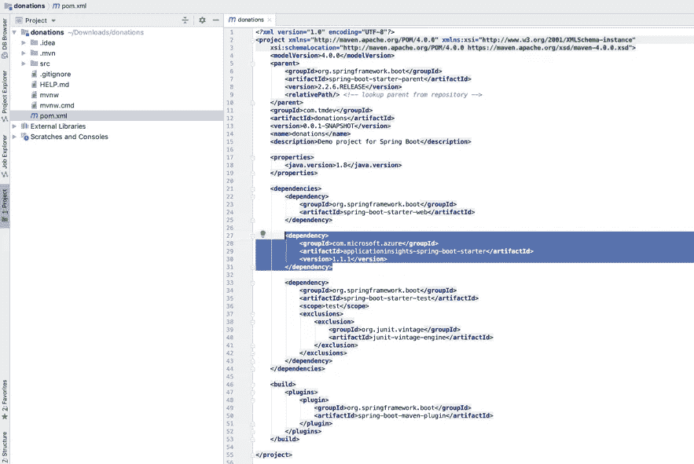

现在，是时候进入 Azure 门户并创建 Application Insights 实例了，它负责存储您的应用程序将生成的数据。

使用您的帐户访问门户，并通过搜索字段搜索应用洞察服务。

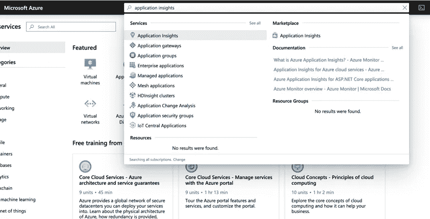

使用+ ADD 按钮创建 Application Insights 的新实例。

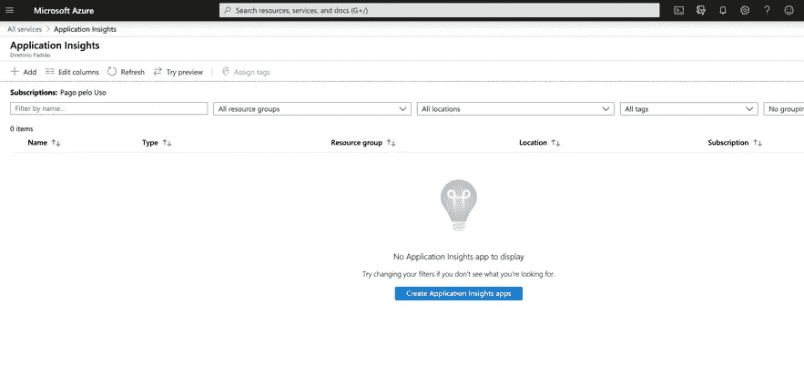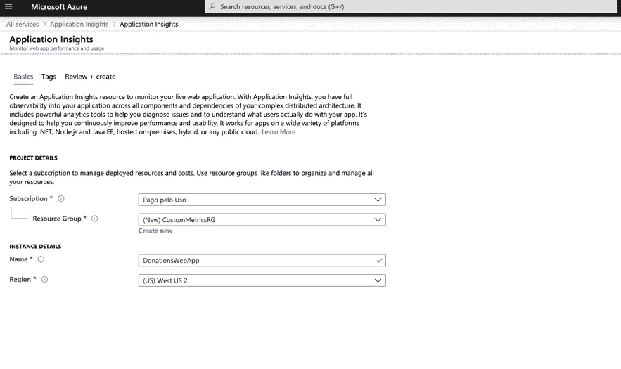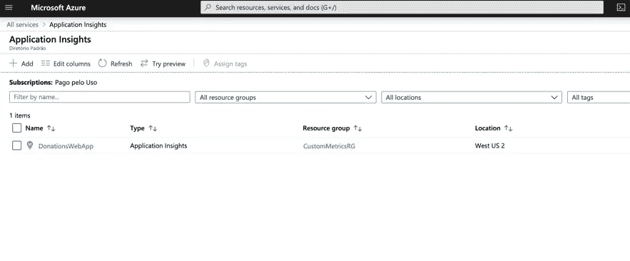

创建 Application Insights 实例后，访问它并复制右上角的 Instrumentation 键。

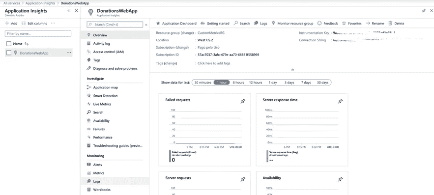

现在返回到您的 IDE，打开应用程序的 application.properties 文件(在 src/main/resources 中)并创建以下属性:

```
# Instrumentation Key #azure.application-insights.instrumentation-key = [Paste here the Instrumentation Key that you copied on the Azure portal]# Name of your application #spring.application.name = donations
```

现在我们要创建控制器类，有两个端点，一个负责登录，一个负责捐赠。

> 您还可以将异常处理和异步处理策略添加到对 SDK 方法的这些调用中，以避免在执行过程中可能出现的错误或速度变慢，但这不是本文的目的，我就不详细介绍了。

```
**package** com.tmdev.donations;

**import** com.microsoft.applicationinsights.TelemetryClient;
**import** org.springframework.beans.factory.annotation.Autowired;
**import** org.springframework.web.bind.annotation.PostMapping;
**import** org.springframework.web.bind.annotation.RequestBody;
**import** org.springframework.web.bind.annotation.RestController;

@RestController
**public class** DonationsController {

    @Autowired
    **private** TelemetryClient **telemetryClient**;

    @PostMapping(**"/login"**)
    **public void** login() {

        **telemetryClient**.trackEvent(**"DonationsLogin"**);

        *// Performs the sequence of business and security logics for login* }

    @PostMapping(**"/donate"**)
    **public void** donate(@RequestBody DonateRequest donateRequest) {

        **telemetryClient**.trackMetric(**"Donation"**, donateRequest.getAmount());

        *// Performs the sequence of business logic for donation* }

}
```

我们还将创建将在捐赠端点中用作请求体的类。

```
**package** com.tmdev.donations;

**public class** DonateRequest {

    **private** String **donorName**;

    **private double amount**;

    **public** String getDonorName() {
        **return donorName**;
    }

    **public void** setDonorName(String donorName) {
        **this**.**donorName** = donorName;
    }

    **public double** getAmount() {
        **return amount**;
    }

    **public void** setAmount(**double** amount) {
        **this**.**amount** = amount;
    }
}
```

现在是时候运行我们的应用程序了，使用 maven 的 spring-boot: run 任务。

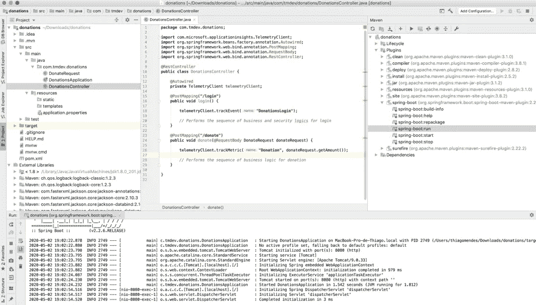

随着应用程序的运行，我将使用 POSTMAN 为登录端点执行一些请求。

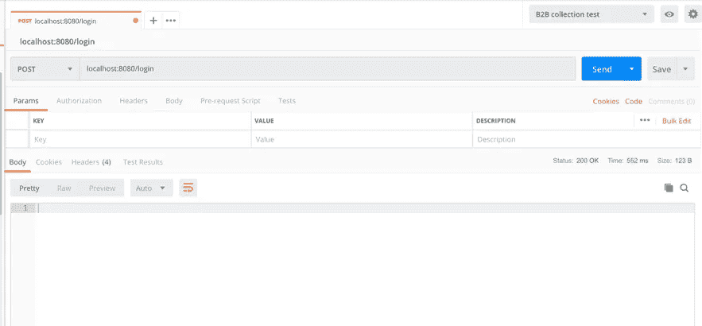

我还将为捐赠端点执行一些请求，在请求之间，我将更改捐赠的值，以便稍后我们可以基于这些值执行过滤。

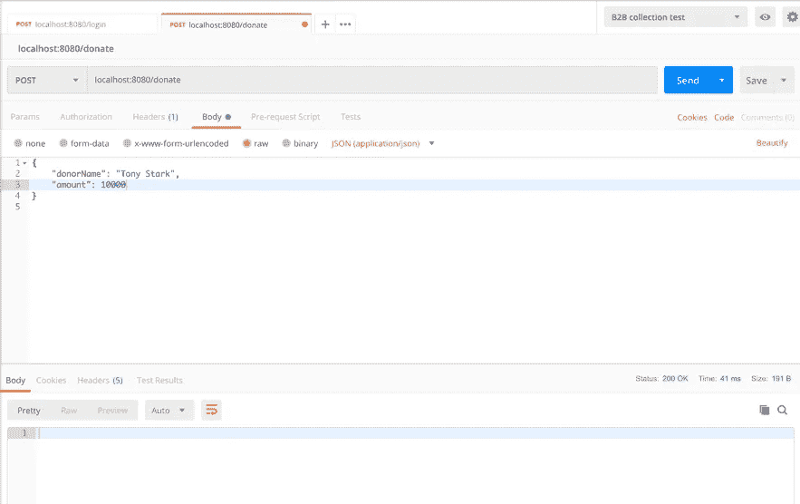

在通过 POSTMAN 执行完端点之后，是时候返回 Azure 门户，访问 Application Insights 实例并查看生成的数据了。

在 Application Insights 实例中，我们有多种方法来可视化这些数据，下面我将列出其中一些方法…

通过左侧的 Events 菜单项，可以查看通过 trackEvent 方法生成的数据，这些数据在登录端点内的应用程序中进行检测。

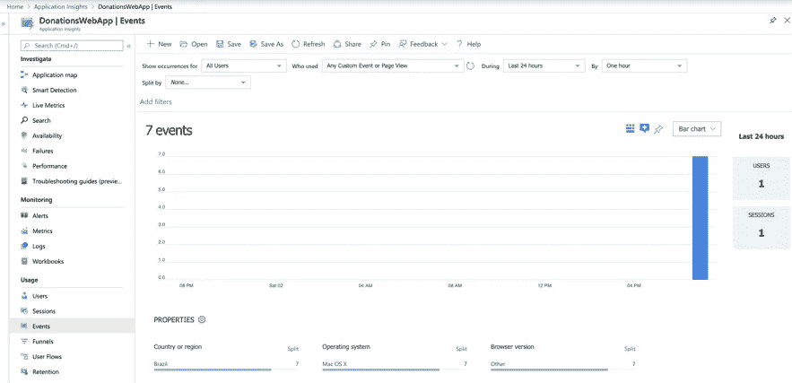

基于通过登录端点生成的数据，可以执行一些特定的过滤并使用一些类型的图表。

下面我列出了过去一个小时的登录，间隔为 3 分钟，并以折线图的形式呈现出来。

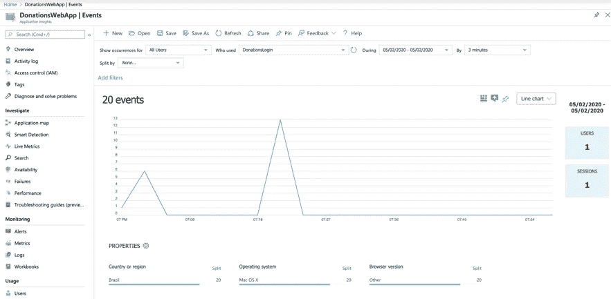

为了获得通过调用捐赠端点生成的数据，使用 trackMetric 方法，我们使用左侧的 Metrics 菜单项。

与 trackEvent 方法不同，使用 trackMetric 方法，我们可以通知一些可用于组成搜索过滤器的变量。

有关 SDK 中每种方法的更多信息，请通过链接[https://docs . Microsoft . com/en-us/azure/azure-monitor/app/API-custom-events-metrics](https://docs.microsoft.com/en-us/azure/azure-monitor/app/api-custom-events-metrics)访问文档

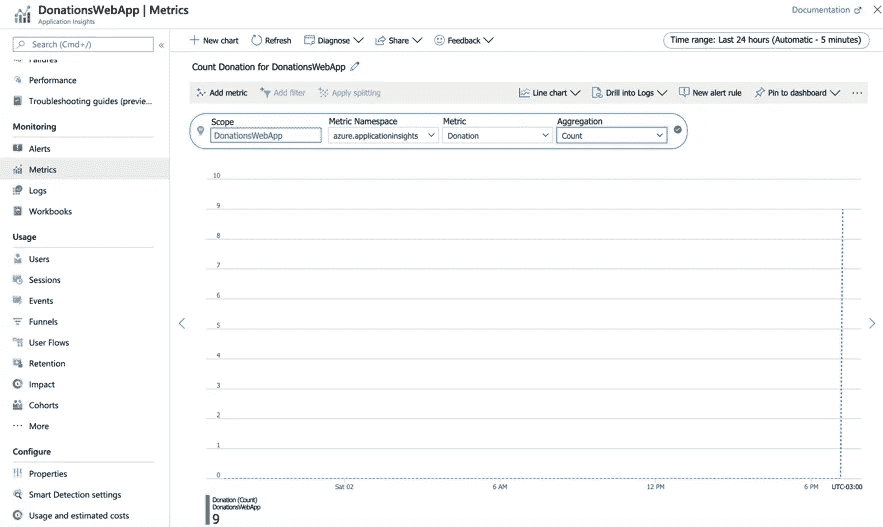

也可以通过左侧的菜单项 Logs 对生成的数据进行搜索，但为此，您需要使用微软的 KUSTO 语言编写查询。

KUSTO 语言非常直观，并且有很好的文档。欲了解更多信息，请访问链接[https://docs . Microsoft . com/en-us/azure/data-explorer/kusto/query/](https://docs.microsoft.com/en-us/azure/data-explorer/kusto/query/)

下面我运行一个查询来获取过去 24 小时内的捐款。

```
customMetrics| where name == "Donation"
```

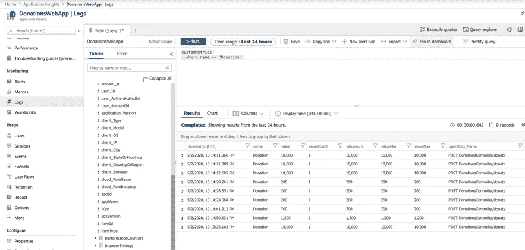

现在，我运行上面相同的查询，但是将结果的显示方式改为条形图。

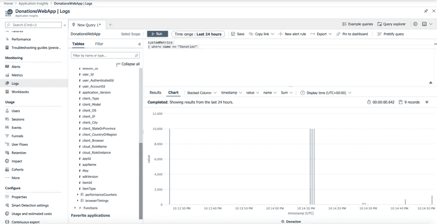

现在，为了满足金额大于 1000 美元的查询需求，我向过滤器添加了一个 WHERE 条件。

```
customMetrics| where name == "Donation" and value > 1000
```

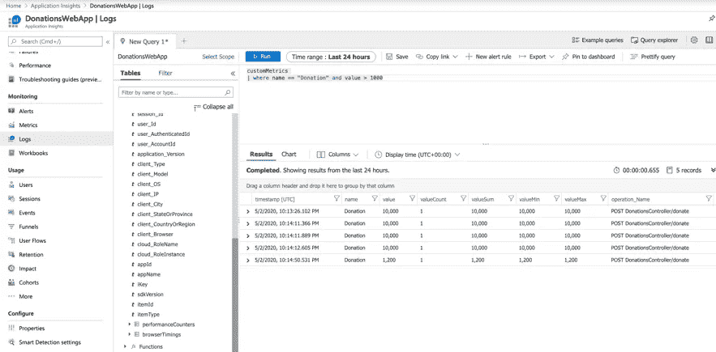

在任何时候，您都可以使用**引脚到仪表板**功能，在特定的仪表板上设置这些查询，您可以根据自己的意愿进行定制。

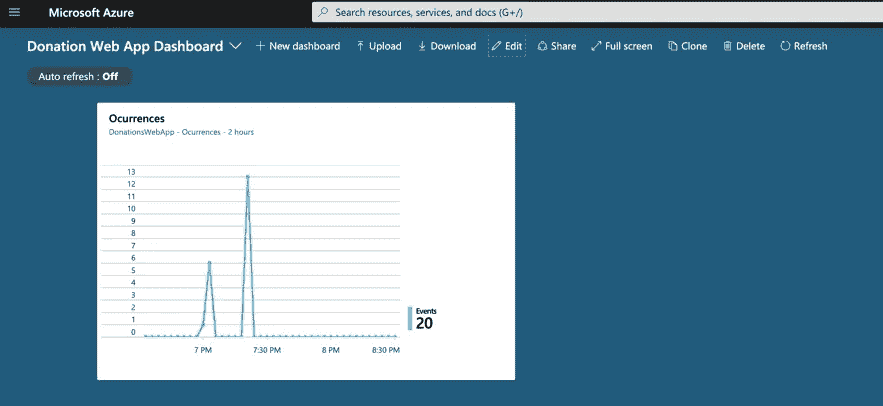

重要的是，您已经打包了 Application Insights SDK，这也允许您访问您的应用的标准指标，这些指标是自动收集的，不需要工具。

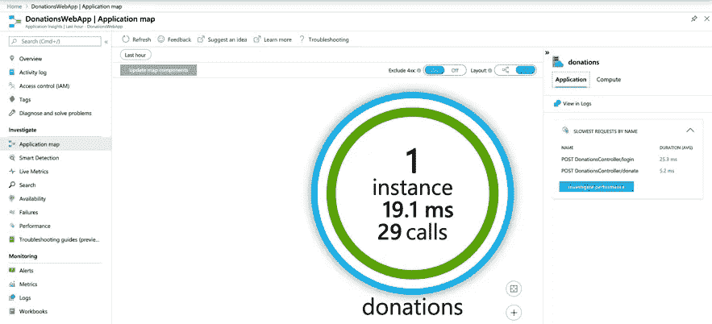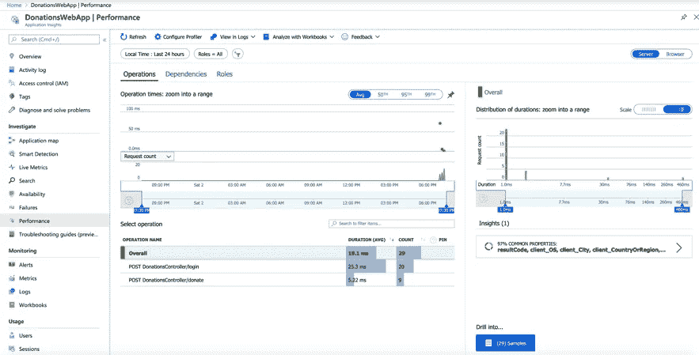

**结论**

在您的应用中使用 Application Insights SDK，除了可以访问与 APM(应用性能管理)相关的最多样化的信息之外，我们还可以使用定制的指标来提供指标，帮助了解您的客户的行为，并根据通过特定工具生成的数据指导一些业务决策。

要获得这篇文章中使用的代码，请访问链接[https://github.com/thiagomendes/donations](https://github.com/thiagomendes/donations)