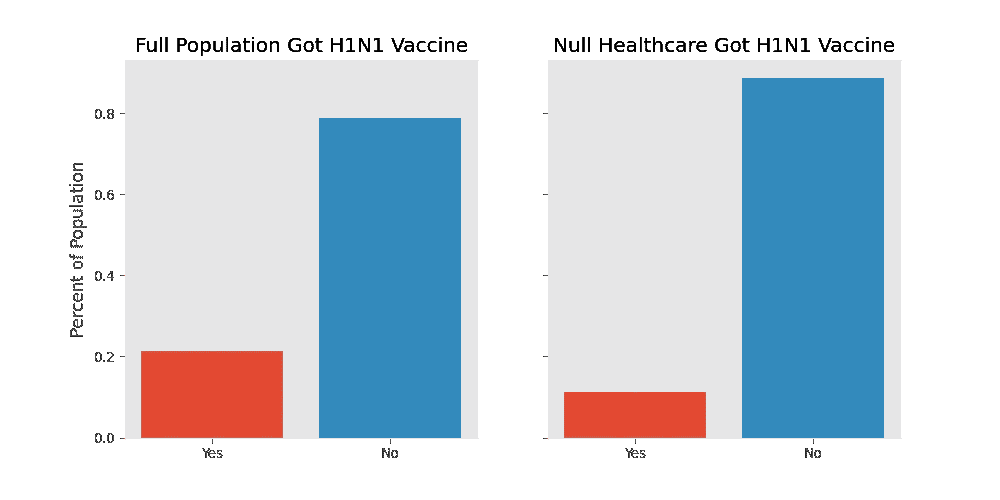
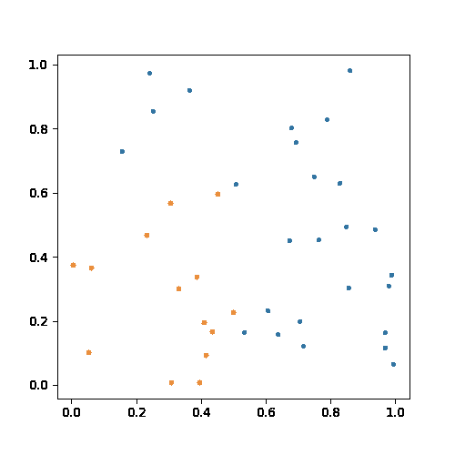
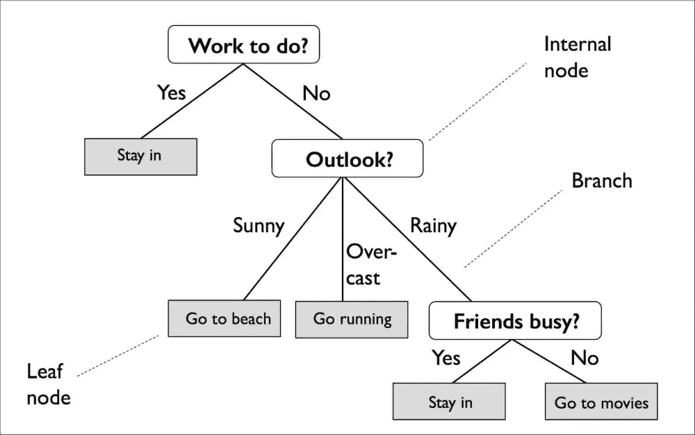
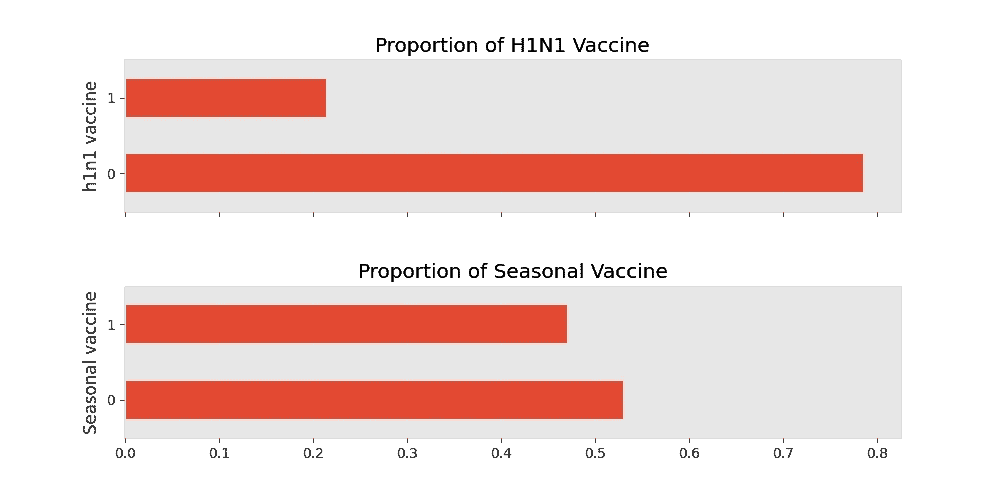
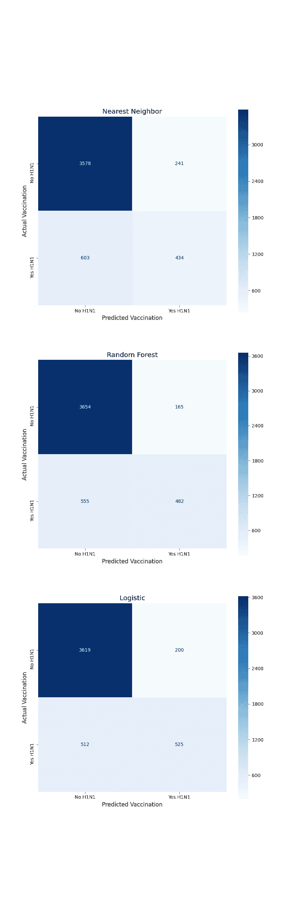
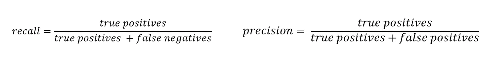
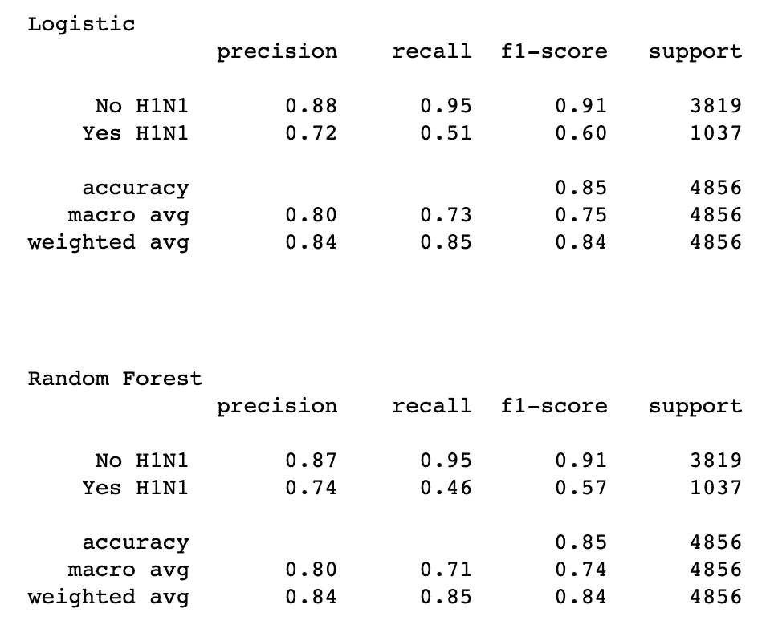

# 使用分类模型预测疫苗接种

> 原文：<https://medium.com/analytics-vidhya/using-classification-models-to-predict-vaccinations-f71d1c43bec7?source=collection_archive---------20----------------------->

我们目前处于全球疫情的第七个月。我想我可以有把握地说，没有人喜欢它。越快结束越好。当谈到减缓病毒传播时，医疗领域最重要的工具之一是疫苗接种。然而，如果没有人接种疫苗，疫苗就不起作用。现在，我意识到这听起来像是一个显而易见的声明，在许多方面确实如此。然而，这仍然是一个非常重要的事实。这是“群体免疫”的基本思想，能够识别出不太可能接种疫苗的社区成员是至关重要的。

幸运的是，对于我们这些有抱负的数据科学家来说，这不是我们的第一个疫情。为了应对 2009 年的 H1N1 流感，美国疾病控制和预防中心(CDC)进行了一项[调查](https://webarchive.loc.gov/all/20140511031000/http://www.cdc.gov/nchs/nis/about_nis.htm#h1n1)，“以监测和评估成人和儿童的流感疫苗接种工作”。这项电话调查询问了人们是否接种了 H1N1 和季节性流感疫苗，以及他们分享的关于生活、观点和行为的信息。 [DrivenData](https://www.drivendata.org/competitions/66/flu-shot-learning/) 提供了这个数据集的一大块，并提出了这样一个问题:利用调查结果，你能建立一个模型来预测谁将获得其中一种疫苗吗？我想我会给它一个镜头(双关语)。

在我上一个[项目](/swlh/using-linear-regression-to-play-out-the-full-2020-mlb-season-c71b37002a32)中，我创建了一个线性回归模型来预测一支棒球队的总胜率。那里的目标(wins)是一个*连续值*，因此它非常适合回归模型。这个问题没那么简单(或者也许更简单？).这里我们的目标值是二元的，不管参与者是否接种了疫苗。所以对于这个问题，我们将着眼于分类模型而不是回归模型。这些模型预测一个结果或另一个结果的可能性，而不是试图预测一个连续的变量。

在这篇文章中，我将介绍我构建模型的过程，并解释一些我最终没有使用的不同分类模型。

# 数据清理

公平的警告，这是无聊的部分，所以如果你不是很感兴趣，跳过这一部分你不会失去任何东西。

数据集由 35 个不同的问题组成。其中 23 个问题有数字答案，要么是意见范围(1-5)，要么是简单的二元“是”(1)或“否”(0)。然而，其中 12 个问题有明确的答案，即收入水平、教育水平、种族、城市等。大多数分类模型不能处理纯分类值，所以我不得不使用一些不同的技术将这些分类值转换成数字输入。

我使用的第一种方法是为每个类别创建虚拟特征。例如，有一个问题问的是家乡城市。我没有将所有城市放在一个列中(以文本形式)，而是将每个城市放在自己的列中。如果应答者不住在那里，每个城市栏都有一个 0，如果他们住在那里，则有一个 1。这可能是一种危险的方法，因为它会大大增加列的数量，从而增加数据集的维数。

第二种方法是将文本数据转换为有序数值。当值之间存在某种有序关系时，就会这样做。例如，在查看教育时，数据是以“高中毕业”、“完成某个学院”、“大学毕业”等形式出现的。这些值可以分别转换为 14、16 和 18，以给出“在校年数”的粗略估计。同样，这只有在值之间已经存在某种潜在关系的情况下才真正合适，其中一个值比另一个值“大”。

除了这些转换，我还必须处理所有的“空”值。特别是，对于一个参与者是否有医疗保健的问题，近一半的回答是“空的”，即没有数据。我的第一个想法是把这个专栏一起扔掉，因为没有足够的数据，所以把它扔掉。然而，经过仔细观察，我发现，尽管所有受访者中有略高于 20%的人接种了 H1N1 疫苗，但在医疗保健“无效”的人群中，只有 13%的人接种了 H1N1 疫苗。

这告诉我，在那些“空”值中实际上可能有值，所以我决定从该列中创建“虚拟变量”。我最后写了三个专栏，“有医疗保险”、“没有医疗保险”和“我们不知道”。

这是正确的方法吗？也许不会，如果有更多的时间，我会更喜欢使用这个特性。但这一过程真正证明了数据清理不是一劳永逸的过程，而是每个决定都是独特的，需要深思熟虑的推理。不管怎样，现在我有了一个没有“空”值的完整的数字数据集，我准备好进入有趣的部分了。

# 模型介绍

欢迎回到那些离开我们的人身边。

有相当多的分类模型可供选择。为了简单(和时间)起见，我将在这篇文章中集中讨论三个分类器:K-最近邻(KNN)，随机森林分类器，逻辑回归。

**KNN**

让我们从 KNN 开始。该模型使用*聚类*来创建预测。让我们首先设想一个只有两个特征(X 和 Y)和一个目标(橙色和蓝色)的问题。我们可以这样描绘这些特征:

KNN 的例子

现在，如果给我们一个有 X 和 Y 但没有颜色的新数据点，我们可以画出来，看看它周围有什么颜色。如果它靠近许多蓝色(在右上角)，我们将把它归类为蓝色，如果它靠近许多橙色(在左下角)，我们将把它归类为橙色。如果我们加入第三维度，我们可以相当容易地概念化这将如何工作。由于数学中的距离公式，这个想法可以扩展到理论上的无限维度。这正是 KNN 模特正在做的事情。

您可以在 KNN 模型中设置的主要参数是它将查找来对数据点进行分类的邻域的数量。如果将 K 设置为 1，那么新数据将被归类为最近点的类别。这将导致模型过度拟合。同样，如果您将 K 设置得太高，那么模型将会欠拟合。找到一个合适的 K 对于一个好的模型来说是必不可少的。

**随机森林分类器**

我看到的第二个模型是一个[随机森林分类器](https://en.wikipedia.org/wiki/Random_forest) (RFC)。RFC 只是决策树的集合，所以让我们先来分解一下什么是决策树。

这里有一个直接来自维基百科的定义:“决策树是一个类似流程图的结构，其中每个内部节点代表对一个属性的“测试”。啊？好吧，也许视觉表现会更容易一点。

示例决策树

上面是一个决策树的例子，用来决定一个人一天应该做什么。问题是树的节点，根据它们的答案，你可以沿着“树”的不同分支前进。在某一点上，您到达了“叶节点”，这是模型预测的类别。这对我的模型意味着什么？嗯，每个调查问题都会是一个不同的节点。因此，如果我输入一组调查答案，它将沿着决策树模型运行，并到达一个叶节点，这将是预测。

可以用来“塑造”这个模型的一个主要变量是树的“深度”。初始节点设置为深度 0，每个后续分支增加一层深度。一棵树越“深”，它就越能适应。一棵真正深的树可以很好地解释训练数据，但对于新数据的归纳却很差。对于一棵树应该有多深，没有一个“放之四海而皆准”的标准。每个数据集和每个问题都不一样。同样，为了理解如何处理这个变量，很好地理解你的问题是有帮助的。

一个数据集可以有数千棵决策树，它们给出的结果略有不同。RFC 将一定数量的这些树聚集成一个“森林”,并采用所有决策树结果的模式。例如，我制作了 100 棵树的 RFC。如果我输入一组答案，70 棵树预测“没有疫苗”，30 棵树预测“有疫苗”，那么 RFC 将返回“没有疫苗”的预测。

**逻辑回归**

我将在逻辑回归模型中讨论的最后一个模型。在这三者中，这无疑是最难概念化的。线性回归假设我们的特征和预测之间存在线性关系，而逻辑回归假设特征和预测的*对数优势*之间存在线性关系。所以最终，逻辑回归模型的输出是数据条目对应于两个二元预测之一的*百分比机会*。

线性回归的例子

如上图所示，逻辑回归将给出一个介于 1 和 0 之间的值。值越接近 1，越有可能属于该类。在我的例子中，1 代表“是疫苗”，所以如果逻辑回归模型返回 0.85，它告诉我给定的调查输入对应于 85%的接种疫苗的机会。

对于一个 logistic 回归模型，了解自己的“门槛”是非常重要的。阈值决定了分割数据的临界值。如果您将阈值设置为 0.6，那么低于该值的任何值都将被预测为 0。有几种不同的方法来确定哪种阈值最适合您的数据集，我将在后面介绍，但同样需要理解的最重要的事情是，它会因每个问题而异。

# 型号选择

一旦我对每个模型的工作原理有了很好的理解，我需要确定哪个模型最适合我的问题。我的模型需要预测两个独立的目标，H1N1 疫苗和季节性流感疫苗。在最初的数据探索中，我很快注意到 H1N1 目标高度不平衡。

接种每种疫苗的人口比例

从上图中可以看出，虽然近 50%的受访者接种了季节性流感疫苗，但只有约 20%的受访者接种了 H1N1 疫苗。这意味着我们不能依靠像*精确度*这样的指标来确定我们的模型有多好。为什么不呢？好吧，如果我们制作一个“哑模型”,不管输入多少，它只是预测一个回答者不会每次都感染 H1N1，它仍然有将近 80%的准确率！

对于这个问题，我决定假阳性将是我想要限制的术语。我的模型预测这些人会接种疫苗，但最终却没有接种。这个数字很重要，因为最终我想尽可能多地捕获非疫苗接种者。我的假阳性越多，就有越多的非疫苗接种者漏网。

让我们来看看我的模特们表现如何。为了这篇博客，我只是展示了我对不平衡的 H1N1 目标所做的，但实际上，我对两个目标变量都执行了所有这些步骤。

这里你可以看到我预测 H1N1 疫苗的三个模型的三个不同的混淆矩阵。误报显示在右上角。模型预测这些人会接种疫苗，但不会。你可以看到最近邻法表现最差，将 241 名非接种者误认为接种者。此外，它还拥有最高数量的假阴性，即预测不会接种疫苗的人。

所以很明显，KNN 模型不是预测这个问题的最佳模型。其他两个模型的值更接近。我不得不更深入地研究这些来决定我将使用哪一个。

**召回与精确**

在分析分类模型的预测时，召回率和精确度是两个至关重要的指标。它们也很容易混淆。这里有一些公式:

那么它们是什么意思呢？精度可以被认为是所有真值中正确识别的百分比。而召回率是所有模型预测识别中正确识别的百分比。在我的例子中，我想限制假阴性，所以我想最大化召回率。两者之间总会有取舍。因此，为了获得更高的召回值，有时您必须牺牲一点精确度。

我知道这些数字太多了。但是关注没有接种 H1N1 疫苗的召回，我们看到两个模型的得分都是 0.95。这意味着在所有没有接种疫苗的人中，模型能够识别出 95%的人。与我们从猜测每个人都不会接种疫苗中得到的大约 80%相比，我们看到我们的模型确实比“愚蠢的模型”做得更好。

事实证明，我的两个模型在预测能力方面相当不相上下。通过使用一些奇特的组合技术(组合多个模型并取它们的平均值)，我能够得到一个持续(尽管稍微)优于这些更基本模型的模型。然而，我不得不考虑的最后一件事是模型的复杂性。

对我来说，这意味着我的实际模型有多大(当我存储它时，以实际的兆字节为单位)以及模型进行预测需要多长时间。逻辑回归比随机森林模型小 10 倍(记住随机森林由 100 棵决策树组成)，可以产生非常快速的预测。所以最终我决定使用逻辑回归模型作为我的[应用程序](https://flu-analysis.herokuapp.com/)的最终模型。试试吧，看看有没有让你惊喜的东西！

# 外卖食品

我发现对我的模型来说，最重要的特征是疫苗是否由医生推荐，以及被调查者是否有健康保险。这是值得注意的，因为它告诉我们，在所有年龄、教育水平和社会经济水平的人群中，医生的建议可能是我们拥有的最大工具。这可能不是最激动人心的发现，但我相信它仍然很重要。在任何一次体检中，医生都必须提供疫苗建议。如果医生更好地理解他们的建议的影响，我肯定他们会这样做。