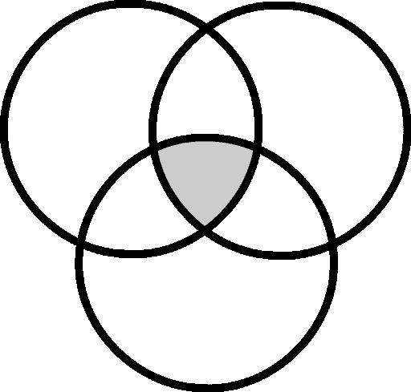
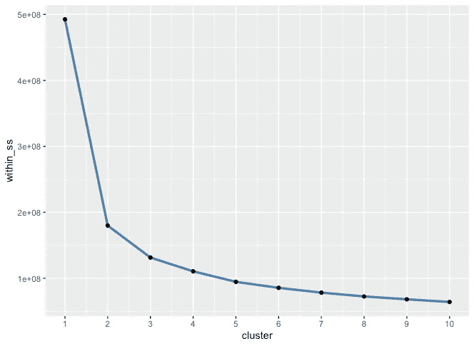
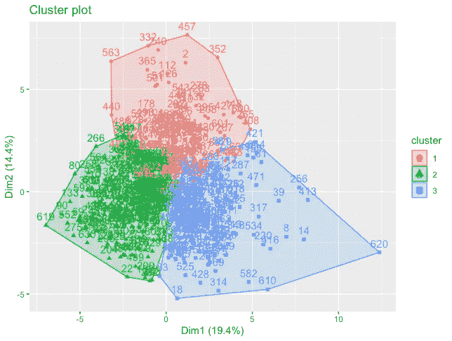

# 更新:使用先进的机器学习技术来识别可比的大联盟投手

> 原文：<https://medium.com/analytics-vidhya/using-clustering-to-identify-comparable-major-league-pitchers-36387fee202?source=collection_archive---------14----------------------->

**注:**

在收到大量有用的反馈后，我决定用一种更加用户友好的格式更新这两篇集群文章。通读本文时，您会发现我的方法的许多更新，以及所有集群的完整列表的链接。感谢阅读！

**简介**

我创建媒体简介的目标是提供优雅、简单的体育数据分析，让广大受众都能理解。

在我的第一个分析中，我将展示 k-means 聚类如何在尝试对大联盟投手进行分组时成为一个有效的工具。

*那么，谁在乎呢？为什么这有帮助呢？*

我选择在我的第一篇文章中演示聚类的主要原因是提供一个有形的、有趣的、有帮助的例子，说明机器学习如何应用于日常问题。在整个棒球运动中，球队在预测表现和寻找潜在价值上花费了大量的时间和精力。虽然聚类是一个有用的预测工具，但它本质上是描述性的。换句话说，它使用数据来描述情况，而不是预测未来。

这尤其有助于识别那些可能没有达到受欢迎程度的投手，但在本质上与许多比赛中更知名的投手相似。我们开始吧！

**数据采集和处理**

我通过 [Baseball Savant](https://baseballsavant.mlb.com) 获得数据，这是一个大型数据库，包含由美国职业棒球大联盟收集的各种各样的指标。这个分析，以及以后所有的分析，都将在 R Studio 中进行。

当思考在寻找投手之间的相似性时可能很重要的变量时，我主要关注两个方面:

1.  *以往产量*
2.  *球场兵工厂*

在查看过去的产品时，我过滤了大部分高级指标，如 xFIP、xBA 和 xSlug，同时添加了一些有用的传统统计数据，如投球局数。球场阿森纳主要是指一个特定的投球频率和所有潜在的因素(速度，旋转，突破)对该投球效率的影响。

来自数据的一些其他关键注释:

*   仅 2019 年观察
*   至少面对 50 名击球手

**聚类解释**

所以，你可能想知道，集群到底是什么？聚类是一种广泛使用的无监督机器学习技术，它根据数据的相似性将数据分成不同的组。

有多种方法可以用来实现集群，每种方法都有自己的优点。在本文中，我将利用最流行的聚类技术， *k-means* ，因为它简单且相对容易实现。

*快速 k 均值汇总:*

1.  算法随机分配点(称为质心)
2.  每个观察值被分配到最近的质心
3.  K-means 计算质心值(聚类)的平均值，创建一个新的质心值
4.  对所有观察重复该过程

如果你对 k-means 更全面的解释感兴趣，可以在[这里](https://blog.easysol.net/machine-learning-algorithms-3/)找到一个可靠的总结。

当算法完成时，数据将被分成指定数量的聚类，每个聚类包含彼此相似的观察值。

**数据处理**

为了实现聚类，*所有数据都需要属于同一类型*。如果您不熟悉数据类型，它们只是一个观察所具有的表示类别。例如，如果“John Doe”是一个观察值，它将被视为一个“字符”。

在 Baseball Savant 数据中，唯一的差异是“last_name”和“first_name”变量，这两个变量都表示为字符，而所有其他变量都表示为“numbers”或“integers”。结果，我不得不临时删除名字和姓氏变量，确保所有数据都是同一类型。

在删除了名字和姓氏变量(因为它们不是数字，我们稍后会添加它们)之后，我需要*决定如何处理空值*。因为数据只包含 40 个 NA 值，所以我决定完全删除它们。

聚类前的最后一步是*标准化变量。*这可以通过利用 R 的帮助刻度功能来实现。此时，savant 数据已准备好用于 k-means 算法。

**确定聚类的最佳数量**

当我们准备好利用集群时，我们需要确定我们希望将数据分成多少个集群。不需要太专业，我们可以利用“平方和”度量来确定集群的最佳数量。我在 R 中对此进行了计算，并创建了一个图表来解释我的发现。在下图的弯曲处或“肘部”可以看到最佳的集群数量。

在 ggplot2 中计算

弯曲似乎发生在 3 簇刻度线处，推断 3 簇解决方案似乎是合理的。

**K 均值聚类**

现在，我们的数据已经过处理，最佳聚类解决方案的数量也已确定，我们可以运行 k-means 算法，聚类解决方案如下所示。

很酷，对吧？

**聚类结果**

K-means 做了一项杰出的工作，将大联盟最好的投手集合在一起。下面，我将列出在每个集群中发现的一些最有趣的名字。

**集群 1(包的中间):**

预期名称:

*   曼德森·布姆加纳
*   亚当·温赖特
*   凯尔·亨德里克斯

有趣的名字:

*   克里斯·塞尔
*   詹姆斯·帕克斯顿

**第二组(最佳投手群):**

预期名称:

*   谢恩·比伯
*   格里特·科尔
*   亚伦·诺拉

有趣的名字:

*   达科塔·哈德森
*   乔·默斯格罗夫

**第三组(效率最低的投手群):**

预期名称:

*   安德鲁·卡什纳
*   乔丹·齐默尔曼
*   阿德里安·桑普森

有趣的名字:

*   科尔宾·伯恩斯
*   卡洛斯·卡拉斯科

所有的聚类结果都可以在这个链接中找到:[https://docs . Google . com/spreadsheets/d/11 ONG 0 PC 35 bgpy 6 svtsbbmmr 0 SPB 5 xytr 20 c 43 awl DTA/edit？usp =分享](https://docs.google.com/spreadsheets/d/11OnG0pc35bgPy6SVtSbBMmr0spB5xYtr20c43awlDTA/edit?usp=sharing)

所以，我们有它。我鼓励你们对每一组进行分类，并得出自己的结论。正如我之前解释的，集群是一种描述性的方法。从这一分析中可以引出许多问题。例如:

*   为什么玩家 A，一个公认的顶级投手，在第一组？
*   我们如何帮助玩家 B(从发展的角度来看)，他在集群 3 中，被分组到集群 1 中？

我希望你喜欢这个分析，请不要犹豫提供反馈！

你的一些结论是什么？

（同 JavaMessageService）Java 消息服务