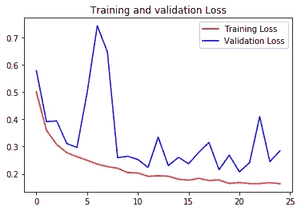

# 用 Tensorflow 中的卷积神经网络分析胸部 x 光片

> 原文：<https://medium.com/analytics-vidhya/using-convolutional-neural-networks-in-tensorflow-to-analyse-chest-xrays-635c59c0e567?source=collection_archive---------13----------------------->

在这篇短文中，我们将展示 TensorFlow 如何通过深度神经网络轻松地对图像数据进行分类。我们将使用 Kaggle 上提供的[胸部 x 光](https://www.kaggle.com/paultimothymooney/chest-xray-pneumonia)图像数据集展示该方法。因为这是一个基于图像的数据集，我们将利用*卷积神经网络*，以及*最大池*来获得我们的预测。

希望这将作为一个指南，任何人都可以遵循，并尝试自己适应这个模型。内部模型层可以很容易地改变(添加或删除层，添加辍学，等等)。

# 胸部 x 光数据集:

胸部 x 射线数据集由成千上万张拍摄的 x 射线图像组成。图像分为健康(正常)或不健康(肺炎)两类。数据集很大，包含。jpeg 文件，因此它保存在 zip 文件中。我们使用 *zipfile* 包来解压缩数据，并创建各自的训练和验证目录。

# 载入图像:

下载完图像后，将工作目录设置为保存图像的位置。

图 1:取自我的 python 代码的图像样本。此图像显示了 16 个图像的样本。第一个上半部分(8 张图片)是健康的，第二个上半部分有肺炎。

我们使用常规卷积神经网络(CNN)来训练该模型，只有 3 个卷积和最大池，以及单个丢弃层。我们还为我们的内层使用了 [*relu*](https://en.wikipedia.org/wiki/Rectifier_(neural_networks)) 激活函数。

以灰度标绘的四个健康肺的样本。

图 2:用灰度标绘的四个患病肺的样本。

# 定义我们的张量流模型:

我们使用四个卷积层，每个卷积层后面都有一个最大池层。我们将每个卷积层中的滤波器数量增加一倍。我们在最终的 relu 激活后设置了一个 0.3 的丢弃层。这将增加验证的准确性(通过帮助防止过度拟合)。

我们还可以查看我们模型的摘要:

图 3:我们的模型总结。我们有几个卷积层，最大池和一个下降层。

# 图像增强:

每个 x 射线图像大约是 180 像素乘 180 像素，因此我们的 input_shape 将被设置为(180，180，3)。3 是三种颜色(RGB)的尺寸。我们将使用 *ImageDataGenerator* 来帮助创建额外的增强图像。我们将 ImageDataGenerator 的“填充模型”参数设置为“最近的”(以填充图像的任何缺失部分)。我们用 255 来缩放每个像素的亮度。

# 编译并拟合模型:

我们使用 RMSprop 优化器来执行梯度下降，学习率为 0.0001，这确保我们采取小步骤。

我们现在符合模型。我们指定 25 个历元，并让 TensorFlow 决定其他参数，如*步数 _ 每历元*和*验证 _ 步数*。

# 可视化内层:

TensorFlow 的一大特点是我们可以轻松访问网络的内层。首先，让我们看看我们的模型拟合进行得如何。

图 4:我们模型拟合的最后几个时期的总结。每个时期大约需要 2.5 分钟。

每个历元花费 2.5 分钟多一点，训练和验证的准确性都有所提高。我们的损失似乎趋于平稳，所以 25 个纪元可能足够了。

我们还可以看到内层是什么样子的。

图 5:卷积层内部。这些层有助于提取图像的边缘和对比度。

图 6:最大池层内部。最大池平均化并简化了整个图像。这使得我们更容易识别尺寸减小的特征

# 绘图精度和损失:

最后，我们可以检查每个历元的精度和损耗图。

图 7:我们的训练和验证准确性。两者都上升并稳定在 90%左右

图 8:我们的培训和验证损失。

就是这样！我们已经训练了一个模型，该模型可以正确地对肺部状况进行分类，在测试集上的准确率超过 90%，在训练集上的准确率超过 94%。

# 总结:

*   在 TensorFlow 中使用 CNN 拟合一个简单的分类模型很简单。
*   ImageGenerator 可以用来扩充图像，增加我们的训练集。
*   过度拟合可以通过增加压差来补救。

**感谢阅读！**

带有代码的 Github:

[https://github.com/Robby955/ChestXray](https://github.com/Robby955/ChestXray)