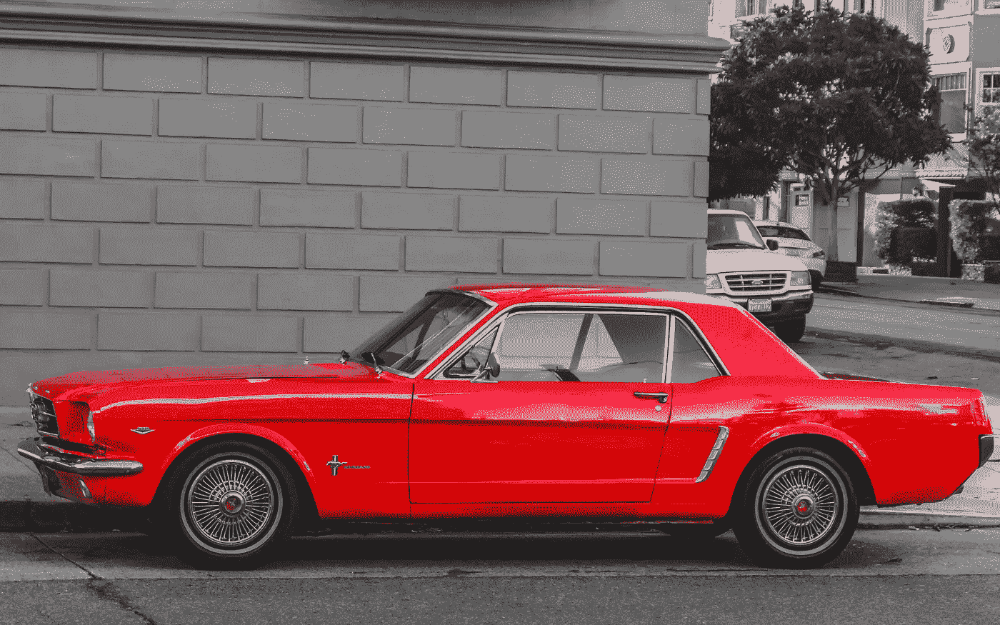

# 利用卷积神经网络对街道标志进行分类

> 原文：<https://medium.com/analytics-vidhya/using-convolutional-neural-networks-to-classify-street-signs-eef7bd6a200a?source=collection_archive---------23----------------------->


图片来源:yonah.org

自从汽车发明以来，随着时间的推移，制造商已经稳步增加了更多的安全功能并改进了汽车设计，目标是让驾驶员在路上更加安全。汽车制造商已经花费了数百万美元来研究安全带、轮胎和几乎所有能想到的汽车零件的安全改进。尽管有所有这些投资，驾驶仍然比 2019 年的航空旅行更加致命。根据[国家安全委员会](https://www.nsc.org/road-safety/safety-topics/fatality-estimates)的数据，仅在 2018 年美国就有大约 4 万人死于汽车事故。事实上，2018 年全球共有约 500 人死于飞机坠毁——与仅在美国发生的车祸死亡人数相比，这比**少 80 倍****。**

**有许多因素可能导致这种巨大的差异，例如与机动车驾驶员相比，商业飞行员在培训和认证方面的难度，以及道路上的汽车数量与飞机的数量。尽管如此，在我看来，死亡率的差异仍然相当惊人。**

****

> **如今，特斯拉、沃尔沃等公司和许多其他公司正在投资人工智能等技术，试图纠正问题的根源，以及我们以前忽略的问题——**方向盘后面的人类表现。****

**自汽车发明以来，汽车技术最令人兴奋的进步可能是自动驾驶汽车的诞生。曾经是科幻小说的主题，通过卷积神经网络(CNN)和其他建模技术的力量，自动驾驶汽车已经成为可能。但是，在我们完全交出钥匙之前，我们必须克服三大挑战。**

**我们必须:**

**> 1.获取数据(传感器、摄像机)**

****

**图片来源:[www.sae.org](https://www.sae.org/*)**

**> 2.处理数据(人工智能——我们将关注这一部分)**

**> 3.根据数据采取行动(驾驶汽车)**

**为了突出特斯拉等公司在向公众提供自动驾驶汽车时所面临的一小部分技术挑战，我们将专门关注步骤 2 的简化应用，**处理图像数据，以确定我们“正在看”的是什么**。为了实现这一目标，我使用了一个包含 43 种标记街道标志的 100，000 张图像的数据集来创建受监督的深度学习模型，该模型利用了 CNN，能够非常可靠地(稍后将详细介绍)对街道标志的新图像进行分类。对于这一切意味着什么的一个很好的总结，请查看 Dhanoop Karunakaran 的这个[系列文章。](/intro-to-artificial-intelligence/deep-learning-series-1-intro-to-deep-learning-abb1780ee20)**

**当讨论这种类型的技术时，注意错误的潜在后果是很重要的。在无人驾驶汽车的情况下，一个错误识别的停车标志*或行人*很容易导致死亡。在一项正式的研究中，可能会对每个符号的错误分类的重要性进行评估，并给予权重。通过这种方式，一个新的模型可以被训练成在对更“关键”的街道标志进行分类时“宁可谨慎”。虽然这一切在理论上听起来很棒，但这些选择背后的伦理也必须认真评估。例如，如果我们的加权输入使我们的新模型在分类停车标志时犯的错误更少，但在分类行人过街标志时表现稍差，这是“可接受的”吗？综上所述，就本文的目的而言，我们将更多地关注技术本身。**

**那么，你如何教计算机识别不同的物体呢？为了触及这一点，我们将从一个简单的例子开始。作为人类，当我们看下面的图片时，我们看到一只可爱的黑色和灰色皮毛的狗站在斑点地毯上。**

****

**不用思考，我们就知道图像的主体不是一匹马、一辆车或一只猫。即使在观看我为同一只狗拍摄的经过大量编辑的照片时，作为人类，我们仍然不难识别图像的主体是一只狗，即使它是蓝色的。看一看:**

****

**毫不奇怪，计算机不知道狗是什么，更不知道人长什么样。取而代之的是，计算机将图像视为名为**张量**的分组矩阵。在每个矩阵中，每个数字对应于图像中的一个特定像素。**

****

**使用卷积神经网络，我们能够训练模型来提取图像特征，如边缘、形状和颜色，用于图像分类。使用监督学习模型，我们可以通过一个模型传递数以千计的狗的图像，以便“教计算机”狗长什么样。因此，虽然计算机可能不欣赏我的狗奥利弗有多可爱，但通过对它的肖像应用不同的滤镜，它可以确定奥利弗的面部结构、颜色和形状与其他狗有相似之处，并且它很可能也是一只狗。**

**所描述的相同技术可用于分类任意数量的目标类，如街道标志。为了说明这个过程，我们将使用一个非常“轻”(读:弱)的 CNN，作为一个例子来解释在图像分类过程中“幕后”发生了什么。如果你想看我用来生成这些例子的代码，或者查看我训练的更健壮的 CNN 的例子，以及看看训练 CNN 所需的其他一些过程，如图像预处理、探索性数据分析等，请务必查看我的代码[这里](https://github.com/pawoody/DL_street_signs/blob/master/traffic_signs_modeling.ipynb)。**

**然而，在本帖中，我们将使用由下图总结的非常基本的 CNN 来揭示计算机能够“看”和“学习”的方式。**

****

**那么，这意味着什么呢？我们为什么要这么做，它如何帮助我们教会计算机对街道标志进行分类？**

**首先，我们有输入图像，所有图像的尺寸都是 32x32x3，或者更简单地说，图像的高度和宽度都是 32 像素，有 3 个颜色通道(红色、绿色和蓝色)。因为这些输入不同于其他神经网络的输入，在其他神经网络中，模型输入是向量，我们需要按摩我们的输入图像，以便使用深度学习对它们进行可靠的分类。对于这个例子，我从数据集中选择了一个随机图像。让我们看看这个例子，并展示我们的模型是如何评估图像的:**

```
# Selecting an example image
example = plt.imshow(data['x_train'][2, :, :, :])
```

****

**正如我之前提到的，计算机“看到”图像是一组叫做张量的矩阵。让我们看一下同一个示例图像:**

```
# Displaying Image Tensor
how_the_computer_sees_it = data['x_train'][2]
display(how_the_computer_sees_it)
```

****

**现在我们已经了解了模型输入，让我们更仔细地了解一下流程:**

****

**如上图所示，应用于输入图像的第一层是卷积层。在这一步中，我们将卷积核应用于我们的图像，在输入图像上有效地滑动一个较小的 3x3 像素过滤器，评估它们的点积。在上面的例子中，我们选择在这个卷积步骤中应用 32 个过滤器，调整层输出的维度。**

****

**接下来，使用滑动 2x2 过滤器，为我们解析的图像的每个“窗口”或“块”选择最大值，应用池层来减少模型的维度(以及参数)。**

****

**最后，为了将我们的图像输入转化为与我们用来对图像进行分类的神经网络的密集层兼容的矢量化格式，我们将图像输入展平到一个数组中。**

**虽然我们可以在上面的图像中看到边缘和形状的突出显示，但我们的输出对人眼来说并不“清晰”。尽管如此，即使是这个非常简单的 CNN 也能相对较好地从数据库中分类出街道标志的图像(约 80%)。在创建和评估这个基线模型之后，我训练了更多的、经过调整的 CNN，并评估了它们的性能，准确率超过 94%。你可以通过查看这个[链接](https://github.com/pawoody/DL_street_signs/blob/master/traffic_signs_modeling.ipynb)来查看我的代码和结论。**

**在现实世界中，手头的任务比简单地对符号进行分类要复杂得多。在自动驾驶的背景下，从许多角度看，许多类型的对象都必须以极高的速度进行处理、分类和极其可靠的操作，所有这些都关系到人的生命。**

**在考虑我们的实验结果以及其他使用神经网络对图像数据进行分类的结果时，需要记住的最重要的因素之一是用于训练我们的模型的图像质量。虽然使用非常小的图像极大地减少了训练深度学习模型所需的时间/资源，但它也很可能妨碍分类性能。当模型在控制一辆高速行驶的汽车时，必须考虑更多的因素时，同样的挑战被极大地放大了。这一细节凸显了特斯拉等公司面临的巨大挑战，以及他们最近收购 [DeepScale](https://fortune.com/2019/10/02/tesla-autopilot-ai-deepscale/) 的重要性，该公司专注于减少对自动驾驶汽车传感器获得的图像数据进行分类所需的资源。**

***原载于 2019 年 11 月 25 日*[*https://medium.com*](/swlh/using-convolutional-neural-networks-to-classify-street-signs-a84b55e11e83)*。***