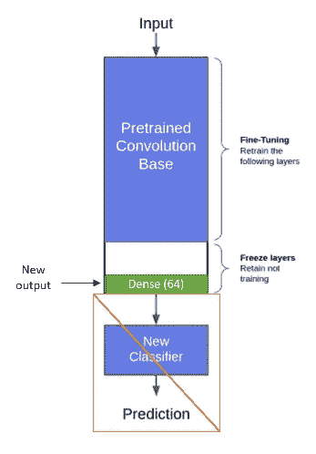
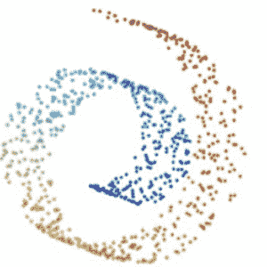
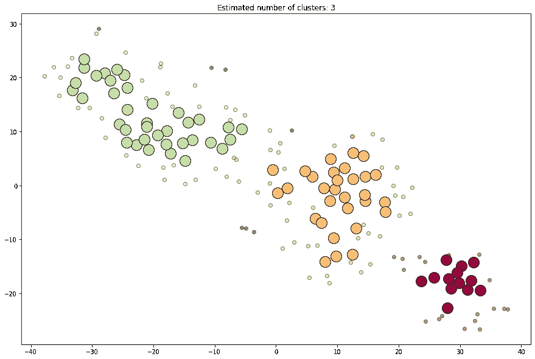
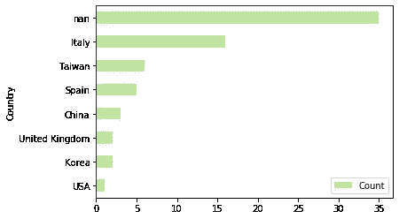
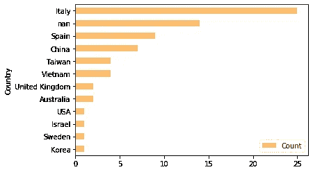
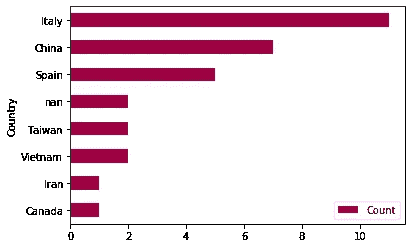

# 利用新冠肺炎 X 射线图像发现病毒变异

> 原文：<https://medium.com/analytics-vidhya/using-covid-19-x-ray-images-to-discover-variants-of-virus-mutation-bcfa89b80189?source=collection_archive---------32----------------------->


由 [Unsplash](https://unsplash.com?utm_source=medium&utm_medium=referral) 上的[融合医学动画](https://unsplash.com/@fusion_medical_animation?utm_source=medium&utm_medium=referral)拍摄的照片

***免责声明:*** *本帖探讨的方法和技术是为了教育和分享的目的。这不是一项科学研究，也不会发表在期刊上。*

> **TL；DR** : 最终，项目结果是**不确定的**数据集中缺少的国家字段太多**数量**样本量太小**。但是项目设法将数据集分成 3 个集群**，这可能只是运气，也可能表明在其他研究论文中发现的病毒 3 集群。

# 这个项目的动机

这个项目是我的另一篇关于使用 X 射线图像进行分类的文章的延伸。该项目以“不够好”作为一个权宜之计，以识别携带新冠肺炎病毒的无症状者而告终。所以为了进一步探索，我想到了有没有可能利用在模型中学习到的特征来识别病毒的变种。

[](/analytics-vidhya/classification-of-covid-19-x-ray-images-with-keras-and-its-potential-problem-e31b3ff16f24) [## 基于 Keras 的新冠肺炎 X 射线图像分类及其潜在问题

### 免责声明:在这篇文章中探索的方法和技术是为了教育和分享的目的。这不是一个…

medium.com](/analytics-vidhya/classification-of-covid-19-x-ray-images-with-keras-and-its-potential-problem-e31b3ff16f24) 

**病毒的变种**

新冠肺炎病毒像其他病毒一样，每次感染宿主后都有机会变异并改变其基因组。世界各地的实验室都在努力收集患者身上的病毒并对其进行测序，以便绘制出该病毒的家谱。

所以为什么识别病毒的基因变化很重要。

*   不同的病毒变种会有不同的传染程度
*   某种类型的病毒比其他的更严重
*   病毒可能对抗病毒药物或检测产生耐药性

> **转引自世卫组织论文《新冠肺炎基因组的变异分析》**
> 
> 随着时间的推移，越来越多的患者被感染，人们担心病毒会积累更多的变种，并可能出现毒性更强的毒株。因此，根据变异、患者概况、地理位置、症状和治疗反应来跟踪和表征它们是至关重要的。
> 
> [https://www.who.int/bulletin/online_first/20-253591.pdf](https://www.who.int/bulletin/online_first/20-253591.pdf)

有了以上对什么是项目的理解，让我们开始吧。

# **总结**

以下是用于对我们的模型所学习的特征进行聚类的步骤。

1.  为特征提取定制模型
2.  降维(主成分分析与 t-SNE)
3.  DBSCAN 聚类
4.  计算 DBSCAN 的分数
5.  t-SNE 和 DBSCAN 网格搜索
6.  解释结果

# **1。定制特征提取模型**



从模型中提取特征

我们需要从我们训练过的模型中提取出*学习过的特征*。这可以通过移除分类层并直接访问密集层来实现。这听起来可能很复杂，但我们需要做的就是从模型中弹出层，并重定向模型的输出。

```
# removing final 2 layers exposing dense_26 
model.layers.pop()
model.layers.pop()# Reconstruct the model to output features
model = Model(inputs=model.input, outputs=**model.get_layer(‘dense_26’).output**)
model.summary()
```

# 2.降维(主成分分析与 t-SNE)

降维是减少特征数量以降低数据集维数的过程。这让我们可以更好地想象或处理一些下游任务。（😂*试着想象一个 64 维的数据图是什么样子。*)

**主成分分析**



[PCA 无法处理这个](https://mlexplained.com/2018/09/14/paper-dissected-visualizing-data-using-t-sne-explained/)

主成分分析在 1933 年首次引入，它是最常用的降维方法之一，因为它使用起来快速简单。PCA 通过保持总体方差来创建低维嵌入。但是它有一些缺点， **PCA 是线性投影**这意味着它不能捕捉非线性数据分布。

**T 分布随机邻居嵌入(t-SNE)**

快进到 2008 年，t-SNE 是由劳伦斯·范德·马滕斯和杰弗里·辛顿开发的。与 PCA 不同， **t-SNE 是一种非线性投影**，它通过计算成对距离或局部相似性之间的相似性度量来实现这一点。作者(

以下是使用 t-SNE 所需的参数，并附有简短说明。

> **n_components:** 嵌入空间的尺寸。我们的输出维度。
> 
> **困惑:**关于如何在数据的局部和全局方面平衡注意力。通常应该比**的数据点数**少，当**等于**的数据点数时**就会产生意想不到的行为。**

由于主成分分析和 t-SNE 都不是聚类算法，当你绘制它们时，它们可能看起来是分段的，但我们仍然需要对提供的数据点进行聚类。这就是 DBSCAN 发挥作用的地方。

# 3.DBSCAN 聚类

不像大多数流行的聚类算法，如 K-Means 和凝聚聚类，需要我们提供 n 个聚类作为算法的参数。DBSCAN 不要求我们在进行聚类时预先猜测聚类的数目。DBSCAN 使用基于距离的度量(欧几里德距离)和最少数量的点来确定密集区域。

> **eps:** 指定每个点应该有多接近才被认为是聚类的一部分。较低意味着点需要更近才能考虑聚类
> 
> **最小样本:**指定形成密集区域的最小点数。较高的平均值需要更多的点来表示密集区域。

正如我们可以立即看到的，找到降维和聚类的最佳参数并不是一件容易的事情。我们会天真地尝试错误来度过这一关。我们需要某种评分来帮助我们确定哪些参数最适合我们的数据集。

等等，让我想想。

# 4.计算 DBSCAN 的分数

这是我想多了的结果，我的尝试很简单。我们想要的是让每个集群尽可能平衡。在示例中，我们不希望两个集群中的一个只有一个数据点，而另一个有所有其余的点。我们不希望有很多异常值，这意味着该算法只是聚类一些点，其余的都是异常值。

以下函数将为 DBSCAN 提供一个分数。它并不完美，但对我的项目来说，它似乎工作得很好。

```
def compute_dbscan_score(db_labels):
    """
    Attempt to find the best DBSCAN parameters by calculating how clusters are balanced
    """
    # forming cluster dictionary
    cluster_dic = dict(Counter(db_labels))

    # Compute the difference in number of nodes of each clusters
    # The lower the value, the better cluster is formed
    # print(cluster_dic.values())
    max_value = np.amax(list(cluster_dic.values()), axis=0)
    score = 0
    for key in cluster_dic.keys():
        if key != -1: # not outliers class 
            score += max_value - cluster_dic[key]
        else: # we want as less outlier as possible
            score += cluster_dic[key]
    return score
```

得分功能完成后，剩下的就简单了。来点暴力搜索怎么样？🤣

# **5。** t-SNE 和 DBSCAN 网格搜索

这部分是最容易理解的，我们循环遍历所有可能的参数组合，找到我们的函数提供的最佳得分。以下只是我们正在查看的参数。

```
total records: 179 recordsmin_cluster = 3
max_cluster = 8
eps_range = np.arange(0.1, 2.0, 0.1)
min_samples = np.arange(5, 20, 1)
perplexity = np.arange(1, 180, 1)
```

大约需要… 19 x 14 x 179 = 47，614 次迭代。是时候来点☕.了


只需要等一会儿我们的结果。

```
[{'eps': 0.1,
  'min_samples': 5,
  'n_clusters': 4,
  'score': 31,
  'perplexity': 179},
 {'eps': 0.4,
  'min_samples': 19,
  'n_clusters': 4,
  'score': 47,
  'perplexity': 178},
 {**'eps': 0.4,
  'min_samples': 14,
  'n_clusters': 3,
  'score': 48,
  'perplexity': 17}**]
```

从结果来看，我们将忽略前两个，因为困惑太高，回想一下，在我们的总数据点附近的困惑将导致 SNE 霸王龙行为怪异。所以第三个结果将是我们的最佳参数。

# **6。解读结果**



根据我们的最佳参数形成的 3 个集群

最后，绘制的结果显示了 3 个集群。我记得读过关于新冠肺炎病毒 A 型、B 型和 C 型变种的新闻报道。这让我非常兴奋，但我们需要进一步探索每个集群，看看它们是否是来自特定国家或地区的病例。

 [## 新冠肺炎:基因网络分析提供了疫情起源的“快照”

### 系统发育技术的首次使用表明，与蝙蝠最接近的“祖先”病毒基因组不是武汉的…

www.sciencedaily.com](https://www.sciencedaily.com/releases/2020/04/200409085644.htm) 

> 引自以上文章
> 
> 该团队使用了 2019 年 12 月 24 日至 2020 年 3 月 4 日期间从世界各地采样的病毒基因组数据。研究揭示了新冠肺炎的三种不同的“变种”，由紧密相关的 T2 血统组成，他们被 T4 命名为“A”、“B”和“C”。
> 
> **A 型，**“原始人类病毒基因组”——在武汉存在，但令人惊讶的是，它并不是这座城市的主要病毒类型。据报道，在居住在武汉的美国人中发现了变异的 A 型病毒，在来自美国和澳大利亚的患者中发现了大量的 A 型病毒。
> 
> 武汉的主要病毒**型、**B 型在来自东亚**的患者中流行**。然而，如果没有进一步的突变，这种变异不会在该地区传播太远——研究人员说，这意味着在武汉有一个“创始人事件”,或者在东亚以外对这种类型的新冠肺炎有“抵抗力”。
> 
> **‘C’变异**是主要的**欧洲型**，在来自**法国、意大利、瑞典和英国的早期患者中发现。**这项研究的中国大陆样本中没有这种物质，但在新加坡、香港和南韩有。

```
Labels distribution: {Red: 31, Yellow: 71, Green: 70, outliers: 7}
```



绿色集群(70)



黄色集群(71)



红色集群(31)

从表面上看，数据显示这些国家是分散的，我们无法断定其中任何一个集群是否属于新冠肺炎病毒的变种。如果我们有更多的数据和更少的“nan”类，我们也许能够做一些明智的猜测。目前，我们必须等待科学界提供更多的研究材料，并收集更多的 x 光片供未来研究。

感谢阅读到最后。呆在室内，注意安全，记得洗手。


即使外夫来访，也要呆在室内。

**参考文献**

[](https://github.com/Niellai/ObjectDetection/blob/master/8_COVID19%20Clustering.ipynb) [## niel lai/对象检测

### permalink dissolve GitHub 是 4000 多万开发人员的家园，他们一起工作来托管和审查代码，管理…

github.com](https://github.com/Niellai/ObjectDetection/blob/master/8_COVID19%20Clustering.ipynb) [](https://mlexplained.com/2018/09/14/paper-dissected-visualizing-data-using-t-sne-explained/) [## 论文剖析:“使用 t-SNE 可视化数据”解释

### 通过将高维数据投影到低维空间来可视化高维数据是任何人…

mlexplained.com](https://mlexplained.com/2018/09/14/paper-dissected-visualizing-data-using-t-sne-explained/) [](https://www.scmp.com/news/china/science/article/3079491/deadly-coronavirus-comes-three-variants-researchers-find) [## 科学家称，致命病毒已变异成三种版本

### A 型、B 型和 C 型都来自于最初在蝙蝠身上发现的病原体，但根据……

www.scmp.com](https://www.scmp.com/news/china/science/article/3079491/deadly-coronavirus-comes-three-variants-researchers-find)  [## 新冠肺炎:基因网络分析提供了疫情起源的“快照”

### 系统发育技术的首次使用表明，与蝙蝠最接近的“祖先”病毒基因组不是武汉的…

www.sciencedaily.com](https://www.sciencedaily.com/releases/2020/04/200409085644.htm) [](https://academic.oup.com/nsr/advance-article/doi/10.1093/nsr/nwaa036/5775463?searchresult=1) [## 论新型冠状病毒的起源和持续演变

### 抽象。新型冠状病毒疫情于 2019 年 12 月下旬在中国武汉开始，此后影响了很大一部分…

academic.oup.com](https://academic.oup.com/nsr/advance-article/doi/10.1093/nsr/nwaa036/5775463?searchresult=1)