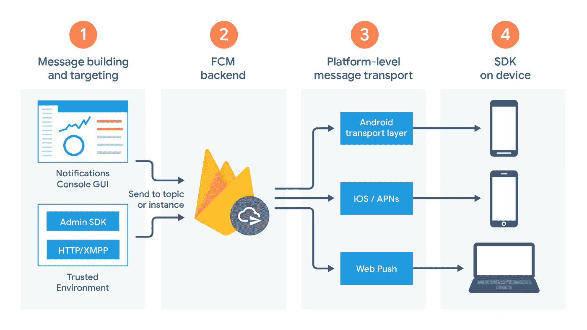
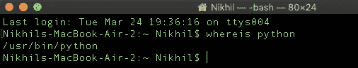

# 使用 Cron 作业部署 FCM 推送通知

> 原文：<https://medium.com/analytics-vidhya/using-cron-jobs-to-deploy-fcm-push-notifications-6c3ef1a375c7?source=collection_archive---------6----------------------->


P ush 通知是应用程序使用的第一个也是最重要的沟通渠道。几乎每个主要的应用程序都使用推送通知来处理交易和重新参与。这是每个产品必不可少的跟踪指标。最近的一项研究显示，移动用户平均每天收到 63.5 条通知，其中大部分来自消息和电子邮件应用。

# 我们开始吧！！

以下库将用于实现自动推送通知服务: *Firebase Messaging Android SDK
pyfcm
python-crontab*

> 使用 MySQL 客户端的完整实现可从[这里](https://github.com/nikhil-sachdeva/parati-notifications)获得。

## 本教程可以分为 3 个步骤:

1.  在应用程序中集成 Firebase 和 FCM 服务。
2.  使用 *pyfcm 实现通知服务。*
3.  通过 *python-crontab 使用 Cron 作业自动化服务。*

## 第一步

使用[官方文档](https://firebase.google.com/docs/android/setup)和 [firebase 控制台](https://console.firebase.google.com/)将 Firebase 集成到 app 中。然后，将云消息 Android 库的依赖项添加到您的模块(应用程序级)Gradle 文件(通常是`app/build.gradle`)中:

```
implementation 'com.google.firebase:firebase-messaging:20.1.2'
```

根据 [Firebase 文档](https://firebase.google.com/docs/cloud-messaging/android/client)上的教程创建`[FirebaseMessagingService](https://firebase.google.com/docs/reference/android/com/google/firebase/messaging/FirebaseMessagingService)` 。

使用`onNewToken`方法检索 FCM 令牌。服务将使用此令牌向设备发送推送通知。理想情况下，对于每个用户的生命周期，在用户“登录”时将令牌发送到服务器。为此，请实现以下方法。

```
FirebaseInstanceId.getInstance().getInstanceId()
        .addOnCompleteListener(new OnCompleteListener<InstanceIdResult>() {
            @Override
            public void onComplete(@NonNull Task<InstanceIdResult> task) {
                if (!task.isSuccessful()) {
                    Log.w(TAG, "getInstanceId failed", task.getException());
                    return;
                }

                // Get new Instance ID token
                String token = task.getResult().getToken(); sendTokenToServer(token);

            }
        });
```

将使用 *sendTokenToServer()* 方法将令牌发送到后端数据库，以便根据每个用户 ID 进行存储。例如，在 REST 框架中，可以在这里调用 POST 查询，根据每个用户 ID 保存令牌。



FCM 架构

## 第二步

现在我们将使用`[olucurious/PyFCM](https://github.com/olucurious/pyfcm)` 库向多个设备发送推送通知。有两种方法可以做到这一点— >要么为设备订阅一个主题，要么向 FCM 令牌列表发送通知。使用
firebase console->Settings->Cloud Messaging 获取 API 密钥。

## 使用 pyfcm 发送到 FCM 令牌列表:

在这种方法中，只有服务器端代码必须编写如下。运行这个 python 脚本会将消息作为通知发送给设备列表，这些设备的 FCM 令牌被添加到*registration _ id 列表中。*

```
# Send to single device.
from pyfcm import FCMNotificationpush_service = FCMNotification(api_key="<api-key>")# Send to multiple devices by passing a list of ids.registration_ids = ["<device registration_id 1>", "<device registration_id 2>", ...]
message_title = "Uber update"
message_body = "Hope you're having fun this weekend, don't forget to check today's news"
result = push_service.notify_multiple_devices(registration_ids=registration_ids, message_title=message_title, message_body=message_body)

print result
```

## 使用主题订阅发送通知:

客户端代码:

```
FirebaseMessaging.getInstance().subscribeToTopic("weather")
        .addOnCompleteListener(new OnCompleteListener<Void>() {
            @Override
            public void onComplete(@NonNull Task<Void> task) {
                String msg = getString(R.string.msg_subscribed);
                if (!task.isSuccessful()) {
                    msg = getString(R.string.msg_subscribe_failed);
                }
                Log.d(TAG, msg);
                Toast.makeText(MainActivity.this, msg, Toast.LENGTH_SHORT).show();
            }
        });
```

服务器端代码:

```
push_service = FCMNotification(SERVER_KEY)
tokens = [
    <registration_id_1>,
    <registration_id_2>,
]

subscribed = push_service.subscribe_registration_ids_to_topic(tokens, 'test')
result = push_service.notify_topic_subscribers(topic_name="weather", message_body=message)

result = push_service.notify_topic_subscribers(message_body=message)
```

> 重要提示:在 python 脚本中编写应该触发通知的事件的条件。对于每个 FCM 令牌，检查用户数据库并根据要求创建条件。

## 第三步

现在为了自动化这个脚本并以固定的时间间隔运行它，将使用 [*python-crontab*](https://pypi.org/project/python-crontab/) 。

```
pip install python-crontab
```

在单独的 python 文件中，实现一个新的 Cron 作业，如下所示:

```
from crontab import CronTabcron = CronTab(user='UserName')job = cron.new(command='command')job.minute.every(1)cron.write()
```

在命令中，编写脚本需要遵循的命令。这些命令将作为一个 *sh shell 脚本*从根目录运行。因此，更改保存项目的目录。还有， *python* as 命令不能直接使用。必须在命令中提供其路径。要做到这一点，运行" *whereis python* "如下所示。



查找已安装库的路径。

现在将命令更改为以下内容。

```
job = cron.new(command='cd Documents/project-notifs && /usr/bin/python notifications.py')
```

根据要求确定时间间隔，并运行此 python 脚本。要检查在后台运行的 cron 作业，您可以在终端中运行 *crontab -l* 。如果您希望在 python 脚本中使用库，请确保使用带有 pip install 的 *-H 标志将它们安装在主目录中。*

现在，您可以在您的系统上运行这个 cron 作业，或者在任何[托管网站](https://www.whoishostingthis.com/compare/cron-jobs/)上托管这个作业。

> 在我做的一个项目中找到完整的实现[这里](https://github.com/nikhil-sachdeva/parati-notifications)。