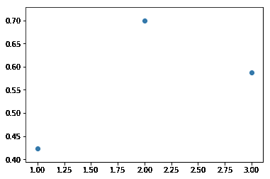
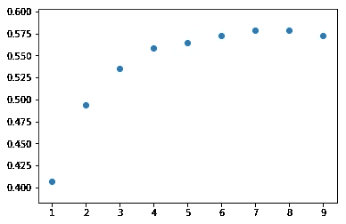

# 使用交叉验证评估不同的模型—回归

> 原文：<https://medium.com/analytics-vidhya/using-cross-validation-to-evaluate-different-models-regression-5f61ec89531?source=collection_archive---------4----------------------->

考虑到大量可用的机器学习模型，选择最适合给定数据的模型非常重要。有许多方法可用于评估模型在特定数据集(R 平方、RMSE 等)上的性能。).

但通常，对训练数据的误差计算可能无法很好地估计模型在某些未知数据上的表现。这个问题的一个可能的解决方案是将数据分成训练集和测试集。将使用训练集来训练该模型，并且使用测试集来执行误差计算。

这种方法在概念上简单且易于实现。但是它有一些潜在的缺点:

1.  测试错误率可能变化很大，具体取决于哪些观察值包含在训练集中，哪些观察值包含在测试集中。
2.  当在较少的观察值上训练时，统计方法往往表现更差。

有一些方法可以克服这些问题。本文将介绍的一种方法是 K-fold 交叉验证。

# **K 倍交叉验证**

这种方法包括将一组观察值随机分成 k 个大小大致相等的组或折叠。第一个折叠被视为一个测试集，模型适合其余的 k1 折叠。然后根据保留折叠中的观察值计算误差。这个过程重复 k 次；每次，不同的观察组被视为一个测试集。这个过程产生了 k 个测试误差估计值。通过平均这些误差值来计算 k 倍 CV 估计值。


[https://sci kit-learn . org/stable/modules/cross _ validation . html](https://scikit-learn.org/stable/modules/cross_validation.html)

# **波士顿房产数据集上的 K 倍 CV**

波士顿住房数据集可在 [Kaggle](https://www.kaggle.com/schirmerchad/bostonhoustingmlnd) 获得。在包含必要的库和处理数据之后，就可以应用模型了。完整的代码可在[这里](https://www.kaggle.com/pranavkaushik/boston-housing/edit)获得。

```
from sklearn.model_selection import cross_val_score
```

cross_val_score 计算应用模型的 R 平方度量。接近 1 的 r 平方误差意味着更好的拟合和更小的误差。

1.  **线性回归**

```
from sklearn.linear_model import LinearRegression
lr = LinearRegression()
np.mean(cross_val_score(lr, X, Y, cv=5))
```

简历得分:

```
0.4237735326662294
```

2.**岭回归**

```
from sklearn.linear_model import RidgeCV
ridge = RidgeCV(cv=5).fit(X, Y)
ridge.score(X, Y)
```

简历得分:

```
0.7172506647287367
```

**3。拉索回归**

```
from sklearn.linear_model import LassoCV
lasso = LassoCV(cv=5).fit(X, Y)
lasso.score(X, Y)
```

简历得分:

```
0.7175254518891412
```

**4。多项式回归**

```
from sklearn.preprocessing import PolynomialFeaturesdef create_polynomial_regression_model(degree):
 poly_features = PolynomialFeatures(degree=degree)
 X_poly = poly_features.fit_transform(X)
 poly = LinearRegression()
 return np.mean(cross_val_score(poly, X_poly, Y, cv=5))poly_cv = []
for i in range(1,4):
 poly_cv.append(create_polynomial_regression_model(i))plt.scatter(range(1,4),poly_cv)
```



通过拟合二次多项式获得最高 CV 值

二次多项式的 CV 分数:

```
0.6989409158148152
```

**5。KNN 回归**

```
from sklearn.neighbors import KNeighborsRegressorcv_score=[]
for i in range(1,10):
 knn = KNeighborsRegressor(n_neighbors= i)
 cv_score.append(np.mean(cross_val_score(knn,X,Y,cv=5)))x = range(1,10)
plt.scatter(x,cv_score)
```



K = 8 时获得的最高 CV 值

K = 8 时的 CV 分数:

```
0.5788133442607475
```

**6。决策树**

```
from sklearn.tree import DecisionTreeRegressor
dt = DecisionTreeRegressor()
np.mean(cross_val_score(dt, X, Y, cv=5))
```

简历得分:

```
0.4254202824604191
```

**7。随机森林**

```
from sklearn.ensemble import RandomForestRegressor
rf = RandomForestRegressor()
np.mean(cross_val_score(rf, X, Y, cv=5))
```

简历得分:

```
0.6654863188252762
```

# **结论**

基于 CV 分数评估了不同的回归模型，观察到与所有其他方法相比，脊/套索回归最适合数据。

我们还可以观察到，对于给定的数据集，完美的线性模型不是很好的近似。

通过观察观察变量和目标变量之间的关系，可以进一步理解各个模型对于给定数据的性能背后的原因。