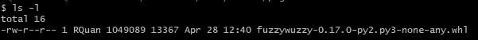
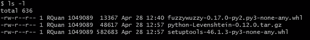
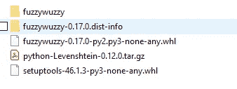
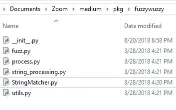
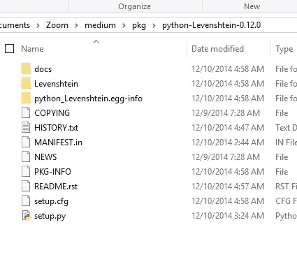
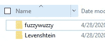
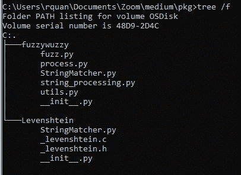
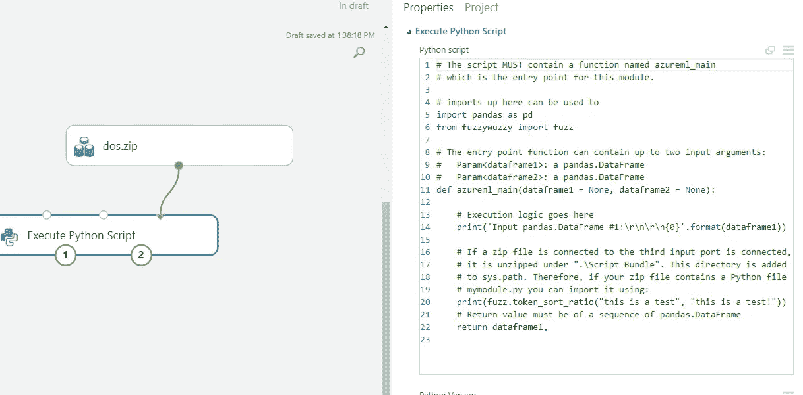
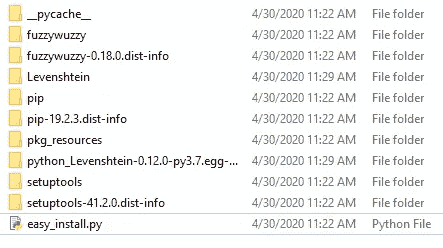

# 在 Azure ML-Python 中使用定制库(两种方法)

> 原文：<https://medium.com/analytics-vidhya/using-custom-libraries-in-azure-ml-python-28e784c41035?source=collection_archive---------5----------------------->

Azure ML 是一个非常棒的服务，可以快速有效地训练、测试和部署 ML 模型。您可以从一系列可用模型中进行选择，并对您的数据进行特征工程，以充分利用 ML 管道。

有时，您可能希望使用自定义 python 脚本来处理数据。我使用自定义脚本进行预处理和后处理。弄清楚如何上传 ML studio 上没有的自定义库是一件痛苦的事情，所以我写了这篇指南来帮助你。

> “你应该包括 azure ml 可能很好，但他们在文档方面很糟糕”
> 
> —同事看完这个。

# 1)(方法一)下载 python。whl 套件

如果你像我一样是个新手，whl 文件基本上是一个 zip 文件，其中包含当你用 python 正常安装时 pip 会自动下载并安装的库文件。

第一步是获取。您想要的库或包的 whl pkg。这可以通过这个简单的命令来完成。注意我们想要的 lirary 是 fuzzywuzzy 0.17，它用于 NLP 中的模糊字符串匹配。在 bash 的新文件夹中运行命令:

> *pip 下载-d . fuzzywuzzy==0.17*

*   pip = Python 包安装程序
*   -d =保存到此目录
*   版本=您可以指定您想要的版本。

现在我们已经下载了 whl，它看起来像这样:

已下载。来自 pip 的 whl 包

我们还需要这个文件的依赖关系。为了检查依赖性，我在 pip 上找到了一个名为 *pkginfo 的定制库。*

> pip 安装 pkginfo

现在，我们可以在 python shell 中运行以下命令:

如图所示，我们需要另一个名为“python-levenshtein (≥0.12)”的依赖项，所以让我们将它下载到同一个文件夹中:

> *pip 下载-d . python-levenshtein==0.12*

原始库的依赖项

现在我们可以看到我们还获得了 setuptools 库。让我们看看这个 whl 是否有必要。

# 2)提取必要的文件和侦探工作

我们实际上并不需要包含在。whl 文件。如果我们使用 winzip 或 7zip 提取 whl，我们会看到一些包包含额外的 dist-info 文件夹或我们不需要的文件。

我们只需要包含基本文件的文件夹:

我们不需要额外的 dist-info 文件夹

FuzzyWuzzy 附带了一个同名的文件夹，其中包含了我们想要的功能，还有一个*dist-info 文件夹，这个文件夹并没有被使用。

模糊文件夹

为了确定我们实际需要的依赖项，让我们研究一下每个 fuzzywuzzy 文件的文件导入。

fuzzy __init__。巴拉圭

fuzzy fuzz.py

模糊字符串匹配器. py

我们找到了依赖！我们可以看到，在 StringMatcher.py 中，我们需要 Levenshtein 导入，因此让我们再次使用 winzip 提取它。

python Levenshtein 依赖性提取

我们可以在这里看到提取的 Levenshtein 文件夹，还有一个 setup.py 文件。setup.py 使用 setuptools，这就是为什么。我们运行 pip 下载时包括了 whl。如果我们检查莱文斯坦的文件夹并调查。我们可以看到它们不依赖于任何其他文件。

所以现在我们可以走了！让我们创建一个**新文件夹**，其中只有我们需要的“*基本*文件。这些文件夹仅与以下名称的文件夹相同:

最需要的文件夹

树内容(cmd 中的树/ f)

# 3)压缩文件夹并发送到 Azure ML

让我们压缩文件夹并上传到数据集下的 Azure ML。这使得我们可以在管道中使用它。确保打开后的压缩文件中包含这两个文件夹。不需要父文件夹。

注意数据集是如何连接的。这是执行 Python 脚本选项的第三次导入。

现在，在执行 Python 脚本中，确保导入了所需的函数。这将自动搜索 zip 中的依赖项。

# 4)检查日志输出以验证其工作

导入的库现在可以工作了，你可以在 ML studio 中使用它的功能了！

我这样做是因为我认为在文档中找不到任何有意义的帮助，我用这个[堆栈溢出帖子](https://stackoverflow.com/questions/44371692/install-python-packages-in-azure-ml)来指导。

# 1)(方法二)使用虚拟环境进行更新

写完这个指南后我学到的一个新方法就是简单地创建一个新的空的虚拟环境。Python 虚拟环境是一个小空间，它使用自己的 python 解释器，并保持其库与实际系统分离。这用于为不同的项目保持特定版本的库分离。

虚拟环境的结构将已安装的包保存在 env/Lib/site-packages 文件夹中。这是从 pip(使用虚拟环境 python)安装的库被保存的地方。我们可以将该文件夹中的内容压缩并发送到 Azure ML。

环境/库/站点包的内容

只需在该级别上压缩并发送到 Azure ML！这一次我们可以包含文件夹中的所有内容。只要记住基本的包，比如 pandas 或 numpy，已经在 Azure ML 上了，所以没有必要在 venv 中再次安装它们。

按如下方式导入库:

感谢阅读！