# 评估大学足球的招募和球员发展

> 原文：<https://medium.com/analytics-vidhya/using-data-science-to-evaluate-recruiting-and-player-development-in-college-football-a8c5c5cd447d?source=collection_archive---------13----------------------->

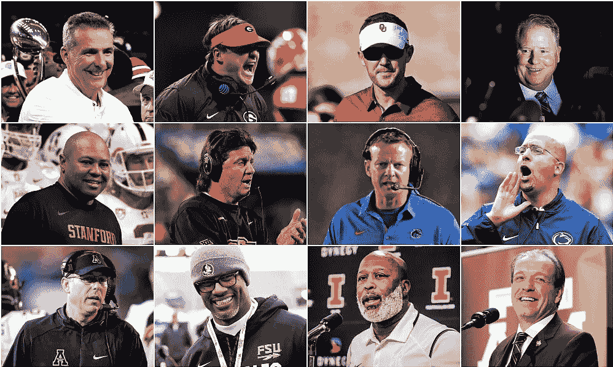

PC:CollegeFootballNews.com

# **背景**

我是一名狂热的大学足球迷，对数据科学有着浓厚的兴趣。对于我第一次深入数据科学，我将使用一些基本的统计和数据处理来评估大学足球教练。

# **定义问题**

足球是任何大学体育系皇冠上的宝石和养家糊口的人。一个成功的足球项目不仅是大学的收入来源，也是一个强大的营销工具，因为研究表明，获胜与捐赠增加、学术声誉和较低的录取率有关。因此，教练拥有巨大的权力和高薪也就不足为奇了。

教练还背负着高期望、低工作保障和平均任期只有 3.8 年的负担。虽然雇佣或解雇教练的决定是一个多因素的过程，但它主要是由他们的记录决定的。因此，一名教练的价值，尤其是对捐赠者和球迷而言，与他们在球场上的表现密不可分。

然而，输赢是由几个因素决定的，其中许多因素超出了教练的控制范围，包括会议从属关系、声望、位置、历史成功和大学的财务投资。因此，教练的记录并不是评估他们价值的最客观的方式。在这个项目中，我们将着手定义一种方法来评估教练，同时尽量减少这些混杂因素的影响。我们开始吧！

# **性能指标**

在大学足球比赛中，有两个主要因素由教练控制，这两个因素决定了比赛的胜负:(1) **招募**和(2) **球员发展**。我们将以此作为评估教练表现的起点。

# **使用的数据集**

为了评估招募能力和球员发展，我们将结合来自四个网站的数据:职业足球参考，247 体育，体育参考和足球数据库。

**247Sports** 提供从 2000 年开始的高中球员和学校的综合招聘排名。我们将提取每个学校的名称，招募排名，招募年份，以及每个球员的国家排名，学校，职位和入学年份。

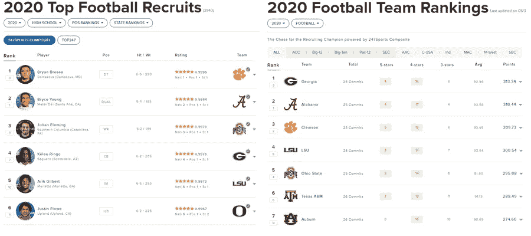

**体育参考**和**足球数据库**提供所有大学球员的比赛日志。这两个网站都将被用来增加找到玩家游戏日志的可能性。我们将提取每个玩家的年度游戏日志，以确定他们在大学生涯中是否转到了另一所学校。任何转会的球员都将被排除在我们的分析之外。

**职业足球参考**提供所有大学球员的选秀信息。我们将提取每个球员的选秀位置。

# **预处理**

**创建数据集** 我们将创建两个数据集进行分析:(1) **玩家**和(2) **学校**。

**球员数据集**将包含以下度量:
(1)球员姓名
(2)学校
(3)国家排名
(4)入学年份
(5)打球位置
(6)选秀位置(如果选秀的话)
(7)转会状态
(8)星级

**学校数据集**将包含以下度量:
(1)学校名称
(2)国家排名
(3)招生年份
(4)蔻驰

我们将使用从 247Sports 获得的球员数据，分别从 Sports Reference/The Football Database 和 Pro Football Reference 中查找比赛日志和选秀位置。利用几个网站提取玩家数据的一个问题是确保它与正确的玩家相关联。例如，在 247 体育数据库中有 11 个名为布兰登·琼斯的运动员。为了将每个独特的布兰登·琼斯与其正确的游戏日志和选秀位置相匹配，我们将首先检查网站之间的学校名称是否匹配。为了防止学校有多个同名球员，我们还会检查球员的比赛日志和选秀年份是否在 247Sports 上列出的大学入学年份的 5 年内。

匹配球员数据的另一个问题是，球员的名字在不同网站上的拼写可能有所不同。对于名字中有特殊字符的球员来说尤其如此，比如罗纳德·琼斯二世、多诺万·人民-琼斯、A.J .埃佩内萨和 D'Andre Swift。为了纠正这一点，我们将在查找球员数据时删除球员名字中的所有特殊字符。

注:关于教练及其关联学校的信息是在一个大学足球网站上以 CSV 格式找到的，而不是从上述任何网站中提取的。

**检查数据集** 首先，让我们了解一下我们从 247 项运动中抽取的运动员人数，以及这些运动员中有多少比例被选中。

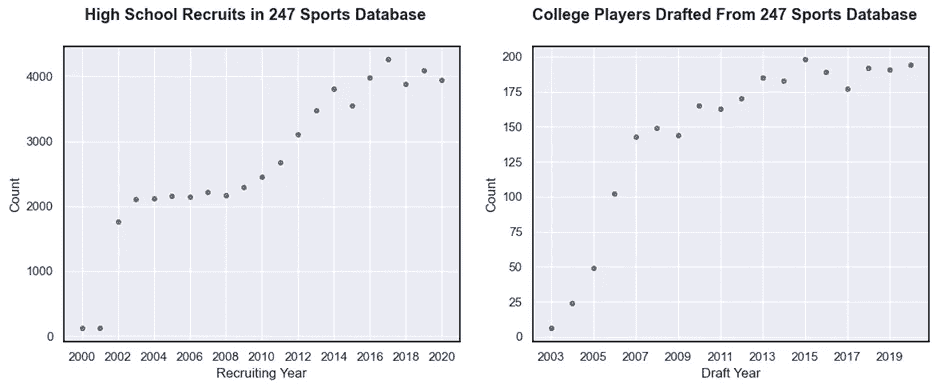

我们可以看到，247Sports 在 2000 年就开始对球员进行排名，但直到 2002 年才开始对大量球员进行排名。从 2000 年到 2020 年，我们数据集中的球员总数是 56，447 人，其中 2，624 人被选中。NFL 每年招募大约 256 名球员，这意味着在 20 年的时间里应该有 5120 名球员被选中。

这种差异有几个原因。首先，2003 年至 2006 年间入选的运动员人数低于预期，因为这些运动员是 1998 年至 2003 年间的高年级学生，要么是在 247 运动开始之前，要么是在排名较少的早期。2007 年至 2020 年间被选中的球员人数从 150 人到 200 人不等，更接近预期的 256 人。剩下的未被说明的球员可能是因为 247Sports 没有将这些球员列为高中毕业生。

# **数据分析**

**招募能力** 教练的招募能力将通过他们各自学校的招募排名来评估。然而，学校排名会受到会议从属关系、位置和历史成功的影响。为了说明这些潜在的混杂因素，我们将创建一个标准化的招聘分数。

首先，我们将对每所学校的招聘排名分布应用 box-cox 变换。简而言之，box-cox 变换是一种统计技术，可用于将偏态分布转换为正态分布。虽然可以从偏斜分布中创建标准化分数，但是如果基础数据是正态分布的，则可以做出更有意义的解释。

接下来，对于教练任职的每一年，我们将从学校的平均招聘排名中减去该年学校的招聘排名，然后除以学校招聘排名的标准差。

然后，我们将取中间值，为每位教练创建一个单一的标准化招聘分数。我们将使用中间值而不是平均值来保持方向性。正的招聘分数将表明教练超出了学校的招聘预期，而负的分数将表明教练低于预期。

**球员发展** 我们将使用**选秀位置**和**被选中的可能性**作为球员发展的代理措施。首先，我们需要考虑两个潜在的混淆因素:(1)星级和(2)位置组。

简而言之，247Sports 根据每个球员在大学和 NFL 级别的预期潜力，给他们分配 2 到 5 颗星的评级。据 247Sports 报道，五星级球员有望获得首轮选秀权，而二星级球员在 NFL 的潜力有限。虽然评级系统并不完美，但拥有高排名球员的学校往往比拥有低排名球员的学校胜率更高。因此，我们希望看到基于星级的选秀位置的差异。这是有问题的，因为教练的球员发展分数会直接受到他们招募能力的影响。位置组是另一个潜在的混淆因素，因为 NFL 球队可能会重视某些位置组。

我们来看看基于星级和岗位群的选秀岗位是否有差异。对于星级评定，我们将三星级玩家分为 3-、3-和 3+等组，因为这一组约占所有玩家的 50%，对其进行划分将为确定组差异提供额外的解决方案。我们将使用 Kruskal-Wallis 和 Dunn 的非参数检验进行分析，因为星级和职位组的基础数据不是正态分布的。

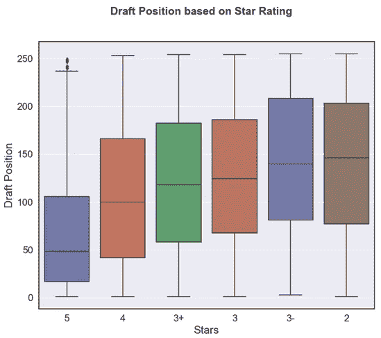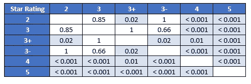

我们可以看到星级与选秀位置显著相关(χ (5) =186，p < 0.001). Pairwise comparisons show 5-star and 4-star players are drafted significantly higher than all lower rated players. 3+ star players are drafted significantly higher than 3- and 2 stars, but not 3 stars.

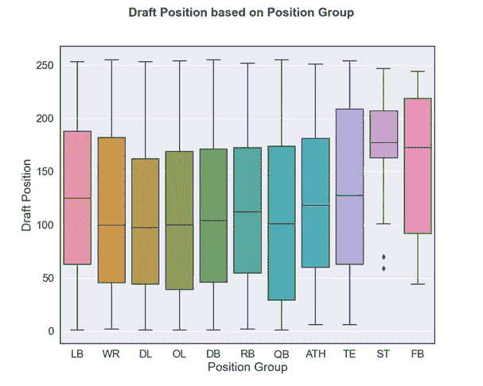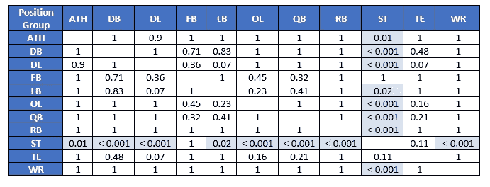

Position group is also significantly associated with draft position (χ²(10) =51, p < 0.001). However, this difference is primarily driven by special teams, who are drafted significantly lower than all position groups except for fullback and tight end. Therefore, we will not account for position group in our analysis of player development.

**选秀位置** 首先，我们将对与每个星级相关的选秀位置应用 box-cox 变换。接下来，我们将为每个球员创建一个标准化的选秀位置分数，方法是从具有相同星级的所有球员的平均选秀位置中减去该球员的选秀位置，然后除以这些球员的选秀位置的标准偏差。

对于每位教练，我们将采用与他们所指导的球员相关的标准化选秀位置得分的中值。同样，我们将使用中间值而不是平均值来保持方向性。积极的球员发展分数将表明教练的球员比预期的更高(更好)，而消极的分数将表明教练的球员比预期的更低(更差)。

**被选中的可能性** 首先，我们来看看被选中的可能性是否与星级有关。

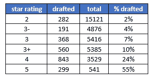

我们可以看到，球员被选中的比例与球员的星级呈正相关。为了说明星级作为一个混杂因素，让我们首先计算每个星级的入选概率的相对差异，方法是用所有入选球员的百分比减去教练带领下的入选球员的百分比，然后除以所有入选球员的百分比。

然后，我们将采用中间值为每位教练创建一个单一的选秀概率得分。接下来，我们将应用 box-cox 变换来标准化所有教练的选秀概率分布。最后，我们将通过用所有教练的平均选秀概率减去教练的选秀概率，并除以所有教练的选秀概率的标准偏差，来为每个教练创建标准化的选秀概率分数。

正的球员发展分数将指示与其他教练相比，球员被该教练选中的可能性更高，而负的分数将指示与其他教练相比，球员被该教练选中的可能性更低。

# **我们的发现**

让我们首先看看球员发展(通过选秀位置)和从 power-5 大会招募现役教练的能力。所有结果测量值都报告为平均值的标准偏差数。提醒一下，积极的招聘分数表明教练的表现超过了学校的平均招聘排名。积极的选秀位置得分表明教练的球员比他们根据星级评定的预期选秀位置更高(更好)。没有至少 5 名球员入选的教练被排除在这些数字之外，因为很难有意义地解释小样本规模的球员发展。

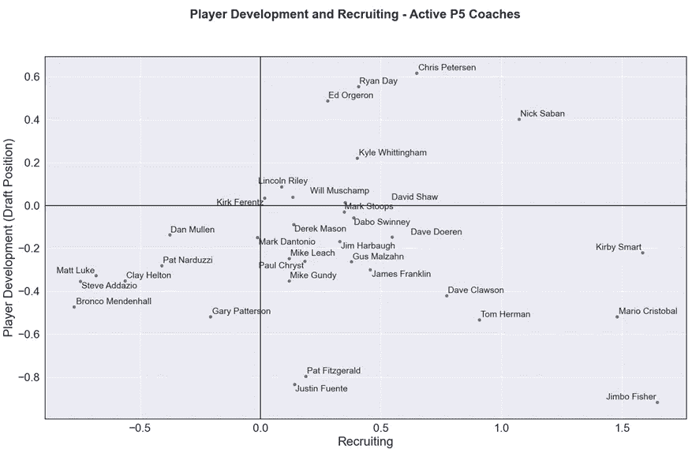

我们可以看到两组与众不同的教练。在球员发展方面，瑞恩·戴、埃德·奥杰伦、克里斯·彼得森和尼克·萨班领先，他们训练的球员比他们预期的选秀位置高出至少 0.4 个标准差。在招聘方面，Kirby Smart、Mario Cristobal 和 Jimbo Fisher 排名最高，他们的招聘比各自学校的历史招聘排名至少高出 1.4 个标准差。

接下来，让我们从选秀位置和选秀概率两个方面来进一步了解球员发展。提醒一下，一个正的选秀概率分数表明一个球员比其他教练更有可能被那个教练选中。

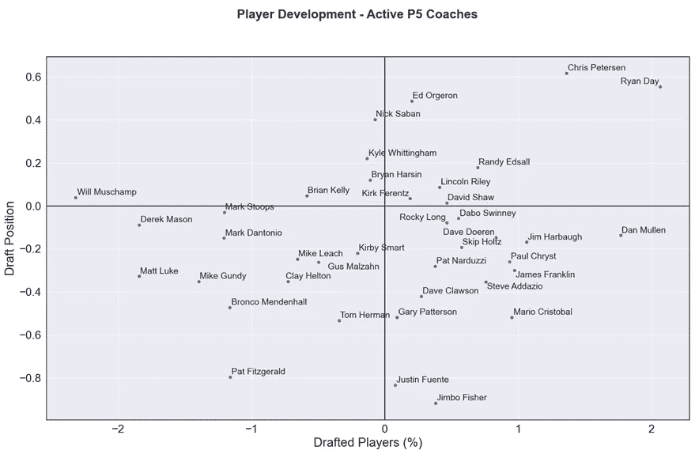

在右上象限中，我们可以看到那些表现好于平均水平的教练，他们不仅让球员被选中，而且让他们比预期的更高(更好)被选中。我们可以看到瑞恩·戴和克里斯·彼得森在球员发展方面脱颖而出。在左下象限的是在这两个方面表现不佳的教练，这样他们的球员被选中的比例较低，而那些被选中的球员被选中的比例比预期的低(更差)。

在右下方的象限中，教练在让球员被选中方面表现好于平均水平，但在让球员被选中达到或超过他们预期的位置方面表现差于平均水平。令人惊讶的是，詹姆斯·福兰克林、吉姆·哈博和达波·斯温尼这些有着精英级成功记录的教练都属于这一类。相反，尼克萨班属于左上象限，因此他对球员的选秀位置评价很好，但在让球员被选中方面略低于平均水平。

当查看这两个图时，我们注意到在极端情况下的几个数据点与相对较新的教练相关联。例如，瑞恩·戴在球员发展方面评价很高，但他只是俄亥俄州立大学第一年的教练。很可能在瑞恩·戴手下被选中的球员也是他的前任 Urban Meyer 在他到来之前培养的。如果被选中的球员的发展主要是基于前任教练的教导，这可能会导致一个正偏差的球员发展分数。相反，吉博·费舍尔在球员发展方面的低评级可能是他在德州农工大学短短两年任期内继承了发展不佳的球员的结果。

招聘不像球员发展那样受教练任期的影响，但新教练可能会给学校带来新的兴奋，从而暂时人为地促进招聘。例如，Mario Cristobal 是一名第一年的教练，他的高招募分数可能是由于非凡的招募能力和项目中重新燃起的激情的结合。

为了减轻新教练对我们数据的影响，我们将删除经验少于 5 年的教练，这样所有剩余的教练都至少有一门他们招募、培养和毕业的完整课程。

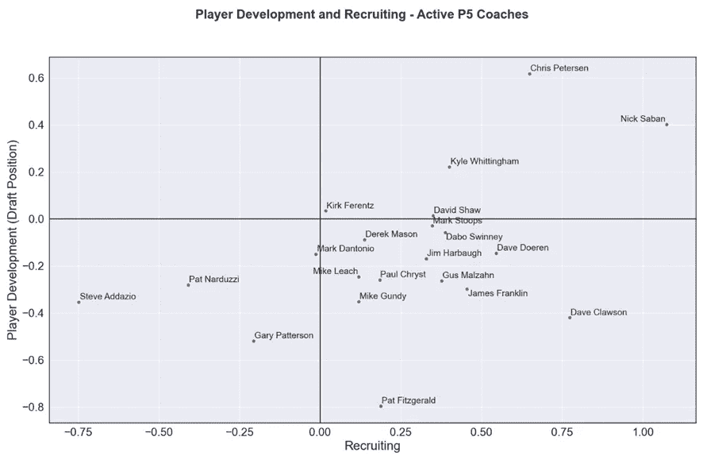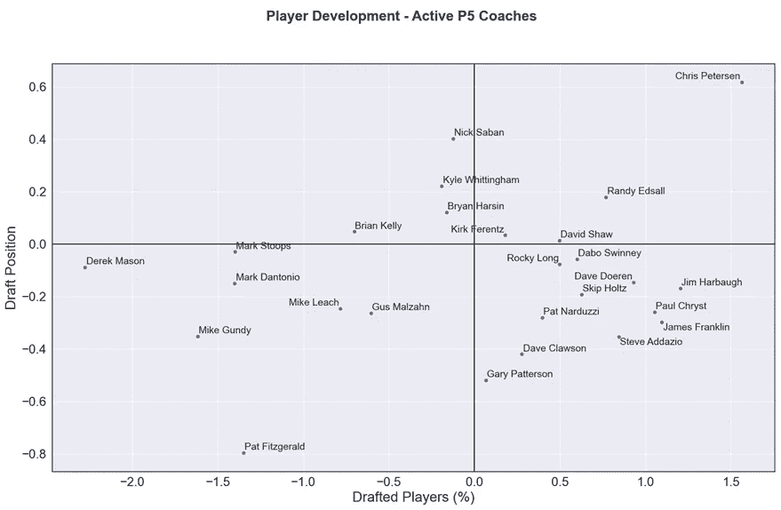

我们可以看到，在所有在各自学校执教至少 5 年的教练中，克里斯·彼得森在整体球员发展方面得分最高。当球员发展和招募能力放在一起时，尼克萨班是教练中最高的。最后，让我们来看看这些活跃的教练与 2000-2020 年间所有教练任期至少为 5 年的教练相比如何。注意:如果教练在此期间执教过几支球队，他们可能会被多次列出。

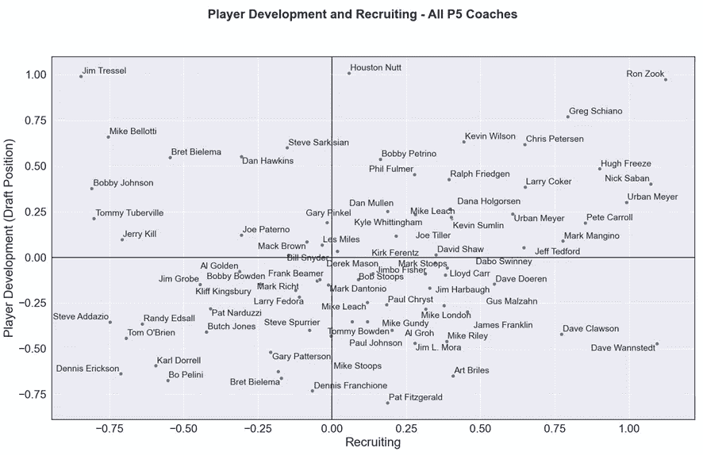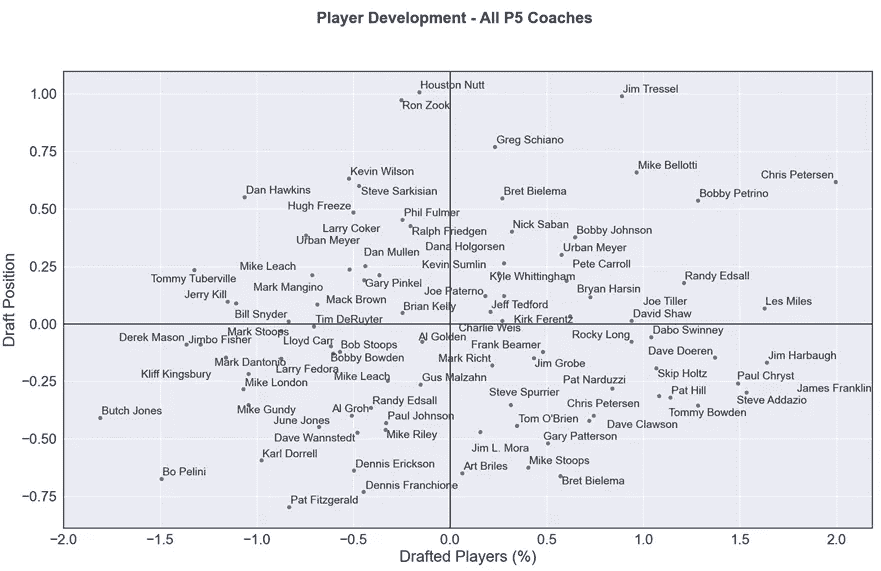

我们可以看到，在历史上，吉姆·特雷塞尔、罗恩·祖克和休斯顿·纳特在使用选秀位置作为球员发展的衡量标准时得分最高。在球员发展和招募能力方面，罗恩·祖克总体得分最高。当选秀位置和选秀概率一起考虑时，克里斯彼得森是所有教练中最高的。

# **结论**

我们对大学足球教练表现的分析提供了一些有趣的见解，我们的许多发现与媒体和球迷的看法相关。例如，尼克·萨班被许多人广泛认为是大学足球的最佳教练，我们的分析也同意这一点，因为在考虑球员发展和招募能力时，他在所有现役教练中排名最高。克里斯·彼得森被认为是一位可以在精英级别上赢得低排名球员的教练，他在博伊西州和华盛顿的成功反映了这一点。我们的研究结果与这种看法一致，他在选秀可能性和选秀位置上得分最高，这是我们衡量球员发展的两个指标。

总的来说，我们开发了一种新的方法来评估教练的表现，这种方法不依赖于简单的输赢，而输赢往往受到教练控制之外的因素的影响，如会议从属关系、声望、位置、历史成功和大学的财务投资。然而，有几个重要的限制需要记住。首先，我们的球员发展和招募分数的准确性对教练任期高度敏感。新教练招募的人可能比他们的实际能力更好或更差，这取决于他们到来之前学校的记录或他们到来后产生的轰动效应。新教练的球员发展分数也可能受到前任教练对其球员发展程度的影响。第二，历史上以精英水平招聘的学校的教练，在超出学校平均招聘排名的程度上将受到限制。最后，教练职业的十字转门性质意味着大多数教练的数据有限，很难对他们的招募和球员发展能力做出准确的解释。

然而，虽然这些发现应该谨慎解释，但它们确实提供了一个教练在招募能力和球员发展方面与同行相比的基本见解。我希望这篇文章将引发进一步的讨论，并作为探索评估教练表现的新方法的跳板。我的代码可以在 GitHub 上获得，我非常欢迎对本文中使用的统计技术的任何反馈或改进建议。