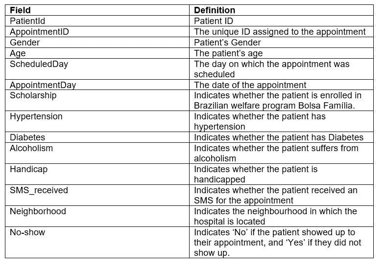
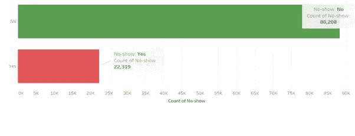
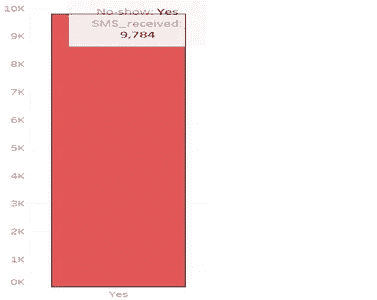
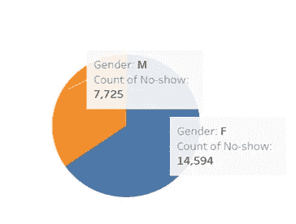
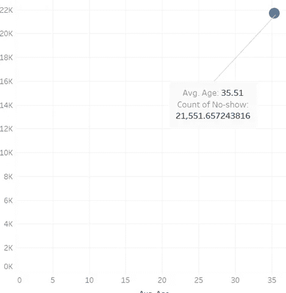
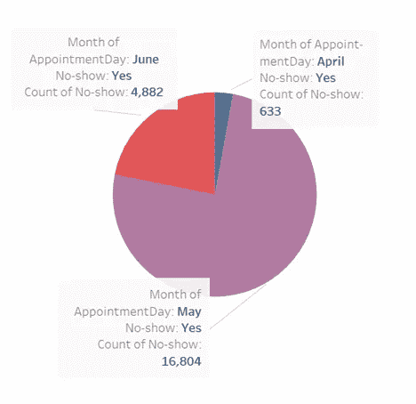
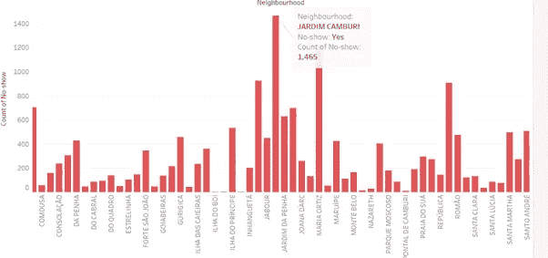
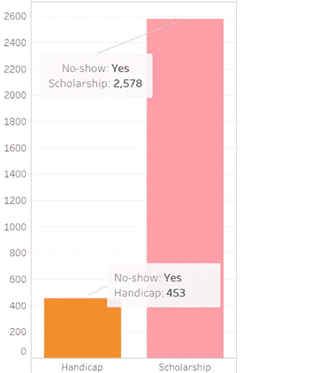
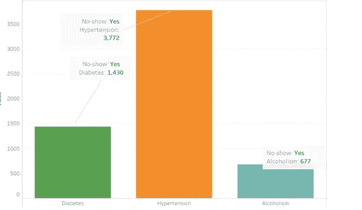

# 使用数据确定可能错过医院预约的患者类型

> 原文：<https://medium.com/analytics-vidhya/using-data-to-determine-the-types-of-patients-likely-to-miss-their-hospital-appointments-df4b4ce756f6?source=collection_archive---------15----------------------->

使用 Tableau 讲述数据故事

来源于[everseat.com](https://www.everseat.com/blog/4-reasons-your-patients-cancel-appointments-at-the-last-minute/)

医院通常要求病人在看医生或专家时预约。然而，我们有时会遇到这样的情况，病人错过了他们的预约，并且没有给出原因。
假设我们要识别定期‘失约者’，基于记录的信息，我们能不能确定失约患者的特征。从而为这些病人建议替代方案，并确保医生不会浪费时间等待他们。

在本文中，我们将使用 Kaggle 中的 [**错过的约会数据集**](https://www.kaggle.com/catherinenewcomb/attendance-of-medical-appointments-in-brazil) 。它包含有关巴西患者进行的 100K 次医疗预约的信息、他们的特征和预约信息，以及他们是否参加了预约(未出现)。以下是对这些功能的描述:

所以，让我们开始吧…

***我们是不是有更多的患者错过了预约？***

我们可以看到，我们有更少的患者错过了他们的预约，在 100，000 次预约中大约有 22，319 次。

我们感兴趣的是错过预约的患者，因此对于该任务的其余部分，我们将过滤数据并集中于那些没有赴约的患者。

***他们收到短信了吗？***

在 22 319 名“失约者”中，只有不到 50%的人收到了约会短信。那可能是他们没有出现的原因。很可能他们像我们一样忘记了。

***哪种性别的人在我们的‘失约者’中占大多数？***

我们的‘失约者’似乎大多是女性，约占‘不洗澡者’的 65%。

***‘失约者’的平均年龄？***

大多数错过预约的患者年龄在 35 岁左右。

哪个月我们记录了更多的“失约者”？

五月似乎是我们“不露面者”(值得调查的事情)的最爱。仅在 5 月份就有 16 804 人没有赴约。

大多数错过的约会是在哪个街区记录的？

贾尔迪姆·坎布里社区记录了 1 465 次失约，是其他社区中最高的。有什么原因吗？🤔。

我们的‘失约者’是残疾人吗？他们有政府奖学金吗？

很明显，我们的“缺席者”中只有少数是残疾人。因此，这不可能阻止他们赴约。此外，只有少数“不露面者”享受福利奖学金？一个看似合理的原因可能是他们没有钱支付预约。

***我们的‘失约者’病了吗？***

很明显，一些但不是大多数“不露面者”患有高血压、糖尿病和酒精中毒。这些人只占失约者的一小部分。这些疾病不可能阻止他们赴约。

**结论**

错过预约的患者的特征是:

**1** 。大多数是平均年龄为 35 岁的女性患者。

**2** 。似乎错过预约的病人，尤其是在 5 月份。

**3** 。在贾尔迪姆坎布里亚医院就诊的病人。

**4** 。不是大部分残疾的病人。

**5** 。大多数没有福利奖学金的病人。

**6** 。大多数不是高血压、糖尿病或酗酒者的病人。

现在我们对错过预约的病人有了明确的了解。希望这些信息可以帮助医院为这群人提出替代方案。

*链接到视觉故事的是* [***这里的***](https://public.tableau.com/views/No-showAppointments/Story1?:language=en&:display_count=y&:origin=viz_share_link) *。*