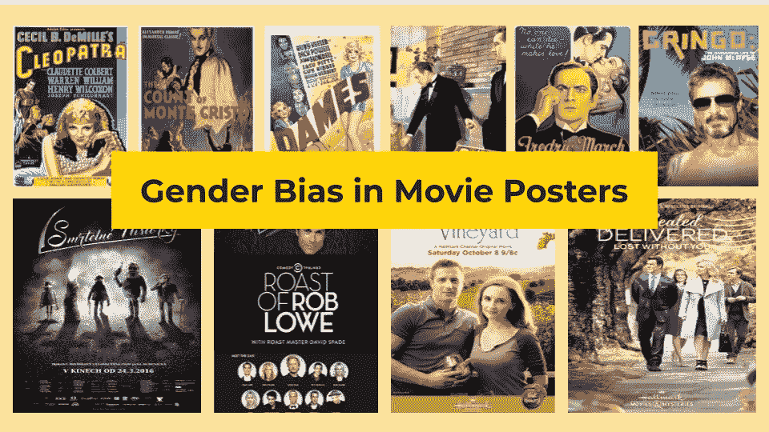
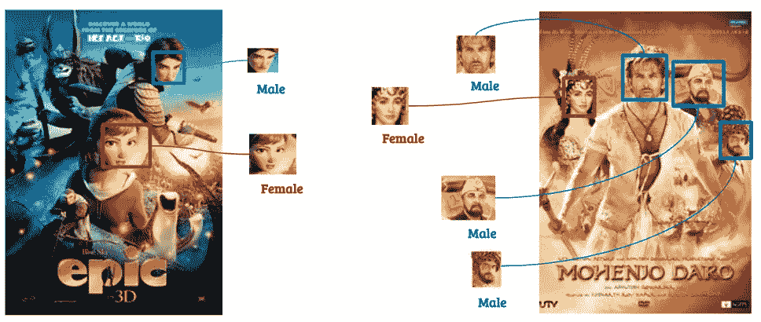
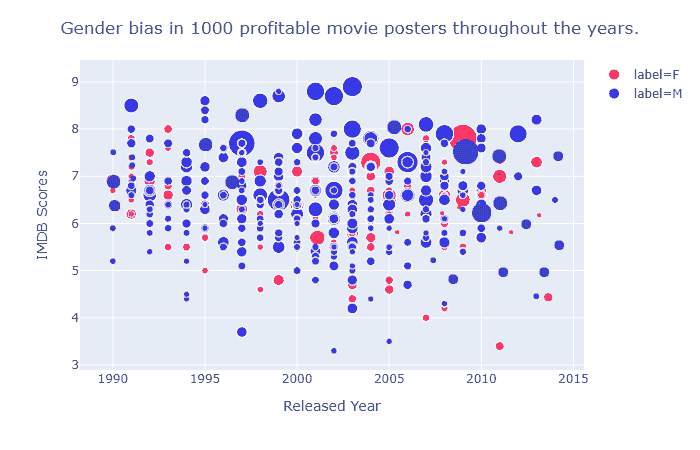
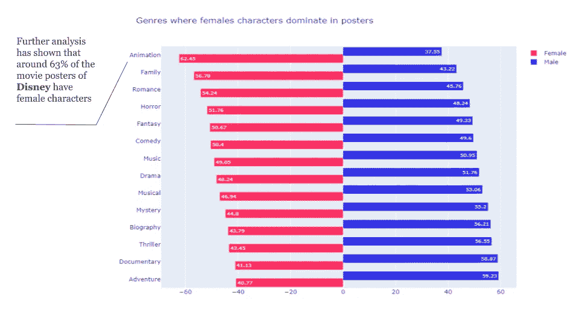
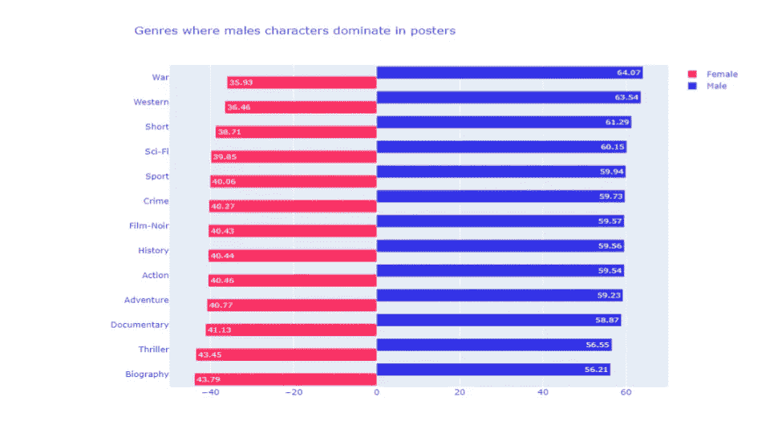
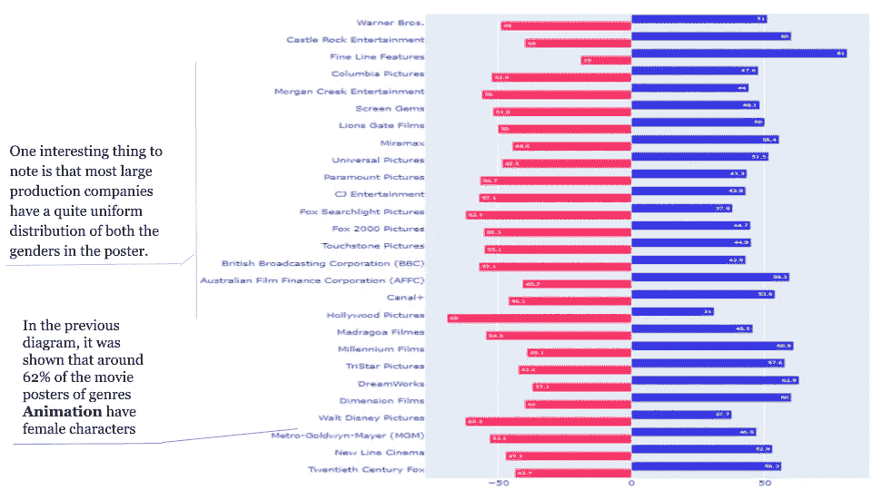
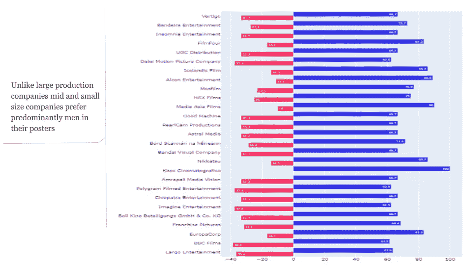

# 使用深度学习分析电影海报中的性别偏见

> 原文：<https://medium.com/analytics-vidhya/using-deep-learning-to-analyse-movie-posters-for-gender-bias-4c0f1557a051?source=collection_archive---------21----------------------->

合著者:[艾亚兹·米兰](https://medium.com/u/363d9d7d7a5f?source=post_page-----4c0f1557a051--------------------------------)，[穆罕默德·沙赫巴兹](https://medium.com/u/7714bf977426?source=post_page-----4c0f1557a051--------------------------------)

有历史记载表明流行文化和社会规范是如何相互影响的，经常反映出[大城市](https://www.researchgate.net/publication/304167054_Social_Change_Through_Popular_Culture)人口的行为趋势。当创意制作人必须营销内容时，这一点变得更加明显，因为他们经常面临创造扣人心弦的作品高峰以保持高客流量的挑战，在这样做的过程中，与令人不安的社会趋势交织在一起的人类心理学的最有趣的特征变得生动起来，供我们思考。

为了找到这种想法的真相，旅程从汇编一个[数据集](https://www.kaggle.com/neha1703/movie-genre-from-its-poster)开始，该数据集由自 1970 年以来上映的 21，000 部电影的海报及其辅助数据组成，如 IMDB 评分和整个电影演职员表。这个想法是想看看海报是如何由一部电影组成的。两个不同的人工智能模型被用来首先检测人脸(甚至动画！)并执行面部识别以从海报中描绘的面部中识别性别。如果一部电影只有一个男明星出现在海报上，真诚地说，它最有可能是一部关于男人/男人的电影，反之亦然，已经说过，研究结果表明，即使不是这样，那么性别压制已经发生，分析仍然成立。在对电影海报和背景数据如电影描述、工作人员/演职员表等的进一步整体分析中，发现了非常有趣的性别偏见。

总收入排名前 1000 的电影。更大的圆圈意味着更多的总收入

历史上广受好评的电影在海报中以男性为主，但这种情况发生了变化。评分最高的 IMDB 电影海报主要由男性出演，而评分最低的电影则由女性出演，这绝非巧合。趋势还表明，在 2000 年之前，7 级及以上电影的海报中主要是男性，但在 2000 年后的时代，这种情况发生了变化，女性演员开始在封面上受到更多关注。像《雷神》( 2011 年)和《蜘蛛侠 2 》( 2004 年)这样狂热吸引人的电影，在两性角色方面获得了应有的平等地位，朝着好的方向改变了趋势。图表还显示，票房最高的电影海报中出现的男性更多，而且几乎总是如此。自 20 世纪 90 年代至 2010 年代以来，电影界和社会中根深蒂固的性别偏见一直是一个无法回避的趋势，即与女性电影相比，海报中的男性电影总收入总是将最多的钱收入囊中。尽管自 2007 年以来，差距在显著缩小，但没有哪一年或哪一次敢于质疑这一趋势。

# **不同流派中的性别分布**

某些类型的电影海报是性别刻板印象泛滥的最好例子。臭名昭著的性别刻板印象被意外地放大了。以“战争”、“科幻”和“体育”为主题的电影在故事和海报中出现男性是不公平的，而“动画”、“家庭”和“浪漫”等主题则在海报中巧妙地出现女性船员。可以肯定的是，电影海报是非常刻板的，老实说，不仅仅是海报，制片人和电影制作人讲述的故事也是如此。

# **不同生产车间的性别分布**

# **更多尝试**

同一部电影，不同国家有不同的海报。

通常，为迎合当地需求，同一部电影会在不同国家发布多张海报。一个令人兴奋的分析可能包括不同性别在不同国家的同一部电影中是如何表现的。

另一个有趣的研究是不仅要识别海报中人的性别，还要识别他的种族和年龄。这些信息以及其他元数据，如演员和工作人员的详细信息，可用于研究电影业的多样性和包容性。