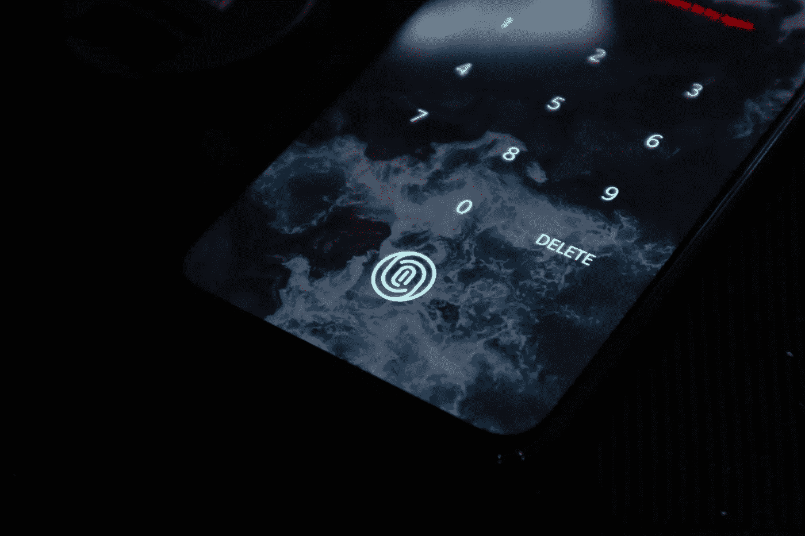

# 使用深度学习重建指纹——使用 Keras

> 原文：<https://medium.com/analytics-vidhya/using-deep-learning-to-reconstruct-fingerprints-with-keras-daf44881b812?source=collection_archive---------15----------------------->

卢肯·萨贝拉诺在 [Unsplash](https://unsplash.com/s/photos/fingerprint?utm_source=unsplash&utm_medium=referral&utm_content=creditCopyText) 上拍摄的照片

## 剧透:自动编码器棒极了

指纹是生物识别安全技术的一个重要方面——它们是独一无二的，难以窃取，地球上的每个人生来都有指纹。(几乎所有人，参见:[AdermatoglyphiaT7)](https://en.wikipedia.org/wiki/Adermatoglyphia)

它们构成了许多刑事调查的基础，也用作证据…