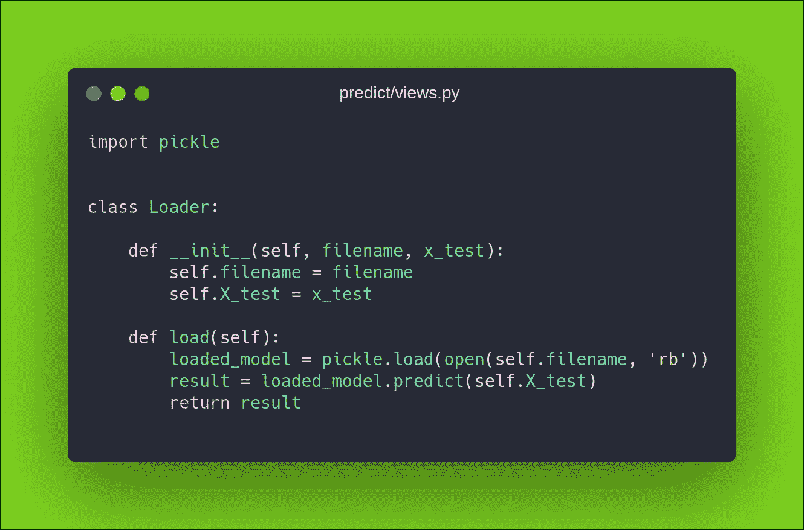

# 像传说一样用 Django 进行机器学习！

> 原文：<https://medium.com/analytics-vidhya/using-django-for-machine-learning-like-a-legend-23d0633a0732?source=collection_archive---------9----------------------->

我经常发现自己处于这样一种情况，人们在思考一个话题。而且话题挺大的。

*“我们制作了这个 ML 模型，我们如何将其与我们的移动应用程序集成？”。*

我用一种相当压倒性的声音回答，*“你用 REST API 的你这个笨蛋。”*

但是有那么简单吗？没有。我从来没有找到任何好的教程来集成 ML 和任何 web 服务器。弄清楚这一点对我来说是一个巨大的考验。我考虑了很多可能性。使用嵌入在设备中的最小化的**【训练模型】**来使用。但这是有代价的。支持这么多平台。在 iOS 设备上做同样的事情非常困难。

# 解决方法是什么？

最简单的方法是用模型参数手动硬编码视图。这样做将使您能够在用户与网站交互时运行您的模型脚本。但这有点像 1995 年。超级慢又无聊。

我们在这里寻找的是传奇的感觉。感觉像是刚从谷歌出来的开发者。咄！


# 设置 ML 代码

让我们快速建立一个样本机器学习代码，它在给定的数据集上进行训练，并存储模型以备后用。

我们将使用 evergreen **工资数据集**，以便于我们的**“年轻”**受众理解。

你可以从 [**这里**](https://github.com/rshrc/django-ml/blob/master/ml/data.csv) 下载数据集。

让我们快速浏览一下 ML 代码，因为这不是我们今天讨论的主题。


明白了吗？

这里的代码是一个基本示例，它将数据集 data.csv 拆分为训练集和测试集，训练一个简单的**线性回归**模型，然后使用 pickle 将训练好的模型存储在一个名为 model.sav 的文件中，以实现模型持久性。我们使用模型持久性，这样我们就不必一次又一次地训练模型。**训练一次，随时使用**。

# 有趣的部分

现在是姜戈的部分。我们将建立一个基本的 Django 项目，里面有两个应用程序。**【预测】****【服务器】**。predict 应用程序包含训练代码和一个**加载器类**，它使我们能够做机器学习的事情。服务器应用程序有一个 **API 视图**，它接收一个 POST 请求并返回输出。

```
django-admin startproject dj_ml_legend && cd dj_ml_legend
python manage.py startapp predict
python manage.py startapp server
```

酷，你现在应该在你的目录中看到两个处女应用程序。

# 预测应用程序

先用预测 app 吧。将您的 ***train.py*** 文件和 ***data.csv*** 文件复制粘贴到您的 ***predict/*** 目录下。然后在您的***predict/views . py***文件中编写以下加载器类。该文件将使您能够**加载和使用**您保存的模型。



啊，装载机

# 服务器应用程序

现在，让我们转向服务器应用程序。我们将使用令人惊叹的 django rest 框架编写一个简单的 API 视图。API 视图调用我们刚刚编写的 Loader 类，并使用它的输出作为对 POST 请求的响应。


我们使用 BASE_DIR 来跟踪 **model.sav** 文件

太好了，现在我们有了一个 API 视图，所有 20 个手指交叉应该可以完美地工作。等等，我们还有网址要管理。


API“端点”

这个端点将给出特定年龄的工资。

# 没有更多的代码？

不，没有更多的代码。这就是姜戈的魅力。为期限为 xD 的机器学习工程师制作。英雄联盟

因此，让我们通过用 python 编写一个简单的 **POST** 请求来测试我们的代码。启动你的 **python 控制台**。在那之前`python manage.py runserver`在你的根目录上。

```
>>> import requests as r
>>> v = r.post('[**http://localhost:8000/server/api/salary/**'](http://localhost:8000/server/api/salary/'), data=**{'exp': 5.6}**)
```

完成，现在 post 请求应该可以工作了。让我们看看输出

```
>>> v.text
'79153.46992551646'
```

快速、充满活力和传奇色彩。

现在这个 API 可以在任何地方使用。在你的网站上，你的应用程序上，所有的一切。

要从不同的设备访问 API，您可以考虑使用[**n rock**](https://ngrok.com/)，但是在投入生产时，我强烈推荐 **pythonanywhere** 或 **Heroku** 。

所以我想就是这样，现在你可以像一个传奇一样使用 Django 进行机器学习了。你可以在这个 [**资源库**](https://github.com/rshrc/django-ml) 里找到源代码。

敬请期待更多*“像传奇一样使用 X”*

*拜拜！*